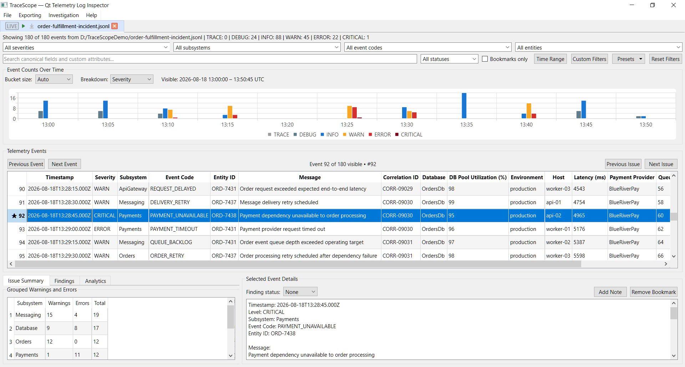
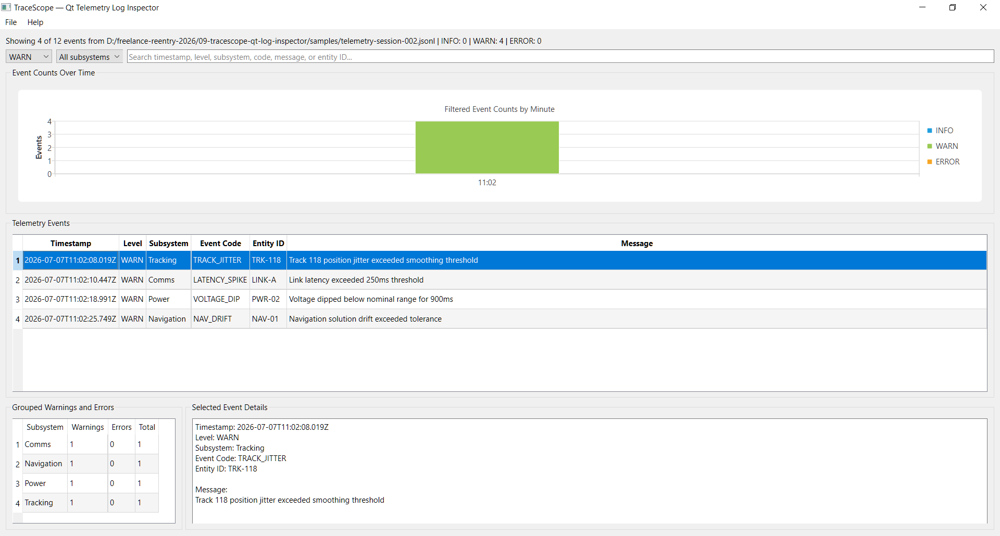
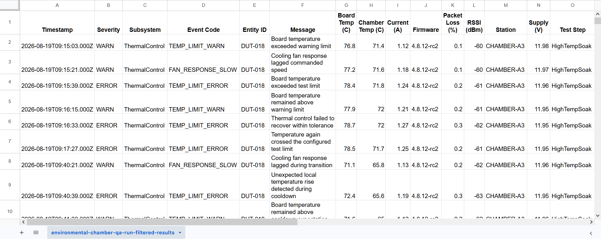

# TraceScope — Qt Telemetry Log Inspector

[](https://github.com/w-cook/tracescope-qt-log-inspector/actions/workflows/ci.yml)

TraceScope is a native Qt/C++ desktop application for loading, filtering, visualizing, inspecting, and exporting structured telemetry and diagnostic log files.

The completed original prototype provides a focused investigation workflow for a built-in JSON Lines telemetry format. TraceScope is now being expanded into a configurable native log-analysis workbench with multiple built-in formats and reusable import profiles.

The `v0.2.0` release established the flexible investigation-record and import domain. The `v0.3.0` release adds the common importer architecture, a dedicated JSON Lines importer, and configurable JSON field paths while preserving the original desktop workflow.

TraceScope is intended for file-based logs produced by applications, services, simulated devices, sensors, QA runs, field-support packages, and engineering test systems.

## Downloads

Portable packages are published through [GitHub Releases](https://github.com/w-cook/tracescope-qt-log-inspector/releases).

The `v0.3.0` package set uses these filenames:

```text
TraceScope-v0.3.0-windows-x64.zip
TraceScope-v0.3.0-linux-x86_64.AppImage
TraceScope-v0.3.0-samples.zip
```

The historical `v0.1.0` and `v0.2.0` prereleases remain available as earlier development milestones.

### Windows

1. Download `TraceScope-v0.3.0-windows-x64.zip`.
2. Extract the complete ZIP to a local directory.
3. Launch `TraceScope.exe`.
4. Open a file from the included `samples` directory.

The Windows package includes the required Qt libraries, plugins, and MinGW runtime dependencies.

### Linux

1. Download `TraceScope-v0.3.0-linux-x86_64.AppImage`.
2. Make the file executable:

```bash
chmod +x TraceScope-v0.3.0-linux-x86_64.AppImage
```

3. Launch it:

```bash
./TraceScope-v0.3.0-linux-x86_64.AppImage
```

The AppImage contains TraceScope and its required Qt dependencies. The same demonstration logs are also available through the standalone sample archive.

### Sample Logs

Download `TraceScope-v0.3.0-samples.zip` for a platform-neutral copy of all included demonstration logs.

After extraction, the archive contains:

```text
TraceScope-v0.3.0-samples/
├── README.md
├── LICENSE
└── samples/
    └── included JSON Lines telemetry sessions
```

Qt, Qt Creator, CMake, Git, and a local compiler are not required to run the packaged applications.

## Current Features

- Open local JSON Lines telemetry log files
- Parse structured records into C++ domain objects
- Preserve an optional typed canonical investigation record alongside source-specific data
- Parse canonical severity values into a typed severity representation
- Parse ISO timestamps with timezone-offset and millisecond support
- Preserve noncanonical JSON fields as dynamic custom attributes
- Preserve raw source records and source file/record metadata
- Generate deterministic stable record identities
- Return structured import results with processed, imported, and skipped counts
- Report structured import diagnostics for malformed or partially mappable records
- Use a common `ILogImporter` abstraction for file-based import implementations
- Register importers through an internal importer registry
- Import JSON Lines through a dedicated `JsonLinesImporter`
- Configure canonical JSON field mappings with dot-delimited top-level or nested object paths
- Preserve the original JSON Lines field layout as the default mapping for backward compatibility
- Keep the legacy `JsonLineLogParser` as a compatibility adapter for the current UI
- Display telemetry events in a sortable table
- Filter events by severity
- Filter events by subsystem
- Search across timestamp, level, subsystem, event code, message, and entity ID
- Inspect complete details for a selected event
- View session-level event counts
- Group warnings and errors by subsystem
- Visualize filtered event counts over time
- Export the currently visible filtered results to CSV
- Use included sample files for demonstration and testing
- Build and test the application on Windows and Linux through GitHub Actions
- Produce a portable Windows x64 ZIP through automated CI
- Produce a portable Linux x86_64 AppImage through automated CI
- Produce a platform-neutral sample-log ZIP
- Smoke-test packaged Windows and Linux applications in CI

The current desktop UI intentionally preserves the original investigation workflow while the flexible importer architecture is introduced behind it. Configurable JSON field paths are implemented and tested at the importer layer but are not yet exposed through an end-user configuration interface.

## Screenshots

### TraceScope Dashboard

The main dashboard combines session summary information, filtering controls, an event-count timeline, the telemetry event table, grouped issue counts, and selected-event details.



### Filtered Warnings

Severity, subsystem, and text filters update the event table, summary information, grouped issue panel, and timeline chart together.



### Exported CSV

The export workflow writes the currently filtered event set to a CSV file for additional review or sharing.



## Expansion in Progress

TraceScope is being expanded from a fixed-schema telemetry inspector into a configurable native desktop workbench for importing and investigating developer logs.

The planned product position is:

> TraceScope supports multiple built-in log formats and reusable import profiles that map source fields into a common investigation model.

The expansion will not claim to automatically understand every arbitrary log format. Import behavior will remain explicit and reproducible through built-in importers and versioned profiles.

Completed expansion foundations include:

- optional canonical investigation fields
- typed severity and timestamp parsing
- preservation of custom source attributes
- raw source and source-location preservation
- stable record identities
- structured import results and diagnostics
- a common `ILogImporter` abstraction
- an internal importer registry
- a dedicated JSON Lines importer
- configurable dot-delimited JSON field paths, including nested object paths
- backward compatibility with the original JSON Lines samples and desktop workflow
- importer-focused automated tests

The current active phase is replacing the fixed `QTableWidget` event display with Qt model/view architecture and reducing UI orchestration responsibilities in `MainWindow`.

Planned capabilities after that include:

- reusable import profiles
- import preview and configuration workflows
- CSV and TSV imports
- structured JSON document imports
- regex-configurable plain-text imports
- dynamic table columns
- responsive large-file processing
- multiple investigation sessions
- advanced filtering and navigation
- bookmarks, notes, and findings
- deterministic burst analysis
- session comparison
- local workspace persistence
- live file following
- offline investigation reports

See the [TraceScope Expansion Roadmap](docs/expansion-roadmap.md) for the planned architecture and development phases.

Planned features are not presented as implemented until their corresponding phases are completed, tested, packaged, and released.

## Tech Stack

- C++17
- Qt 6
- Qt Widgets
- Qt Charts
- CMake
- Qt Test
- MinGW 64-bit on Windows
- GCC on Linux
- GitHub Actions
- `windeployqt`
- `linuxdeploy`
- AppImage

The trusted local Windows development baseline uses Qt 6.11.1 with MinGW 64-bit. Continuous integration currently uses a pinned Qt 6.10.3 environment on Windows and Linux.

## Current Sample Format

The currently exposed built-in format is newline-delimited JSON. Each line represents one telemetry record:

```json
{"timestamp":"2026-07-07T10:14:22.381Z","level":"WARN","subsystem":"Tracking","eventCode":"TRACK_LOST","message":"Track 402 lost for 1200ms","entityId":"TRK-402"}
```

The original built-in field names are:

- `timestamp`
- `level`
- `subsystem`
- `eventCode`
- `message`
- `entityId`

As of `v0.2.0`, these values are normalized into a flexible investigation record in which canonical fields are optional. Unknown JSON fields are preserved as custom attributes, and the raw source plus source-location metadata are retained.

As of `v0.3.0`, JSON Lines canonical fields are resolved through configurable dot-delimited paths. The default configuration continues to map the original top-level names shown above, preserving compatibility with the existing sample files and desktop UI. Alternate top-level names and nested object paths such as `metadata.occurredAt` or `event.code` can be mapped by constructing the JSON Lines importer with a different configuration.

The configurable mappings are currently an importer-layer capability. A desktop workflow for creating, validating, saving, and reusing import profiles is planned for later phases and is not presented as implemented.

Sample files are included in the repository’s `samples` directory, the Windows package, the Linux AppImage, and the standalone sample archive.

## Project Structure

```text
.github/
└── workflows/
    └── ci.yml                     # Windows, Linux, and sample packaging workflow

docs/
├── original-prototype-plan.md    # Historical initial implementation plan
├── expansion-roadmap.md          # Current expansion architecture and phases
└── screenshots/                   # Portfolio screenshots

packaging/
└── linux/
    ├── tracescope.desktop         # Linux desktop metadata
    └── tracescope.svg             # Application icon

samples/                            # Example telemetry sessions

src/
├── analysis/                      # Grouped issue and timeline analysis
├── domain/                        # Legacy telemetry model plus flexible investigation-record domain
├── exporting/                     # Filtered CSV export
├── filtering/                     # Severity, subsystem, and text filtering
├── importing/                     # Import contracts, registry, JSON Lines importer, configuration, results, and diagnostics
├── parsing/                       # Legacy JSON Lines compatibility adapter for the current UI
├── MainWindow.cpp                 # Current Qt Widgets UI orchestration
├── MainWindow.h
└── main.cpp

tests/                              # Qt Test coverage for core application logic
```

## Building Locally

### Requirements

- Qt 6
- Qt Charts
- CMake
- a C++17-compatible compiler

### Qt Creator

1. Open the root `CMakeLists.txt` in Qt Creator.
2. Select a Qt 6 kit that includes Qt Charts.
3. Configure the project.
4. Build the `TraceScope` target.
5. Run the application.
6. Open one of the included files from the `samples` directory.

### Command Line

Use a terminal or developer environment in which Qt, CMake, and the selected compiler are configured correctly:

```bash
cmake -S . -B build -DCMAKE_BUILD_TYPE=Release
cmake --build build --parallel
```

Run the generated `TraceScope` executable from the build directory.

The exact executable location may vary by generator, platform, and development environment.

## Running Tests

After configuring the project:

```bash
cmake --build build --parallel
ctest --test-dir build --output-on-failure
```

The current CTest suite includes:

- `ParserTests`
- `FilterTests`
- `IssueAnalyzerTests`
- `CsvExporterTests`
- `EventTimelineAnalyzerTests`
- `RecordSeverityTests`
- `InvestigationRecordTests`
- `ImportResultTests`
- `ImporterRegistryTests`
- `JsonLinesImporterTests`

Together, these tests cover:

- JSON Lines parsing
- file parsing
- optional canonical fields
- typed severity parsing
- timestamp parsing
- custom-attribute preservation
- raw source and source metadata
- stable record identity behavior
- structured import results and diagnostics
- malformed and non-object JSON handling
- importer registration and lookup behavior
- dedicated JSON Lines importer behavior
- configurable alternative top-level field mappings
- configurable nested JSON field mappings
- preservation of source attributes when nested mappings are used
- disabled canonical mappings through empty paths
- configured timestamp and severity diagnostic behavior
- legacy parser compatibility behavior
- event filtering
- grouped warning and error analysis
- timeline bucket analysis
- CSV export

The same CTest suite runs in GitHub Actions on Windows and Linux.

## Continuous Integration and Packaging

The GitHub Actions workflow runs three parallel jobs with read-only repository permissions.

### Windows x64

- installs a pinned Qt and MinGW environment
- configures a Release build
- builds the application
- runs all registered CTest tests
- deploys Qt and compiler dependencies with `windeployqt`
- verifies required runtime files
- includes documentation and sample logs
- creates `TraceScope-v0.3.0-windows-x64.zip`
- extracts and starts the packaged executable
- uploads the ZIP as a workflow artifact

### Linux x86_64

- runs on a pinned Ubuntu 22.04 environment
- installs the same pinned Qt version
- configures a Release build with GCC
- builds the application
- runs all registered CTest tests
- assembles an AppDir
- deploys Qt dependencies with `linuxdeploy`
- creates `TraceScope-v0.3.0-linux-x86_64.AppImage`
- starts the AppImage using the offscreen Qt platform
- uploads the AppImage as a workflow artifact

### Sample Logs

- verifies that the repository contains sample files
- copies all samples into a platform-neutral package
- verifies that the packaged count matches the source count
- creates `TraceScope-v0.3.0-samples.zip`
- uploads the ZIP as a workflow artifact

Workflow artifacts are used to validate candidate packages. Approved packages are attached permanently to GitHub Releases.

## Current Status

### Original Prototype

The original prototype is complete for its fixed JSON Lines telemetry schema and was packaged as the `v0.1.0` prerelease.

Implemented:

- JSON Lines import
- telemetry event parsing
- event table display
- severity and subsystem filtering
- full-field text search
- selected-event details
- grouped warning and error summaries
- filter-aware event-count timeline chart
- filtered CSV export
- sample telemetry sessions
- automated core-logic tests
- cross-platform Windows and Linux CI
- portable Windows x64 packaging
- portable Linux x86_64 AppImage packaging
- standalone sample-log packaging
- packaged-application startup smoke tests

### Expansion

The configurable workbench expansion is in progress.

`v0.2.0` completed the flexible record and import-domain foundation, including optional typed canonical fields, dynamic custom attributes, raw-source preservation, source metadata, stable record identities, import results, and structured diagnostics.

`v0.3.0` completes the importer-abstraction phase. It adds a common `ILogImporter` contract, an internal importer registry, a dedicated `JsonLinesImporter`, configurable dot-delimited JSON field mappings, nested object-path support, importer-focused automated tests, and a compatibility adapter that keeps the existing sample files and UI behavior operational.

The current active phase is **Qt Model/View Architecture**. Current priorities are:

1. replace the fixed event `QTableWidget` with a `QAbstractTableModel`-based model;
2. move sorting and filtering toward proxy-model behavior;
3. support dynamic table columns needed by the flexible investigation-record domain;
4. preserve correct source/proxy selection mapping;
5. reduce `MainWindow` orchestration responsibilities while preserving the existing investigation workflow.

Later phases will add versioned import profiles, import configuration workflows, additional formats, and broader investigation features.

See the [expansion roadmap](docs/expansion-roadmap.md) for the complete planned sequence.

## Design Goals

TraceScope emphasizes:

- practical native desktop development
- clear separation of parsing, importing, filtering, analysis, exporting, and UI concerns
- testable non-UI application logic
- explicit and reproducible import behavior
- preservation of source information
- responsive investigation workflows
- offline operation
- conservative and defensible product claims
- repeatable cross-platform releases

## License

This project is licensed under the GNU General Public License v3.0. See the [LICENSE](LICENSE) file for details.

TraceScope uses Qt Charts, which is available to open-source users under the GNU General Public License v3.0.
