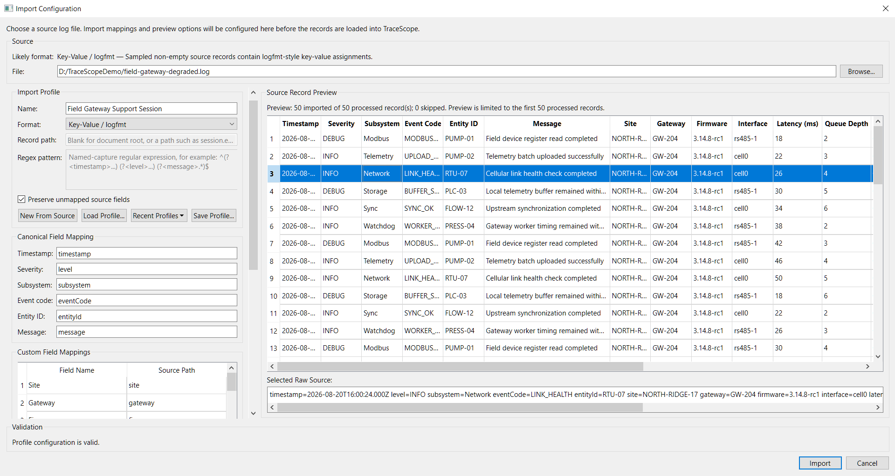
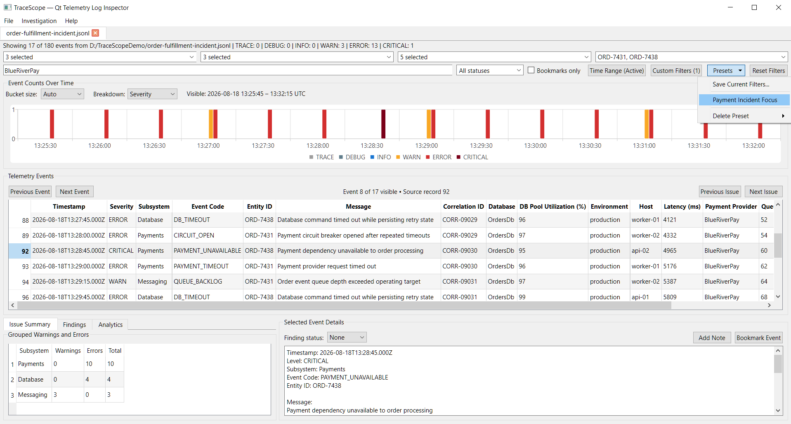
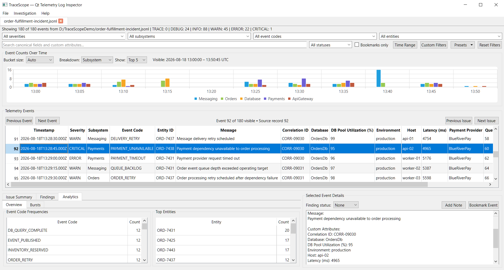
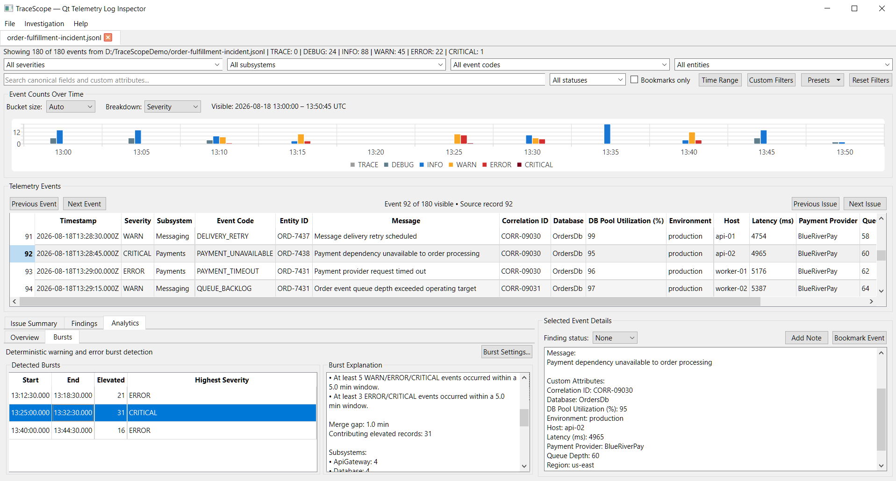
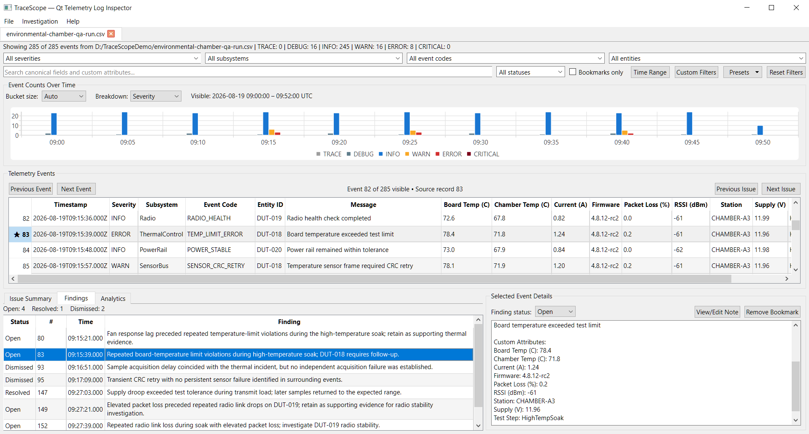
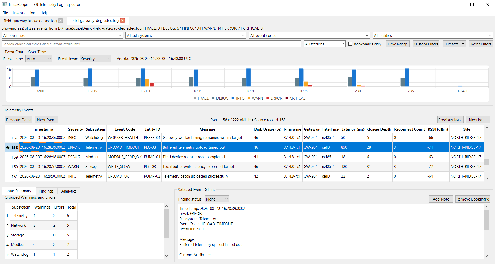
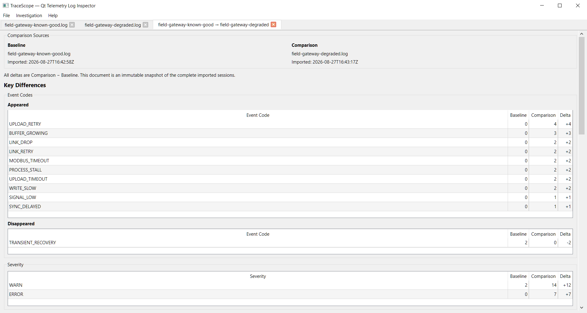

# TraceScope — Qt Telemetry Log Inspector

[](https://github.com/w-cook/tracescope-qt-log-inspector/actions/workflows/ci.yml)

TraceScope is a native C++/Qt desktop application for investigating file-based telemetry and diagnostic logs. It helps developers, QA engineers, field-support teams, and other technical users move from unfamiliar source files to a structured, repeatable investigation without requiring a hosted backend, log-shipping infrastructure, user accounts, or an indexing service.

TraceScope imports multiple structured and operational log formats and uses reusable import profiles to map source fields into a common investigation model. Timestamp, severity, subsystem, event code, entity ID, and message are optional canonical fields rather than a required fixed schema. Source-specific values and raw records remain available alongside normalized data.

Once a source is loaded, investigators can combine canonical and custom-field filters, search and navigate records, inspect timeline and trend views, review deterministic event-code/entity analytics, detect explainable warning/error bursts, preserve bookmarks, notes, and finding states, keep multiple sessions open, detach or re-dock workspace documents, compare complete sessions, and export the currently visible investigation to CSV.

TraceScope is intentionally file-oriented and offline. It does not claim to automatically understand every arbitrary log format, diagnose root cause, replace centralized observability systems, or guarantee a fixed maximum file size. Import and analysis behavior stays explicit, testable, and reproducible.


## Download TraceScope

Portable packages are published through [GitHub Releases](https://github.com/w-cook/tracescope-qt-log-inspector/releases).

The current release is **`v0.13.0`**:

```text
TraceScope-v0.13.0-windows-x64.zip
TraceScope-v0.13.0-linux-x86_64.AppImage
TraceScope-v0.13.0-samples.zip
```

Historical `v0.1.0` through `v0.12.0` prereleases remain available as earlier development milestones.

### Windows

1. Download `TraceScope-v0.13.0-windows-x64.zip`.
2. Extract the complete ZIP.
3. Launch `TraceScope.exe`.
4. Open a file from the included `samples` directory or choose one of your own supported log files.

The package includes the required Qt libraries, plugins, MinGW runtime dependencies, demonstration logs, and reusable sample import profiles.

### Linux

1. Download `TraceScope-v0.13.0-linux-x86_64.AppImage`.
2. Make it executable:

```bash
chmod +x TraceScope-v0.13.0-linux-x86_64.AppImage
```

3. Launch it:

```bash
./TraceScope-v0.13.0-linux-x86_64.AppImage
```

### Samples Only

`TraceScope-v0.13.0-samples.zip` provides a platform-neutral copy of the repository samples and reusable import profiles.

Qt, Qt Creator, CMake, Git, and a local compiler are not required to run the packaged applications.

## Core Investigation Workflow

### Import and Normalize Logs

Choose or drag in a source file, review TraceScope's likely-format suggestion, load or edit a reusable profile, inspect mapped preview records and raw source, and validate the configuration before importing.

Profiles define how source-specific fields map into optional canonical fields and readable custom attributes. This makes mapping behavior reusable and inspectable instead of hiding it behind automatic interpretation.



Supported source families include JSON Lines, structured JSON, CSV/TSV, key-value/logfmt, Syslog, IIS W3C, structured XML, Windows Event XML, common Apache/Nginx access-log layouts, and regex-configurable line-oriented text. See [Supported Formats and Profiles](#supported-formats-and-profiles) for details.

### Filter, Search, and Navigate

Investigations can be narrowed using multiple severities, subsystem, event code, entity, UTC time range, full-record search, dynamic custom-field values, bookmark state, and finding status. Named filter presets preserve useful combinations for reuse.

Previous/next event navigation, warning/error-class navigation, grouped issue drill-down, timeline drill-down, and direct finding navigation keep source-record context available while moving through a filtered investigation.



### Analyze Frequencies, Trends, and Bursts

TraceScope provides deterministic analysis intended to help investigators recognize patterns without claiming automated diagnosis.

The Analytics overview shows event-code frequencies and top entities when those fields are available. The timeline can break activity down by severity or by the most frequent subsystems, with scalable windowed rendering for fine resolutions.



Warning, error, and critical events can also be grouped into deterministic bursts using explicit thresholds and time windows. Auto timing derives a human-readable investigation cadence from the current records while remaining bounded relative to the investigation span; Manual timing is also available. Every detected burst explains why it qualified and summarizes contributing severities, subsystems, event codes, entities, and source records.



Burst detection is deterministic and explainable. It is **not** presented as AI anomaly detection or root-cause diagnosis.

### Preserve Findings While You Investigate

Records can be bookmarked, annotated with multiline analyst notes, and classified as Open, Resolved, or Dismissed findings. The Findings review panel summarizes the investigation record and supports direct navigation back to the exact preserved source record.

Applicable bookmark, note, and finding state survives in-place reloads when stable record identities remain present. Saving and reopening that investigation state across application restarts is the active Phase 13 workspace-persistence focus.



### Work Across Related Sessions

Multiple imported sources can remain open as independent investigation sessions. Each session retains its source/profile context, filters, controller state, timeline/analytics presentation state, bookmarks, notes, findings, and reload behavior. Investigation and comparison documents can be reordered, detached into independent workspace windows, moved between detached windows, and re-docked into the main workspace. Narrow layouts adapt for horizontally split and portrait-oriented use instead of requiring a wide desktop window.



TraceScope can also compare two complete imported sessions using an explicit **Baseline → Comparison** orientation. Comparison snapshots are immutable and are built from complete session records rather than the sessions' current filters, so temporary investigation choices do not silently change the meaning of an existing comparison.

The comparison view prioritizes meaningful differences in event codes, severity, elevated subsystem/entity activity, conservative shared custom fields, optional burst behavior, and session-level context such as total records, duration, and event rate. Missing dimensions are reported as unavailable rather than treated as zero, and the output remains descriptive rather than claiming causal diagnosis or root cause.



### Export the Current Investigation

The CSV export workflow writes the currently visible records using readable canonical headers and configured custom-field names. Filtering before export makes it possible to hand off only the records relevant to a finding or investigation path.

## Supported Formats and Profiles

Different source formats need different amounts of configuration. TraceScope keeps that distinction visible rather than pretending every file can be interpreted automatically.

| Source family | How TraceScope handles it |
| --- | --- |
| JSON Lines | Dedicated importer with configurable field paths |
| Structured JSON | Imports arrays or records selected from nested documents |
| CSV / TSV | Delimited-text import with header-based field mapping |
| Regex-configurable text | Named regular-expression captures map line-oriented text into fields |
| Key-value / logfmt | Parses key-value records and maps discovered fields |
| Syslog | Dedicated RFC 3164 and RFC 5424 parsing |
| Apache / Nginx access logs | Reusable built-in regex profiles for common access-log layouts |
| IIS W3C | Dedicated importer with W3C field-header support |
| Structured XML | Nested elements, attributes, repeated elements, record paths, and raw XML preservation |
| Windows Event XML | Uses the XML importer with Windows Event detection, presets, severity aliases, and named `EventData` fields |

Windows Event XML support covers XML-formatted events and collections. Native binary `.evtx` ingestion is not part of `v0.13.0`.

### Canonical Investigation Fields

TraceScope normalizes source data into six optional canonical fields:

- `timestamp`
- `severity`
- `subsystem`
- `eventCode`
- `entityId`
- `message`

A source record can remain useful when one or more canonical fields are missing. A feature that depends on a missing field may be unavailable, while unrelated inspection, search, custom attributes, and raw source remain usable.

Import profiles map source-specific field names into those canonical fields and can promote other useful values into named custom columns. Unmapped source values can also be preserved.

## Sample Investigations

The repository includes both compact format examples and larger fictional investigation scenarios.

The larger scenarios are designed to resemble files a prospective user might actually need to investigate:

- **Order Fulfillment Incident** — JSON Lines business-application logs covering database degradation, retries, cascading payment/dependency failures, recovery periods, and a later messaging backlog.
- **Environmental Chamber QA Run** — CSV engineering-test data covering a high-temperature soak, DUT-specific thermal instability, power/radio faults, recovery, and cooldown validation.
- **Field Gateway Support Sessions** — matched known-good and degraded logfmt captures from a fictional industrial gateway, including cellular instability, Modbus timeouts, telemetry buffering, recovery, and residual backlog behavior. The pair also provides a reproducible Baseline → Comparison workflow.

Additional repository samples exercise structured XML, Windows Event XML, CSV/TSV, structured JSON, Syslog, Apache/Nginx/IIS access logs, regex-configurable application logs, and other supported import paths.

The samples are fictional and self-contained. They are intended to demonstrate import configuration, profile reuse, canonical mappings, custom fields, filtering, timeline behavior, analytics, findings, burst detection, export, and related-session workflows without external services.

## Performance and Large-File Behavior

Large imports run outside the UI thread. Streamed importers can report determinate progress and support cooperative cancellation without replacing the current investigation with partial results.

TraceScope keeps normalized records, raw-source values, dynamic attributes, and per-session investigation state resident while sessions are open; it does not claim constant-memory behavior.

Measured Release-build scenarios cover representative JSON Lines, CSV, IIS W3C, Windows Event XML, and structured JSON investigations containing up to 220,000 records and approximately 109 MiB on the documented test system. These are measured observations rather than maximum supported file-size or throughput guarantees.

See [Performance Notes](docs/performance.md) for methodology, environment, scenario results, cancellation checks, and interpretation boundaries.

## Current Capabilities

### Import and Configuration

- Import JSON Lines, structured JSON documents and arrays, CSV, TSV, key-value/logfmt records, Syslog RFC 3164 and RFC 5424, IIS W3C logs, and structured XML
- Use reusable built-in profiles for Apache Common and Apache/Nginx Combined access logs
- Recognize Windows Event XML and apply Windows-oriented XML presets for common system fields
- Use regex-configurable profiles for line-oriented text logs without a dedicated importer
- Suggest likely formats from extension and source content where practical
- Define versioned JSON import profiles with canonical mappings, custom-field mappings, severity aliases, timestamp rules, record paths, and unmapped-field preservation
- Validate mapping configuration before import
- Select or drag-and-drop sources
- Create fresh source-derived profiles with automatic custom-field discovery
- Preview bounded mapped records without replacing the active investigation
- Inspect complete raw source for the selected preview record
- Keep the last valid preview visible while temporarily invalid edits are corrected
- Disable automatic preview for large structured documents and generate explicit large-document previews in cancellable background work
- Save reusable profiles and reopen recently used profiles through the same validated loading path
- Retain an intentional profile when switching sources so compatibility can be checked without silently resetting configuration
- Normalize supported sources into a common `InvestigationRecord`
- Preserve raw records, source file/record metadata, stable identities, source-specific custom attributes, import counts, and diagnostics

### Investigation and Navigation

- Display records in a sortable Qt model/view table with preserved source-record numbers
- Show canonical columns only when values are present in the loaded dataset
- Add discovered source-specific attributes as dynamic columns
- Filter by multiple severities, subsystem, event code, entity, UTC time range, dynamic custom-field values, bookmark state, and finding status
- Use OR semantics for multiple values of the same custom field and AND semantics across different fields/filter categories
- Add custom-field filters directly from visible table cells
- Search case-insensitively across canonical fields and custom attributes
- Reset the complete active filter state
- Save, overwrite, apply, and delete persistent named filter presets in local application settings
- Restore reusable preset criteria safely across sessions while ignoring unavailable criteria
- Apply complete filter-state changes as one model update
- Preserve correct selected-record mapping after sorting and filtering
- Inspect canonical fields, custom attributes, raw source, visible event position, and preserved source-record position
- Navigate to previous/next visible records and cyclically among visible warning/error/critical records
- Drill from grouped warning/error summaries into represented subsystem/issue classes without discarding unrelated filters
- Drill from timeline bars into represented time ranges and severity/subsystem series without broadening unrelated filters

### Timeline and Analytics

- Visualize event counts with automatic or manually selected resolutions from millisecond through day-scale intervals
- Preserve empty timeline intervals so gaps remain visible
- Use bounded windowed rendering and horizontal navigation for fine resolutions, reducing the visible bucket window as horizontal space narrows
- Keep visible range context, legend placement, and Y-axis scaling stable while navigating
- Use explicit semantic colors for severity series
- Break timeline activity down by severity or by the most frequent subsystems
- Show Top 5 or Top 10 subsystem series without truncating the underlying analysis data
- Calculate deterministic event-code frequencies when event codes are available
- Calculate deterministic entity frequencies and present Top Entities when entity IDs are available
- Degrade analytics independently when a canonical dimension is missing
- Derive adaptive investigation cadence statistics from valid timestamps, with a documented fallback for sparse data
- Detect deterministic WARN/ERROR/CRITICAL bursts using configurable event thresholds, time windows, and merge gaps
- Use cadence-derived Auto burst timing or analyst-controlled Manual timing
- Explain why each burst qualified and summarize contributing severity counts, subsystems, event codes, entities, and record identities
- Double-click a detected burst to narrow the investigation to its contributing elevated-event range while preserving unrelated filters

### Bookmarks, Notes, and Findings

- Bookmark records through stable record identities
- Filter the active investigation to bookmarked records
- Add multiline analyst notes without blocking inspection of other records
- Classify records as Open, Resolved, or Dismissed findings
- Filter by one or more finding statuses
- Review findings with status counts, source-record context, timestamps, and preserved notes
- Navigate directly from a finding to its exact source record
- Relax only filters that would otherwise hide a finding target
- Retain applicable bookmark, note, and finding state across in-place reloads when stable identities survive

### Workspace and Session Comparison

- Keep multiple imported sessions open in one application instance with independent source/profile context, filters, presentation state, bookmarks, notes, and findings
- Reload sessions in place while preserving the existing session unchanged when a reload is cancelled
- Reorder investigation and comparison documents, detach them into independent workspace windows, move documents between detached windows, and re-dock them into the main workspace
- Keep workspace documents usable in horizontally split and portrait-oriented layouts through responsive summaries, filters, review panels, selected-event controls, tables, and fine-resolution timeline windows
- Maintain bounded, deduplicated recent-file and recent-profile history in local application settings and reopen recent files through Import Configuration
- Create comparisons with explicit Baseline and Comparison selection, including an orientation swap before creation
- Compare complete imported-session snapshots rather than current filtered views, so later filter changes do not alter comparison meaning
- Preserve created comparisons as immutable documents even if a source session is later reloaded or closed
- Compare session totals, duration, event rate, event-code appearance/disappearance/change, severity counts, elevated subsystem/entity activity, and conservative shared custom-field changes when the required data is available
- Optionally compare bursts using one shared explicit burst configuration for both sessions, distinguishing not-requested, unavailable, and valid zero-burst results
- Treat missing comparison dimensions as unavailable rather than zero and keep comparison output descriptive rather than presenting causal or root-cause claims

### Export, Samples, and Verification

- Export currently visible investigation records to CSV
- Use user-facing canonical headers and configured custom-field names
- Preserve deterministic custom-column ordering and blanks for attributes absent from individual records
- Retain CSV escaping and compact JSON serialization for structured custom values
- Include demonstration logs and reusable profiles across supported source families
- Include larger realistic fictional investigation scenarios for product walkthroughs
- Build and test on Windows and Linux through GitHub Actions
- Produce portable Windows x64, Linux AppImage, and platform-neutral samples packages
- Verify representative packaged samples and smoke-test packaged Windows and Linux applications in CI

## Documentation

- [Feature Screenshot Gallery](docs/feature-screenshot-gallery.md) — visual walkthrough of import, investigation, analytics, findings, session comparison, detachable workspaces, responsive layouts, large-file behavior, recent-file, and export workflows
- [Expansion Roadmap](docs/expansion-roadmap.md) — product direction, completed milestones, active development, release discipline, and scope boundaries
- [Performance Notes](docs/performance.md) — measured large-file scenarios, methodology, environment, and interpretation limits
- [Original Prototype Plan](docs/original-prototype-plan.md) — historical plan for the initial focused JSON Lines inspector

## Development Status

Implemented expansion milestones:

| Version | Milestone |
| --- | --- |
| `v0.1.0` | Original prototype and cross-platform packaging baseline |
| `v0.2.0` | Flexible investigation-record and import domain |
| `v0.3.0` | Importer abstraction and configurable JSON Lines |
| `v0.4.0` | Qt model/view architecture and dynamic custom-attribute UI |
| `v0.4.1` | Investigation-record CSV export with dynamic attributes |
| `v0.5.0` | Versioned import profiles, validation, serialization, profile-aware importing, and preview logic |
| `v0.6.0` | Desktop import configuration, mapping-aware preview, reusable profile save/load, and sample profiles |
| `v0.7.0` | Additional built-in formats, format detection/presets, and expanded cross-format samples |
| `v0.8.0` | Responsive large-file import, progress/cancellation, scalable timeline resolution/navigation, and measured performance scenarios |
| `v0.9.0` | Multi-session workspace, per-session context/reload, persistent recent files/profiles, and session-switching responsiveness |
| `v0.10.0` | Advanced canonical/custom filtering, persistent filter presets, event/issue navigation, and summary/timeline drill-down |
| `v0.11.0` | Session-local bookmarks, analyst notes, finding status, findings review, bookmark/finding filtering, and source-record navigation |
| `v0.12.0` | Deterministic event-code/entity analytics, subsystem/severity trends, adaptive cadence, configurable burst detection, and analytics drill-down |
| `v0.13.0` | Directional session comparison, immutable comparison snapshots, detachable multi-window workspace documents, and constrained-layout hardening |

The current release is **`v0.13.0`**.

**Phase 13 — Workspace and Profile Persistence is in active development, targeted for `v0.14.0`.** It focuses on saving and reopening local multi-session workspaces with source/profile context, investigation state, comparison documents, document ordering, and detached-window organization intact.

Later phases cover live file following, reporting/export expansion, final UI polish and documentation, and the stable `v1.0.0` release.

Planned capabilities are not presented as implemented until their corresponding phases are completed and verified.

## Tech Stack

- C++17
- Qt 6
- Qt Widgets
- Qt Charts
- Qt Model/View
- Qt Concurrent
- CMake
- Qt Test
- MinGW 64-bit on Windows
- GCC on Linux
- GitHub Actions
- `windeployqt`
- `linuxdeploy`
- AppImage

The trusted local Windows development baseline uses Qt 6.11.1 with MinGW 64-bit. Continuous integration uses a pinned Qt 6.10.3 environment on Windows and Linux.

## Project Structure

```text
.github/
└── workflows/
    └── ci.yml                     # Windows, Linux, and sample packaging

docs/
├── original-prototype-plan.md    # Historical initial implementation plan
├── expansion-roadmap.md          # Expansion architecture and phased roadmap
├── feature-screenshot-gallery.md # Visual feature walkthrough
├── performance.md                # Measured large-file scenarios and interpretation
└── screenshots/                  # Product screenshots

packaging/
└── linux/
    ├── tracescope.desktop         # Linux desktop metadata
    └── tracescope.svg             # Application icon

samples/                           # Demonstration logs and reusable profiles
└── profiles/                      # Versioned sample import profiles

src/
├── analysis/                      # Timeline, frequency, cadence, burst, and grouped issue analysis
├── compatibility/                # Flexible-record adapters for legacy telemetry components
├── controllers/                  # Investigation model/proxy coordination
├── domain/                       # Flexible investigation-record and legacy telemetry domain
├── exporting/                    # Investigation-record CSV export
├── filtering/                    # Legacy telemetry filtering retained for compatibility/tests
├── importing/                    # Importers, profiles, validation, preview, results, and diagnostics
├── models/                       # Investigation table and filter proxy models
├── parsing/                      # JSON Lines compatibility facade
├── preferences/                  # Persistent recent histories and filter presets
├── ui/                           # Import configuration and reusable investigation/comparison controls
├── workspace/                    # Workspace documents, sessions, comparisons, and investigation state
├── MainWindow.cpp                # Qt Widgets presentation and workflow orchestration
├── MainWindow.h
└── main.cpp

tests/                             # Qt Test coverage for core application logic
```

## Building Locally

### Requirements

- Qt 6
- Qt Charts
- CMake
- a C++17-compatible compiler

### Qt Creator

1. Open the root `CMakeLists.txt`.
2. Select a Qt 6 kit that includes Qt Charts.
3. Configure and build the `TraceScope` target.
4. Run the application.
5. Open a file from `samples`.

### Command Line

```bash
cmake -S . -B build -DCMAKE_BUILD_TYPE=Release
cmake --build build --parallel
```

The exact executable location varies by generator, platform, and development environment.

## Running Tests

After configuring the project:

```bash
cmake --build build --parallel
ctest --test-dir build --output-on-failure
```

The Qt Test suite covers the flexible record/import domain, supported importer families, progress/cancellation, profile validation and preview behavior, model/filter coordination, presets, bookmarks and findings, timeline and deterministic analytics, burst detection, CSV export, per-session state and reload behavior, session-comparison analysis and immutable snapshots, comparison-dialog defaults/validation, workspace-document semantics, and recent-item history.

The same CTest suite runs in GitHub Actions on Windows and Linux.

## Continuous Integration and Packaging

The GitHub Actions workflow runs three parallel jobs with read-only repository permissions:

- **Windows x64:** pinned Qt/MinGW Release build, CTest, `windeployqt`, package verification, startup smoke test, and `TraceScope-v0.13.0-windows-x64.zip`
- **Linux x86_64:** pinned Qt/GCC Release build on Ubuntu 22.04, CTest, `linuxdeploy`, AppImage verification, offscreen startup smoke test, and `TraceScope-v0.13.0-linux-x86_64.AppImage`
- **Samples:** verifies representative source/profile pairs and packages the complete `samples` directory as `TraceScope-v0.13.0-samples.zip`

Workflow artifacts validate candidate packages. Approved packages are attached permanently to GitHub Releases.

## Design Goals

TraceScope emphasizes practical native desktop investigation, explicit and reproducible source mapping, preservation of source-specific information, deterministic and explainable analysis, complete-session comparison with explicit semantics, responsive multi-window workflows, offline operation, clear separation between importing, investigation data, presentation, analysis, comparison, and export, testable non-UI logic, conservative product claims, and repeatable cross-platform releases.

## License

This project is licensed under the GNU General Public License v3.0. See the [LICENSE](LICENSE) file for details.

TraceScope uses Qt Charts, which is available to open-source users under the GNU General Public License v3.0.
