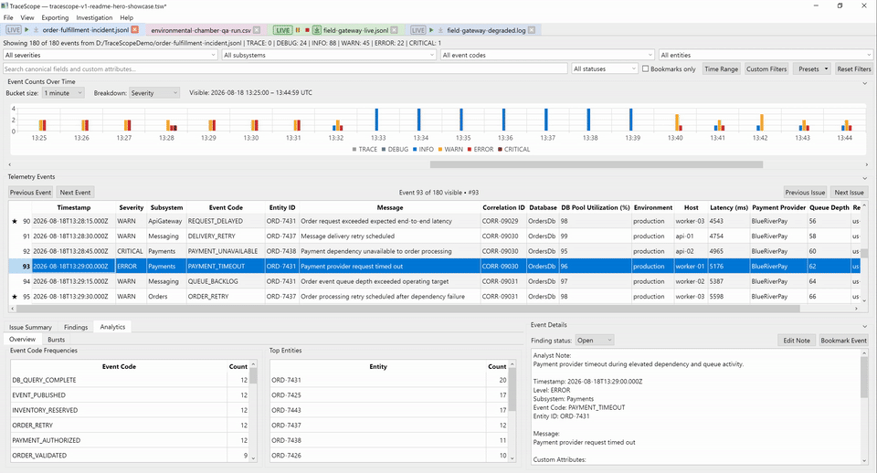

<!--
TraceScope v1.0 README — editorial draft.
The product narrative and link structure are ready for review; the media slots
below are deliberately comments, not broken image links. Replace them with
newly captured, consistent media after the targeted development pass.
Before publication, verify the final release artifacts, optional generator
packaging, scenario/profile distribution, screenshots, and product claims.
-->

# TraceScope

**Investigate file-based logs without sending them to a server.**

TraceScope is a native, cross-platform C++/Qt desktop application that turns supported application, service, QA, and diagnostic log files into investigations you can navigate, analyze, preserve, and share. It works locally: no hosted backend, log-shipping infrastructure, or account is required.

[**Download TraceScope**](https://github.com/w-cook/tracescope-qt-log-inspector/releases) · [**Get started**](docs/getting-started.md) · [**Browse the documentation**](https://w-cook.github.io/tracescope-qt-log-inspector/) · [**Explore an example report**](https://w-cook.github.io/tracescope-qt-log-inspector/examples/field-gateway-investigation-report.html)

<!--
MEDIA 01 — HERO: A short, readable demonstration of a real investigation.
Suggested sequence: open a representative Field Gateway source; inspect the
mapped records; narrow the investigation with filters and timeline drill-down;
inspect the selected record and related findings. Lead with the actual app,
not a title-card montage. Prefer an animation here.
Suggested final placement:

-->

## From unfamiliar files to useful evidence

A source file should not have to match one rigid schema to be useful. TraceScope imports supported structured and operational formats through reusable **import profiles**: explicit rules that map available fields into a common investigation model while retaining source-specific attributes and raw-record context.

Start with a likely-format suggestion, inspect the source preview, adjust field mappings when needed, and import the records into a sortable event table. Timestamp, severity, subsystem, event code, entity ID, and message are *optional* canonical fields; a file can still be investigated when some are absent.

<!--
MEDIA 02 — IMPORT: Show an actual file and profile being selected, mapped
preview vs. raw source, then the resulting event table. Choose a short GIF if
interaction is important; otherwise a clean annotated still may read better.
Suggested final placement:

-->

TraceScope supports JSON Lines, structured JSON, CSV and TSV, key-value/logfmt, Syslog RFC 3164 and RFC 5424, IIS W3C, structured XML, XML-formatted Windows Events, and common Apache/Nginx access-log layouts through regex-based profiles. Other line-oriented text can be imported with a matching regular-expression profile. Native binary `.evtx` files are **not** directly supported.

[Importing Logs](docs/importing-logs.md) · [Supported Formats](docs/supported-formats.md) · [Import Profiles](docs/import-profiles.md)

## Follow the evidence, not just the rows

Combine severity, subsystem, event-code, entity, time-range, and source-specific custom-field filters with search. Save useful filter combinations, move between matching events, inspect each record's original source context, and drill from summaries or the timeline into the records behind a pattern.

The timeline makes activity and gaps visible at adjustable resolutions. Deterministic analytics summarize event codes and entities where those fields exist; configurable burst detection groups elevated warning, error, and critical activity and shows the criteria behind each result. TraceScope helps you identify *where to investigate*—it does not claim to diagnose root causes automatically.

<!--
MEDIA 03 — INVESTIGATION: Demonstrate advanced filtering, one meaningful
timeline or issue-summary drill-down, and inspecting a selected source record.
If a single GIF becomes too dense, use one interaction GIF and a crisp static
analytics/burst image rather than accelerating the entire UI sequence.
Suggested final placement:

-->

[Investigating Logs](docs/investigating-logs.md)

## Follow a changing file without abandoning the investigation

TraceScope can follow supported log files as another application writes them. Complete new records enter the existing investigation, while filters and derived views update on a controlled cadence. Pause, resume, stop, or choose to keep the table following the newest visible records when that is useful.

This is still a file-oriented workflow. TraceScope handles incomplete writes, supported structured documents being written incrementally, same-path truncation or replacement, and configured rotated source families. When an external source changes or disappears, explicitly saved investigation snapshots can preserve records already admitted to the investigation rather than relying exclusively on what remains in the current file.

<!--
MEDIA 04 — LIVE FOLLOW: Use the standalone generator to show a deterministic
scenario producing a real on-disk log while TraceScope independently follows
it. Capture incoming records, a meaningful filter, and the controlled derived-
view update. Avoid cramming every lifecycle control into the same animation.
Suggested final placement:

-->

[Live Following](docs/live-following.md) · [Saving and Restoring](docs/saving-and-restoring.md)

## Compare what changed between sessions

Keep related investigations open and compare a complete **Baseline → Comparison** pair. TraceScope presents descriptive differences in event counts, severity, event codes, subsystem and entity activity, shared custom fields, and optionally burst behavior—only where the underlying data supports them. Missing fields are reported as unavailable rather than being mistaken for zero.

Comparisons capture point-in-time results from complete imported sessions, not whatever temporary filters happen to be active. A comparison already created does not silently change when you continue investigating or following its source sessions.

<!--
MEDIA 05 — COMPARE: Use a coherent related pair, such as the bundled known-
good and degraded Field Gateway investigations. Establish the baseline and
comparison, then show a small number of meaningful difference views. Consider
one restrained GIF plus a legible static comparison image.
Suggested final placement:

-->

[Comparing Sessions](docs/comparing-sessions.md)

## Preserve and share the investigation

Bookmark significant events, add analyst notes, and track findings as **Open**, **Resolved**, or **Dismissed**. Save a workspace to retain the broader investigation context—including its sessions, filters, findings, comparisons, and document layout—so you can resume your work later. Standalone investigation snapshots preserve normalized evidence separately from the workspace's analyst and presentation state.

When it is time to hand off results, copy individual records, export visible events or findings to CSV, or generate a self-contained **offline HTML report** from selected investigations and comparisons. Reports capture point-in-time results instead of referring to live, changing application state.

<!--
MEDIA 06 — HANDOFF: A concise findings/bookmark interaction paired with a
high-resolution static view of the exported HTML report. The report should
remain readable; an animated browser scroll is optional, not mandatory.
Suggested final placements:

-->

[Findings](docs/findings.md) · [Saving and Restoring](docs/saving-and-restoring.md) · [Reporting and Export](docs/reporting-and-export.md) · [View an example HTML report](https://w-cook.github.io/tracescope-qt-log-inspector/examples/field-gateway-investigation-report.html)

## Download and get started

Get the currently published builds from [**GitHub Releases**](https://github.com/w-cook/tracescope-qt-log-inspector/releases). The available application distributions include a portable Windows x64 ZIP and a Linux x86_64 AppImage.

On **Windows**, extract the full application archive and launch `TraceScope.exe`. On **Linux**, make the downloaded AppImage executable and launch it. Packaged applications do not require Qt Creator or a local C++ development toolchain. The [Getting Started guide](docs/getting-started.md) walks through a first investigation using supplied examples.

The repository also contains realistic fictional sample investigations and reusable import profiles. An **optional standalone Live-Log Generator**, with a command-line tool and graphical launcher, can reproduce growing files and lifecycle changes for manual testing and demonstrations. It is separate from TraceScope and is not required for normal use. See the [Live-Log Generator documentation](docs/live-log-generator.md) for its current distribution and source-build details.

<!--
RELEASE CHECK: Replace generic package language with verified v1.0 links,
platform instructions, and package contents after GitHub Actions changes.
Decide and document final generator packages and scenario/profile library
locations before treating this section as release-ready.
-->

## Documentation and project details

The [**documentation hub**](https://w-cook.github.io/tracescope-qt-log-inspector/) organizes the task-oriented guides, format and profile references, troubleshooting, and technical documentation. Start with [Getting Started](docs/getting-started.md) or go directly to [Troubleshooting](docs/troubleshooting.md).

TraceScope is built with **C++17, Qt 6 Widgets, Qt Model/View, Qt Charts, and CMake**. For implementation and verification details, see [Architecture](docs/architecture.md), [Testing](docs/testing.md), [Building from Source](docs/building-from-source.md), and [Performance Notes](docs/performance.md). Recorded performance figures are measurements on a documented test system, not maximum supported-file or throughput guarantees.

For project evolution, see the [Expansion Roadmap](docs/expansion-roadmap.md). TraceScope is distributed under the [GNU General Public License v3.0](LICENSE).

