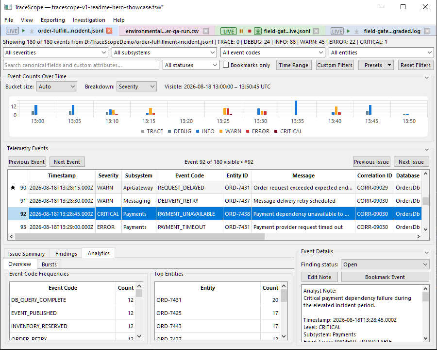
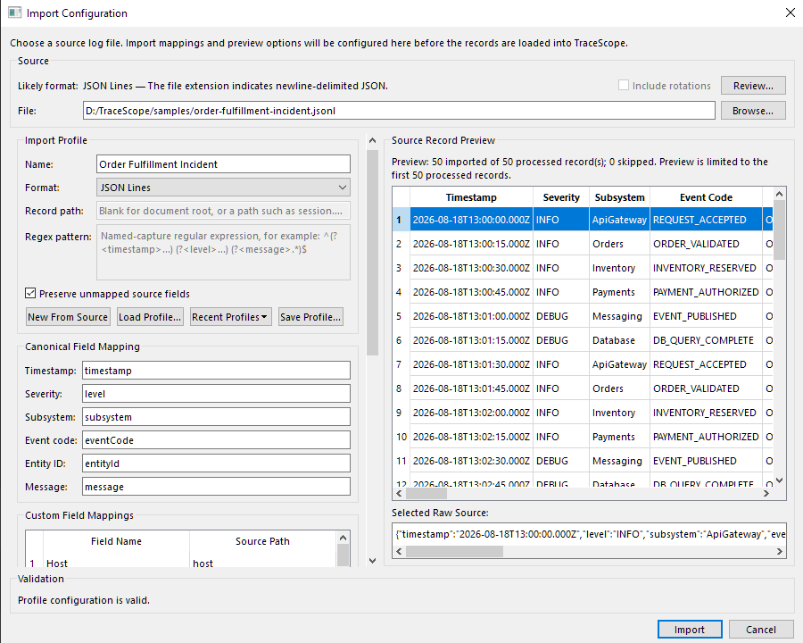
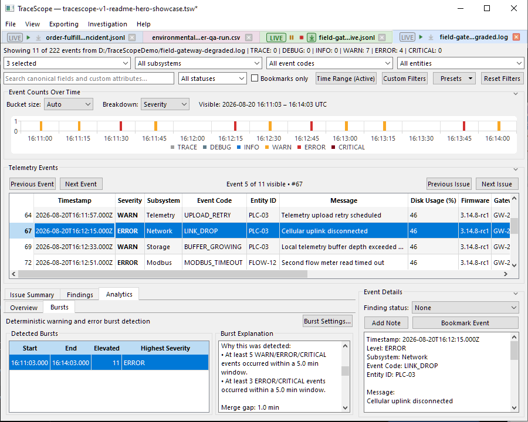
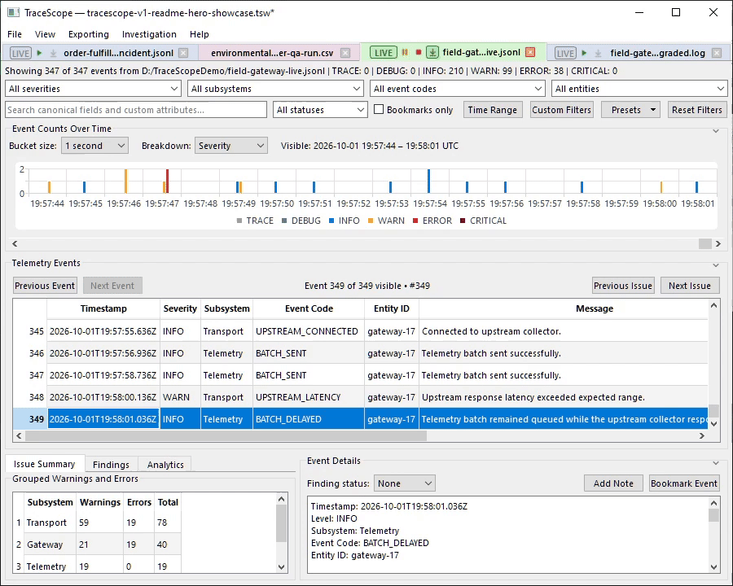
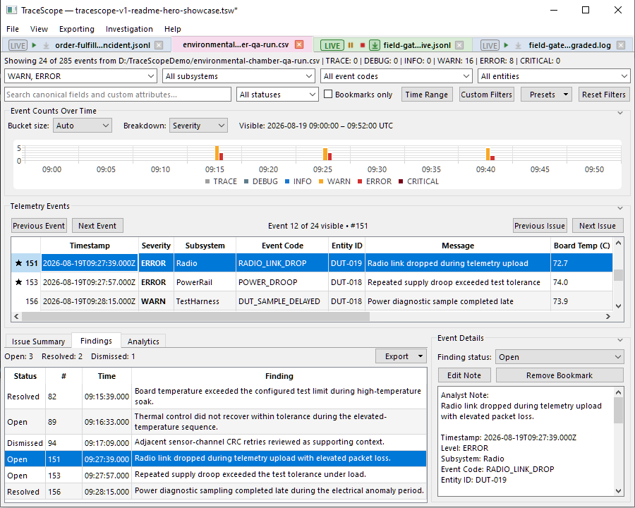
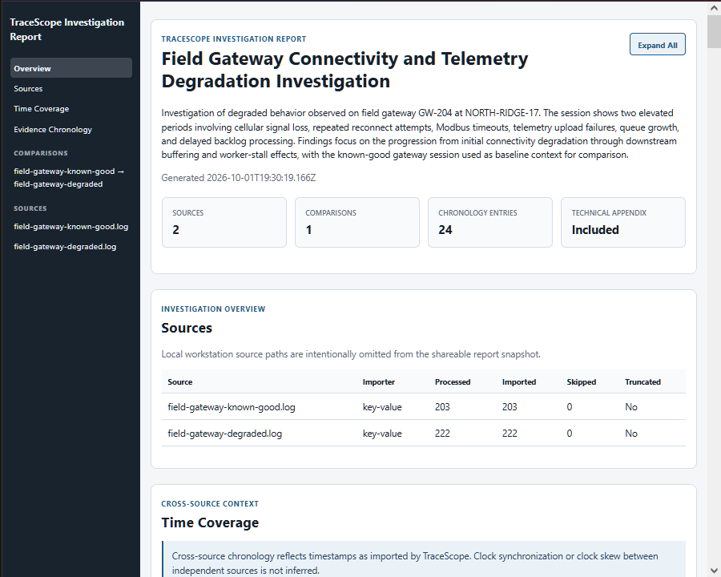

# TraceScope

**Turn file-based logs into investigations you can actually work through.**

TraceScope helps you investigate supported application, service, QA, and diagnostic logs directly on your desktop. Bring records from different file formats into a structured investigation, narrow them to the evidence that matters, preserve what you find, and share the results when someone else needs to understand them.

TraceScope works directly with files rather than requiring centralized log collection or ingestion infrastructure.

[**Download TraceScope**](https://github.com/w-cook/tracescope-qt-log-inspector/releases) · [**Get started**](docs/getting-started.md) · [**Browse the documentation**](https://w-cook.github.io/tracescope-qt-log-inspector/) · [**Explore an example report**](https://w-cook.github.io/tracescope-qt-log-inspector/examples/field-gateway-investigation-report.html)

## From unfamiliar files to useful evidence

Use TraceScope to bring differently structured log files into the same investigation workflow without first reshaping them into one rigid schema. Choose a supported format, inspect how the source is being interpreted, and use a reusable **import profile** to map the fields that matter while keeping source-specific attributes and the original record available for context.

You do not need every source to provide the same metadata before it becomes useful. Timestamp, severity, subsystem, event code, entity ID, and message are optional canonical fields, while application-specific values can remain available as custom attributes. That lets you work with the information the source actually contains instead of forcing missing concepts into the data.

TraceScope supports JSON Lines, Structured JSON, CSV and TSV, Key-Value/logfmt, Syslog RFC 3164 and RFC 5424, IIS W3C, Structured XML, XML-formatted Windows Events, and common Apache/Nginx access-log layouts through regex-based profiles. Other line-oriented text can be imported with a matching regular-expression profile. Native binary `.evtx` files are not directly supported.

[Importing Logs](docs/importing-logs.md) · [Supported Formats](docs/supported-formats.md) · [Import Profiles](docs/import-profiles.md)

## Follow the evidence, not just the rows

Use filters, search, navigation, and the timeline to move from a large record set to the part of the investigation that actually needs your attention. Narrow by severity, subsystem, event code, entity, time range, or source-specific attributes, save useful filter combinations, and move between related records without losing access to their original source context.

When a pattern is easier to see in aggregate than one row at a time, use the timeline, issue summaries, and deterministic analytics to find where to look next. TraceScope can surface repeated event codes, elevated subsystem or entity activity, and concentrated bursts of warning, error, or critical events, then let you return to the underlying records that produced those results.

The goal is to help you build and test an investigation path from the evidence in front of you. TraceScope highlights patterns and gives you ways to reach the records behind them.

[Investigating Logs](docs/investigating-logs.md)

## Follow a changing file without abandoning the investigation

Keep working in the same investigation while another application continues writing to the source file. New complete records can join the existing evidence as they arrive, so your filters, findings, timeline, and analytical context can continue alongside the changing log instead of requiring a fresh import each time the file grows.

Pause ingestion when you want to temporarily stop admitting new records, resume to catch up with source data that is still available, or stop following when the live portion of the investigation is complete. TraceScope can keep the table and timeline positioned on the newest visible records as they arrive, and you can turn that behavior off when you want to stay focused on older evidence while new records continue to arrive.

TraceScope also keeps source changes understandable as the investigation evolves. Incomplete writes are admitted only when a complete record is available, rotated files can remain part of one logical source family, and same-path truncation or replacement is tracked as a new source generation. When evidence needs to outlive the external file that produced it, you can preserve the admitted investigation state and continue working from that evidence later.

[Live Following](docs/live-following.md) · [Saving and Restoring](docs/saving-and-restoring.md)

## Compare what changed between sessions

Compare related investigations when you want to understand what changed between runs, environments, versions, or operating periods. Choose one investigation session as the **Baseline** and another as the **Comparison**, then review differences in severity, event codes, subsystem and entity activity, shared custom fields, and burst behavior wherever the available data supports them.

You can compare the complete evidence currently admitted to each investigation session or independently focus either side on a selected time range. That lets you compare whole sessions, matching periods, or a focused interval from one investigation against a broader capture from another, depending on the question you are trying to answer.

Each comparison document captures the analytical results, selected evidence scope, and relevant source context at the moment you create it, rather than copying the complete underlying record sets. You can continue filtering, following, or otherwise working in the source investigation sessions without changing that captured comparison. Return to the original sessions when a difference gives you something worth examining more closely.

[Comparing Sessions](docs/comparing-sessions.md)

## Preserve what matters and share what you found

Bookmarks, analyst notes, and finding statuses let you keep important observations connected to the evidence they came from. Records can be marked for another look, annotated with your investigation context, and tracked as **Open**, **Resolved**, or **Dismissed** as your understanding develops.

Saving the complete workspace lets you return later with its investigation sessions, filters, findings, comparison documents, and window layout intact. A standalone investigation session snapshot (`.tsinv`) provides another option for preserving admitted evidence independently of the broader workspace.

When someone else needs the result, you can choose the level of handoff that fits the situation. Individual records can be copied to the **clipboard** as formatted text or JSON and pasted into another application. Filtered records or classified findings can be exported as **CSV files** for further review in spreadsheet applications or sharing. For a fuller handoff, you can generate a self-contained **HTML report** from selected investigation sessions and comparison documents, preserving that point-in-time result in a file that can be opened in a browser, reviewed offline, and printed or saved as PDF.

[Findings](docs/findings.md) · [Saving and Restoring](docs/saving-and-restoring.md) · [Reporting and Export](docs/reporting-and-export.md) · [View an example interactive HTML report](https://w-cook.github.io/tracescope-qt-log-inspector/examples/field-gateway-investigation-report.html) or [its PDF print](https://w-cook.github.io/tracescope-qt-log-inspector/examples/field-gateway-investigation-report.pdf)

## Download TraceScope and start investigating

TraceScope is available from [**GitHub Releases**](https://github.com/w-cook/tracescope-qt-log-inspector/releases) as a portable **Windows x64 ZIP** and **Linux x86_64 AppImage**. The packaged application includes everything you need to run TraceScope — no Qt, CMake, or C++ development environment is necessary.

The supplied fictional logs and matching import profiles give you ready-made investigations to explore before bringing in your own data. The [Getting Started guide](docs/getting-started.md) walks through one of those examples from first import to focused evidence, so you can explore the core workflow with a known source before adapting it to your own logs.

For experimenting with Live Following, the release also includes a separate **Live-Log Generator** that can reproduce deterministic growing-file scenarios, including lifecycle changes such as truncation, replacement, and rotation. It is a testing and demonstration companion rather than part of the normal TraceScope workflow. See the [Live-Log Generator documentation](docs/live-log-generator.md) for its scenarios, controls, and usage.

## Explore the documentation and internals

The [**TraceScope documentation hub**](https://w-cook.github.io/tracescope-qt-log-inspector/) brings together the complete user guides, format and import-profile references, troubleshooting, and technical documentation. Start with [Getting Started](docs/getting-started.md), look up source-specific details in the reference documentation, or go directly to [Troubleshooting](docs/troubleshooting.md) when you are trying to diagnose a problem.

If you want to look under the hood, TraceScope is built with **C++17, Qt 6 Widgets, Qt Model/View, Qt Charts, and CMake**. The [Architecture](docs/architecture.md) documentation explains how imports, investigations, Live Following, persistence, comparisons, and reporting fit together. [Testing](docs/testing.md) covers the automated and manual verification strategy, while [Building from Source](docs/building-from-source.md) provides a reproducible development setup.

The [Performance Notes](docs/performance.md) document measured import scenarios, test conditions, and the limits of those measurements so you can evaluate the recorded results in context. For the project's development history and the path from the original prototype to the current application, see the [Expansion Roadmap](docs/expansion-roadmap.md).

TraceScope is distributed under the [GNU General Public License v3.0](LICENSE).

