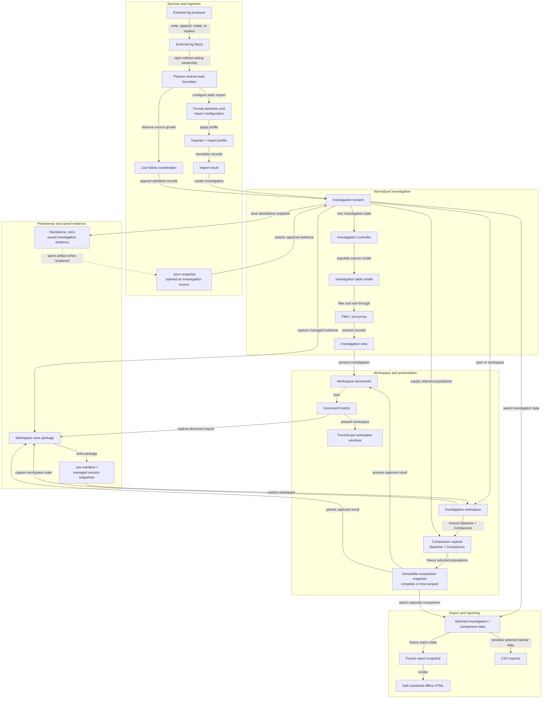
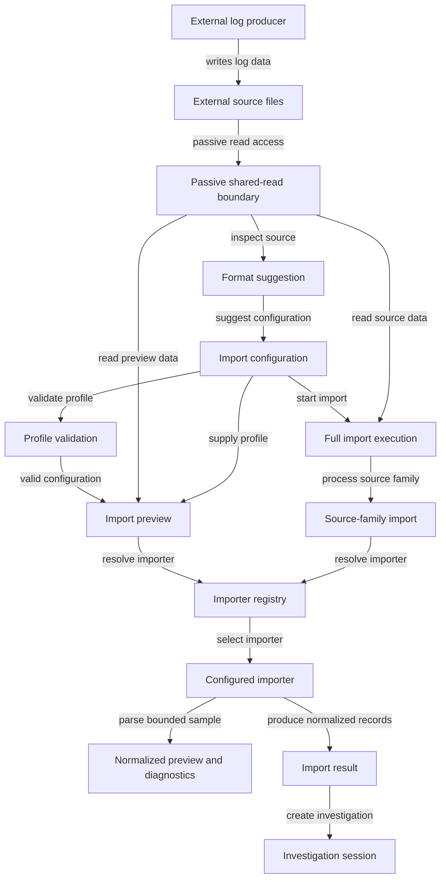
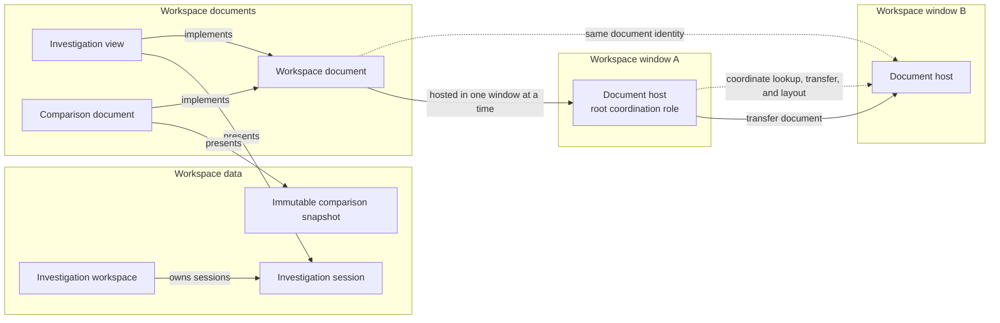
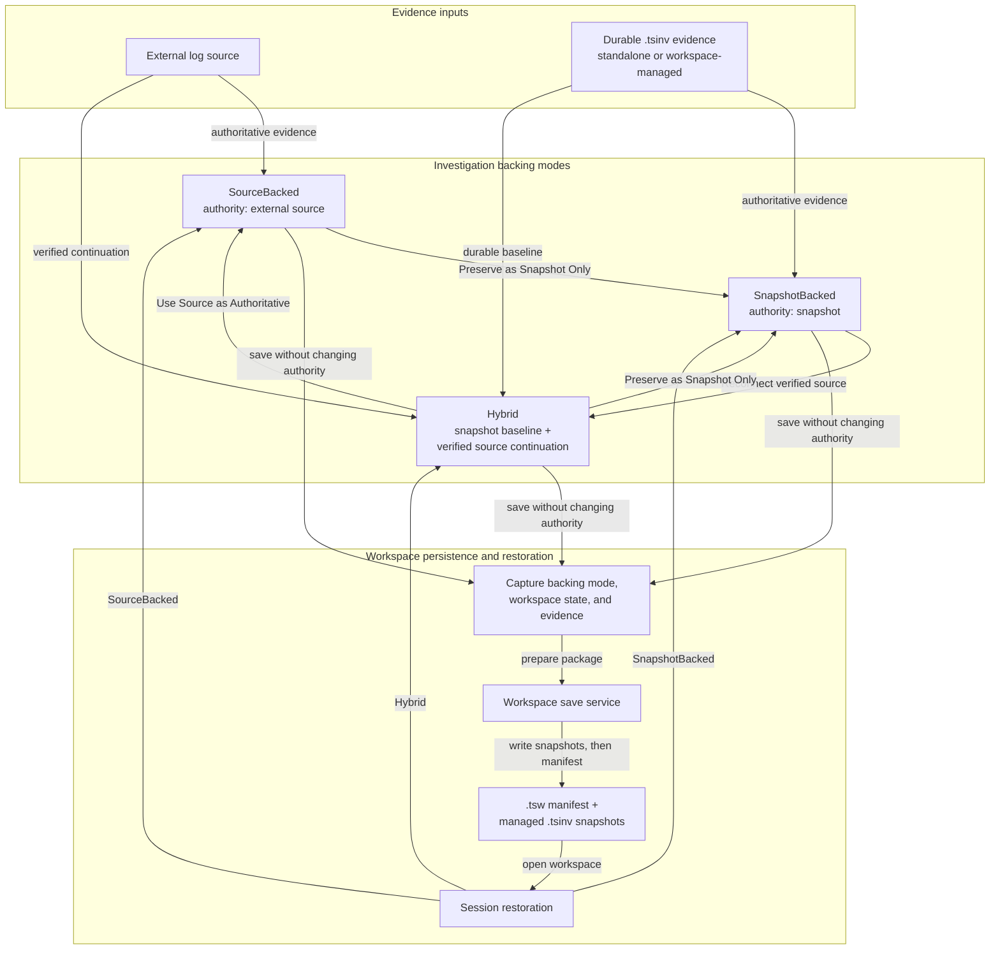
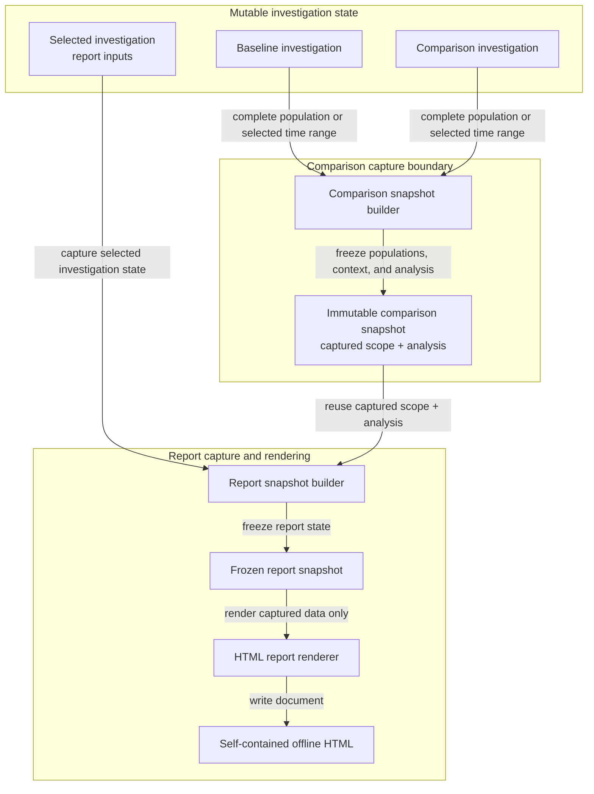

# TraceScope Architecture

TraceScope is a native, offline Qt/C++ desktop application for investigating file-based application, service, QA, engineering, and diagnostic logs. This document explains the main implementation boundaries and the decisions that connect importing, investigation, live following, persistence, comparisons, reporting, and workspace presentation. It is intended for contributors and technical readers rather than as an end-user walkthrough.

## Find the information you need

| I want to understand... | Go to |
| --- | --- |
| How the application is divided | [1. System overview](#1-system-overview) |
| The record type shared across formats | [2. Investigation data model](#2-investigation-data-model) |
| How source files become investigation records | [3. Import pipeline](#3-import-pipeline) |
| How filters, navigation, analyses, and workspace presentation fit together | [4. Investigation and analysis](#4-investigation-and-analysis) |
| How new file content is followed without rebuilding the investigation | [5. Live following and source identity](#5-live-following-and-source-identity) |
| How evidence survives source changes and workspace reopening | [6. Persistence and evidence continuity](#6-persistence-and-evidence-continuity) |
| Why comparisons and reports remain stable after capture | [7. Comparison and reporting](#7-comparison-and-reporting) |
| Where to begin making a change | [8. Code map and extension points](#8-code-map-and-extension-points) |

## 1. System overview

TraceScope separates **source interpretation** from the **normalized investigation**, and separates that investigation from its **presentation and durable artifacts**. This allows different source formats to converge on one investigation model without requiring every format to provide the same fields, and allows admitted evidence to remain meaningful even when the original source later changes or becomes unavailable.

The diagram is a conceptual view of the major data and presentation boundaries rather than a literal call graph.

- **Application and UI coordination:** `src/main.cpp`, `src/MainWindow.*`, and `src/ui/` coordinate application-level actions, workspace windows and documents, imports, restoration, reporting, and shared presentation behavior.
- **Importing and domain:** `src/importing/`, `src/domain/`, `src/io/`, and `src/sources/` interpret supported sources and normalize them into investigation records while preserving raw and physical-source provenance.
- **Investigation and analysis:** `src/workspace/`, `src/controllers/`, `src/models/`, `src/filtering/`, `src/analysis/`, and `src/preferences/` own investigation sessions, filtering and table coordination, annotations, analyses, comparisons, and persistent user preferences.
- **Continuity and output:** `src/live/`, `src/persistence/`, `src/workspace/`, and `src/exporting/` handle growing files, evidence continuity, snapshot/workspace persistence, and user-selected exports.
- **Test producer:** `tools/live-log-generator/` is a separate CLI utility used to generate reproducible file activity for live-follow testing and demonstration. TraceScope interacts only with the files it produces.

TraceScope is a **local, file-oriented desktop tool**. It investigates logs directly from files rather than requiring centralized log collection or ingestion infrastructure. See [Supported Formats](supported-formats.md) for source-format boundaries and [Live-Log Generator](live-log-generator.md) for the independent test utility.

## 2. Investigation data model

The central normalized record is [`InvestigationRecord`](../src/domain/InvestigationRecord.h). It carries a stable `recordId`; six *individually optional* canonical fields (timestamp, severity, subsystem, event code, entity ID, and message); source-specific `customAttributes`; original `rawSource`; and `RecordSourceMetadata` describing the record's physical and logical provenance.

Optional canonical fields are deliberate. A source may contain useful investigation data without providing every concept represented by the normalized model. Importers and profiles should therefore preserve absent values rather than manufacture data merely to populate canonical columns.

`RecordSourceMetadata` keeps physical source location separate from stable logical source identity and records the source-relative record number and source generation. That distinction allows TraceScope to preserve record provenance across rotated files, same-path replacement or truncation, and verified source relocation.

An import profile (`src/importing/ImportProfile.h`) selects an importer and defines how source data maps into canonical and custom fields. Depending on the importer, it can also supply record paths, regular expressions, severity aliases, timestamp rules, and unmapped-field preservation. Import profiles are **parsing configurations**, not saved investigations; see [Import Profiles](import-profiles.md).

`ImportResult` is the boundary between parsing and investigation creation or reload. It carries normalized records, diagnostics, processing counts, and cancellation/truncation state. Stable record identity and provenance are subsequently used by selection, annotations, persistence, live-source continuity, and reconciliation.

## 3. Import pipeline

### Configuration, selection, and preview

`ImportConfigurationDialog` is the boundary between source selection and import execution. `ImportFormatSuggestionService` inspects the selected source and proposes a likely importer and, where applicable, a built-in profile preset. The suggestion is advisory: the configured profile remains the authority for how the source will be interpreted.

`ImportProfileValidator` checks whether that configuration is structurally valid. `ImportPreviewService` then exercises the selected importer against a bounded sample so the proposed mappings can be inspected before a full import. Because preview uses the same importer infrastructure as the real import, it can expose content-dependent parsing problems that profile validation alone cannot detect.

Large structured JSON or XML documents are handled specially during preview. TraceScope does not automatically parse an expensive complete structured document merely because a mapping changes; those previews are started explicitly and run outside the UI thread.

### Importer boundary

[`ILogImporter`](../src/importing/ILogImporter.h) is the common import interface. `BuiltInImporterRegistry` provides the built-in JSON Lines, structured JSON, structured XML, regex text, key-value text, Syslog, IIS W3C, CSV, and TSV importers. Apache/Nginx and Windows Event XML support are implemented through profiles or presets over those importer families rather than through separate parser architectures.

Each importer is responsible for turning its source representation into normalized `InvestigationRecord` values while preserving raw content and source provenance. `JsonObjectRecordMapper` centralizes object-to-record mapping for structured values where that model applies; other importer families perform equivalent normalization according to their source structure and profile.

When rotated files are imported as one logical source family, `SourceFamilyImportService` processes the physical files individually in rotation order and combines their normalized records, diagnostics, progress, and cancellation state into one import result. Rotation remains a relationship among separate physical files; it is not the same concept as a new generation of one active path during live following.

### Passive external-source access

External log files are treated as **producer-owned resources**. TraceScope opens them only for passive read access and does not require exclusive ownership of a source in order to investigate it.

[`SharedReadFile`](../src/io/SharedReadFile.h) centralizes this boundary. On Windows, source handles explicitly permit concurrent read, write, and delete sharing so an application producing the log can continue to append, rename, rotate, replace, or remove its file while TraceScope is reading it. Platforms whose normal read handles already permit those operations use their ordinary file-reading semantics.

Concurrent access also means that a source can change between observation and physical reading. Source-reading code handles that possibility conservatively rather than assuming an observed file state remains fixed. For example, live following advances its read position only after the complete expected byte range has been read; a short read leaves the cursor unchanged so the source can be reassessed on the next observation.

This passive-reader rule is part of TraceScope's source boundary: investigating a log should not require the producing application to change its normal file lifecycle for TraceScope.

### Execution and memory

Full log imports run asynchronously so file parsing does not block the Qt event loop. The import path provides cancellation and forwards measurable importer progress when the selected importer can report it.

Line-oriented and other streamable formats can process source data incrementally. Structured JSON requires complete-document handling and therefore has different memory and progress characteristics. The architecture does not treat every supported format as a constant-memory stream.

After parsing, the normalized records themselves become part of the in-memory investigation. Streaming the input file therefore does not imply fixed application memory usage as an investigation grows. Measured behavior and its test environment are documented separately in [Performance Notes](performance.md).

## 4. Investigation and analysis

### Session, model, and investigation state

[`InvestigationSession`](../src/workspace/InvestigationSession.h) owns the investigation's normalized records through `InvestigationController`, along with source/backing metadata, import diagnostics, annotations, and session-specific presentation state. [`InvestigationWorkspace`](../src/workspace/InvestigationWorkspace.h) owns the collection of open sessions; an investigation remains the same session regardless of which workspace window currently presents it.

`InvestigationController` coordinates an `InvestigationTableModel` source model with an `InvestigationFilterProxyModel`. The source model exposes canonical fields and discovered custom-field columns; the proxy provides sorting and filtering. Operations that originate from a visible table row must resolve through the proxy back to the underlying record rather than treating a displayed row number as record identity.

Bookmarks, notes, and finding classifications are stored separately from imported log content in `InvestigationStateStore` and keyed by stable record ID. This keeps investigator-authored state distinct from source evidence while allowing it to follow the corresponding record through filtering, navigation, persistence, and reporting.

The filter model supports severity, subsystem, event code, entity, time range, dynamic custom fields, text search, finding status, and bookmark state.

### Analysis scope

Focused analyzers under `src/analysis/` provide timeline aggregation, issue grouping, value frequencies and trends, cadence analysis, burst detection, and session comparison.

Analysis population is explicit rather than assumed to be synonymous with the rows currently visible in the Event Table. Different features may intentionally operate on filtered records, complete admitted populations, or separately captured comparison populations. Code that introduces a new analysis should define that scope deliberately and preserve it through any resulting snapshot or export.

`InvestigationSessionView` composes the investigation-facing presentation and coordinates selection, navigation, filtering, annotations, and refresh of derived analysis views. It remains a presentation layer over the session rather than a second owner of investigation evidence.

### Workspace presentation

Investigation and comparison views implement the common `WorkspaceDocument` abstraction and are hosted by `WorkspaceDocumentHost`. A TraceScope workspace can span multiple top-level windows, each with its own document host. Documents may move between those hosts without being copied or acquiring a new investigation/comparison identity.

The visible windows are peers from the user's perspective: document-scoped actions target the window that invoked them, while workspace-level operations apply to the shared workspace. A root host coordinates cross-window document lookup, transfer, and layout internally; it is not a privileged user-facing workspace window.

Presentation behavior that must remain consistent across documents is centralized rather than embedded independently in individual panels. `InterfaceScale` provides application-wide user scaling on top of the operating system's display/font scaling, while `InvestigationSectionResizePolicy` centralizes constrained-height resize, collapse, and recovery decisions for the main investigation layout. These mechanisms affect presentation only; they do not alter normalized evidence or analysis semantics.

See [Investigating Logs](investigating-logs.md), [Findings](findings.md), and [Comparing Sessions](comparing-sessions.md) for the corresponding user-facing workflows.

## 5. Live following and source identity

Live following extends the **same `InvestigationSession`, normalized record model, and investigation state used for static imports**. Newly admitted records join the existing investigation rather than entering a parallel live-only representation.

[`LiveSessionFollowCoordinator`](../src/live/LiveSessionFollowCoordinator.h) connects a session to `LiveFileFollower` and the format-specific incremental parsing state required by the session's importer. The follower observes newly available source bytes through the shared passive-read boundary described in [Import pipeline](#3-import-pipeline), while the coordinator turns complete new source content into ordinary `ImportResult` records and admits them through the session's existing append path.

Incremental framing depends on the source format. Line-oriented formats retain incomplete trailing records until later source content completes them. Structured JSON and XML maintain parser state across observations so partial objects or elements are not admitted prematurely. Structured XML live following relies on a repeatable configured record path.

Appending records updates the existing table/model path rather than rebuilding the investigation. Derived analyses and other higher-cost presentation state can be refreshed separately from immediate record admission, allowing live ingestion and analytical presentation to operate at appropriate cadences.

### Physical files and logical sources

TraceScope distinguishes several changes that can otherwise look similar at the filesystem level:

- **Rotation** adds another physical file to a logical source family. Each rotated file retains its own provenance, while the active member remains the live-follow target.
- **Truncation or same-path replacement** begins a new source generation at the active path. Records admitted from earlier generations remain part of the investigation even when their original bytes are no longer present in the current file.
- **Relocation** changes the verified physical path associated with an existing logical source. Its stable `logicalSourceKey` and current generation remain unchanged.

`sourcePath`, `logicalSourceKey`, and `sourceGeneration` therefore answer different questions: where a record or active source was observed, which logical source it belongs to, and which same-path generation produced it. Keeping those concepts separate is necessary for reliable live continuation, persistence, reload, and later source reconciliation.

See [Live Following](live-following.md) for the user-facing workflow and [Live-Log Generator](live-log-generator.md) for reproducible growth, partial-write, truncation, replacement, and rotation scenarios.

## 6. Persistence and evidence continuity

TraceScope separates the **evidence currently authoritative for an open investigation** from the fact that durable copies of evidence may also exist. This distinction allows a workspace to preserve recoverable evidence without silently changing how an active investigation should reload or continue.

### Investigation snapshots

A `.tsinv` snapshot stores the normalized investigation evidence captured at a point in time, together with the import profile, import counts and diagnostics, and optional source-continuity metadata. In v1.0, snapshots preserve the normalized interpretation of the source; they do not embed a complete copy of the original source bytes for arbitrary future re-import.

Source-continuity metadata can retain the physical path, stable logical source identity, source-family configuration, source generation, and physical-source identity needed for later verification or reconnection. That metadata records where the evidence came from; its presence does not by itself make the external source authoritative for a reopened snapshot.

A standalone `.tsinv` captures investigation evidence but not the broader workspace state such as bookmarks, notes, finding classifications, filters, comparisons, or document layout. Those belong to workspace persistence.

### Backing modes and evidence authority

[`InvestigationSessionBacking`](../src/workspace/InvestigationSessionBacking.h) expresses which durable inputs currently govern an open investigation:

| Mode | Evidence authority |
| --- | --- |
| `SourceBacked` | The connected external source is authoritative. A saved snapshot may exist for recovery, but normal source-based reconstruction follows the external source. |
| `SnapshotBacked` | The saved TraceScope snapshot is authoritative. The investigation does not depend on the external source's current contents. |
| `Hybrid` | Saved snapshot evidence forms the durable baseline, while a verified external source can contribute compatible continuation evidence. |

Backing mode is therefore independent of whether the workspace has recently been saved. Saving a `SourceBacked` session creates durable recovery evidence without automatically converting that open session to `SnapshotBacked` or `Hybrid`.

Transitions between these modes are explicit. Preserving an investigation as snapshot-only removes its dependence on the current external source. Reconnecting eligible snapshot evidence to a verified source creates a Hybrid relationship without replacing the saved baseline. Conversely, **Use Source as Authoritative** deliberately abandons snapshot authority and reconstructs from the verified external source; it is not an implicit consequence of ordinary reload or recovery.

### Workspace persistence

A `.tsw` workspace stores the relationships and state needed to reconstruct the broader investigation environment: session backing information, investigator-authored record state, filters and presentation state, immutable comparisons, and workspace document layout.

Each saved workspace is accompanied by a `<workspace-name>.sessions/` directory containing durable `.tsinv` snapshots for its investigations. `WorkspaceSavePackageService` writes the new session snapshots before committing the workspace manifest. Only after the new manifest has been committed are superseded managed snapshots eligible for cleanup. This ordering prevents an interrupted save from causing an existing workspace manifest to begin referring to partially replaced evidence.

The workspace manifest refers to its managed session snapshots rather than embedding all normalized records directly. The `.tsw` file and its companion `.sessions/` directory therefore form one saved workspace package and must remain together.

### Restoration and reconciliation

`InvestigationSessionRestorationService` restores each session according to its persisted backing mode rather than applying one generic reload strategy.

A `SourceBacked` session reconstructs from its authoritative external source when that source is available. Its workspace snapshot remains recovery evidence; the existence of that snapshot does not silently override the source.

A `SnapshotBacked` session reconstructs directly from its saved normalized evidence. Source-continuity metadata, when available, can support a later verified reconnection but does not change the restored evidence authority.

A `Hybrid` session begins with the saved snapshot as its durable evidence baseline. `HybridInvestigationCandidateBuilder` and `HybridInvestigationReconstructionService` reconcile eligible external-source material with that baseline while preserving already admitted evidence. If the external source is unavailable, the snapshot remains sufficient to restore the preserved investigation.

Source relocation, reconnection, Hybrid reconstruction, ordinary reload, and **Use Source as Authoritative** are deliberately separate operations. Paths and physical files can change independently of logical source identity, and replacing preserved evidence with current source contents is treated as an explicit authority decision rather than a side effect of recovery.

See [Saving and Restoring](saving-and-restoring.md) for the corresponding user-facing workflows and recovery choices.

## 7. Comparison and reporting

### Immutable comparisons

[`InvestigationComparisonSnapshotBuilder`](../src/workspace/InvestigationComparisonSnapshotBuilder.cpp) creates a comparison from two open investigations with an explicit **Baseline → Comparison** orientation. Each side is captured from either its complete admitted record population or an independently selected time range.

Time-scoped comparison capture is deliberately independent of the investigations' other active filters. The selected record populations, optional time boundaries, requested burst settings, source context, and derived analysis are captured when the comparison is created. The resulting `InvestigationComparisonSnapshot` is immutable: later filtering, navigation, live additions, reloads, or source changes do not redefine it.

`InvestigationSessionComparisonAnalyzer` performs deterministic analysis over those captured populations. Comparison persistence stores the captured source context, optional time ranges, analysis result, and presentation state so reopening a workspace restores the original comparison rather than recalculating it from the current sessions.

This makes a comparison document an analytical artifact in its own right. It can remain meaningful even if one of its original source investigations is later changed, unavailable, or omitted during workspace restoration.

### Report capture

HTML report generation introduces a second immutable boundary. `InvestigationReportSnapshotBuilder` captures the selected investigation and comparison material into an `InvestigationReportSnapshot` before rendering begins.

Investigation report snapshots preserve the report-relevant source context, active investigation filters, record populations, analysis results, findings/evidence, and other selected report state. Included comparisons reuse their already-captured `InvestigationComparisonSnapshot` analysis and scope; report generation does not recalculate them from potentially newer session contents.

[`InvestigationReportHtmlRenderer`](../src/exporting/InvestigationReportHtmlRenderer.cpp) renders only from that frozen report model. The renderer therefore does not query mutable `InvestigationSession` state while producing the document. This separation keeps report output internally consistent even when the originating workspace contains live or otherwise mutable investigations.

The resulting HTML report is self-contained and usable offline. Interactive navigation, expansion controls, responsive presentation, and print-specific behavior belong to the rendering layer and do not change the captured analytical state.

CSV export follows a narrower path: visible-record and findings exports serialize the explicitly selected record population without passing through the full HTML report snapshot model.

See [Comparing Sessions](comparing-sessions.md) and [Reporting and Export](reporting-and-export.md) for scope rules and user-facing operations.

## 8. Code map and extension points

The following entry points are intended to help contributors identify the subsystem responsible for a change before tracing the implementation in detail.

| Change | Start by inspecting | Related verification |
| --- | --- | --- |
| New source format | `src/importing/ILogImporter.h`, `BuiltInImporterRegistry`, profile presets, format suggestions, and the shared-read source boundary in `src/io/SharedReadFile.*` where file access is involved | Importer tests, matching sample/profile data, preview behavior, diagnostics, and producer-safe source access |
| New mapping or profile rule | `ImportProfile`, profile serialization/validation, and the applicable importer or shared record mapper | Serialization, validation, preview, and importer tests |
| New table field or filter | `InvestigationTableModel`, `InvestigationFilterProxyModel`, `InvestigationController`, and `InvestigationSessionView` | Model/proxy/controller tests plus filtering and navigation behavior |
| New analysis | The focused analyzer under `src/analysis/` and the presentation surface that consumes it | Deterministic analyzer tests and explicit population/scope verification |
| Comparison behavior or scope | `InvestigationSessionComparisonAnalyzer`, `InvestigationComparisonSnapshotBuilder`, and comparison persistence | Analyzer, snapshot, time-scope, persistence, and comparison-presentation tests |
| New live-follow behavior | `LiveFileFollower`, `LiveSessionFollowCoordinator`, `src/io/SharedReadFile.*`, format-specific live parsing, and session append/source-identity handling | Follower/coordinator/parser tests plus real-file generator scenarios and producer-safe source access |
| Evidence or persistence change | Session backing, `.tsinv` snapshot serialization, restoration/reconstruction services, workspace persistence, and `WorkspaceSavePackageService` | Versioned round trips, backing-mode transitions, recovery, reconciliation, and failure-path tests |
| New report content or capture semantics | Report configuration, snapshot builders, `InvestigationReportSnapshot`, and `InvestigationReportHtmlRenderer` | Snapshot immutability, scope/capture, escaped rendering, and export tests |
| Workspace/document behavior | `WorkspaceDocument`, `WorkspaceDocumentHost`, investigation/comparison documents, and workspace layout persistence | Document-host/layout tests and manual multi-window verification |
| Shared interface scaling or constrained investigation layout | `InterfaceScale`, `InvestigationSessionView`, and `InvestigationSectionResizePolicy` | Scale/resize policy tests plus multi-scale and constrained-window regression checks |

Changes that cross subsystem boundaries deserve additional scrutiny. In particular, live following, persistence, source identity, and restoration all affect which evidence remains authoritative after a physical source changes; comparison and reporting changes can affect whether previously captured analytical state remains immutable.

For the automated verification structure, see [Testing](testing.md). For a reproducible development environment and local test execution, see [Building from Source](building-from-source.md).
