# Comparing Investigation Sessions in TraceScope

A log file can reveal what happened during one run. **Session Comparison** helps you identify how two recorded runs differ—for example, a known-good engineering capture and a later degraded capture. TraceScope compares the normalized records from two investigation sessions and presents the results in a separate comparison document, highlighting differences in event codes, severity, elevated activity, selected source-specific attributes, and optionally detected bursts.

This guide uses the fictional **Field Gateway Support Sessions** supplied with TraceScope. The two captures represent a known-good run and a degraded run of the same gateway. They are deliberately matched for a reproducible exercise, but a difference between two logs is an investigative observation, **not proof of what caused a failure**.

**Having trouble comparing sessions?** [Jump straight to Troubleshooting](#troubleshooting).

**In this guide, you will:**

1. [Choose a known-good baseline and degraded comparison session](#1-choose-sessions-that-answer-a-useful-question), then [open both investigations](#2-open-the-baseline-and-comparison-investigations).
2. [Create a directional comparison](#3-create-the-comparison), optionally [capture independent time ranges](#optionally-compare-selected-time-ranges), and [configure shared burst analysis](#decide-whether-to-include-burst-comparison).
3. Interpret the comparison's [key differences](#4-read-the-comparison-from-top-to-bottom), [burst results](#5-interpret-burst-comparison), and [session context](#6-use-session-context-to-keep-the-differences-in-perspective).
4. [Investigate differences in the original sessions](#7-investigate-the-differences-in-the-original-sessions) while [respecting the saved comparison's point-in-time meaning](#know-when-you-need-a-new-comparison).
5. [Preserve the comparison in a workspace or include it in an offline report](#8-save-or-share-the-comparison).

If you have not imported logs before, start with [Getting Started](getting-started.md) and [Importing Logs](importing-logs.md). For individual-record filtering and analysis, see [Investigating Logs](investigating-logs.md).

## 1. Choose sessions that answer a useful question

A comparison is most useful when the two captures represent states you intentionally want to contrast. A known-good capture can serve as the **Baseline**, while a failed, changed, or degraded capture serves as the **Comparison**.

TraceScope always calculates a difference as:

**Delta = Comparison − Baseline**

A positive delta means a value occurred more often in the comparison capture; a negative delta means it occurred less often. Neither direction, on its own, establishes whether the change was beneficial or harmful.

Before comparing your own files, check whether they have compatible field mappings and comparable collection conditions. The same field name should mean the same thing in each investigation. Differences in capture duration, workload, collection coverage, firmware, or logging configuration can affect the output even when there is no new defect. TraceScope reports descriptive differences; it does not normalize unrelated workloads or establish causation.

The supplied Field Gateway pair gives us a consistent starting point:

| File | Role |
| --- | --- |
| [`samples/field-gateway-known-good.log`](../samples/field-gateway-known-good.log) | Baseline: an ordinary gateway support capture |
| [`samples/field-gateway-degraded.log`](../samples/field-gateway-degraded.log) | Comparison: a capture containing degraded activity |
| [`samples/profiles/field-gateway-support-session-profile.json`](../samples/profiles/field-gateway-support-session-profile.json) | Shared import profile for **both** files |

The samples use key-value/logfmt records. Their matching profile maps timestamps, severities, subsystems, event codes, entity IDs, and messages, and preserves source-specific values such as **Firmware**, **Latency (ms)**, **Queue Depth**, and **Reconnect Count**.

## 2. Open the baseline and comparison investigations

Import each log as a separate investigation session. Both sessions must be open in the **same TraceScope workspace** before you create a comparison document.

1. Choose **File > Open Log File...**,

    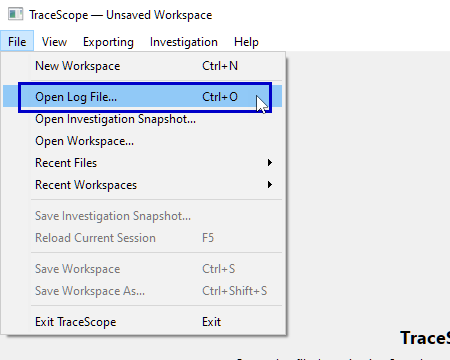

    select `field-gateway-known-good.log`,
    
    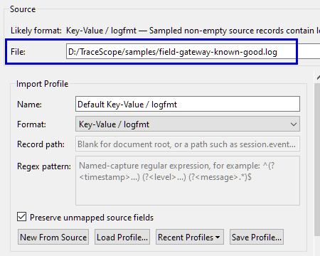
    
    and load `field-gateway-support-session-profile.json` using **Load Profile...** in **Import Configuration**.

    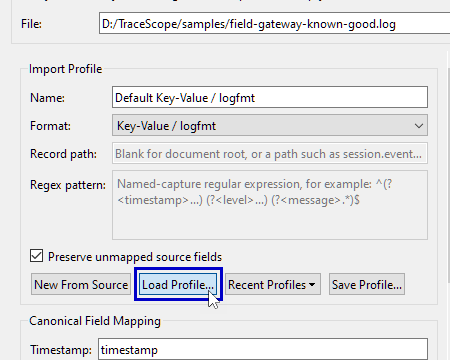
2. Confirm that the selected format is **Key-Value / logfmt**,

    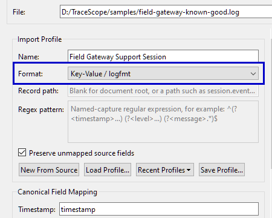

    inspect the preview,
    
    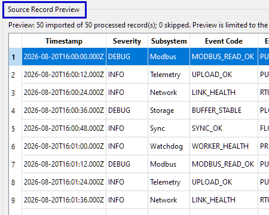
    
    and select **Import**.

    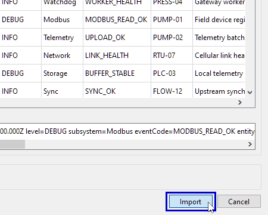
3. Repeat those steps for `field-gateway-degraded.log`, using **the same profile**.

    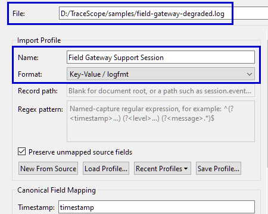
4. Confirm that both investigation sessions are open as separate tabs in the workspace.

    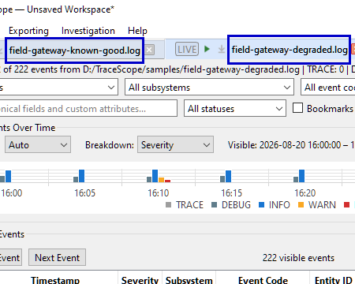

    Leave the degraded investigation active for the next step.

If you are using the packaged Windows release, look under its included `samples/` directory. For the Linux AppImage, obtain the separate static samples archive or use the repository's sample files, as explained in [Getting Started](getting-started.md#3-find-the-example-log-and-its-profile).

You can inspect and filter either investigation before proceeding. **By default**, a comparison uses all records currently admitted to each investigation, not merely the records visible under its active filters. Alternatively, you can independently capture one or both sessions' **active time-range boundaries** when creating the comparison. Only those boundaries restrict a scoped population; search, severity, subsystem, entity, custom-field, bookmark, and finding-status filters do not. For a live or previously reloaded session, the comparison captures evidence actually held at creation time; it cannot reconstruct historical bytes that were never admitted or are no longer available.

## 3. Create the comparison

With the degraded investigation active:

1. Choose **Investigation > Compare Sessions...**. 

    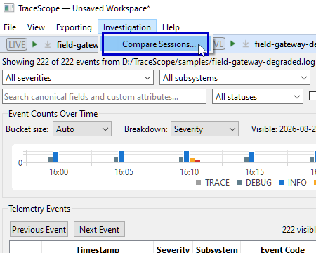

    The command is available when at least two investigation sessions are open. You can also right-click an investigation session's tab and choose **Create Comparison...**.

    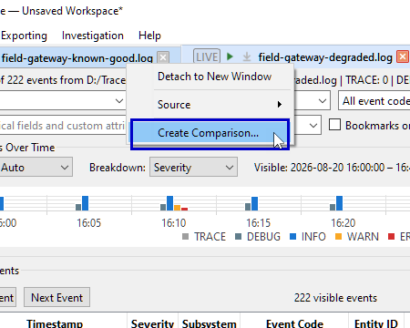
2. In **Compare Investigation Sessions**, set **Baseline** to `field-gateway-known-good.log` and **Comparison** to `field-gateway-degraded.log`.

    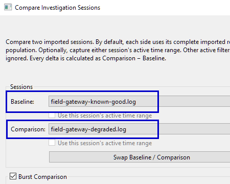
3. Read the orientation above the selectors: every displayed delta is **Comparison − Baseline**. Use **Swap Baseline / Comparison** if the sessions are reversed.

    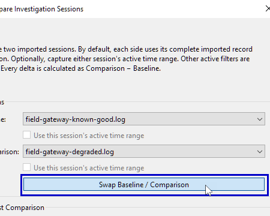
4. Leave **Use this session's active time range** unchecked for both **Baseline** and **Comparison**. This first walkthrough compares all currently admitted records in each investigation session.

    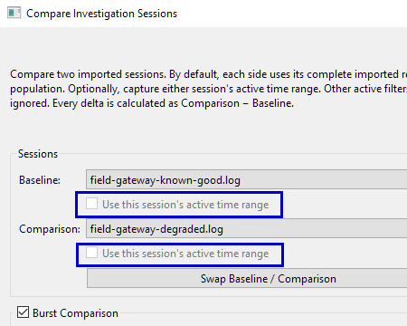

    See [Optionally compare selected time ranges](#optionally-compare-selected-time-ranges) when you want to focus on particular periods instead.
5. Review **Burst Comparison**, which is enabled by default, and decide whether to keep it for this exercise. You can leave its suggested settings as they are for your first comparison.

    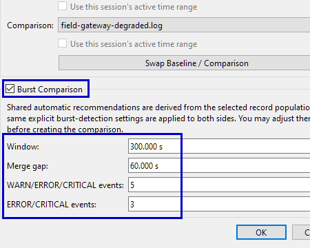
6. Select **OK** to create a new comparison document.

    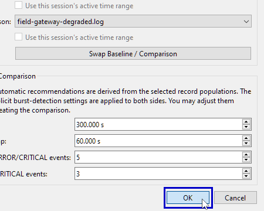

TraceScope prevents you from selecting the same investigation for both roles. The active session normally defaults to **Comparison**, while another open session is suggested as **Baseline**. Right-clicking a different session's tab can also suggest that clicked session as the baseline; always verify both selectors before continuing.

The comparison opens as a **separate comparison document** in the workspace, with a compact title indicating `Baseline → Comparison`. It does not replace, merge, or modify either source investigation session.

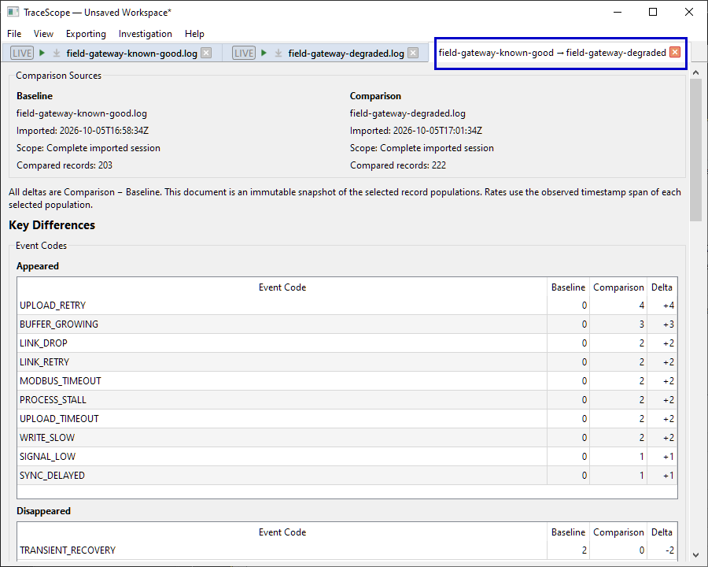

### Optionally compare selected time ranges

Comparing complete investigation sessions is useful when both captures cover similar periods and operating conditions. When they don't, you may want to compare only the relevant intervals—for example, the period surrounding a failure in a degraded run against a comparable period of normal activity in the baseline. This helps focus the comparison on the behavior you're investigating rather than unrelated activity elsewhere in either capture.

You can compare different periods of two investigation sessions without applying their other active event table filters to the comparison. Configure the desired **Time Range** filter separately in each source investigation *before* opening **Compare Sessions...**, then use the independent **Use this session's active time range** checkbox under Baseline, Comparison, or both.

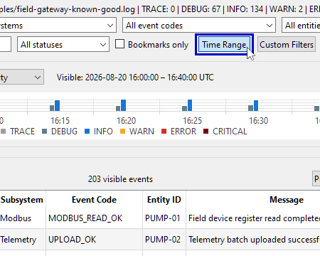

Each checkbox starts unchecked. It becomes available only when its selected investigation has at least one valid active time boundary and that boundary selects one or more records. Checked boundaries are inclusive: a start-only or end-only scope is valid, as is a bounded start–end interval.

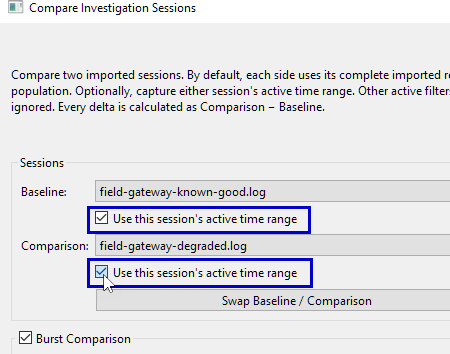

The selected records come from that session's **complete currently admitted population**, ignoring every other active filter. Records without usable timestamps cannot belong to a time-scoped selection.

You can scope just one side and leave the other as a complete session. The resulting comparison permanently captures each side's scope and selected records; it is not a live connection to the source investigations' evolving filters. A time range selecting no records cannot be used to create a comparison. If you later want different boundaries or newly admitted live evidence, create another comparison.

### Decide whether to include burst comparison

The **Burst Comparison** section is optional. It applies the **same explicit settings to both sessions**, rather than allowing each run's separate automatic timing to produce measurements on different scales.

The setup dialog recommends shared **Window** and **Merge gap** values from the records selected for each side. If a scoped population contains too little timing information for an adaptive recommendation, that side falls back to its complete session's cadence; if that is also too sparse, the existing static recommendation applies. The dialog uses the larger of the two resulting recommendations for each shared setting. You can adjust those values and the **WARN/ERROR/CRITICAL events** and **ERROR/CRITICAL events** thresholds before creating the comparison. **Actual burst analysis always uses the selected comparison populations and the same explicit settings on both sides**; the fallback affects recommendations only.

For this exercise, leaving the default burst option enabled provides another perspective on the gateway's elevated activity. If you disable it, the core comparison is still complete; the resulting document simply omits **Burst Comparison**. See [Investigating Logs](investigating-logs.md#10-explore-frequencies-and-detected-bursts) for how burst detection works in one investigation.

## 4. Read the comparison from top to bottom

Start with **Comparison Sources** at the top of the new document. It identifies each source and its import context, reports whether that side used the **complete imported session** or a **captured active time range**, and shows any captured start and end boundaries (including unbounded boundaries) and the number of records actually compared. These details matter especially when the two sides have different scopes.

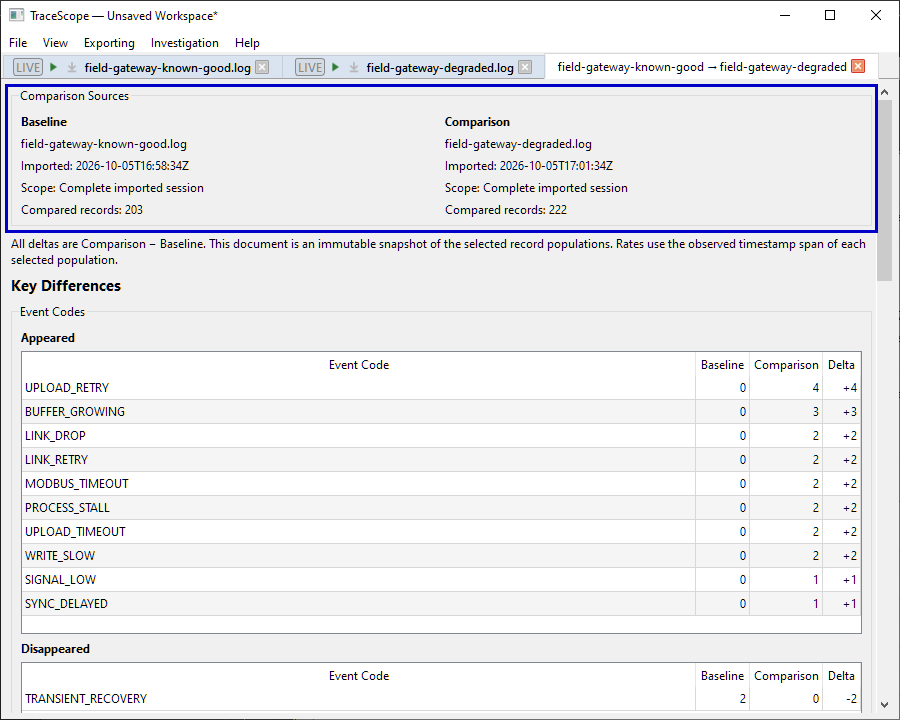

Immediately below, the document reiterates two important rules: all deltas are **Comparison − Baseline**, and the result is an **immutable snapshot** of the selected record populations as they existed when you created it.

### Key Differences: look for changes worth investigating

The **Key Differences** section focuses on differences rather than repeating every unchanged value. Its tables show baseline counts, comparison counts, and directional deltas where appropriate. Larger absolute differences generally appear earlier within the applicable result groups, but the presentation order is not a root-cause ranking.

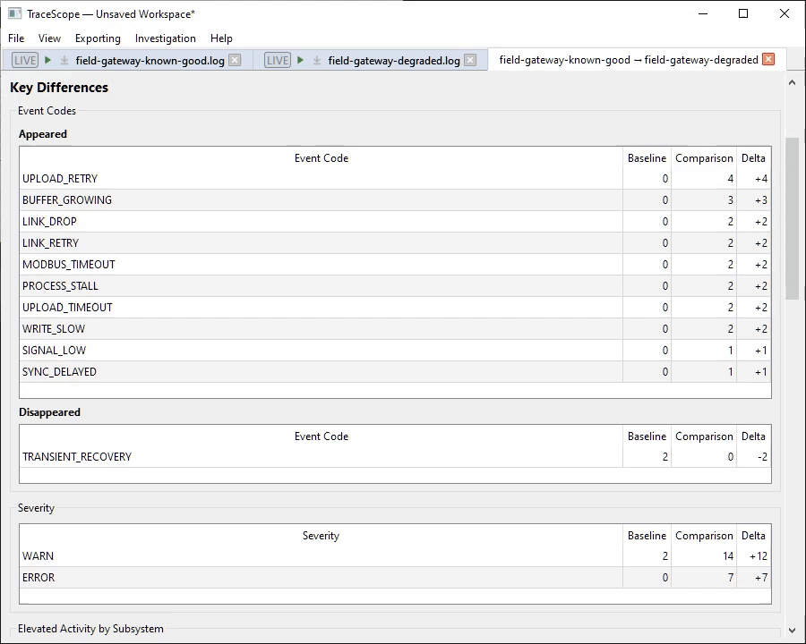

Read the available subsections together:

| Section | What to look for |
| --- | --- |
| **Event Codes** | Codes that **Appeared**, **Disappeared**, or **Changed** in occurrence count between the captures. |
| **Severity** | Changes in the number of records at individual severity levels. |
| **Elevated Activity by Subsystem** | Differences in `WARN`, `ERROR`, and `CRITICAL` activity associated with mapped subsystems. |
| **Elevated Activity by Entity** | Differences in elevated activity associated with mapped entity IDs. |
| **Custom Fields** | Selected changes in shared source-specific fields, under conservative comparison rules. |

In the Field Gateway example, start with event-code differences and elevated subsystem activity. These can give you concrete leads to explore in the degraded session. Then check whether the custom-field section offers related context, including the differing firmware values and any changing numeric summaries. Do not assume that two changes occurring in the same pair of captures have a proven causal relationship.

**An unavailable dimension is not a zero.** For example, if one investigation has no usable event-code data, TraceScope cannot responsibly claim that all codes in the other capture newly appeared. It explicitly marks an unsupported comparison as unavailable. Conversely, a comparable dimension that contains no differences can be omitted to keep the document focused.

### Understand the custom-field limitations

TraceScope compares custom fields **only when their mapped names match exactly** and both investigations contain suitable values. It does not guess that differently named fields are equivalent.

- For a field whose populated values are all finite numbers in **both** sessions, TraceScope compares **minimum, median, and maximum**. It shows a numeric field when those distribution summaries differ; it does not treat a changed populated-record count alone as a distribution difference.
- For qualifying categorical fields, it shows values that **appeared or disappeared**. It intentionally does not present occurrence-count changes for values shared by both captures as custom-field differences. Fields with too many distinct categorical values or unsuitable structured values can be omitted.

For this exercise, the profile's **Firmware** field provides useful categorical deployment context, while **Latency (ms)** and **Queue Depth** can provide numeric context. Their appearance in the comparison depends on the actual imported values and the rules above. Treat these results as supporting observations rather than automated explanations.

## 5. Interpret Burst Comparison

If you enabled burst analysis in the setup dialog, scroll to **Burst Comparison**.

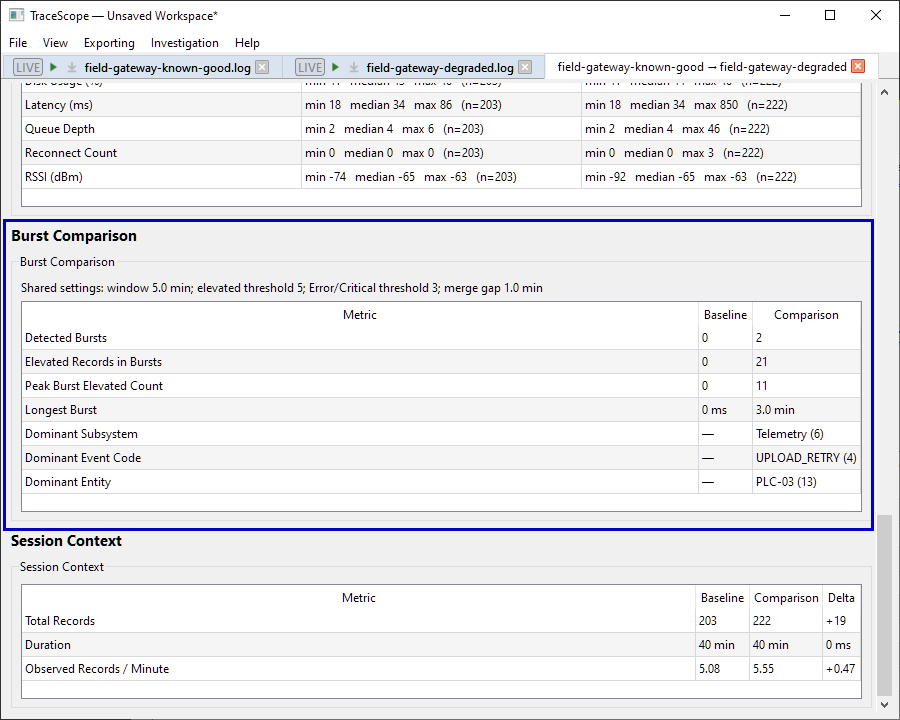

The document displays the shared configuration used for both sessions and, when the data supports comparison, includes:

- **Detected Bursts** and **Elevated Records in Bursts**.
- **Peak Burst Elevated Count** and **Longest Burst**.
- The available **Dominant Subsystem**, **Dominant Event Code**, and **Dominant Entity** within detected bursts.

Compare these alongside the event-code and severity sections. A capture with more detected bursts or a higher peak deserves further examination, but those numbers are dependent on the selected thresholds, timing window, merge gap, timestamps, and severities.

Three situations have different meanings: **no Burst Comparison section** means you did not request it; **Unavailable** means the requested settings or source data do not support a valid result; and **zero detected bursts** is a valid analytical result when the required data exists but nothing meets the chosen detection criteria.

Unlike the **Auto** timing option in an individual investigation's Analytics tab, session comparison evaluates both captures under one shared, fixed configuration. Do not equate two separately configured individual burst views with a shared-settings comparison.

## 6. Use Session Context to keep the differences in perspective

The **Session Context** table includes **Total Records**, **Duration**, and **Observed Records / Minute**, with directional deltas where they can be meaningfully calculated.

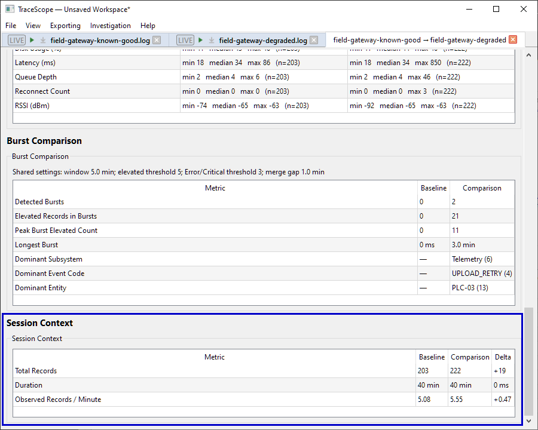

When at least one side has a valid, bounded time range with a positive duration, it also shows **Window-Average Records / Minute**.

**Duration** and **Observed Records / Minute** use the span between the first and last usable timestamps **among the selected records**. The observed rate divides the number of timestamped records by that span; it is unavailable without a positive-duration interval. By contrast, a **window-average rate** divides the selected timestamped-record count by the entire explicitly captured start–end interval, including quiet periods before the first or after the last selected event. Start-only, end-only, and zero-duration scopes do not have a finite window-average rate. A dash marks an unavailable side, and a window-average delta is displayed only when **both** sides have qualifying bounded windows. An unscoped complete session does not acquire a window-average rate merely because its records have first and last timestamps.

A source with missing timestamp information may still support a valid total-record comparison even when timing measurements are unavailable. If you want to compare rates, review the captured scopes and the difference between observed span and selected window before interpreting a delta.

Check this section before interpreting a large count difference. If your own comparison capture covers twice as long a period, more events may simply reflect that longer collection window. If logging configurations or workloads differ, a higher event rate may not represent the same underlying kind of activity. TraceScope presents these measurements as context; deciding whether the captures are operationally comparable remains part of the investigation.

## 7. Investigate the differences in the original sessions

The comparison document is a **read-only analytical summary**, not a merged event table. Its summary tables do not replace source-record inspection or automatically navigate into individual source events.

To follow up on a changed event code or subsystem:

1. Note the event code, subsystem, or entity of interest from **Key Differences**.
2. Switch to the degraded investigation session's tab. Use the event-code filter, subsystem filter, or another available criterion to find the corresponding source records.
3. Inspect the matching records in **Telemetry Events** and **Event Details**. Broaden filters and examine surrounding activity before interpreting the difference.
4. Switch to the known-good investigation and examine the corresponding value or nearby activity, when applicable.
5. Bookmark records, add analyst notes, or create findings in the **individual investigation** if you want to preserve your review decisions. See [Findings](findings.md).

You can place the comparison document and its source investigation sessions side by side by detaching their tabs into separate TraceScope windows. In a narrow window, the comparison document scrolls vertically, and long result tables can have their own scroll areas. Arrange the documents for your available display space rather than expecting everything to fit at once.

### Know when you need a new comparison

A comparison is captured at creation time. Later changes to source filters, newly arriving live records, a source reload, closing an investigation, or changing its backing mode **do not update an existing comparison**.

This is intentional: an existing result must keep its original meaning, including any separately captured time boundaries. If you want to compare newly admitted evidence or use changed time scopes, create a **new comparison document**. Keep the earlier comparison if the before-and-after distinction matters to your review. Ordinary filter changes by themselves do not alter either a complete-session comparison or the already captured time boundaries of a scoped one.

## 8. Save or share the comparison

Choose **File > Save Workspace** to preserve the workspace's open investigation sessions, comparison documents, and associated state in a `.tsw` workspace package.

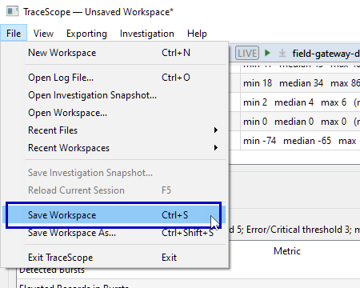

The saved workspace also has a companion `<workspace-name>.sessions/` folder holding the investigations' durable evidence snapshots. Keep the `.tsw` file and its matching folder together when moving or backing up your work; see [Saving and Restoring](saving-and-restoring.md).

A saved comparison contains an independent point-in-time result, including the original selected populations' analysis and any independently captured time boundaries. The comparison document can still be restored as part of the workspace even if one of its source investigation sessions cannot be reopened and you choose **Skip Session** during missing-source recovery. A saved comparison is not a substitute for keeping the original source evidence when you need to inspect individual events again.

For an offline handoff that recipients can read **without TraceScope**, you can create a self-contained HTML report and include the comparison among its selected documents.

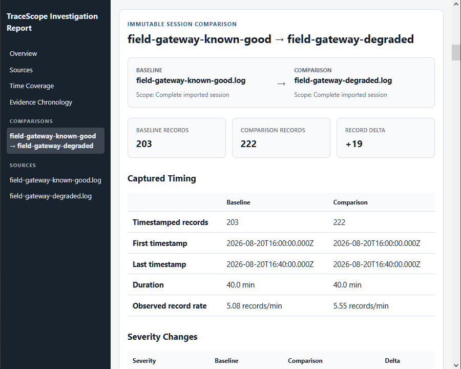

A report is another fixed snapshot—not a live connection to either investigation or to the saved comparison document. The separate [Reporting and Exporting](reporting-and-export.md) guide covers report options and the distinctions among reports, findings CSV, filtered-record CSV, and saved workspaces.

## Troubleshooting

| Situation | What to check |
| --- | --- |
| **Compare Sessions...** is unavailable | You need at least **two distinct open investigation sessions** in the current workspace. A comparison document is not itself another source investigation. See [Open the baseline and comparison investigations](#2-open-the-baseline-and-comparison-investigations) for more information. |
| The dialog will not accept your choices | **Baseline** and **Comparison** must refer to different open investigations. A checked time range must be valid and contain at least one timestamped record. See [Create the comparison](#3-create-the-comparison) and [Optionally compare selected time ranges](#optionally-compare-selected-time-ranges). |
| A session's time-scope checkbox is disabled | Configure at least one usable **Time Range** boundary in that investigation before opening the comparison dialog. The active range must select timestamped records; other filters do not determine whether a scoped population has matches. See [Optionally compare selected time ranges](#optionally-compare-selected-time-ranges). |
| The scoped comparison has different counts from the filtered event table | This is expected when other source-data or review-only filters are active: an optional comparison scope uses **time boundaries alone** over the complete admitted population. See [Optionally compare selected time ranges](#optionally-compare-selected-time-ranges). |
| Window-Average Records / Minute does not appear | At least one side needs both captured time boundaries with a positive interval. Start-only, end-only, and complete-session sides have no window-average value; the row is omitted if neither side qualifies. See [Use Session Context](#6-use-session-context-to-keep-the-differences-in-perspective). |
| A field is marked **Unavailable** | Confirm that **both** source investigations contain usable data for the relevant mapped dimension. Missing fields are not assumed to mean zero occurrences. See [Read the comparison from top to bottom](#4-read-the-comparison-from-top-to-bottom) and [Importing Logs](importing-logs.md#3-configure-an-import-profile) for related information. |
| A custom field you expected does not appear | Check that both profiles use the **same exact custom-field name**, the data contains usable values, and the conservative numeric/categorical comparison rules apply. See [Understand the custom-field limitations](#understand-the-custom-field-limitations) for more information. |
| The burst section is missing | Check whether you enabled **Burst Comparison** when creating the document. It is an optional comparison dimension. See [Create the comparison](#3-create-the-comparison) for more information. |
| Burst Comparison says **Unavailable** | Both sessions require usable timestamps and severities. Requested settings must also be valid. See [Interpret Burst Comparison](#5-interpret-burst-comparison) for more information. |
| You changed a source session's filters but the comparison did not change | Comparisons are immutable snapshots, **not** live filtered views. An existing scoped comparison keeps the time boundaries captured when it was created; other filters never restrict it. Create a new comparison if you need newly captured time boundaries or evidence. See [Know when you need a new comparison](#know-when-you-need-a-new-comparison). |
| A large delta seems inconsistent with your observations | Recheck the **Baseline → Comparison** orientation, imported record coverage, source-field mappings, collection durations, and relevant operational differences. See [Choose sessions that answer a useful question](#1-choose-sessions-that-answer-a-useful-question) and [Use Session Context](#6-use-session-context-to-keep-the-differences-in-perspective) for related information. |
| An earlier comparison reopens even though one source investigation is missing | The saved comparison is independent of its source session objects. Its analysis remains viewable, but recovering the original event-level evidence is a separate task. See [Save or share the comparison](#8-save-or-share-the-comparison) and [Saving and Restoring](saving-and-restoring.md#3-optional-walkthrough-recover-when-the-original-source-is-missing) for related information. |

## Where to go next

You now have a reproducible workflow for comparing complete investigations or independently selected time windows, using descriptive differences to guide record-level review, and preserving the resulting point-in-time analysis.

Use [Investigating Logs](investigating-logs.md) and [Findings](findings.md) when you need to investigate and record the supporting source evidence. See [Saving and Restoring](saving-and-restoring.md) for retaining entire workspaces and source evidence, and the [Reporting and Exporting](reporting-and-export.md) guide for producing a self-contained offline handoff.
