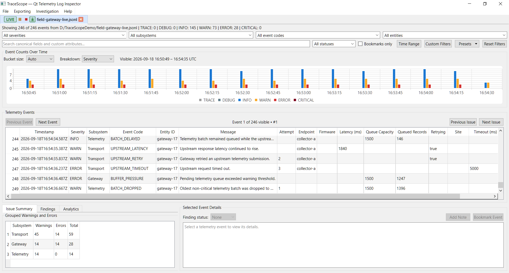
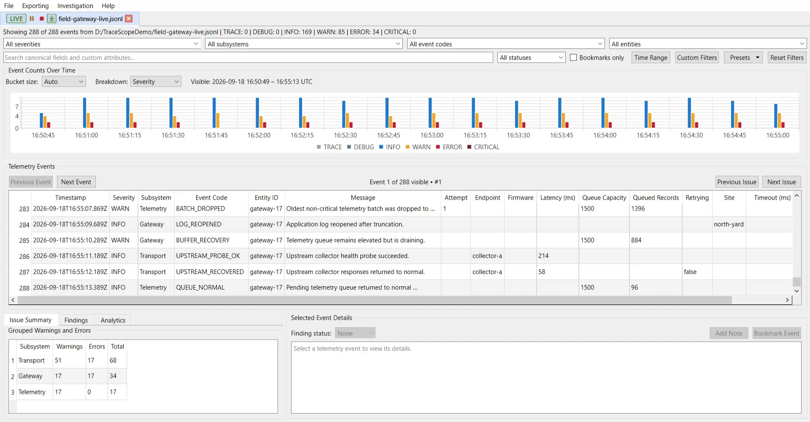
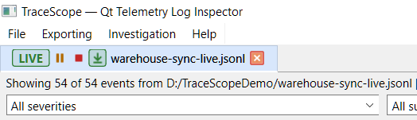
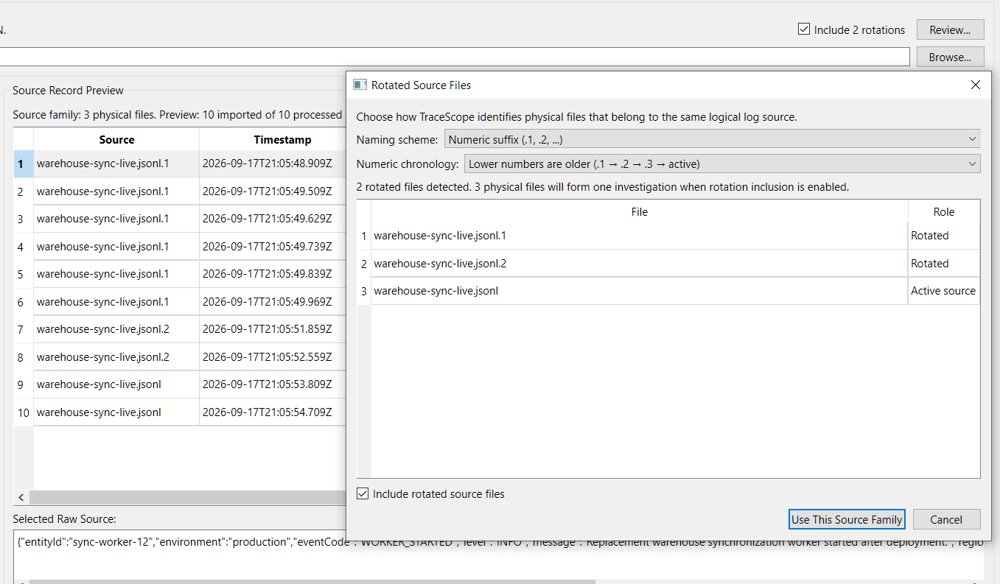
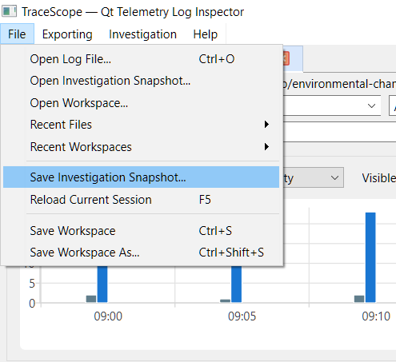
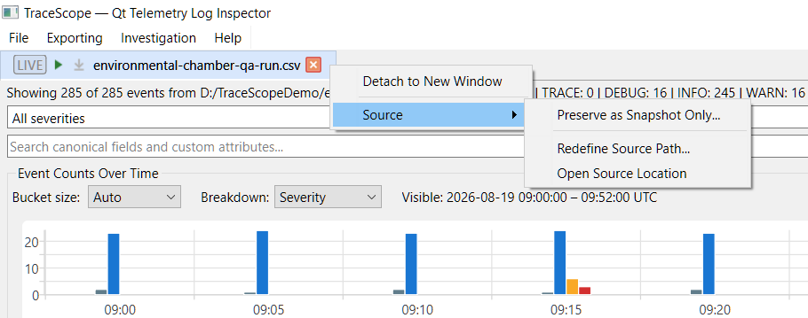
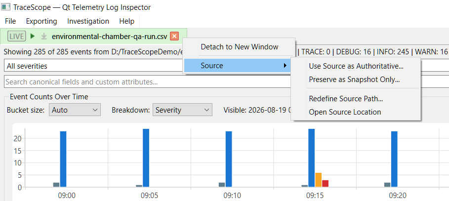
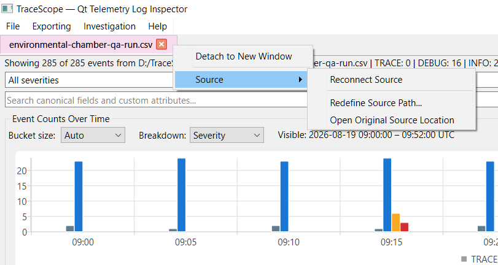
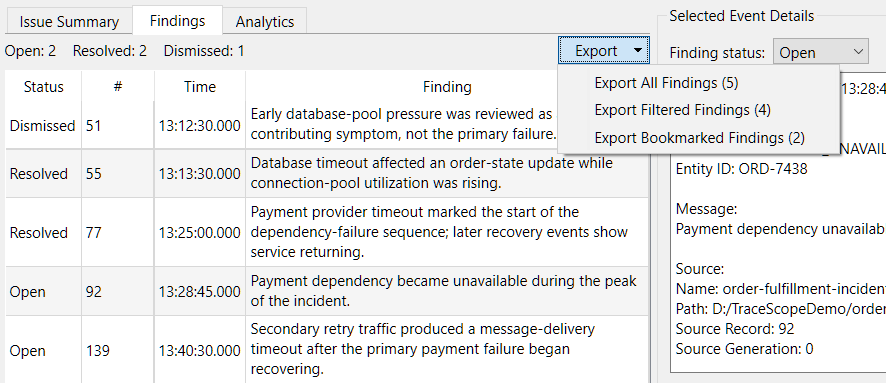
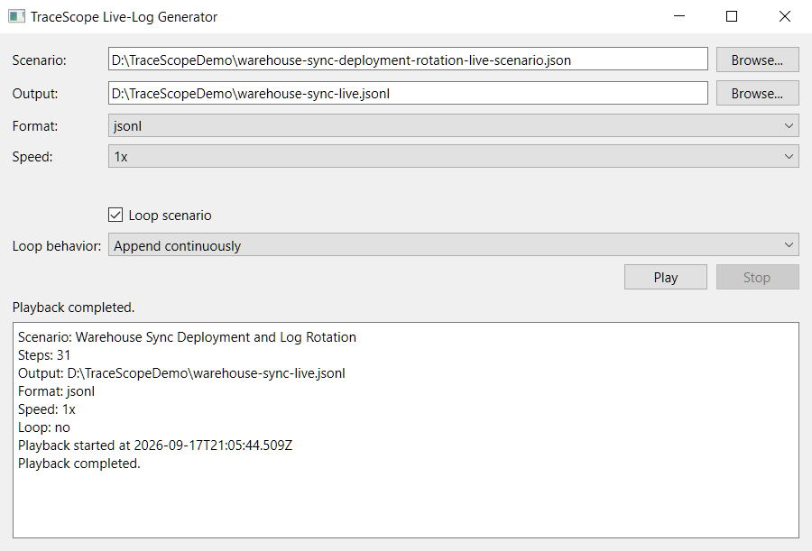

# TraceScope Feature Screenshot Gallery

This gallery provides a visual walkthrough of the published TraceScope `v0.16.0` prerelease investigation workflow. The screenshots use fictional repository samples, reusable import profiles, and deterministic live-log scenarios so the demonstrated behavior can be reproduced without external services. Phase 15 — Live File Following is complete in `v0.16.0`; Phase 16 — Final UI Polish, Documentation, and 1.0 Release is in progress.

For a product overview, downloads, supported formats, and current capabilities, see the [main README](../README.md).

## Investigation Workspace

TraceScope combines source/session context, investigation filters, a scalable event timeline, sortable normalized records, review panels, navigation controls, and selected-record details in one native desktop workspace.

The example below uses the fictional Order Fulfillment Incident sample, which contains distinct periods of database degradation, retries, payment/dependency failures, recovery, and later messaging backlog activity.

## Import Configuration

The Import Configuration workflow keeps source interpretation explicit. Users can choose or drag in a file, review TraceScope's likely-format suggestion, load or edit a reusable profile, inspect normalized preview records alongside raw source, and validate mappings before importing.

The example below uses the Order Fulfillment Incident JSON Lines sample and its reusable import profile.

## Responsive Large-File Import

For larger sources, import work runs outside the UI thread. Streamed import paths can report determinate progress and support cooperative cancellation while keeping the desktop interface responsive.

Measured large-file behavior and its interpretation limits are documented separately in [Performance Notes](performance.md).

## Advanced Filtering and Navigation

Canonical and source-specific criteria can be combined to narrow an investigation without discarding the underlying source context. TraceScope supports multi-severity, subsystem, event-code, entity, UTC time-range, search, custom-field, bookmark, and finding-status filtering, plus reusable named presets.

Navigation and drill-down actions operate directly on the active investigation. Previous/next event and warning/error navigation, grouped issue summaries, timeline bars, findings, and custom-field cells can all move or narrow the current investigation while preserving unrelated criteria where practical.

The Environmental Chamber example combines WARN and ERROR severities, the `ThermalControl` subsystem, entity `DUT-018`, a UTC time range, and one custom-field filter, narrowing the run to nine visible records.

## Fine-Resolution Timeline Navigation

After filters narrow the record set, the timeline remains a primary navigation surface. Automatic resolution provides an investigation overview, while manual resolutions preserve millisecond-through-day-scale detail when needed.

When a chosen resolution would create too many buckets, TraceScope materializes only a bounded visible window and provides horizontal navigation. The number of buckets shown also adapts to available width so labels remain readable in narrow workspaces without changing the selected resolution. Range context and Y-axis scaling remain stable while moving through the investigation.

## Analytics Overview

Alongside timeline navigation, the Analytics overview shows deterministic event-code frequencies and Top Entities when the relevant canonical fields are available. The timeline can simultaneously break activity down by severity or by the most frequent subsystems so investigators can connect frequency summaries with changes over time.

Top-N limits are presentation choices; the underlying deterministic analysis is not truncated.

## Deterministic Burst Detection

TraceScope groups qualifying clusters of WARN, ERROR, and CRITICAL records into deterministic investigation bursts. Each burst explains the thresholds and timing that caused it to qualify and summarizes contributing severity counts, subsystems, event codes, entities, and source records.

Auto mode derives timing from the investigation's timestamp cadence with an explicit fallback for sparse data; Manual mode allows direct timing control. Double-clicking a burst narrows the investigation to its contributing elevated-event range while preserving unrelated filters.

The captured Order Fulfillment example selects the strongest 31-event burst, whose highest severity is CRITICAL, with the one-minute timeline centered on the burst interval without changing the record set used for detection.

This feature is deterministic analysis, not AI anomaly detection or root-cause diagnosis.

The compact Burst Settings dialog exposes the same deterministic controls directly: Auto timing keeps cadence-derived recommendations, while Manual timing allows explicit window and merge-gap values without changing the elevated-event thresholds.

## Findings Review

Bookmarks, multiline analyst notes, and Open/Resolved/Dismissed finding states let investigators preserve what they discovered instead of losing useful context as they move through a session.

The Findings panel summarizes classified records with source-record and timestamp context. Double-click navigation returns to the exact source record and relaxes only filters that would otherwise hide it.

The example below uses the fictional Environmental Chamber QA Run and contains six reviewed findings spanning Open, Resolved, and Dismissed states across DUT-specific thermal, power, radio, and supporting sensor behavior.

## Live File Following

A supported source can remain open while another application continues writing to it. TraceScope admits newly completed records into the existing investigation, keeps active filters applicable to arriving data, and refreshes timeline, analytics, summaries, findings, and other derived investigation views without replacing the session.

The captured example uses the deterministic Field Gateway live scenario with the `[LIVE]` state active, Follow Newest enabled, a populated event table, and timeline/analysis context that makes it clear live following is part of the same investigation workflow rather than a separate monitoring screen.

The animation below shows the same workflow in motion: complete records are appended incrementally, Follow Newest keeps the table anchored to arriving visible evidence, and derived investigation views refresh on their controlled cadence.

Live following handles ordinary append growth, incomplete trailing records, same-path truncation and replacement, rotated source families, and supported structured JSON/XML sources whose outer document is still being written. File-lifecycle changes do not require abandoning the existing investigation model.

### Live Follow Controls and Follow Newest

Compact tab controls keep the live-session state visible without consuming investigation workspace. While following, users can Pause, Stop, or enable Follow Newest. Follow Newest keeps the event table anchored to newly arriving visible records; it turns off when live following is no longer active so normal table browsing is not unexpectedly overridden.

## Rotated Source Families

While a source is being followed or investigated, TraceScope can treat an active log and its rotated physical files as one logical source family without collapsing those files into one indistinguishable stream. The Rotated Source Files workflow lets the investigator choose a naming scheme, preview the physical files TraceScope discovered, control their chronology, and decide whether rotated files should be included with the active source.

Built-in numeric and date/timestamp schemes cover common rotation conventions, while a saved custom-pattern workflow supports source families whose filenames use application-specific ordering rules. The active file remains the live-follow target; rotated files are imported as independently identifiable physical evidence within the same logical investigation.

The captured example uses the deterministic Warehouse Sync deployment-rotation scenario so the discovered source family contains multiple real rotated siblings rather than a manually staged filename list.

## Investigation Snapshots and Source Continuity

Live evidence is treated as investigation evidence rather than disposable screen state. TraceScope can save or open a standalone versioned `.tsinv` investigation snapshot independently of a complete workspace.

A `.tsinv` snapshot preserves the normalized record set admitted to the investigation together with the import profile, import diagnostics and counts, source-truncation state, and available source-continuity metadata. It is an evidence snapshot rather than a complete workspace: bookmarks, analyst notes, finding states, active filters, comparison documents, and UI presentation state belong to workspace persistence instead. When a snapshot-backed or hybrid investigation is saved inside a `.tsw` workspace, the workspace layers that broader investigation state around the durable snapshot evidence.

The File menu exposes the standalone snapshot workflow directly alongside the broader workspace commands.

TraceScope makes the current relationship between an investigation and its evidence source explicit. The investigation tab uses a small state color to distinguish the three backing modes:

- **SourceBacked — blue:** the external source is authoritative. The investigation can continue reading or following that source, and no durable snapshot is required to remain attached.
- **Hybrid — green:** a durable snapshot preserves the investigation's evidence floor while a verified external source remains connected and can contribute continuation records.
- **SnapshotBacked — berry:** the saved TraceScope snapshot is authoritative. The retained evidence no longer depends on the external source remaining available or unchanged.

A SourceBacked investigation can preserve its complete currently admitted evidence as a durable snapshot and transition away from dependence on the external file. Its Source menu also provides explicit source-path management without treating a path alone as source identity.

A Hybrid investigation has both durable snapshot evidence and a connected external source. Its Source menu exposes the consequential choices explicitly: the investigator can deliberately use the external source as authoritative, preserve the complete current evidence as SnapshotBacked only, redefine a source path after continuity verification, or open the current source location.

A SnapshotBacked investigation no longer depends on the original external source for its retained evidence. When source-continuity information is available, TraceScope can explicitly reconnect a verified source and transition the investigation to Hybrid rather than silently replacing the preserved snapshot evidence.

These transitions are deliberately explicit because they change which evidence source is authoritative. Applicable bookmarks, notes, and finding state can remain associated with stable record identities when the corresponding evidence survives a transition, while workspace persistence retains the broader investigation state independently of the `.tsinv` evidence snapshot itself.

Existing comparison snapshots and already-generated reports remain immutable point-in-time artifacts. Reconnecting a source, changing backing mode, or admitting additional live evidence does not silently rewrite an existing comparison or report.

## Multi-Session Workspace

Related investigations can remain open as independent sessions in one application instance. Session switching preserves each investigation's source/profile context, backing state, active filters, model state, presentation state, bookmarks, notes, findings, and reload behavior.

The example below uses matched known-good and degraded fictional Field Gateway captures so an investigator can keep both sessions available while moving between their individual evidence and the comparison built from them.

## Session Comparison Setup

A comparison is created explicitly between two complete imported sessions with a directional **Baseline → Comparison** orientation. The setup dialog makes that orientation visible, supports swapping the two sessions, prevents comparing a session with itself, and can apply one shared burst-detection configuration to both sides when burst comparison is requested.

Comparisons operate on complete session snapshots rather than the sessions' current filtered views, so temporary investigation filters do not silently change the comparison basis.

## Session Comparison

The dedicated comparison document surfaces investigation-relevant differences while avoiding unsupported causal claims. It preserves an immutable Baseline → Comparison snapshot, so later filtering, session reload, source closure, workspace restoration, live appends, source-lifecycle transitions, or report generation do not silently change what the comparison means.

The matched Field Gateway samples provide a reproducible example. The first view establishes source orientation, immutable snapshot semantics, and the highest-impact differences before the document continues into deeper comparison sections.

Further down the same comparison, TraceScope surfaces event-code, severity, elevated subsystem/entity, and conservative shared custom-field differences when both sessions support those dimensions. Missing dimensions are reported as unavailable rather than treated as zero, and unchanged/noisy output is omitted.

When burst comparison is requested, both sessions are analyzed using one shared explicit burst configuration. The comparison distinguishes unavailable data and valid zero-burst results from a comparison that was never requested.

## Detachable Multi-Window Workspace

Investigation and comparison documents can be detached from the main window, grouped with other documents in detached workspace windows, moved between detached windows, and re-docked without losing their document state.

This supports practical workflows such as keeping a baseline session, degraded session, and comparison visible across multiple monitors or arranging related evidence side by side during an investigation.

## Constrained and Portrait Workspaces

Workspace documents adapt to constrained widths that are common in split-screen and portrait-monitor use. Long session summaries elide instead of forcing window width, filters reflow when needed, fine-resolution timelines reduce the visible bucket window, and Findings/Analytics receive more horizontal space than Selected Event Details when the review surface is width-constrained.

The goal is not a separate mobile-style interface; it is to keep the native desktop investigation workflow usable when documents occupy narrower engineering workspaces.

## Recent Files and Workspaces

Bounded recent-file, recent-profile, and recent-workspace histories are stored in local application settings. Recent files reopen through the normal Import Configuration workflow rather than bypassing profile review and validation.

Saved `.tsw` workspaces retain the source/import-profile context and durable snapshot evidence needed to restore SourceBacked, SnapshotBacked, and Hybrid sessions as applicable. The workspace separately preserves the broader investigation context around that evidence, including bookmarks, analyst notes, finding states, active filters, presentation state, immutable comparison snapshots, document ordering, active-document state, and main/detached window organization. Recent workspaces provide a direct route back into those saved investigations.

## Investigation Handoff and Export

Once an investigation has been narrowed, analyzed, annotated, or compared, TraceScope keeps its handoff paths close to the investigation rather than requiring a separate publishing workflow. Each investigation document exposes export actions in its own context: selected records can be copied for immediate use elsewhere, visible evidence and classified findings can be exported to CSV, and broader investigation/comparison state can be captured in an offline HTML report.

The captured Order Fulfillment export menu also shows live Findings submenu counts for all, filtered, and bookmarked findings, making the relationship between current investigation state and export scope visible before the export is created.

For the smallest handoff unit, selected-record copy lives directly in the Selected Event Details context menu. The current record can be copied to the clipboard as structured JSON or compact formatted text, then pasted into a ticket, chat message, note, document, or another application without leaving the investigation workflow.

### Visible-Record CSV Export

TraceScope exports the currently visible investigation records to CSV using readable canonical headers and configured custom-field names. The CSV shown below is the same nine-record Environmental Chamber result demonstrated in **Advanced Filtering and Navigation** earlier in this gallery, completing a direct narrow-in-TraceScope → hand-off-the-visible-evidence workflow.

### Findings CSV Export

Classified findings can be exported separately from the current visible-record CSV workflow. The findings export preserves investigator state and stable source-record context so the result can be reviewed in a spreadsheet or moved into QA, issue-tracking, or documentation workflows without copying rows by hand.

The example below exports the same six Environmental Chamber findings shown in **Findings Review** earlier in this gallery, preserving their mixed Open, Resolved, and Dismissed dispositions.

Findings can also be exported directly from the Findings panel itself. Its Export menu exposes separate scopes for all classified findings, findings whose source records match the current investigation filters, and bookmarked findings regardless of those filters.

The captured Order Fulfillment example contains five classified findings, with four matching the active investigation filters and two bookmarked. This makes the export scope visible at the point of handoff without requiring the investigator to return to the application-level export menu.

### Offline Report Configuration

For a broader handoff than record copy or CSV, the report setup dialog lets the investigator provide a human-facing title and optional context, choose which open investigation and comparison documents to include, and decide whether the report should include detailed supporting evidence and the technical import appendix.

Document selection is logical rather than window-based, so docked and detached workspace documents are treated consistently.

The captured configuration produces the representative **Field Gateway Telemetry Degradation Investigation — Baseline vs. Degraded Run** report from the matched known-good/degraded sessions and their comparison.

### Self-Contained HTML Investigation Report

TraceScope renders the selected report content into one offline HTML file that can be opened in an ordinary browser without TraceScope, an account, a backend, or companion assets. Report state is captured immutably before rendering begins, so later investigation changes—including new live records or source-lifecycle transitions—cannot silently alter an already-generated artifact.

The screenshots below come from the refreshed `v0.16.0` Field Gateway report exported from the same known-good/degraded investigation and comparison workflow shown earlier in this gallery.

The report overview records its title/context, generation time, selected source/session context, record counts, time coverage, and navigation into the included investigation and comparison documents. Local workstation source paths are intentionally omitted.

Investigation sections preserve deterministic analysis such as timeline activity, grouped issue/frequency summaries, timestamp cadence, and burst analysis when those dimensions are available.

Investigator annotations are summarized separately from lower-level evidence so findings, severities, messages, notes, bookmarks, timestamps, and source-record numbers remain easy to review. Annotation rows link directly to the corresponding Supporting Evidence entry, which expands to expose the captured record, custom attributes, analyst note, and raw source.

Included comparison documents preserve their original Baseline → Comparison orientation and immutable comparison results. The report carries timing/rate context, severity and dimension changes, conservative shared custom-field results, and shared-settings burst comparison without recalculating the comparison from later mutable session state.

The generated report remains deterministic and descriptive. It does not claim automated diagnosis or root cause, and browser printing can be used when a PDF handoff is preferable.

A representative [Field Gateway investigation report](https://w-cook.github.io/tracescope-qt-log-inspector/examples/field-gateway-investigation-report.html) is published for direct browser viewing. It uses the fictional matched known-good/degraded Field Gateway samples shown throughout the comparison and multi-session sections, allowing the complete exported artifact—not only the screenshots above—to be inspected directly in a browser.

## Reproducible Live-Source Demonstration Utility

The standalone TraceScope Live-Log Generator provides a deterministic external producer for exercising and demonstrating live following without coupling the application to a test-only data source. A thin Qt Widgets launcher selects a scenario, destination file, output format, playback speed, looping mode, and start/stop behavior while the command-line generator process writes the source file independently.

TraceScope does not depend on the generator and does not communicate with it directly; it observes only the files the utility produces. The generator source is part of the tagged `v0.16.0` repository under `tools/live-log-generator/`, while its deterministic scenario library lives under `samples/live/`.

The captured launcher uses the Warehouse Sync deployment-rotation scenario, the same deterministic producer used for the Rotated Source Files example above.

The live scenario library covers ordinary growth, waits, partial writes, truncation, same-path replacement, rotation, structured open-container output, access-log traffic, and degraded/recovery sequences across TraceScope-supported source families. The utility is a permanent verification and demonstration artifact rather than a TraceScope runtime dependency or generalized synthetic-data product.

The generator is not bundled into the primary TraceScope Windows ZIP or Linux AppImage. For `v0.16.0`, a separately packaged Windows x64 convenience build is provided alongside the tagged source and has been smoke-tested after extraction. Linux users of this prerelease should build the generator from source with Qt 6 and CMake. A corresponding Linux convenience package is planned as part of the final `v1.0.0` packaging work.

See the [Live-Log Generator documentation](live-log-generator.md) for the scenario model, supported renderers, lifecycle behavior, runtime options, build/distribution notes, and verification boundaries.
