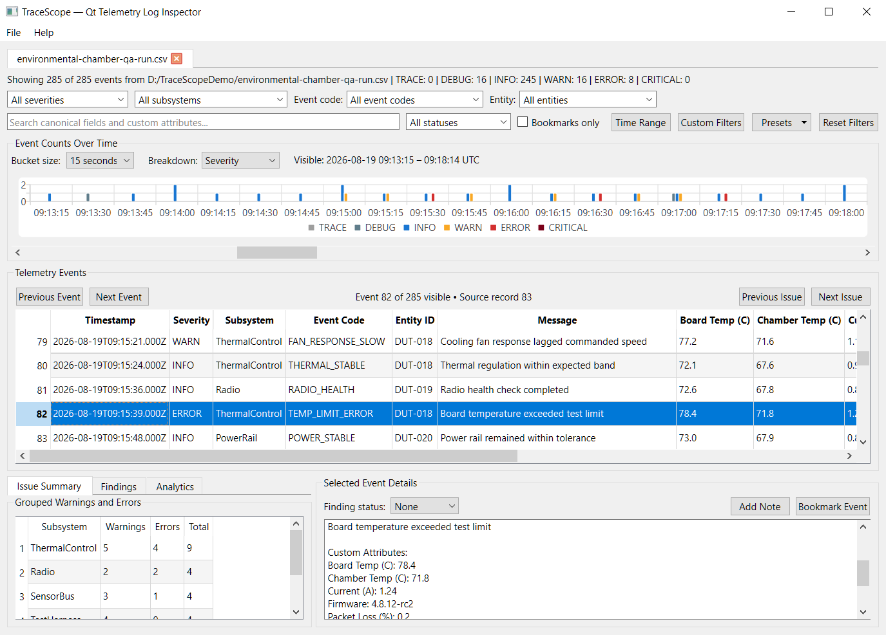
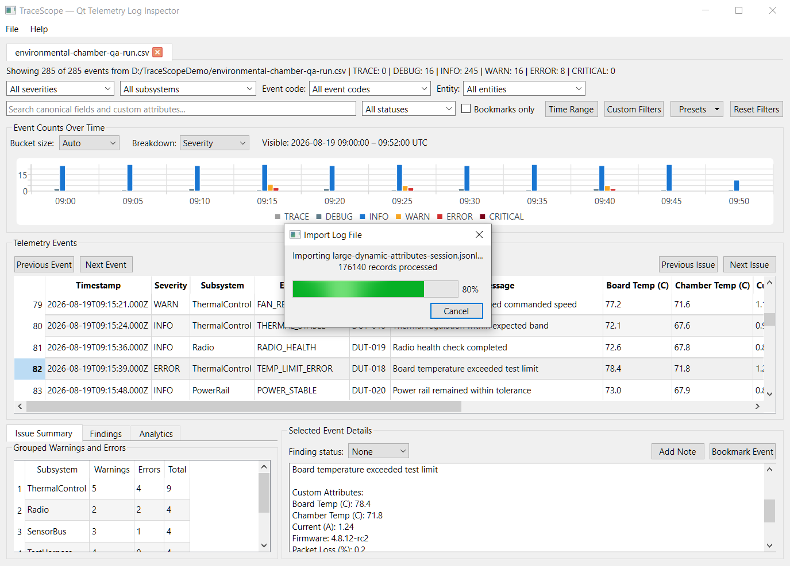
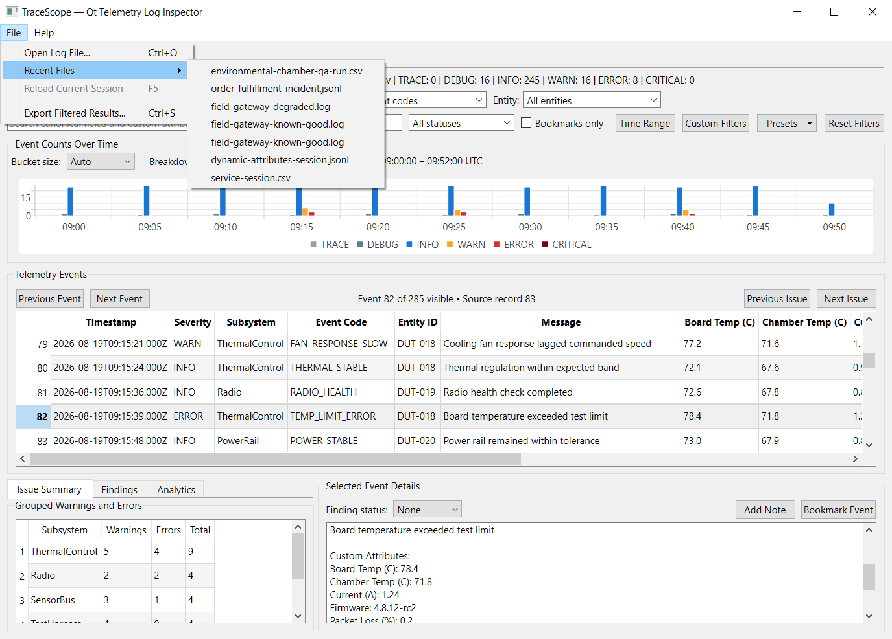

# TraceScope Feature Screenshot Gallery

This gallery provides a visual walkthrough of the TraceScope `v0.12.0` investigation workflow. The screenshots use fictional repository samples and reusable import profiles so the demonstrated behavior can be reproduced without external services.

For a product overview, downloads, supported formats, and current capabilities, see the [main README](../README.md).

## Investigation Workspace

TraceScope combines source/session context, investigation filters, a scalable event timeline, sortable normalized records, review panels, navigation controls, and selected-record details in one native desktop workspace.

The example below uses the fictional Order Fulfillment Incident sample, which contains several distinct periods of database, payment/dependency, and messaging degradation.

## Import Configuration

The Import Configuration workflow keeps source interpretation explicit. Users can choose or drag in a file, review the suggested format, load or edit a reusable profile, inspect normalized preview records alongside raw source, and validate mappings before importing.

The example below uses the degraded Field Gateway support capture in key-value/logfmt format.

## Advanced Filtering and Navigation

Canonical and source-specific criteria can be combined to narrow an investigation without discarding the underlying source context. TraceScope supports multi-severity, subsystem, event-code, entity, UTC time-range, search, custom-field, bookmark, and finding-status filtering, plus reusable named presets.

Navigation and drill-down actions operate on the active investigation rather than requiring a separate query interface.

## Analytics Overview

When the relevant canonical fields are available, the Analytics overview shows deterministic event-code frequencies and Top Entities. The timeline can simultaneously break activity down by the most frequent subsystems so investigators can connect frequency summaries with changes over time.

The underlying analysis remains complete; Top-N limits are presentation choices rather than analyzer truncation.

## Deterministic Burst Detection

TraceScope groups qualifying clusters of WARN, ERROR, and CRITICAL records into deterministic investigation bursts. Each burst explains the thresholds and timing that caused it to qualify and summarizes contributing severity counts, subsystems, event codes, entities, and source records.

Auto mode derives timing from the investigation's timestamp cadence with an explicit fallback for sparse data; Manual mode allows direct timing control. Double-clicking a burst narrows the investigation to its contributing elevated-event range while preserving unrelated filters.

This feature is deterministic analysis, not AI anomaly detection or root-cause diagnosis.

## Findings Review

Bookmarks, multiline analyst notes, and Open/Resolved/Dismissed finding states let investigators preserve what they discovered while a session remains open.

The Findings panel summarizes classified records with source-record and timestamp context. Double-click navigation returns to the exact source record and relaxes only filters that would otherwise hide it.

The example below uses the fictional Environmental Chamber QA Run and records conclusions around DUT-specific thermal and power behavior.

## Fine-Resolution Timeline Navigation

Automatic timeline resolution provides an investigation overview, while manual resolutions can preserve millisecond-through-day-scale detail.

When a chosen resolution would create too many buckets, TraceScope materializes only a bounded visible window and provides horizontal navigation. Range context and Y-axis scaling remain stable while moving through the investigation. Severity mode uses explicit semantic colors so informational activity, warnings, errors, and critical events are visually distinct.

## Multi-Session Workspace

Related sources can remain open as independent sessions in one application instance. Session switching preserves each source's import context, active filters, model state, presentation state, bookmarks, notes, findings, and reload behavior.

The example below uses matched known-good and degraded fictional Field Gateway captures. Structured cross-session comparison builds on this foundation in Phase 12.

## Responsive Large-File Import

Import work runs outside the UI thread. Streamed import paths can report determinate progress and support cooperative cancellation while keeping the desktop interface responsive.

Measured large-file behavior and its interpretation limits are documented separately in [Performance Notes](performance.md).

## Recent Files

Bounded recent-file and recent-profile histories are stored in local application settings. Recent files reopen through the normal Import Configuration workflow rather than bypassing profile review and validation.

## CSV Export

TraceScope exports the currently visible investigation records to CSV using readable canonical headers and configured custom-field names. This allows an investigator to narrow a session first and hand off only the records relevant to the current question or finding.

