# TraceScope Feature Screenshot Gallery

This gallery provides a visual walkthrough of the TraceScope `v0.15.0` investigation workflow. The screenshots use fictional repository samples and reusable import profiles so the demonstrated behavior can be reproduced without external services.

For a product overview, downloads, supported formats, and current capabilities, see the [main README](../README.md).

## Investigation Workspace

TraceScope combines source/session context, investigation filters, a scalable event timeline, sortable normalized records, review panels, navigation controls, and selected-record details in one native desktop workspace.

The example below uses the fictional Order Fulfillment Incident sample, which contains distinct periods of database degradation, retries, payment/dependency failures, recovery, and later messaging backlog activity.

## Import Configuration

The Import Configuration workflow keeps source interpretation explicit. Users can choose or drag in a file, review TraceScope's likely-format suggestion, load or edit a reusable profile, inspect normalized preview records alongside raw source, and validate mappings before importing.

The example below uses the Order Fulfillment Incident JSON Lines sample and its reusable import profile.

## Advanced Filtering and Navigation

Canonical and source-specific criteria can be combined to narrow an investigation without discarding the underlying source context. TraceScope supports multi-severity, subsystem, event-code, entity, UTC time-range, search, custom-field, bookmark, and finding-status filtering, plus reusable named presets.

Navigation and drill-down actions operate directly on the active investigation. Previous/next event and warning/error navigation, grouped issue summaries, timeline bars, findings, and custom-field cells can all move or narrow the current investigation while preserving unrelated criteria where practical.

## Analytics Overview

When the relevant canonical fields are available, the Analytics overview shows deterministic event-code frequencies and Top Entities. The timeline can simultaneously break activity down by severity or by the most frequent subsystems so investigators can connect frequency summaries with changes over time.

Top-N limits are presentation choices; the underlying deterministic analysis is not truncated.

## Deterministic Burst Detection

TraceScope groups qualifying clusters of WARN, ERROR, and CRITICAL records into deterministic investigation bursts. Each burst explains the thresholds and timing that caused it to qualify and summarizes contributing severity counts, subsystems, event codes, entities, and source records.

Auto mode derives timing from the investigation's timestamp cadence with an explicit fallback for sparse data; Manual mode allows direct timing control. Double-clicking a burst narrows the investigation to its contributing elevated-event range while preserving unrelated filters.

This feature is deterministic analysis, not AI anomaly detection or root-cause diagnosis.

The compact Burst Settings dialog exposes the same deterministic controls directly: Auto timing keeps cadence-derived recommendations, while Manual timing allows explicit window and merge-gap values without changing the elevated-event thresholds.

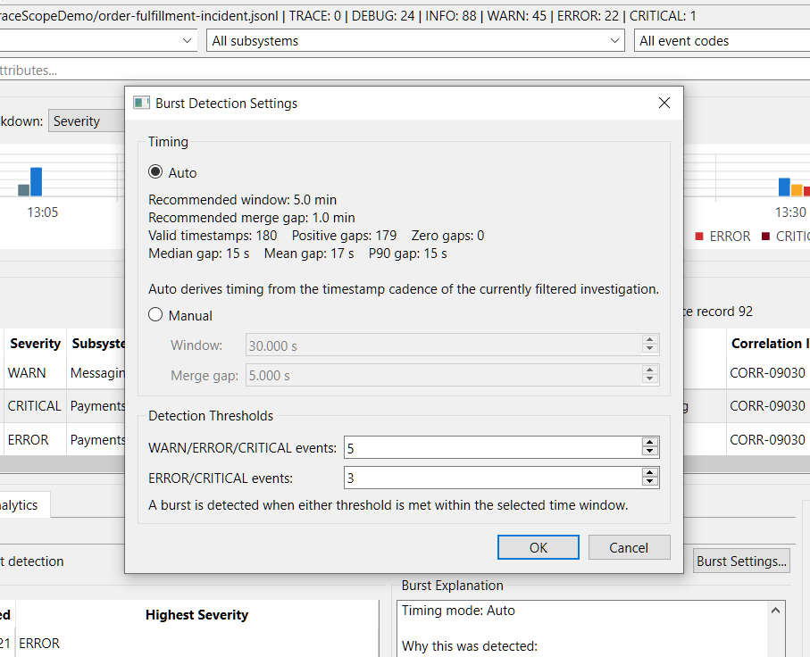

## Findings Review

Bookmarks, multiline analyst notes, and Open/Resolved/Dismissed finding states let investigators preserve what they discovered instead of losing useful context as they move through a session.

The Findings panel summarizes classified records with source-record and timestamp context. Double-click navigation returns to the exact source record and relaxes only filters that would otherwise hide it.

The example below uses the fictional Environmental Chamber QA Run and records observations around DUT-specific thermal, power, and radio behavior.

## Fine-Resolution Timeline Navigation

Automatic timeline resolution provides an investigation overview, while manual resolutions preserve millisecond-through-day-scale detail when needed.

When a chosen resolution would create too many buckets, TraceScope materializes only a bounded visible window and provides horizontal navigation. The number of buckets shown also adapts to available width so labels remain readable in narrow workspaces without changing the selected resolution. Range context and Y-axis scaling remain stable while moving through the investigation.

## Multi-Session Workspace

Related sources can remain open as independent investigation sessions in one application instance. Session switching preserves each source's import context, active filters, model state, presentation state, bookmarks, notes, findings, and reload behavior.

The example below uses matched known-good and degraded fictional Field Gateway captures so an investigator can keep both sessions available while moving between their individual evidence and the comparison built from them.

## Session Comparison Setup

A comparison is created explicitly between two complete imported sessions with a directional **Baseline → Comparison** orientation. The setup dialog makes that orientation visible, supports swapping the two sessions, prevents comparing a session with itself, and can apply one shared burst-detection configuration to both sides when burst comparison is requested.

Comparisons operate on complete session snapshots rather than the sessions' current filtered views, so temporary investigation filters do not silently change the comparison basis.

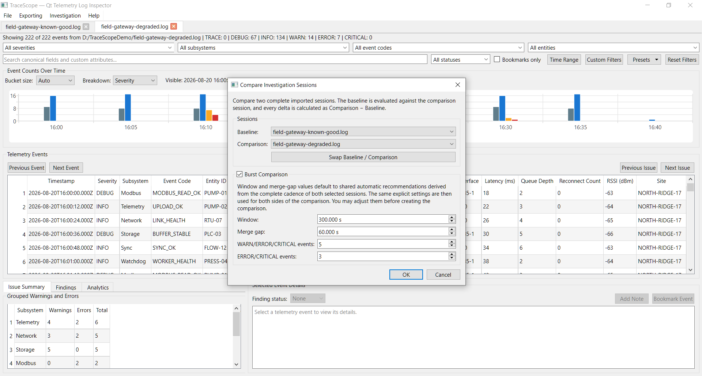

## Session Comparison

The dedicated comparison document surfaces investigation-relevant differences while avoiding unsupported causal claims. It preserves an immutable Baseline → Comparison snapshot, so later filtering, session reload, source closure, workspace restoration, or report generation does not silently change what the comparison means.

The matched Field Gateway samples provide a reproducible example. The first view establishes source orientation, immutable snapshot semantics, and the highest-impact differences before the document continues into deeper comparison sections.

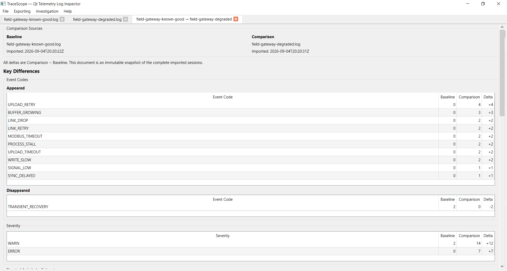

Further down the same comparison, TraceScope surfaces event-code, severity, elevated subsystem/entity, and conservative shared custom-field differences when both sessions support those dimensions. Missing dimensions are reported as unavailable rather than treated as zero, and unchanged/noisy output is omitted.

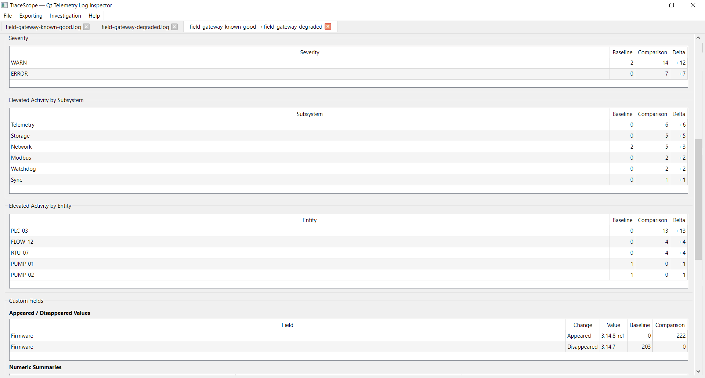

When burst comparison is requested, both sessions are analyzed using one shared explicit burst configuration. The comparison distinguishes unavailable data and valid zero-burst results from a comparison that was never requested.

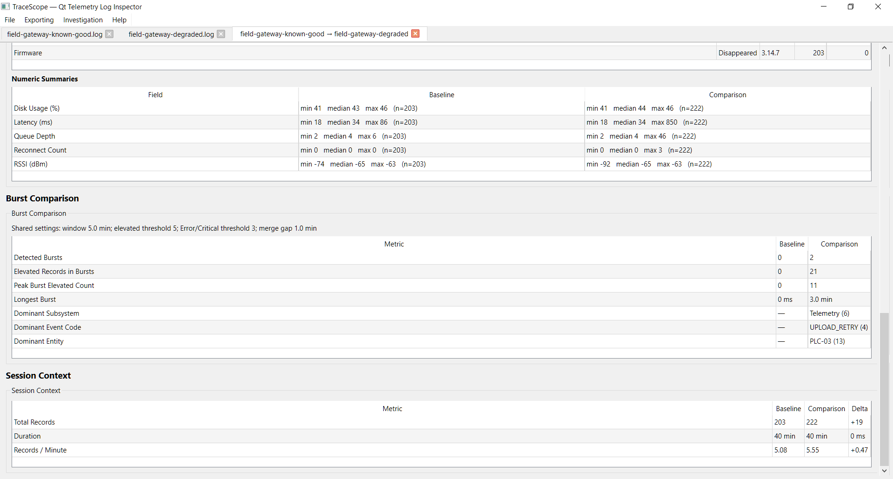

## Detachable Multi-Window Workspace

Investigation and comparison documents can be detached from the main window, grouped with other documents in detached workspace windows, moved between detached windows, and re-docked without losing their document state.

This supports practical workflows such as keeping a baseline session, degraded session, and comparison visible across multiple monitors or arranging related evidence side by side during an investigation.

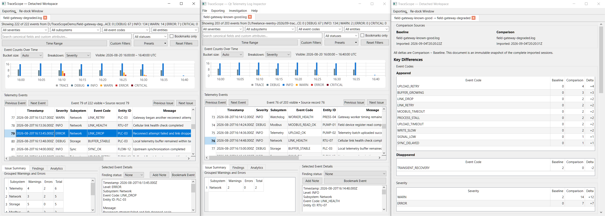

## Constrained and Portrait Workspaces

Workspace documents adapt to constrained widths that are common in split-screen and portrait-monitor use. Long session summaries elide instead of forcing window width, filters reflow when needed, fine-resolution timelines reduce the visible bucket window, and Findings/Analytics receive more horizontal space than Selected Event Details when the review surface is width-constrained.

The goal is not a separate mobile-style interface; it is to keep the native desktop investigation workflow usable when documents occupy narrower engineering workspaces.

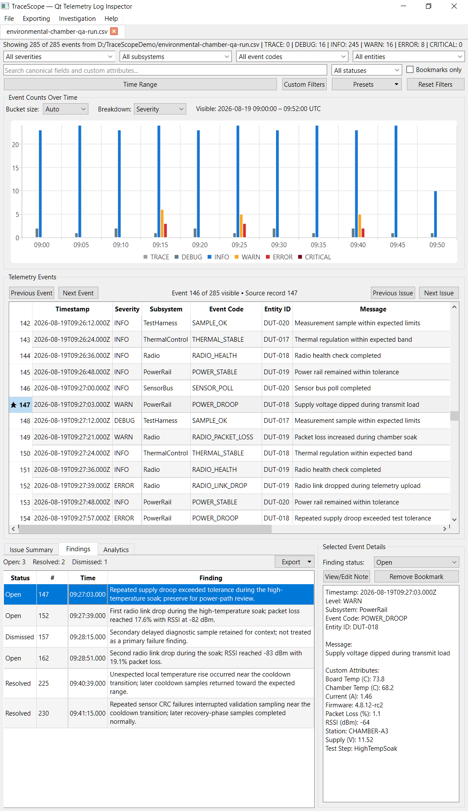

## Responsive Large-File Import

Import work runs outside the UI thread. Streamed import paths can report determinate progress and support cooperative cancellation while keeping the desktop interface responsive.

Measured large-file behavior and its interpretation limits are documented separately in [Performance Notes](performance.md).

## Recent Files and Workspaces

Bounded recent-file, recent-profile, and recent-workspace histories are stored in local application settings. Recent files reopen through the normal Import Configuration workflow rather than bypassing profile review and validation.

Saved workspaces retain the source/import-profile context needed to reopen sessions along with investigation state, comparison snapshots, document ordering, active-document state, and main/detached window organization. Recent workspaces provide a direct route back into those saved investigations.

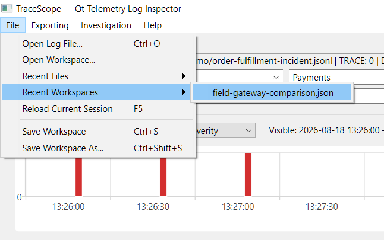

## CSV Export

TraceScope exports the currently visible investigation records to CSV using readable canonical headers and configured custom-field names. This allows an investigator to narrow a session first and hand off only the records relevant to the current question or finding.

## Document-Scoped Export and Record Copy

Each investigation document exposes export actions in its own context. A selected record can be copied as structured JSON for machine-friendly handoff or as compact formatted text for tickets, chat, notes, and documentation. The same export surface provides access to visible-record CSV, findings CSV, and the offline report workflow where those actions apply.

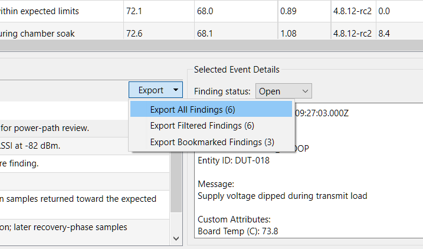

Selected-record copy lives directly in the Selected Event Details context menu so the current event can be handed off without leaving the investigation surface.

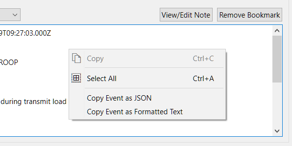

## Findings CSV Export

Classified findings can be exported separately from the current visible-record CSV workflow. The findings export preserves investigator state and stable source-record context so the result can be reviewed in a spreadsheet or moved into QA, issue-tracking, or documentation workflows without copying rows by hand.

The example below uses findings from the Environmental Chamber QA Run.

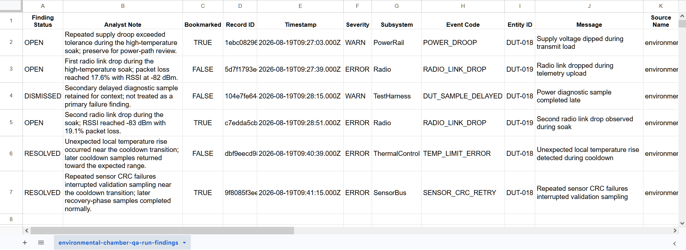

## Offline Report Configuration

The report setup dialog lets the investigator provide a human-facing title and optional context, choose which open investigation and comparison documents to include, and decide whether the report should include detailed supporting evidence and the technical import appendix.

Document selection is logical rather than window-based, so docked and detached workspace documents are treated consistently.

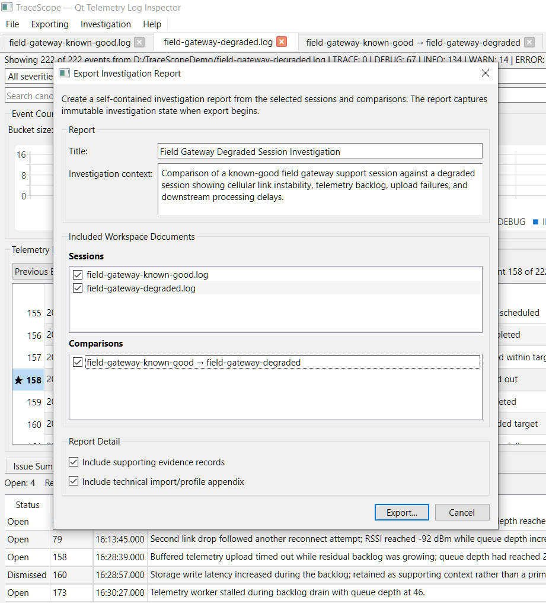

## Self-Contained HTML Investigation Report

TraceScope renders the selected report content into one offline HTML file that can be opened in an ordinary browser without TraceScope, an account, a backend, or companion assets. Report state is captured immutably before rendering begins so later investigation changes cannot silently alter an already-generated artifact.

The report overview records its title/context, generation time, selected source/session context, record counts, time coverage, and navigation into the included investigation and comparison documents. Local workstation source paths are intentionally omitted.

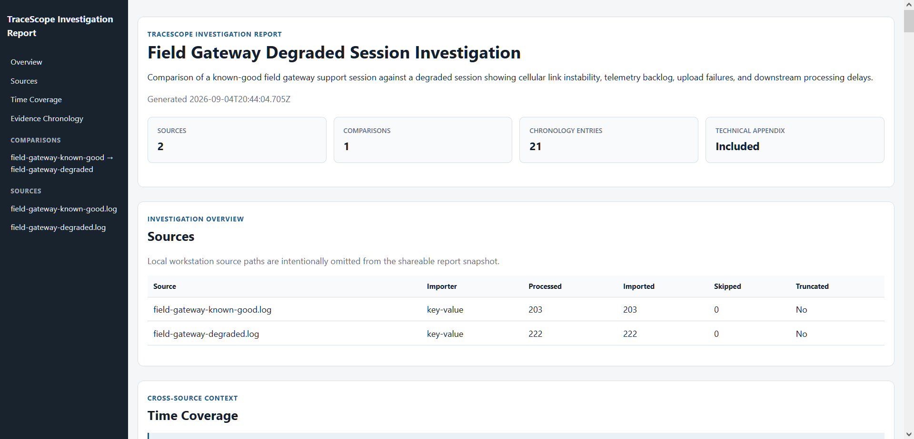

Investigation sections preserve deterministic analysis such as timeline activity, grouped issue/frequency summaries, timestamp cadence, and burst analysis when those dimensions are available.

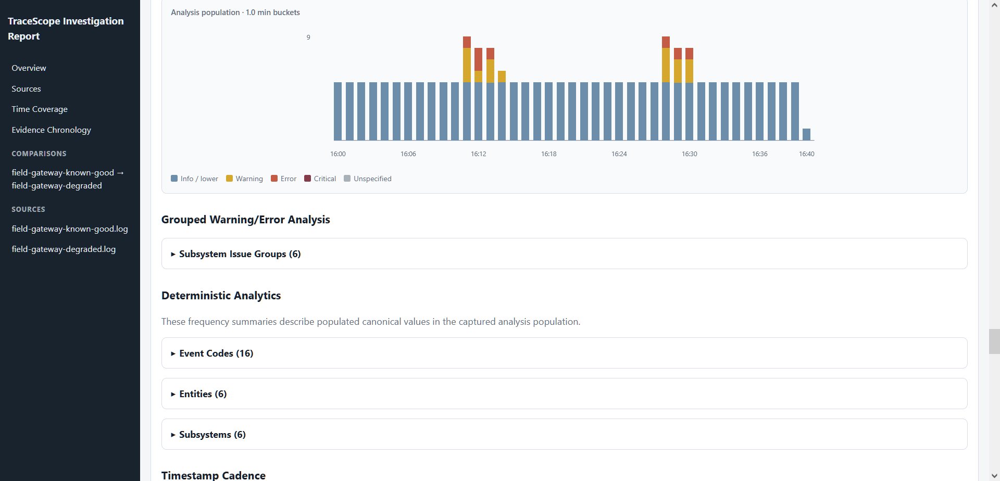

Investigator annotations are summarized separately from lower-level evidence so findings, severities, messages, notes, bookmarks, timestamps, and source-record numbers remain easy to review. Annotation rows link directly to the corresponding Supporting Evidence entry, which expands to expose the captured record, custom attributes, analyst note, and raw source.

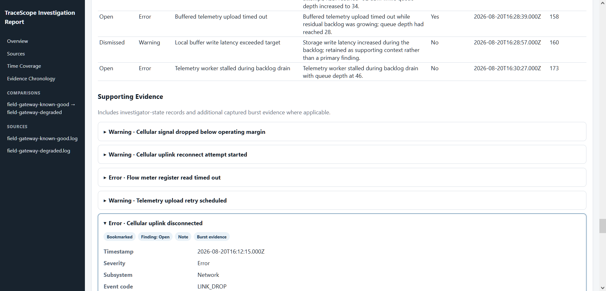

Included comparison documents preserve their original Baseline → Comparison orientation and immutable comparison results. The report carries timing/rate context, severity and dimension changes, conservative shared custom-field results, and shared-settings burst comparison without recalculating the comparison from later mutable session state.

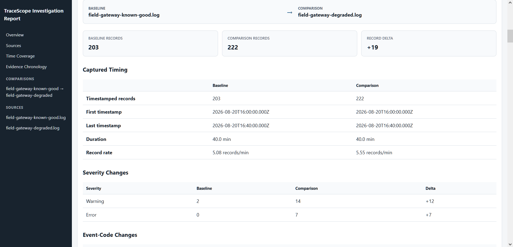

The generated report remains deterministic and descriptive. It does not claim automated diagnosis or root cause, and browser printing can be used when a PDF handoff is preferable.

A representative [Field Gateway investigation report](examples/field-gateway-investigation-report.html) is included with the documentation. It uses the fictional matched known-good/degraded Field Gateway samples shown throughout the comparison and multi-session sections, allowing the complete exported artifact—not only the screenshots above—to be inspected directly in a browser.
