# Recording and Managing Findings in TraceScope

Importing and filtering logs helps you locate relevant events. **Bookmarks, analyst notes, and finding statuses** help you preserve what you noticed, distinguish an investigative lead from a reviewed finding, and return to the supporting record later. TraceScope keeps those actions attached to individual investigation records, rather than treating a finding as an unrelated entry in a separate list.

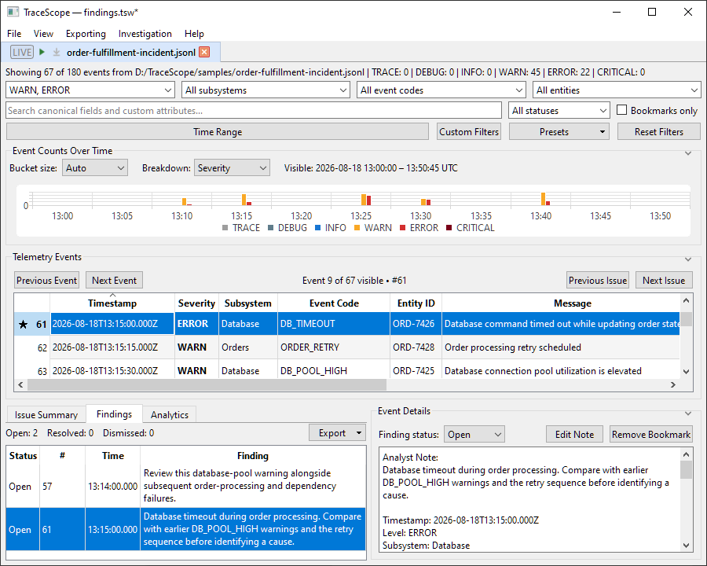

This guide continues the fictional **Order Fulfillment Incident** used in [Getting Started](getting-started.md) and [Investigating Logs](investigating-logs.md). It covers the complete review workflow, from marking an event to exporting the findings you want to share. If you have already completed Getting Started, you may have an existing `DB_POOL_HIGH` finding; the exercise below uses a different event so you can follow it without removing your earlier work.

**Having trouble reviewing a finding?** [Jump straight to Troubleshooting](#troubleshooting).

**In this guide, you will:**

1. [Understand how bookmarks, notes, and finding statuses differ](#1-open-the-sample-and-locate-the-review-controls).
2. [Bookmark a record](#2-bookmark-a-record-worth-revisiting), [create a finding](#3-create-an-open-finding), and [write an analyst note](#4-add-and-revise-an-analyst-note).
3. [Review findings even when their events are hidden](#5-navigate-between-findings-and-the-event-table) by event table filters.
4. [Revisit and update findings](#6-revisit-and-update-a-finding) as your investigation develops.
5. [Export all, filtered, or bookmarked findings](#7-export-the-findings-you-need) and [preserve your working investigation](#8-preserve-the-investigation-for-later-review).

TraceScope records your review decisions; it does not establish a root cause or independently verify the conclusions in your notes.

## 1. Open the sample and locate the review controls

If you have the Order Fulfillment Incident open already, continue in that investigation. Otherwise, choose **File > Open Log File...**, select [`samples/order-fulfillment-incident.jsonl`](../samples/order-fulfillment-incident.jsonl), and load [`samples/profiles/order-fulfillment-incident-profile.json`](../samples/profiles/order-fulfillment-incident-profile.json) in **Import Configuration** before selecting **Import**. You can also reopen a workspace you saved during the previous walkthroughs.

Select **Reset Filters** for a predictable starting point.

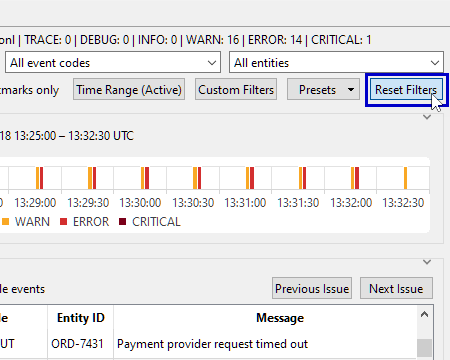

In the **Telemetry Events** table, select any record row and find the separate **Event Details** panel.

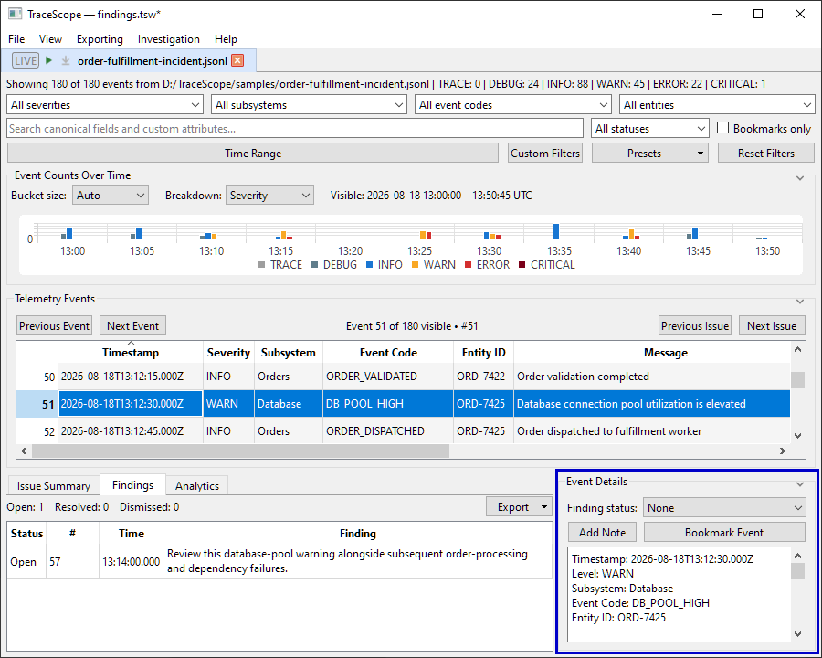

Its review controls include:

| Control | Purpose | Does it place the record in Findings? |
| --- | --- | --- |
| **Bookmark Event** / **Remove Bookmark** | Mark or unmark an event for quick recognition and bookmark-based filtering. | No. |
| **Add Note** / **Edit Note** | Attach your own observations to that event. | No, not by itself. |
| **Finding status** | Explicitly classify a record as **Open**, **Resolved**, **Dismissed**, or **None**. | Yes, for every status except **None**. |

These three properties are independent. You can bookmark an event without classifying it, add a note before deciding whether it is a finding, or classify a finding without a bookmark or note. They remain associated with the same source record as you investigate. When an event has a saved note, its text now appears at the top of **Event Details**, so you can review the note alongside the selected record without reopening the editor.

The **Findings** tab is in the lower investigation area, alongside **Issue Summary** and **Analytics**, with **Event Details** beside those review tabs.

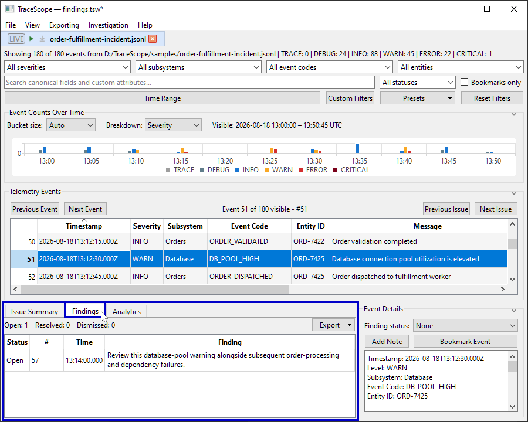

If part of the interface is collapsed, use the chevrons near the right side of the section headings to expand the area you need. The layout adapts to window size, display scaling, and **View > Interface Scale**; on a constrained screen, expanding one section may collapse another. See [Getting Started](getting-started.md#adjust-the-layout-for-your-screen) for layout guidance.

## 2. Bookmark a record worth revisiting

Let's mark a database timeout as evidence to examine.

1. Select **Reset Filters**,

    

    then choose `ERROR` in the severity filter
    
    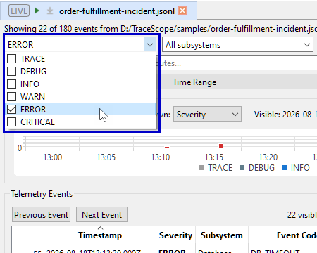
    
    and `DB_TIMEOUT` in the event-code filter.

    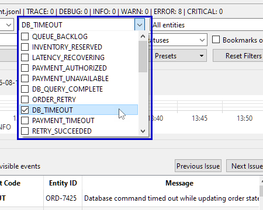
2. Select a `DB_TIMEOUT` row in the **Telemetry Events** table. 

    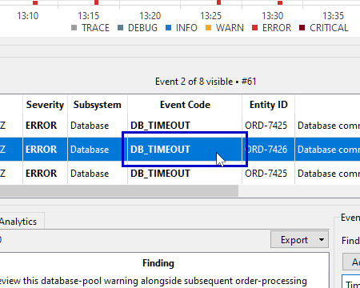

    Read its message, timestamp, subsystem, and any available additional fields in **Event Details** before recording your assessment.

    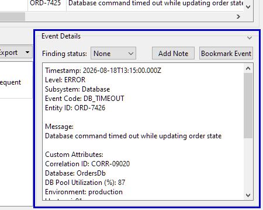
3. Choose **Bookmark Event**.

    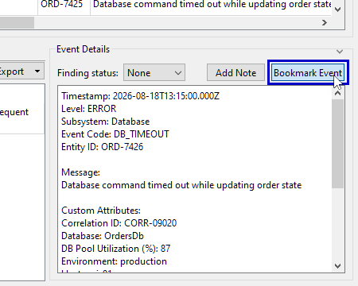

    The button changes to **Remove Bookmark**, and a **star (★)** appears next to that event's number in the event table's left-hand gutter.

    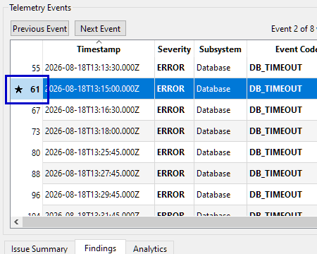
4. To view your bookmarks independently of the previous severity and event-code selections, select **Reset Filters**, then enable **Bookmarks only**. 

    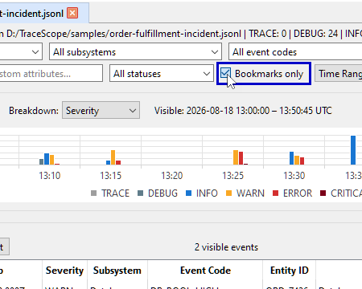

    Your bookmarked event will appear alongside any others you have marked.

The event number identifies a record's position in the underlying imported investigation. Sorting and filtering can move it around the visible table, but do not renumber it. A bookmark is attached to the record, not to the row's current position.

**A bookmark is not a finding.** It is a useful way to flag a record while you are still deciding whether it warrants a formal entry in your investigation. The **Findings** tab does not list a record merely because it is bookmarked.

## 3. Create an Open finding

With your bookmarked `DB_TIMEOUT` record selected, make it an explicit finding.

1. In **Event Details**, change **Finding status** from **None** to **Open**.

    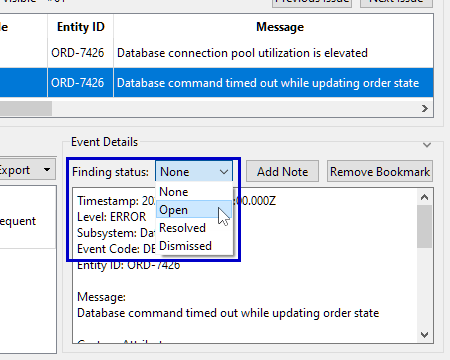

    If you arrived here with **Bookmarks only** enabled, the record can remain selected; the bookmark and status are separate properties.
2. Expand the lower investigation area if necessary and select the **Findings** tab.

    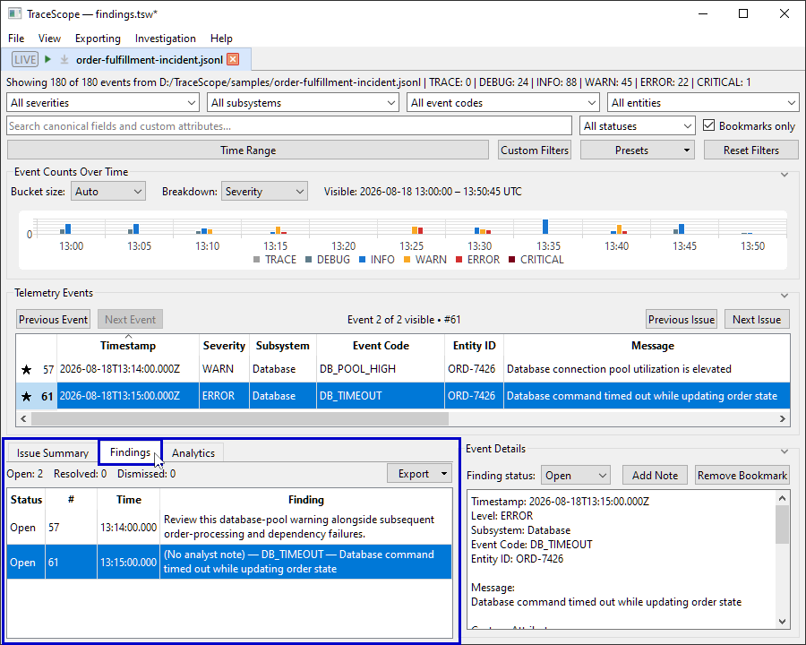
3. Find the new **Open** entry. The table displays **Status**, the investigation event number (**#**), **Time**, and **Finding**. Until you add a note, the **Finding** column displays a description beginning with **(No analyst note)**, followed by the available event code and message.

    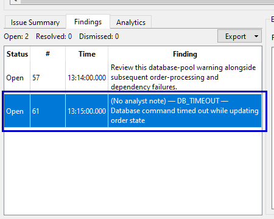
4. Observe the summary above the list: **Open**, **Resolved**, and **Dismissed** count the records you have explicitly classified under each status.

    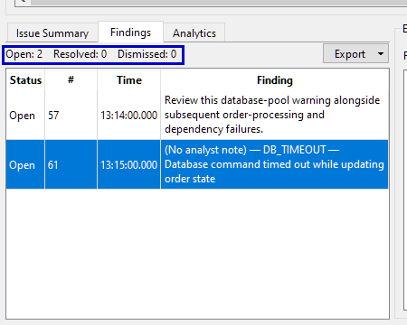

The **Findings** tab is a review list, not another view of the current filtered event table. It lists classified findings from the investigation even when their events do not match your active filters. That means its status counts may differ from the number of rows currently visible in **Telemetry Events**.

**What the statuses mean:** Use **Open** for an observation that still needs attention, **Resolved** when you consider it addressed, and **Dismissed** when you decide it should not remain an active investigative concern. These are your review classifications, not automatically verified conclusions. **None** means the record is not part of the formal Findings list.

## 4. Add and revise an analyst note

A finding is more useful when it records *why* you selected the event and what you still need to establish.

1. Keep the `DB_TIMEOUT` finding selected. Its record should be available in **Event Details**; you can select its row in the event table again if needed.
2. Select **Add Note**. The **Analyst Note** editor opens for that event.

    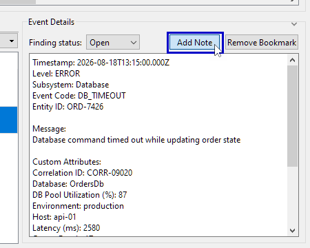
3. Enter a concise observation, for example: `Database timeout during order processing. Compare with earlier DB_POOL_HIGH warnings and the retry sequence before identifying a cause.`
4. Choose **Save**.

    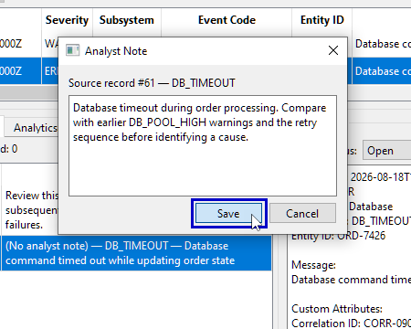

    The button in **Event Details** now reads **Edit Note**, and the saved note appears as an **Analyst Note** block at the start of the existing **Event Details** text area.

    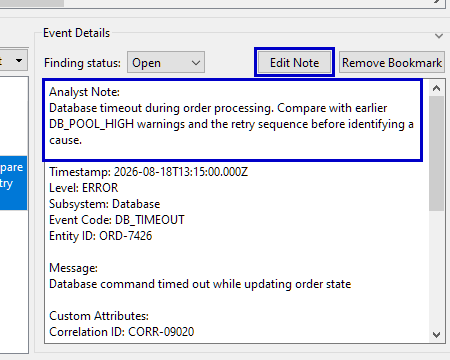
5. Return to the **Findings** tab. The default **(No analyst note)** description is replaced by the note you saved.

    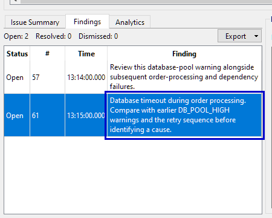

The example deliberately separates what the record shows from what still needs investigation. A useful note might describe the observed symptom, mention related event codes or identifiers, and record a question or follow-up. Avoid treating a nearby warning or a repeated message as proof that it caused the failure.

To revise the note, select the same event or finding, choose **Edit Note**, change the text, and **Save**. The inline note refreshes with your changes. To remove a note, clear its contents and save the empty editor. If the event is still classified, the **Findings** tab returns to its default **(No analyst note)** description. Clearing a note does not automatically remove its bookmark or change its finding status.

You can also add a note to an unclassified event. It will stay attached to that record but will **not** appear in the **Findings** list until you assign a status other than None.

## 5. Navigate between Findings and the event table

The **Findings** tab is designed to keep your review accessible even when your filters focus on something else. This is particularly useful when you are investigating several related subsystems or time windows.

### Preview a finding without changing filters

1. Select **Reset Filters**,

    

    then choose `WARN` in the severity filter.
    
    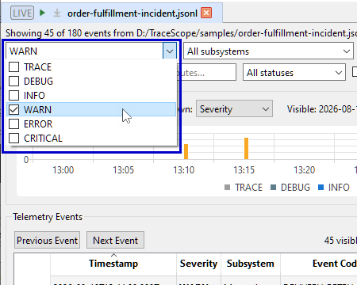
    
    Your `ERROR`-level `DB_TIMEOUT` event is now excluded from the event table.
2. Open **Findings** and **single-click** the `DB_TIMEOUT` finding you created.

    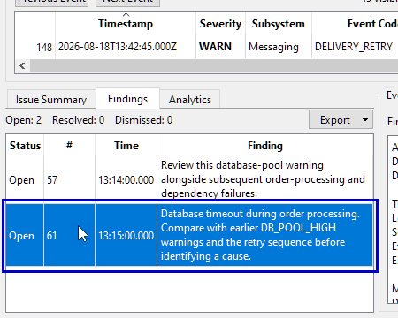
3. Read the associated record in **Event Details**. Even though no matching `DB_TIMEOUT` row is present in the currently filtered event table, TraceScope can preview this finding's underlying record without changing your filters.

    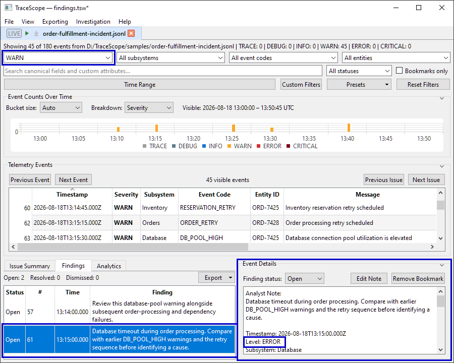
4. Check the severity filter again: it still selects `WARN`. A finding preview has not broadened your current investigation view.

If the selected finding *does* match the current filters, single-clicking it in **Findings** also selects the corresponding event table row, without moving keyboard focus away from **Findings**.

### Reveal and focus the original event

When you want to work directly with a finding's source event, **double-click** its row in **Findings**. TraceScope reveals the corresponding record in the **Telemetry Events** table and moves focus there. If active filters exclude the record, TraceScope adjusts the relevant criteria to make it visible. For example, it may add an excluded severity value or clear search text that prevents a match.

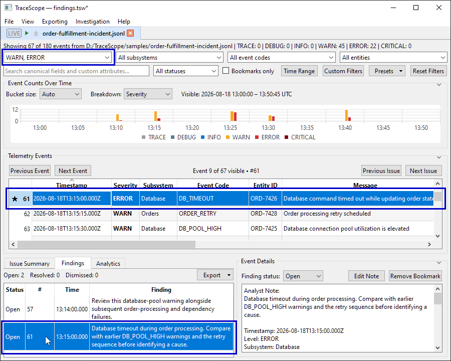

This is intentionally different from a single-click preview: **revealing a finding can change your filters**. Check the filter controls afterward if you need to preserve a specific search or time window. Save a useful combination as a filter preset beforehand if you expect to return to it; [Investigating Logs](investigating-logs.md#11-save-a-reusable-filter-preset) covers presets in detail.

The selection works in both directions. Selecting a classified record in the event table updates its details and highlights the corresponding **Findings** row. Selecting another unclassified record changes the details without turning it into a finding.

## 6. Revisit and update a finding

Review decisions can change as you gather more evidence. You do not need to create a second finding when you revise the assessment of an existing event.

1. Select your `DB_TIMEOUT` finding in **Findings** or reveal it in the event table.

    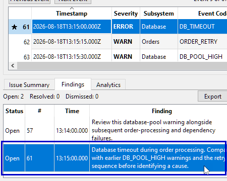
2. In **Event Details**, review the existing analyst note and the original record.

    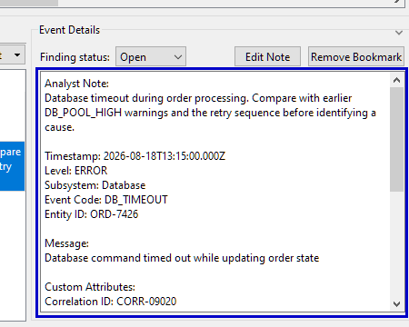
3. Update the note with any new observations, making clear what you actually verified.
4. Change **Finding status** from **Open** to **Resolved** or **Dismissed** if that reflects your review. 

    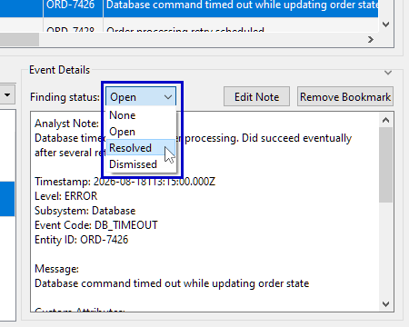

    The entry remains in **Findings** under its new status, and the summary counts update.

    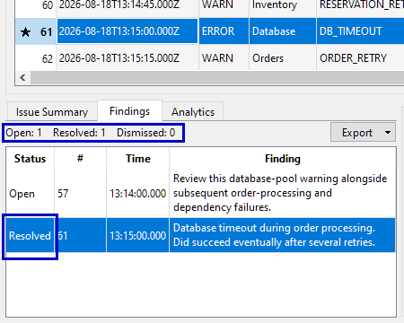
5. Change the status back to **Open** if further work is needed.

Use **None** if you want to remove the event from the formal Findings list altogether. This does **not** delete the imported record or automatically erase its note or bookmark. You can restore its finding status later. Similarly, choosing **Remove Bookmark** does not remove a finding or its analyst note.

For a broader review, the finding-status filter lets you narrow the event table to records with selected finding statuses, and **Bookmarks only** limits it to bookmarked records. These review-only filters may be combined with source-data filters such as subsystem or event code.

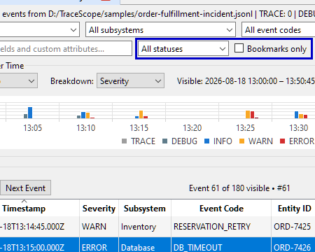

As explained in [Investigating Logs](investigating-logs.md#2-understand-what-filtering-changes), the timeline, Issue Summary, and Analytics deliberately ignore bookmark and finding-status filters, so they continue to describe the selected source-data population rather than only your reviewed records.

## 7. Export the findings you need

When you want a structured record of your review, use the **Export** button at the top of the **Findings** tab.

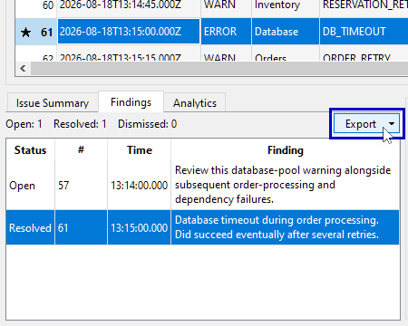

The active investigation's document-level **Export > Findings** menu offers the same scopes.

| Export option | What it includes |
| --- | --- |
| **Export All Findings** | Every record with an explicit finding status: Open, Resolved, or Dismissed, regardless of current filters or bookmark state. |
| **Export Filtered Findings** | Classified findings whose records are **currently visible in the filtered event table**. This respects *all* active event table filters, including bookmark and finding-status filters. |
| **Export Bookmarked Findings** | Classified findings that are also bookmarked, **regardless of the current filters**. |

The menu shows a count beside each option and disables an option when its scope contains no findings. A bookmarked event with **Finding status: None** is **not** included in Export Bookmarked Findings: it is a bookmark, not a classified finding.

To see why the scopes differ, first make sure your `DB_TIMEOUT` record is still both **Open** and **bookmarked** if you experimented with its status or bookmark. Then try this short check:

1. Set the severity filter to `WARN`, leaving `DB_TIMEOUT` excluded from the event table.

    
2. Open the **Export** menu in the **Findings** tab. The finding still contributes to **Export All Findings** and **Export Bookmarked Findings**, but not to **Export Filtered Findings**.

    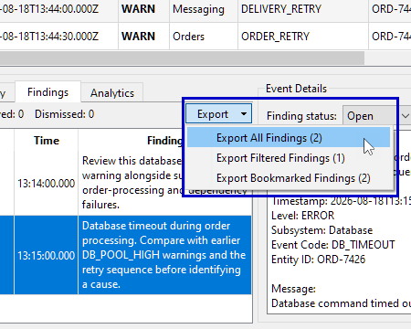

    If you have other existing findings, the counts will reflect those too.
3. Change or reset the filters until the `DB_TIMEOUT` record is visible again.

    

    Reopen the export menu and observe how the filtered count responds.

    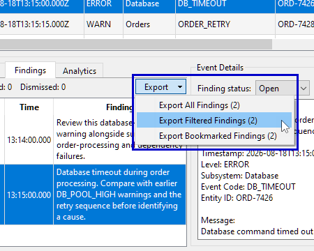
4. Select whichever export scope you need, choose a destination, and save the **CSV** file.

A findings CSV contains the classification, analyst note, bookmark state, stable record ID, mapped event fields, source provenance (including the source name, path, record number, and generation), available custom attributes, and the raw source representation.

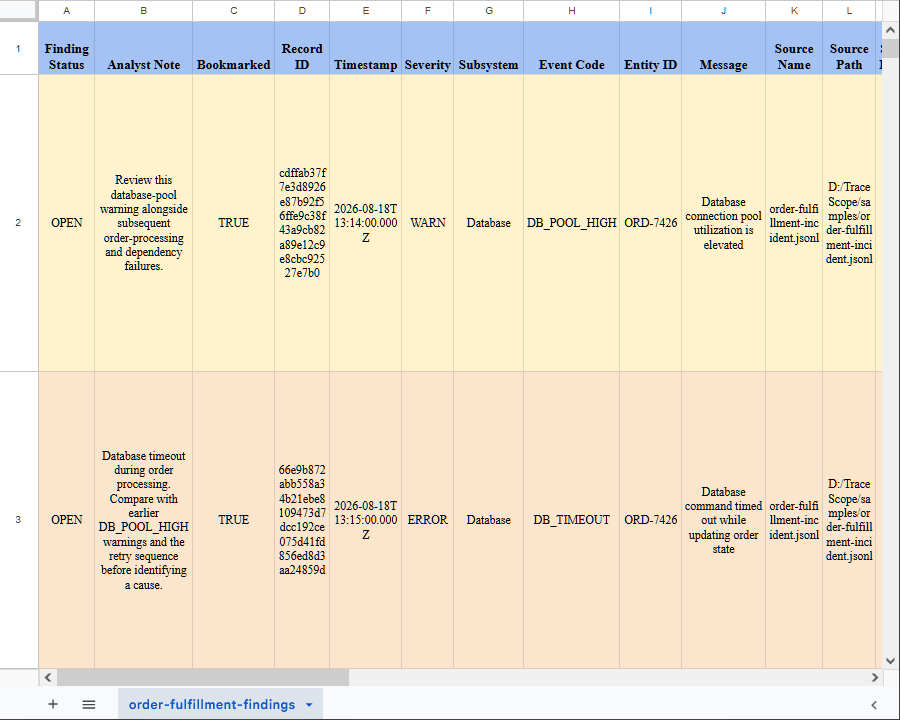

It is an evidence-oriented export, not a diagnosis or a replacement for the saved interactive investigation. Review its contents before sharing: logs and analyst notes can contain internal paths, identifiers, or other sensitive information.

If you instead need **every currently visible log record**, including records that were never classified as findings, choose the separate **Export Filtered Results...** action from the investigation's export menu. A full offline HTML report is another, distinct workflow covered in the [Reporting and Exporting](reporting-and-export.md) guide.

## 8. Preserve the investigation for later review

CSV is useful for handing off selected results, but you should also preserve your working investigation when you want to continue reviewing records, modifying notes, or changing statuses.

Use **File > Save Workspace** (`Ctrl+S` on Windows) to save a `.tsw` workspace.

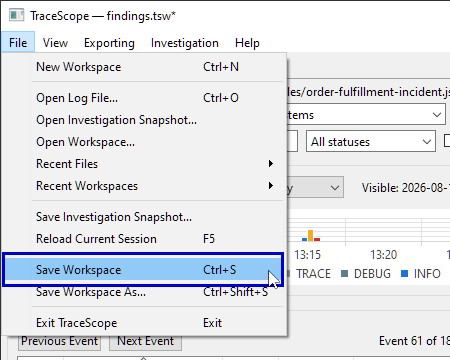

This preserves your investigation and its review state, including bookmarks, notes, finding statuses, and applicable filters and presentation state. A workspace save also creates a companion `<workspace-name>.sessions/` folder holding a durable `.tsinv` snapshot of each open investigation's evidence. **Keep the `.tsw` file and its companion folder together** when moving or backing up the workspace.

For SourceBacked investigation sessions, saving does not automatically change the session to SnapshotBacked. On normal reopening, TraceScope continues to use the external source; if that file is unavailable, the workspace's saved evidence can be recovered through **Open Saved Snapshot**.

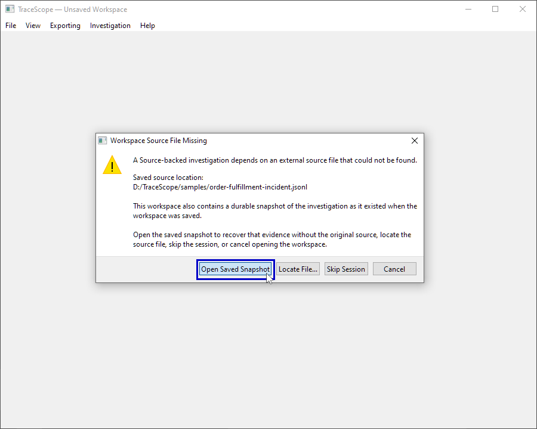

You can also save an individual `.tsinv` investigation snapshot separately. The [Saving and Restoring](saving-and-restoring.md) guide explains the backing and recovery choices in depth.

**Before sharing an investigation:** Consider whether the recipient should receive a CSV of selected findings, a broader report, or a saved workspace with its full evidence snapshots. The right choice depends on the scope of the review and whether the underlying log data is appropriate to share.

## Troubleshooting

| Situation | What to check |
| --- | --- |
| A bookmarked or noted event is missing from **Findings** | Bookmarks and notes alone do not create a finding. Select the event and assign **Open**, **Resolved**, or **Dismissed**. See [Open the sample and locate the review controls](#1-open-the-sample-and-locate-the-review-controls) and [Create an Open finding](#3-create-an-open-finding) for related information. |
| A finding remains listed even though it is missing from the event table | The **Findings** list spans classified records independently of event table filters. Single-click it to preview its evidence; double-click to reveal it and, if necessary, adjust the filters. See [Navigate between Findings and the event table](#5-navigate-between-findings-and-the-event-table) for more information. |
| **Export Filtered Findings** is disabled or has an unexpectedly low count | Check **all** current event table filters, including **Bookmarks only** and **Finding status**. **Export All Findings** ignores those filters. See [Export the findings you need](#7-export-the-findings-you-need) for more information. |
| **Export Bookmarked Findings** has fewer entries than the number of bookmark stars | Only records that are both **bookmarked and explicitly classified** qualify for that scope. See [Export the findings you need](#7-export-the-findings-you-need) for more information. |
| The finding's description still says **(No analyst note)** | Select that finding and use **Add Note** in **Event Details** to save its first note. See [Add and revise an analyst note](#4-add-and-revise-an-analyst-note). |
| You cannot see **Event Details** or the **Findings** tab | Expand the lower investigation area, enlarge the window, or reduce **View > Interface Scale** if needed. See [Open the sample and locate the review controls](#1-open-the-sample-and-locate-the-review-controls) for more information. |

## Where to go next

You now have a workflow for marking evidence, maintaining its review status, locating it across filtered views, and exporting a precise subset of findings. Use [Investigating Logs](investigating-logs.md) when you need to widen your search or understand a pattern before making a review decision.

The [Live Following](live-following.md) guide addresses continuously growing files and continuity across rotation or replacement. [Saving and Restoring](saving-and-restoring.md) covers durable evidence and recovery in more detail, while [Reporting and Exporting](reporting-and-export.md) covers full investigation reports and other export options.
