# Getting Started with TraceScope

TraceScope is an offline desktop application for inspecting and investigating file-based diagnostic and telemetry logs. This guide takes you from launching the application to saving your first [investigation](#2-understanding-tracescopes-terminology), using a fictional software incident supplied with the project.

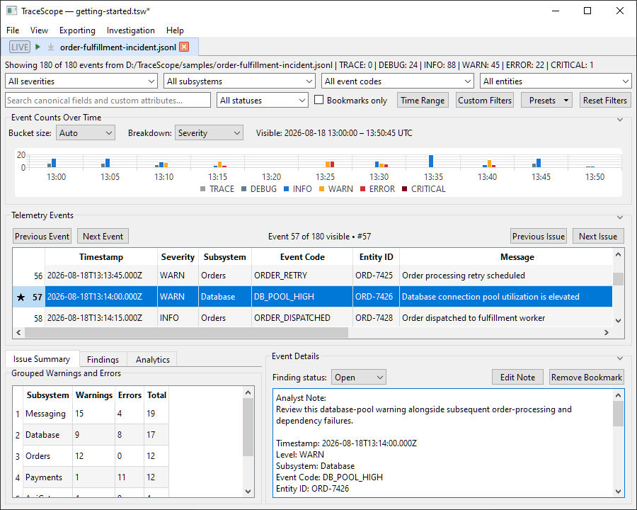

You do not need to write code, run a server, or use the separate Live-Log Generator for this walkthrough.

**In this guide, you will:**

1. [Download and launch TraceScope](#1-download-and-launch-tracescope).
2. [Understand TraceScope's terminology](#2-understanding-tracescopes-terminology).
3. [Find the example log and its profile](#3-find-the-example-log-and-its-profile).
4. [Import the log](#4-import-the-log).
5. [Explore your investigation session](#5-explore-your-investigation-session).
6. [Filter events and investigate a warning](#6-investigate-a-warning).
7. [Bookmark evidence, record a finding, and add an analyst note](#7-preserve-what-you-found).
8. [Save your workspace](#8-save-your-workspace) so you can return to it later.

## 1. Download and launch TraceScope

Download the appropriate application package from the [TraceScope Releases page](https://github.com/w-cook/tracescope-qt-log-inspector/releases). Prebuilt packages are intended for users; Qt, CMake, and a compiler are not required to run them.

### Windows

1. Download the Windows x64 ZIP package for the release you want to use.
2. Extract the **entire** archive into a folder of your choice. Keep its included files and directories together.
3. Run `TraceScope.exe` from the extracted folder.

The Windows package includes demonstration files and reusable import profiles under `samples/`.

### Linux

1. Download the Linux x86_64 AppImage from the [TraceScope Releases page](https://github.com/w-cook/tracescope-qt-log-inspector/releases).

2. Launch TraceScope using either of the following methods:

   **Option A — File manager**

   Open the folder containing the downloaded AppImage. Depending on your Linux desktop environment, you may be able to right-click the file and select **Run**, or launch it directly.

   If your file manager does not offer this option, use the terminal method below.

   **Option B — Terminal**

   Open a terminal in the directory containing the downloaded AppImage. Make the file executable:

   ```bash
   chmod +x TraceScope-v1.0.0-linux-x86_64.AppImage
   ```

   Then launch TraceScope:

   ```bash
   ./TraceScope-v1.0.0-linux-x86_64.AppImage
   ```

   These commands use the v1.0.0 filename. Substitute the actual filename if you downloaded a different release.

3. Download and extract the release's separate samples archive for this walkthrough, or obtain the sample files from the repository.

**Linux troubleshooting:** Most desktop Linux installations already provide the OpenGL libraries needed by TraceScope. If launching the AppImage fails with an error indicating that `libOpenGL.so.0` cannot be found, Ubuntu users can install the missing library with:

```bash
sudo apt update
sudo apt install libopengl0
```

Then launch the AppImage again. Other Linux distributions may provide the same library under a different package name.

The application runs locally. You do not need to create an account or configure a hosted service.

## 2. Understanding TraceScope's terminology

Before importing your first log, it helps to understand a few terms TraceScope uses to organize your work.

| Term | Meaning |
| --- | --- |
| **Investigation session** | An individual investigation containing imported log records and the associated investigation state, such as filters, bookmarks, findings, and notes. The application may also refer to this as an **investigation** or **session**. |
| **Comparison document** | A document used to compare investigation sessions and examine differences between their recorded activity. |
| **Document** | A general term for either an investigation session or a comparison document opened in TraceScope. |
| **Workspace** | The broader working environment containing your open documents and their associated state. A workspace can contain multiple investigation sessions and comparison documents. |

**An investigation session is not a workspace.** A session represents one investigation, while a workspace organizes the documents you have open and allows you to save and restore your broader working environment.

Throughout this guide, *investigation* and *investigation session* refer to the same application object unless the surrounding text is describing the general activity of investigating logs.

## 3. Find the example log and its profile

We will investigate a fictional order-processing application. Its logs include ordinary order activity and periods of database, payment, and messaging trouble. These records are demonstration data, not logs from a real production system.

Locate these two files in the supplied samples:

| File | Purpose |
| --- | --- |
| `samples/order-fulfillment-incident.jsonl` | The source log to investigate |
| `samples/profiles/order-fulfillment-incident-profile.json` | A reusable import configuration for that log |

You can also find the [sample log](../samples/order-fulfillment-incident.jsonl) and [matching profile](../samples/profiles/order-fulfillment-incident-profile.json) in the repository.

The `.jsonl` extension means **JSON Lines**: each line holds an individual JSON record. The matching profile tells TraceScope where to find familiar fields such as timestamp, severity, subsystem, event code, entity ID, and message. It also identifies useful source-specific attributes.

## 4. Import the log

TraceScope uses the **Import Configuration window** to prepare a log file for investigation. Here, you can choose a source file, load an import profile, check how its fields will be interpreted, and preview the records before importing them.

Follow these steps to import the Order Fulfillment Incident sample:

1. In TraceScope, choose **File > Open Log File...** (`Ctrl+O` on Windows).

   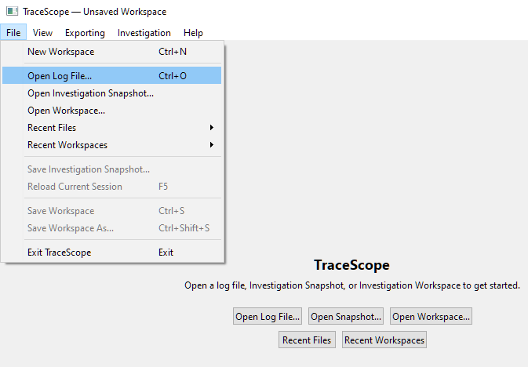

   This opens the **Import Configuration window**.

   

2. In the Import Configuration window, select **Browse...**

   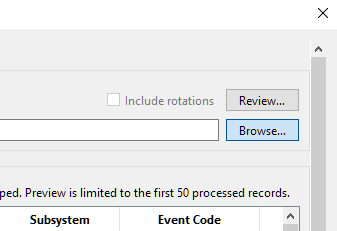

   and choose `order-fulfillment-incident.jsonl`.

   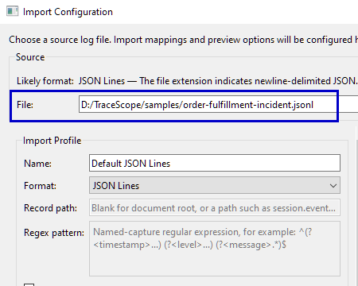

3. Select **Load Profile...** and choose `order-fulfillment-incident-profile.json` from the `samples/profiles/` directory.

   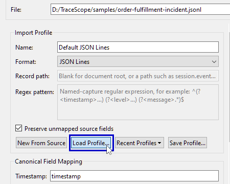

4. Confirm that the profile is named **Order Fulfillment Incident**, the selected format is **JSON Lines**,

   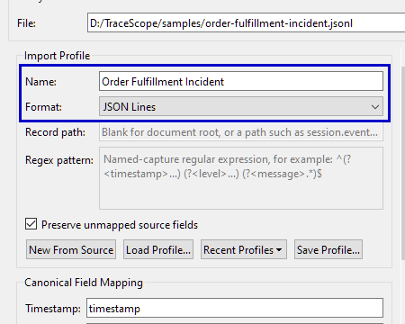

   and the configuration reports that the profile is valid.

   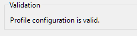
5. Examine the preview. You should see recognizable timestamps, severities, subsystems, and messages rather than having to interpret raw JSON yourself.

   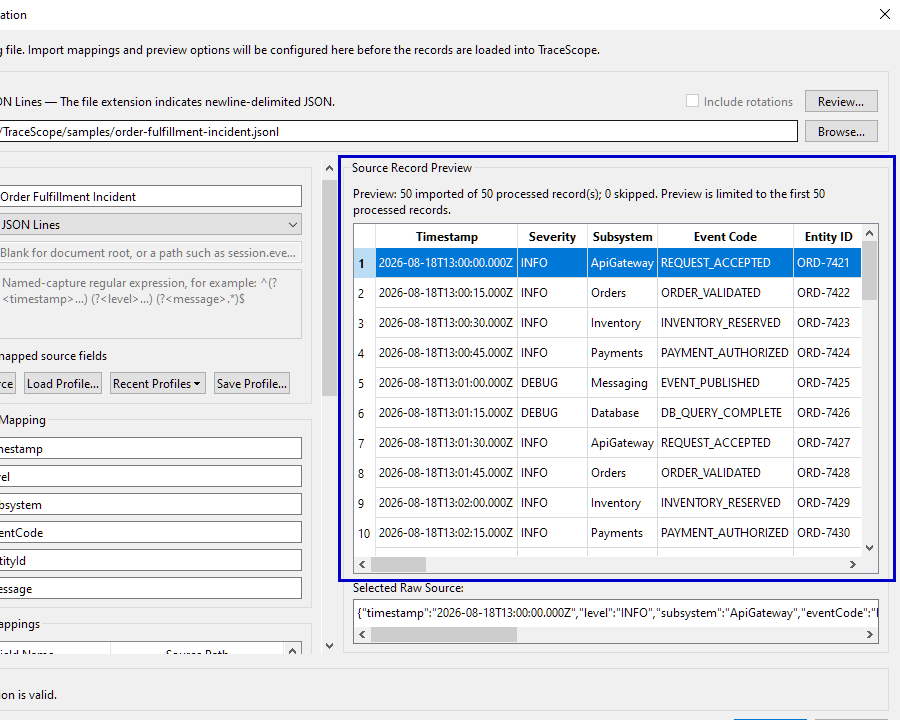
6. Select **Import** to open the investigation.

   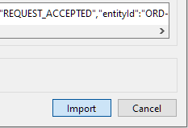

The Import Configuration layout may differ according to your window size. Its controls and validation have the same purpose in the wide and compact layouts.

**Why load a profile?** Different sources may use different field names or structures. A TraceScope import profile makes those mappings explicit and reusable. In this example, the supplied profile maps the source's `level` field to severity and retains attributes such as host, correlation ID, latency, and queue depth. You do not need to create or edit a profile for this first investigation.

## 5. Explore your investigation session

When you import a log file into TraceScope, the application creates an **investigation session** containing the imported records and opens it as a document in your workspace. This session provides the tools for examining events, identifying patterns, and recording findings.

Let's explore the main areas of the investigation interface:

- **Telemetry Events:** This section contains the **event table**, where you can browse, sort, and select imported records.

   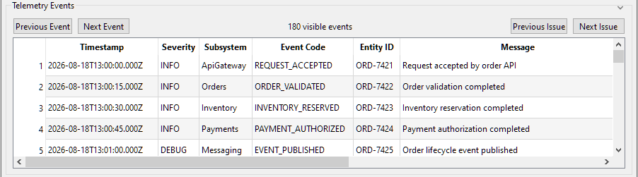

   Source-specific fields appear alongside recognized investigation fields where available. Active categorical filter values appear bold within records.
- **Filters and search:** Narrow the event table by severity, subsystem, event code, and other available fields, or search across the records.

   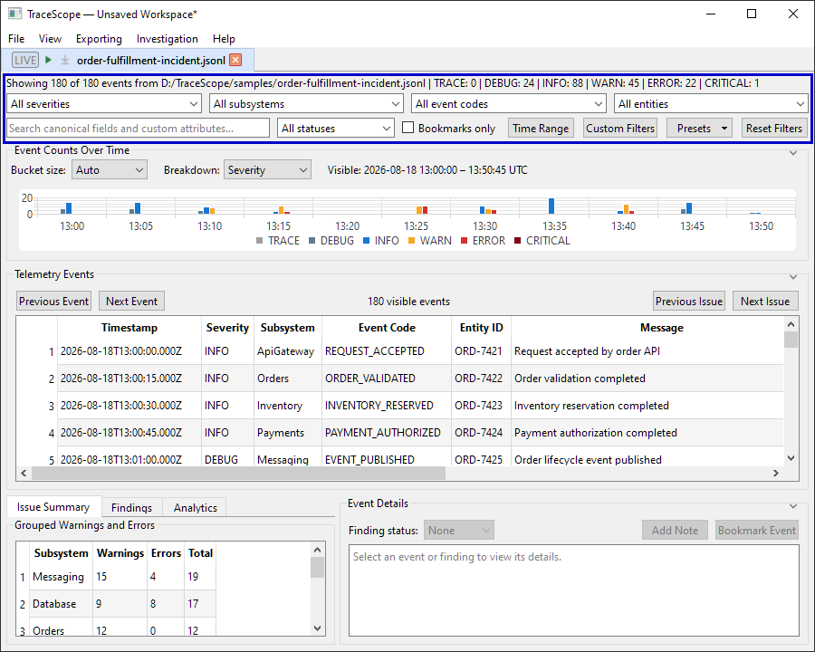
- **Event Details:** Selecting a row in the **Telemetry Events** event table displays that record's information in the separate **Event Details** panel. This includes its mapped values and **Custom Attributes**, followed by **Source / Provenance**.

   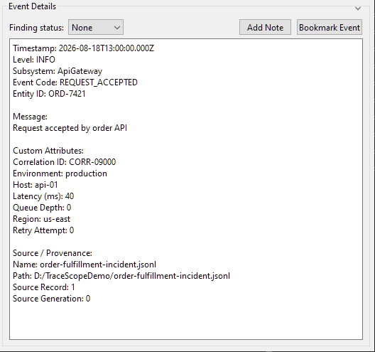

   If you later save an analyst note, it appears above the record information in this same panel. This is also where you can bookmark and annotate evidence.
- **Timeline and analysis:** Explore how recorded activity changes over time and use the available summary and analytical views to investigate patterns.

   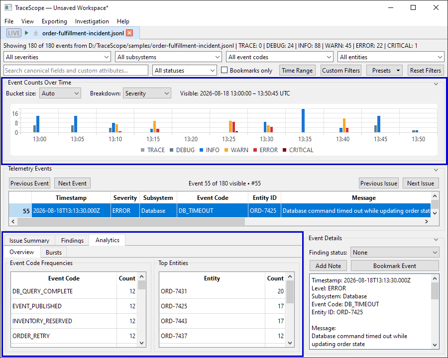

### Adjust the layout for your screen

The investigation may look different on your computer depending on your window size, monitor resolution, operating-system display scaling, and TraceScope's own **Interface Scale** setting. The investigation adapts to its available space: on a smaller window, a low-resolution display, or a display with high scaling, the **Timeline**, **Telemetry Events**, or lower investigation panels may initially appear **collapsed**. This is intentional. The sections are still available; the application has reduced the visible layout to keep it usable in the available space.

If you want more room or need to change the size of the interface:

1. Try maximizing or enlarging the TraceScope window.
2. Open **View > Interface Scale**.

   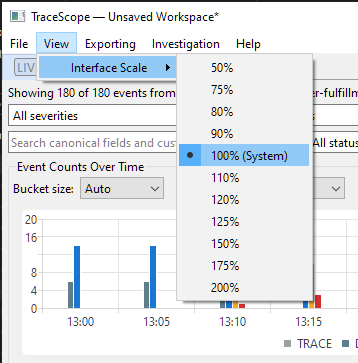

   The **100% (System)** option uses your operating system's current display scaling as TraceScope's baseline. Other percentages adjust the size of TraceScope's interface relative to that baseline; they do not change your system's display settings. If the interface is too large for the available space, try **90%**, **80%**, or another smaller option. If controls and text are too small, choose a larger percentage instead. Changes take effect immediately, without restarting TraceScope.
3. Use the small **chevron near the right side of each section's title** to collapse or expand the Timeline, Telemetry Events, or the entire lower investigation area.

   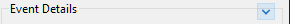

   You can also drag the dividers between expanded sections to distribute the available space.

**When space is limited:** Expanding one section may cause a different section to collapse so the requested area can fit. If a section cannot expand, give the window more vertical space or reduce Interface Scale. You can also leave sections collapsed and open only the area you need; there is no requirement to match a particular layout to complete this walkthrough.

The lower investigation area contains the **Issue Summary**, **Findings**, and **Analytics** tabs alongside **Event Details**. If you cannot see these controls when a later step refers to them, expand that lower area first.

## 6. Investigate a warning

The [Order Fulfillment Incident sample](../samples/order-fulfillment-incident.jsonl) contains routine order-processing activity followed by periods of elevated database activity and other operational problems. If you haven't imported it yet, follow the [import walkthrough](#4-import-the-log) before continuing.

Rather than reading every record, start by narrowing the investigation to events that may need attention.

1. Open the severity filter (which displays **All severities** when no values are selected).

   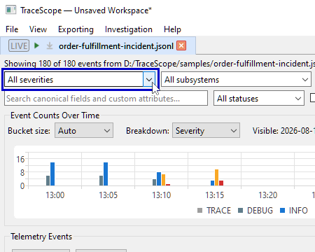
2. Select `WARN` and `ERROR` to limit the visible records to those severity levels.

   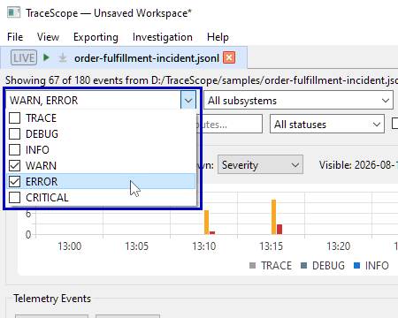

   Notice that the severity values **WARN** and **ERROR** now appear in **bold** in the event table. This indicates that those values are included in your active severity filter.

   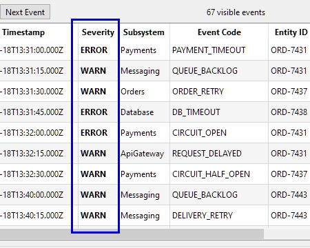
3. Inspect the remaining records in the **Telemetry Events** event table. Find a record with the event code `DB_POOL_HIGH`; the associated message reports elevated database connection-pool utilization.

   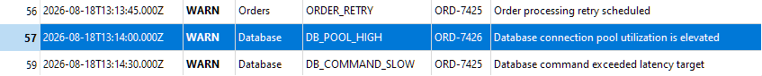
4. Select that **record row in the event table**, then look at the separate **Event Details** panel below.

   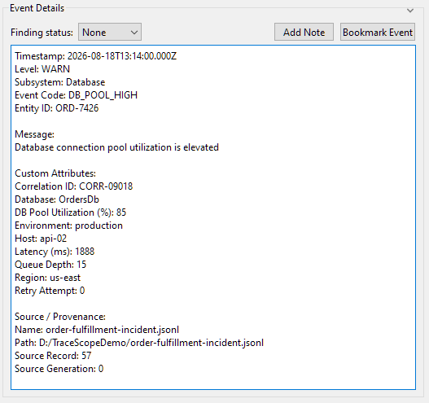

   Pay particular attention to its timestamp, subsystem, event code, message, source-record context, and any relevant custom attributes.

You have now moved from an entire source file to a specific record worth examining. The filter limits what you see; it does not remove records from the imported investigation.

You can use **Reset Filters** whenever you want to return to the full visible dataset.

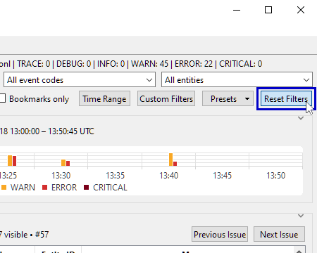

**Interpretation note:** A warning is a useful investigative lead, not proof of a root cause. TraceScope helps you inspect and organize evidence; it does not automatically establish why an incident occurred.

## 7. Preserve what you found

In this example, we'll bookmark a database warning, classify it as an open finding, and attach an analyst note to preserve our observations.

Start with the `DB_POOL_HIGH` record from the Order Fulfillment Incident sample selected in the event table. This is the elevated database connection-pool warning identified in the [previous investigation step](#6-investigate-a-warning).

1. In **Event Details**, select **Bookmark Event**.

   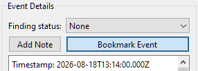

   Look back at the event table: a **star (★) appears beside that record's event number to indicate its new Bookmarked status**.

   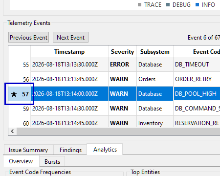
2. In **Event Details**, change **Finding status** from **None** to **Open**.

   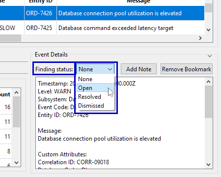

   **Bookmarks and findings serve different purposes.** Bookmarking a record makes it easy to return to later without assigning it a formal finding status. Setting a finding status adds the record to the investigation session's **Findings** list, where you can track and review it. You can bookmark a record, assign it a finding status, or do both, as in this example.
3. In the lower investigation area, select the **Findings** tab. If that area is collapsed, expand it using its chevron first. Find your newly created **Open** finding in the list. Its text initially begins with **(No analyst note)** and includes the event's code and message.

   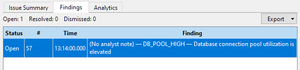
4. Return to **Event Details** for the selected record and select **Add Note**.

   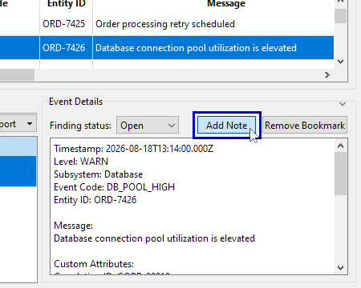

   Enter a brief observation, such as: `Review this database-pool warning alongside subsequent order-processing and dependency failures.` Select **Save** in the note editor.
   
   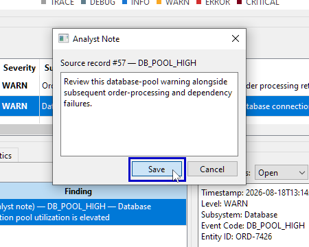
   
   The text appears immediately in an **Analyst Note** block above the record details, and the button changes to **Edit Note**.

   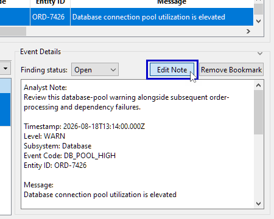
5. Look at the **Findings** tab again. The entry's default **(No analyst note)** description has been replaced by **your note**.

   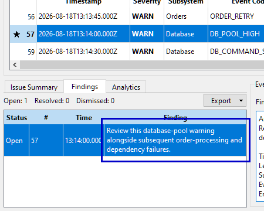

   This demonstrates how the event table, Event Details panel, and Findings tab represent the same underlying record and investigation state.

You have now bookmarked a source record, classified it as an unresolved finding, and attached an observation directly to that evidence. You can return to it through the bookmark and finding controls as you continue investigating.

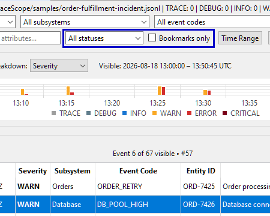

## 8. Save your workspace

Choose **File > Save Workspace** (`Ctrl+S` on Windows), select a location, and save the current workspace as a `.tsw` file. This preserves your open investigation session along with its associated workspace state.

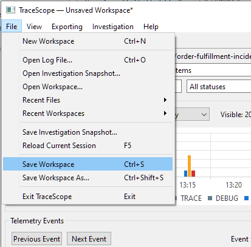

A workspace can contain multiple investigation sessions and comparison documents. Saving it preserves the open documents and their associated state, including import-profile information, active filters, bookmarks, notes, findings, and applicable presentation settings. A saved workspace lets you return to your broader working environment rather than simply exporting a list of records.

To verify this workflow, you can use **File > Open Workspace...** to reopen the saved file and check that your investigation state has been restored.

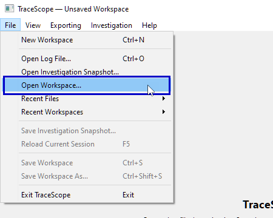

**What happens to the log evidence when you save?** Saving a workspace creates both the `.tsw` workspace file and a **companion folder containing a durable `.tsinv` snapshot for each open investigation session**. The snapshots preserve each investigation's normalized evidence as it existed when you saved; the `.tsw` file preserves the broader workspace and investigation state. Keep the companion `<workspace-name>.sessions/` folder together with the `.tsw` file if you move, back up, or share the saved workspace; the `.tsw` file alone is not the complete saved package.

An investigation session that is **SourceBacked** (associated with its original external log file) remains SourceBacked when you save the workspace. The original log remains the authoritative source for normal reopening and reloading. If that source is missing when you reopen the workspace, TraceScope offers **Open Saved Snapshot** so you can recover the saved evidence without the original log.

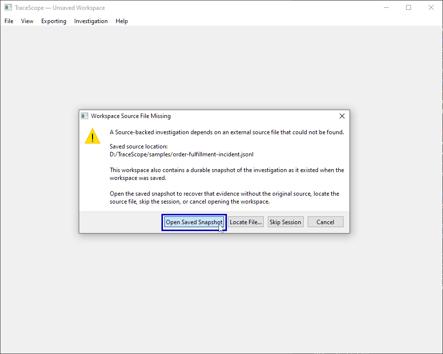

Choosing **Open Saved Snapshot** restores the affected investigation session as **SnapshotBacked**, meaning the investigation uses its saved evidence instead of reopening the original source file. Saving a workspace therefore preserves the investigation's evidence without automatically changing how that session is backed.

You can also save an individual investigation session as a standalone `.tsinv` snapshot, independently of the full workspace.

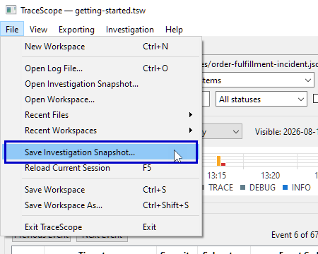

The detailed distinctions among source backing, saved snapshots, and recovery are covered in [Saving and Restoring](saving-and-restoring.md).

## What you've accomplished

You have imported a source file using a reusable profile, isolated relevant events, inspected source-specific details, recorded an investigative lead, and saved the state of your work.

From here, you can explore more advanced filtering and timeline navigation, compare a known-good investigation session with a degraded one, follow an actively growing log, or export findings and offline HTML reports. See [Investigating Logs](investigating-logs.md), [Comparing Sessions](comparing-sessions.md), [Live Following](live-following.md), and [Reporting and Exporting](reporting-and-export.md) for those workflows.

If your own log does not import correctly, return to **Import Configuration** and inspect its format suggestion, profile mappings, validation messages, and source preview before attempting to investigate the resulting records.
