# Importing Logs into TraceScope

TraceScope works with log files on your computer. Before importing a log into an investigation session, you use the **Import Configuration window** to choose how its records should be interpreted. This guide covers that process, from importing a familiar format to configuring an unfamiliar source and combining related rotated files.


An import profile describes how TraceScope reads a source and maps its fields. You can reuse a supplied profile, build one from a source, or save your own configuration for later. Importing does not rewrite the original log.

If you have not used TraceScope before, start with [Getting Started](getting-started.md). That walkthrough uses a supplied log and profile so you can learn the investigation interface before configuring your own sources.

**Having trouble importing?** [Jump straight to Troubleshooting](#troubleshooting).

## Find the task you need

| I want to... | Go to |
| --- | --- |
| Open a file and check whether TraceScope understands it | [Import a log file](#1-import-a-log-file) |
| Understand why the Import Configuration window looks different on my screen | [Find your way around Import Configuration](#2-find-your-way-around-import-configuration) |
| Map unfamiliar field names or nested records | [Configure an import profile](#3-configure-an-import-profile) |
| Reuse a configuration | [Save, load, and reset profiles](#4-save-load-and-reset-profiles) |
| Check the data before importing | [Verify the preview and validation](#5-verify-the-preview-and-validation) |
| Import archived files together with an active log | [Import a rotated source family](#6-import-a-rotated-source-family) |
| Open a particularly large file | [Import large files](#7-import-large-files) |
| Fix an unexpected import result | [Troubleshooting](#troubleshooting) |

## 1. Import a log file

1. Choose **File > Open Log File...** (`Ctrl+O` on Windows). TraceScope opens the **Import Configuration window**.

    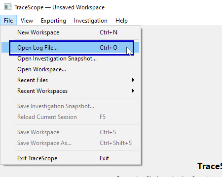

    You can also open a single local log file through the application's supported drag-and-drop workflow;
    
    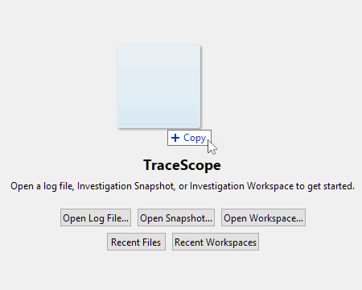

    The **Import Configuration window** still gives you a chance to inspect the file before importing it.
2. Under **Source**, choose **Browse...** and select your log file. Alternatively, enter its path in the **File** field.

    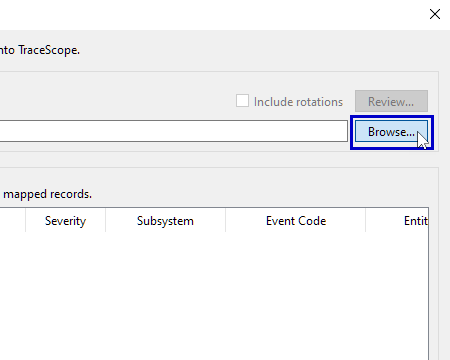

3. Read **Likely format**. TraceScope may suggest an importer based on the extension or recognizable source content.

    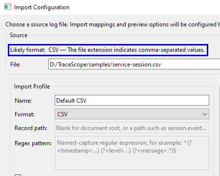

    If you also see **Include rotations**, that option concerns older log files moved aside by the producing application.
    
    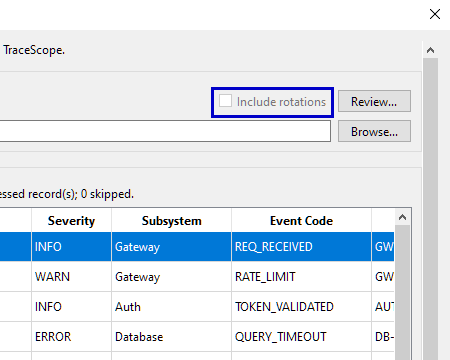

    You can ignore it for a single-file import; see [Import a rotated source family](#6-import-a-rotated-source-family) for details.
4. Inspect the selected **Format**,
    
    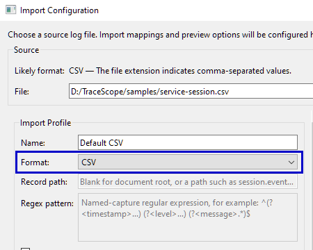
    
    the field mappings,
    
    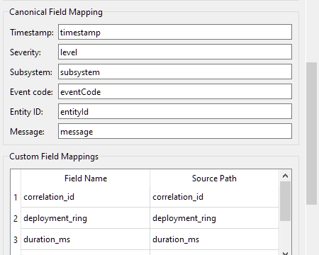
    
    and **Source Record Preview**.
    
    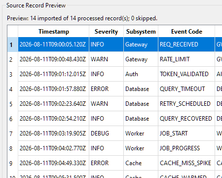
    
    If the default configuration is not appropriate, load an existing profile or adjust the mappings before proceeding.
5. Check **Validation** for configuration errors.
    
    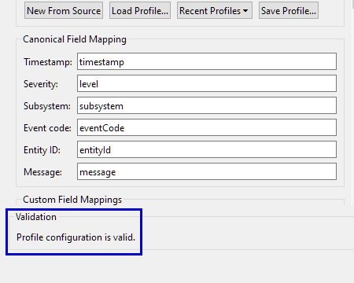

    Examine the preview to confirm that the records contain the information you expect.
6. Select **Import**.

    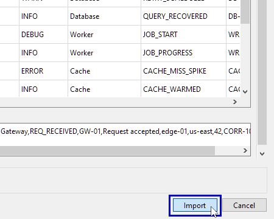

    TraceScope processes the selected source, creates an **investigation session** containing the imported records, and opens that session as a document in your workspace.

**A format suggestion is a starting point, not a guarantee.** TraceScope can recognize several common formats, but an extension such as `.log` does not reveal every custom log structure. A profile that passes validation can still produce missing values or unexpected results if its mappings do not match your data. Check the preview rather than importing solely because a format was suggested.

If you already have a profile for the source, **Load Profile...** is usually the quickest and most reliable route. For example, the supplied `samples/service-session.csv` can be opened with `samples/profiles/service-session-csv-profile.json`.

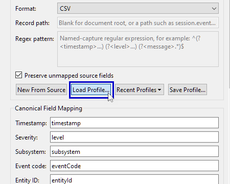

## 2. Find your way around Import Configuration

The **Import Configuration window** is divided into four functional areas:

| Area | What it controls |
| --- | --- |
| **Source** | The active file, likely-format suggestion, and optional [related rotated files](#6-import-a-rotated-source-family) |
| **Import Profile** and the mapping sections | Importer selection, record structure, canonical fields, custom fields, severity aliases, and timestamp rules |
| **Source Record Preview** | A limited preview of interpreted records and the original source text of the selected preview row |
| **Validation** | Whether the current profile configuration is structurally valid |

The profile controls include **New From Source**, **Load Profile...**, **Recent Profiles**, and **Save Profile...**. The **Import** and **Cancel** buttons remain available at the bottom of the window.

### If the Import Configuration window looks different on your screen

The arrangement responds to the available screen space and interface scaling. On a sufficiently wide display, profile controls and source preview appear beside each other, separated by a **resizable vertical divider**. Drag the divider left if you want to give the preview more room, or right if you need more space to edit the profile and mappings. In a more constrained layout, the content may instead appear under separate **Profile & Mappings** and **Source Preview** tabs. The **Source** and **Validation** areas remain accessible, and you can scroll within the relevant content.

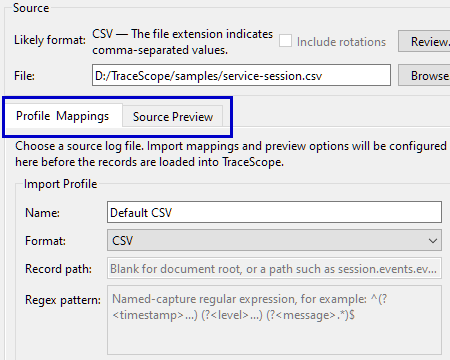

You can resize the Import Configuration window if your screen permits it. To adjust TraceScope's interface scaling, close the window, choose **View > Interface Scale** from the main application window, and reopen Import Configuration.

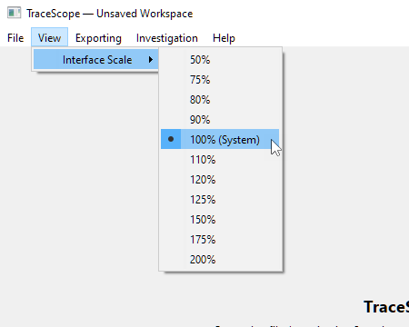

**100% (System)** uses your operating system's current display scaling as TraceScope's baseline. Other percentages adjust the size of TraceScope's interface relative to that baseline; they do not change your system's display settings. The [Getting Started guide](getting-started.md#adjust-the-layout-for-your-screen) explains how to choose an appropriate scale for your screen.

The location of a control may change between layouts, but its function does not.

## 3. Configure an import profile

A profile answers two questions:

1. **How should TraceScope read the records?** This is the selected **Format**, together with format-specific settings such as a record path or regular expression.
2. **How should it interpret the values?** Canonical mappings, custom fields, severity aliases, and timestamp rules determine what appears in the investigation.

Start with the suggested configuration or a supplied profile whenever possible. Configure only what your source actually needs.

### Choose the format

Select an importer from **Format**.

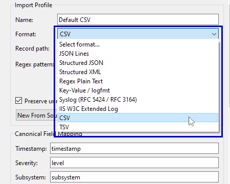

The following summarizes the available source families and the main configuration decisions:

| Source family | Typical configuration |
| --- | --- |
| JSON Lines (`.jsonl`, `.ndjson`) | Map fields in individual JSON records; nested source paths are supported |
| Structured JSON (`.json`) | Identify the records within the document when necessary, then map their fields |
| CSV or TSV | Map named columns from the file's header row |
| Key-value / logfmt | Map fields extracted from key-value records |
| Syslog | Use the Syslog importer and map available parsed fields |
| IIS W3C access logs | Use the dedicated importer and its field-header support |
| Structured XML, including Windows Event XML | Select the relevant record path and map elements or attributes |
| Regex plain text | Supply a named-capture regular expression, then map its captured fields |
| Common Apache/Nginx access logs | Use the suggested regex-based preset where the log matches a recognized layout |

The [Supported Formats](supported-formats.md) reference describes each built-in importer, recognized source layouts, format-specific requirements, and limitations in detail. In particular, Windows Event support is limited to XML-formatted records and collections; TraceScope does not directly import native binary `.evtx` files.

Selecting the correct importer matters more than the filename. If no format is suggested for a custom text log, choose **Regex Plain Text** and provide a suitable pattern, or load a profile that already contains one.

### Map the canonical investigation fields

The **Canonical Field Mapping** section contains six optional destinations.

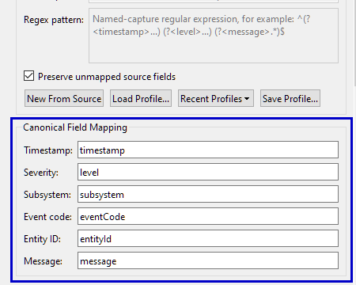

Enter the *source field name or path* containing each value, not an example value from a record. For structured sources, a path such as `service.name` identifies a value within the selected record; it is not a filesystem path or a general JSONPath expression. See [Import Profiles](import-profiles.md#3-source-paths-and-format-specific-configuration) for the full source-path rules.

| Destination | Example source field | Used for |
| --- | --- | --- |
| **Timestamp** | `timestamp` | Time-based investigation and timeline views |
| **Severity** | `level` | Severity filtering and severity-based analysis |
| **Subsystem** | `service.name` | Component or subsystem investigation |
| **Event code** | `event.code` | Grouping and navigating event classes |
| **Entity ID** | `resource.id` | Investigating activity associated with an entity |
| **Message** | `details.message` | Human-readable event context |

A JSON source might use `level` for severity, while another might use `priority`; both can map to TraceScope's **Severity** field. The dot-separated examples above illustrate nested paths, not literal field names required by TraceScope.

**Canonical fields are optional.** Leave a mapping blank when the source genuinely lacks that information. TraceScope can still retain and display useful records, although views or filters that depend on an unavailable field may not be offered. Do not invent values merely to make every destination appear populated.

If you map a **Timestamp** field, you must also configure at least one **Timestamp Rule** so TraceScope knows how to interpret its values. See [Parse timestamps](#parse-timestamps) for the available rule types and examples.

For a concrete nested example, open the supplied `samples/structured-json-nested-session.json` and load `samples/profiles/structured-json-nested-profile.json`. This profile maps `observedAt` to Timestamp, `priority` to Severity, `service.name` to Subsystem, and other nested paths to their respective destinations.

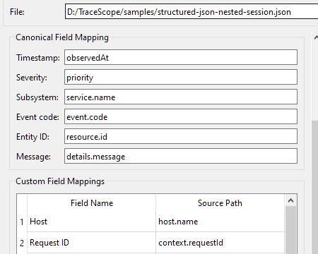

### Select records inside structured JSON or XML

Some structured files contain metadata around the actual records. For these sources, **Record path** identifies the object or element path containing the records to import. Leave it blank only when the document's root is the appropriate record location.

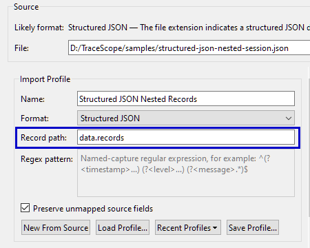

The nested JSON sample above places its records at `data.records`, so its profile uses:

```text
Record path: data.records
```

If the preview contains no records, or appears to interpret the wrong part of a structured document, check the record path before changing the individual field mappings.

The record-path control applies to **Structured JSON** and **Structured XML**. Other formats do not require this setting.

### Keep source-specific information with custom fields

Canonical fields provide common investigation controls, but they should not replace useful details specific to your source.

Under **Custom Field Mappings**, choose **Add Mapping** and enter:

- **Field Name:** the label you want TraceScope to display.
- **Source Path:** the corresponding field in the source record.

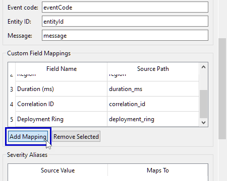

For example, `samples/service-session.csv` contains a `duration_ms` column. Its matching profile maps that column to a custom field named **Duration (ms)**. A JSON profile can similarly map a nested path such as `context.requestId` to **Request ID**.

You can add multiple mappings or select a row and use **Remove Selected**.

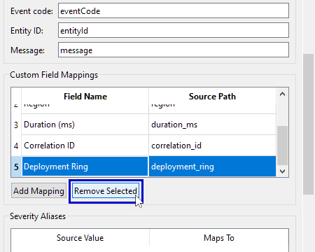

Custom fields can become investigation columns and provide additional search and filtering context.

**Preserve unmapped source fields** retains other source attributes that are not explicitly assigned to canonical or custom destinations.

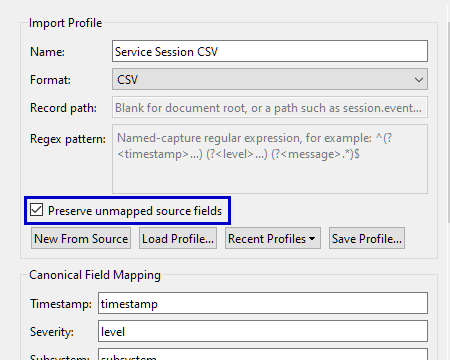

Keeping it enabled is generally useful when exploring an unfamiliar source: the preview can then help you identify fields you may want to map deliberately. Turning it off is an explicit choice to omit those unmapped attributes from the normalized custom-field data. The original raw source remains available for inspection.

TraceScope can also detect candidate custom fields from previewed source content for supported formats. This is a starting point, not a complete scan of every field in the source; fields that occur only in later records may not be discovered. Review the suggested mappings and their display names, and add any important missing fields explicitly.

### Interpret nonstandard severity values

Your source may use values that differ from TraceScope's standard severity levels. Use **Severity Aliases** to map the source's terminology to **TRACE**, **DEBUG**, **INFO**, **WARN**, **ERROR**, or **CRITICAL**.

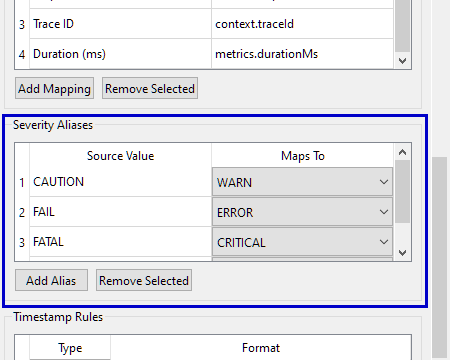

The supplied nested JSON sample uses source values such as `CAUTION` and `FAIL`. Its profile maps them to TraceScope's warning and error levels. Without appropriate aliases, a mapped but unrecognized severity value can produce a diagnostic and leave that record without a normalized severity.

Use **Add Alias** to add a **Source Value**

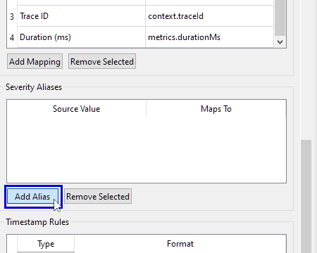

and select its **Maps To** target.

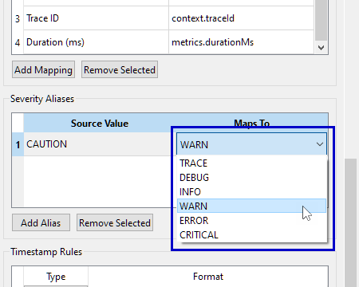

Review the preview after changing an alias, especially when severity-based investigation is important to your workflow.

### Parse timestamps

If you map a Timestamp field, configure at least one **Timestamp Rule**. TraceScope supports ISO 8601 parsing and explicitly configured Qt-format rules. Use **Add Rule** to add a rule

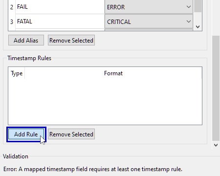

or **Remove Selected** to remove one you no longer need.

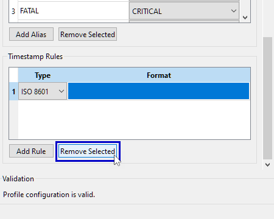

The bundled JSON and CSV examples use ISO 8601 timestamps, such as `2026-08-11T09:00:05.120Z`. For timestamps that do not use ISO 8601, see [Timestamp rules](import-profiles.md#timestamp-rules) in the Import Profiles reference for guidance on configuring Qt-format rules, including format-string examples.

Verify the resulting timestamp column in **Source Record Preview**. A field name can be correct even when its value cannot be parsed using the selected rule; in that case, the record may remain usable without a normalized timestamp, but time-dependent features will have less information.

### Import text using a regular expression

For custom line-oriented text, choose **Regex Plain Text** and provide a regular expression with named captures. The capture names become source fields that you can map in **Canonical Field Mapping** or **Custom Field Mappings**.

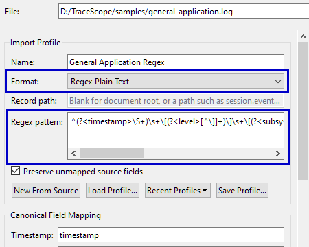

The expression must match the **entire log line**, not just a portion of it. A pattern that matches only part of a record may appear successful in a regex testing tool but will cause TraceScope to skip that record. Using `^` and `$` anchors is a useful starting point when constructing your pattern.

For a working example, open `samples/general-application.log` with `samples/profiles/general-application-regex-profile.json`. The supplied profile captures timestamps, levels, subsystems, event codes, entity IDs, request IDs, and messages from the sample's bracketed log format.

**If you are unfamiliar with regular expressions, consider asking an AI assistant to help draft one.** Give it several *sanitized* examples of your log lines and tell it which parts you want to extract. Ask specifically for a **Qt `QRegularExpression`-compatible pattern with named capture groups**, and have it explain which capture maps to each TraceScope field. For example, you could ask:

> Write a Qt QRegularExpression-compatible regular expression using named capture groups for these sample log lines. Capture the timestamp, severity, subsystem, and message so I can map them in TraceScope. Explain the expression and identify lines it might not handle. [Paste several sanitized examples here.]

**Do not upload confidential or sensitive production logs to an AI service or public testing website.** Remove or replace credentials, personal information, tokens, internal addresses, customer details, and other sensitive content first. Use synthetic examples where possible and follow your organization's data-handling requirements.

If you would rather work through the expression yourself, [Regex101](https://regex101.com/) can help you experiment with a pattern; select its **PCRE2** flavor for a useful approximation of Qt's regular-expression syntax. Qt's [QRegularExpression documentation](https://doc.qt.io/qt-6/qregularexpression.html) is the authoritative reference for what TraceScope's regex engine accepts. For help specific to TraceScope, you can also [open a GitHub issue](https://github.com/w-cook/tracescope-qt-log-inspector/issues), providing a sanitized sample and explaining the fields you need.

Whether you write the regex yourself or use assistance, first confirm that it matches **several representative records**, including unusual or incomplete lines where applicable. A syntactically valid or AI-generated expression is not necessarily correct for your log. Use **Source Record Preview** to confirm that its captures populate the intended fields, and check that the preview does not unexpectedly skip records.

## 4. Save, load, and reset profiles

The **Import Configuration window** lets you save, load, and reset import profiles. Once your preview looks right, save the configuration so you do not have to recreate it for the next file from the same source.

**Save a profile:** Choose **Save Profile...** and select a location for the `.json` profile file. Give the profile a meaningful name in the **Name** field before saving. The button requires a valid profile configuration.

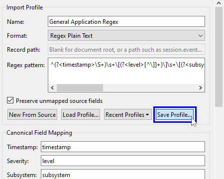

**Load a profile:** After selecting a compatible log file, choose **Load Profile...**, then select the saved `.json` profile.


**Recent Profiles** provides shortcuts to previously used, still-available profile files. 

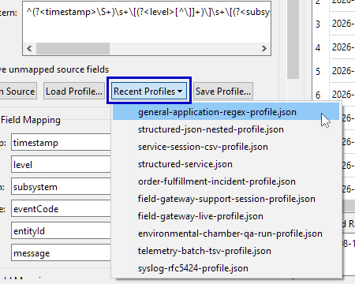

Confirm the selected source and preview after loading; a valid profile may not match every file with the same extension.

**Start again from the source:** Choose **New From Source** to replace the current working configuration with a new one based on the selected file and any available format suggestion.

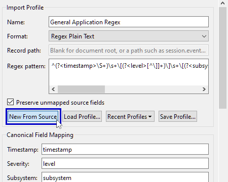

If you have edited the current profile, TraceScope requests confirmation before replacing it. Save changes you want to keep first.

Profiles describe **import behavior**. They are not saved investigation sessions or investigation snapshots, and they do not contain your imported records, bookmarks, analyst notes, finding statuses, or saved workspace layout. A saved workspace and a standalone investigation snapshot serve different purposes; see [Getting Started](getting-started.md#8-save-your-workspace) for the introductory distinction.

## 5. Verify the preview and validation

Before importing unfamiliar data, use **Validation** and **Source Record Preview** in the **Import Configuration window** to check your current configuration. These are two different checks: validation determines whether the profile is structurally acceptable, while preview helps you determine whether the selected source is being interpreted correctly.

### Check Validation

**Validation** checks whether your profile is structurally acceptable. For example, it can identify a missing profile name, malformed source path, invalid regular expression, duplicate custom-field name, or a missing timestamp rule for a mapped timestamp.

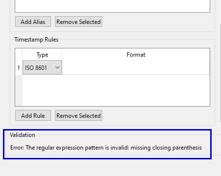

Correct errors before proceeding. A warning can identify a questionable setting without necessarily making the profile invalid. A valid profile means the configuration is acceptable; it does not establish that the selected source has been interpreted correctly.

### Inspect Source Record Preview

The preview shows normalized columns according to your current mappings, including configured custom fields. The **Unmapped Custom Fields** column shows additional preserved source attributes when they are available; it may be empty when no unmapped values are retained.

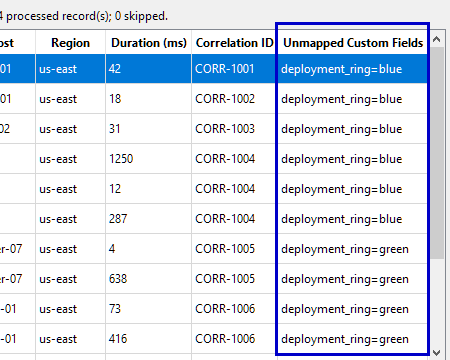

Select a **row in the preview table** to inspect its original text under **Selected Raw Source**.

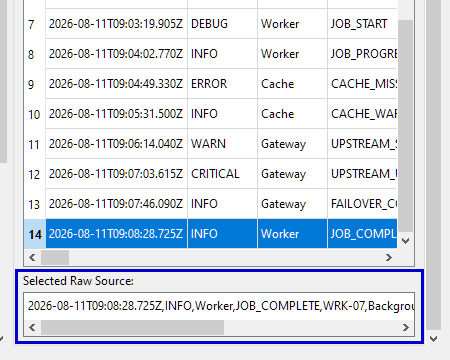

Use these two views together:

1. Confirm that each mapped column contains the value you expect for the selected record.
2. Compare those values with **Selected Raw Source**, particularly when timestamps or severities are blank or unexpected.
3. Check whether important data appears only among the unmapped attributes. If so, consider giving it an explicit custom-field mapping.
4. Inspect the preview summary for the number of imported, processed, and skipped records, and any diagnostic count.

The preview is deliberately limited to **50 processed records** by default. This is a sampling limit, not a limit on the subsequent full import. When previewing a rotated source family, TraceScope distributes the preview allowance among the selected physical sources; a **Source** column identifies the origin of each displayed preview record.

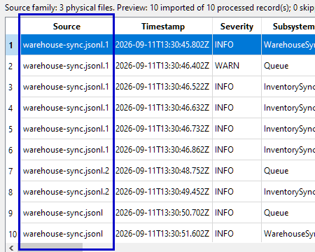

**Interpreting the counts:** *Processed* records are the records considered by the preview; *imported* records were admitted as investigation records; *skipped* records were processed but not imported. A diagnostic indicates something worth checking, such as an invalid value or parsing problem. After import, you can include captured import diagnostics in an offline HTML report by enabling **Include technical import/profile appendix** in the report settings. Do not treat a successful preview of a few records as proof that every later record in the file has the same structure.

### Large structured documents have an explicit preview action

For **Structured JSON** or **Structured XML** files larger than **16 MiB**, TraceScope does not generate the usual automatic preview. Instead, choose **Refresh Preview** to generate a limited preview in the background.

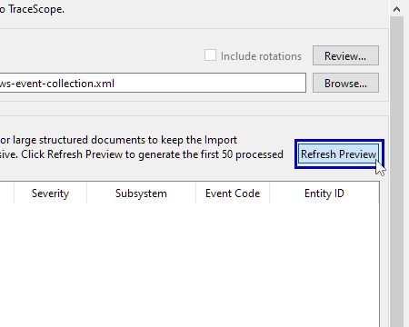

The same rule applies if any selected member of a structured source family exceeds that threshold.

Wait for the result before deciding whether your mappings work. You can continue interacting with Import Configuration while the background preview is being generated. This protects the configuration interface from the cost of automatically previewing large structured documents every time a setting changes.

If the preview is empty or misleading, correct the configuration and preview again before importing the full file.

## 6. Import a rotated source family

Some applications move older records into rotated files while continuing to write to an active file. You can import related physical files as one logical source family rather than investigating them in isolation.

1. In the **Source** section of the **Import Configuration window**, select the **active log file**: the path that the application currently uses for new writes.
2. Look beside **Likely format**. If TraceScope detects related rotated files, it offers **Include rotations** with the detected count.

    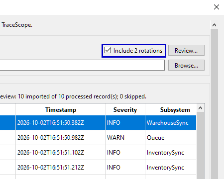

    Select **Review...** to inspect the proposed family before including it.

    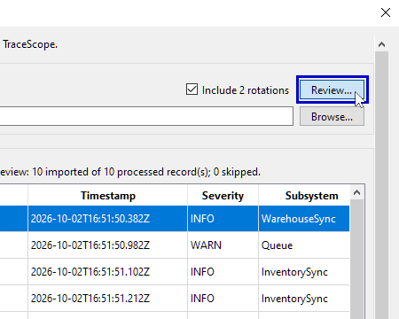
3. In **Rotated Source Files**, check **Naming scheme**
    
    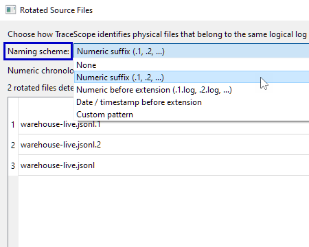
    
    and, where applicable, **Numeric chronology**.
    
    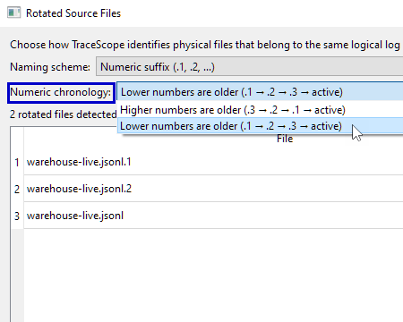
    
    Available schemes include numeric suffixes, numeric names before the extension, date/timestamp-based names, and configurable custom patterns.
4. Review the listed physical files and their roles. Check that the files really belong to the same logical source and that their order represents the source's chronology. For a custom scheme, configure the regular expression and ordering options as needed.

    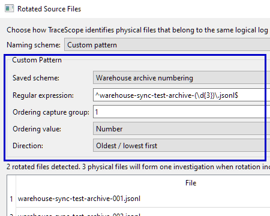
5. Enable **Include rotated source files**
    
    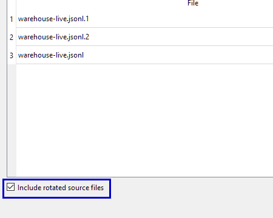
    
    and select **Use This Source Family**.
    
    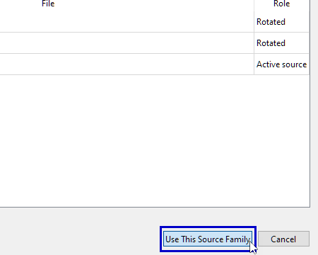

    Back in Import Configuration, verify that rotations are included and inspect the family preview before selecting **Import**.

A conventional sequence might be `service.log.3`, `service.log.2`, `service.log.1`, followed by the active `service.log`. Other producers number or timestamp rotations differently, so review the chronology rather than assuming it.

TraceScope keeps each physical file identifiable while investigating the combined logical source. The rotated files are imported in the configured chronological order, from oldest to newest, with the active file last. A rotated file is not the same concept as a *source generation*, which describes truncation or same-path replacement during live following.

If no rotations are detected, **Review...** can still be used to configure a different naming rule for a valid selected source. The inclusion checkbox is disabled when the current rule finds no eligible rotated files.

The family configuration concerns which files to **import**. It does not, by itself, start continuous following. See [Live Following](live-following.md) for actively growing sources and source-continuity behavior.

## 7. Import large files

A full import runs outside the main UI thread. For importers that report measurable progress, TraceScope shows percentage and processed-record progress; operations without such measurements can display indeterminate progress. Use **Cancel** in the import-progress dialog if you do not want to finish the operation.

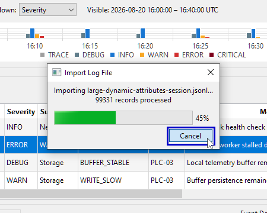

Cancelling an import does not create a partially imported investigation session in your workspace. If you cancel a reload of an existing investigation session, its previously loaded records remain available.

There is no fixed maximum file-size guarantee. Open investigations retain normalized records and related data in memory, and requirements depend on the source's structure and your machine. Start with representative files when evaluating your own workload. See [Performance Notes](performance.md) for measured scenarios and their limits.

If importing a large structured document, remember that **Refresh Preview** is separate from the full **Import** operation: you do not need to produce a preview of the entire file before importing it.

## Troubleshooting

| Situation | What to check |
| --- | --- |
| No likely-format suggestion | Select the importer manually or load a matching profile. Generic `.log` and `.txt` files can have many unrelated structures. See [Import a log file](#1-import-a-log-file) for more information. |
| Correct format, but empty or incorrect mapped columns | Compare a preview row with **Selected Raw Source**. Correct the canonical paths, custom-field mappings, or structured-document **Record path**. See [Configure an import profile](#3-configure-an-import-profile) and [Verify the preview and validation](#5-verify-the-preview-and-validation) for related information. |
| The profile reports an error | Correct the issue shown under **Validation**. A valid source file cannot compensate for an invalid profile. See [Verify the preview and validation](#5-verify-the-preview-and-validation) for more information. |
| Severities are missing or unexpectedly blank | Check **Severity** mapping and **Severity Aliases** against the source's actual values. See [Interpret nonstandard severity values](#interpret-nonstandard-severity-values) for more information. |
| Timestamps are missing or unexpectedly blank | Check **Timestamp** mapping and **Timestamp Rules** against representative source values. See [Parse timestamps](#parse-timestamps) for more information. |
| A custom text source skips records | Review the **Regex pattern** and confirm it matches representative lines. See [Import text using a regular expression](#import-text-using-a-regular-expression) for more information. |
| Large structured JSON/XML does not preview automatically | Choose **Refresh Preview**. Automatic preview is intentionally disabled for these files above 16 MiB. See [Large structured documents have an explicit preview action](#large-structured-documents-have-an-explicit-preview-action) for more information. |
| The profile or preview pane seems too narrow | Resize the divider to redistribute space. Use the compact **Profile & Mappings** / **Source Preview** tabs, resize the Import Configuration window, or adjust Interface Scale if the available screen width is insufficient. See [Find your way around Import Configuration](#2-find-your-way-around-import-configuration). |
| Expected rotated files are absent | Confirm that you selected the active file, then use **Review...** to check the naming scheme, file list, and chronology. See [Import a rotated source family](#6-import-a-rotated-source-family) for more information. |
| The preview looks right, but some later records are missing | Remember that preview is limited. Examine the complete source's consistency and any available import diagnostics; do not assume the first 50 processed records represent the entire file. See [Verify the preview and validation](#5-verify-the-preview-and-validation) and [Import large files](#7-import-large-files) for related information. |
| The import opens an investigation with no events | Check the importer, paths, record structure, and source content. Try the matching sample profile for a known working example before changing several settings at once. See [Import a log file](#1-import-a-log-file) and [Configure an import profile](#3-configure-an-import-profile) for related information. |

## Where to go next

Once your source is imported, the next task is investigating it: filtering records, following event relationships, exploring the timeline, and interpreting deterministic analytics. Those operations belong in the [Investigating Logs](investigating-logs.md) guide.

For format-specific requirements and limitations, see [Supported Formats](supported-formats.md). For the saved profile schema, source-path rules, and configuration details, see [Import Profiles](import-profiles.md). This guide focuses on the import workflow rather than duplicating those references.
