# Investigating Logs with TraceScope

TraceScope helps you move from a large set of imported log records to the smaller set relevant to a question. Its Event Table, filters, timeline, Issue Summary, and Analytics views work together: you can narrow the records, inspect individual events, and follow patterns without changing the original log file.

This guide continues the fictional **Order Fulfillment Incident** used in [Getting Started](getting-started.md). It focuses on investigating an existing session. For help importing an unfamiliar source or configuring its fields, see [Importing Logs](importing-logs.md).

**Having trouble investigating?** [Jump straight to Troubleshooting](#troubleshooting).

**In this guide, you will:**

1. [Understand the Event Table](#1-open-an-investigation-and-get-oriented) and [how investigation filters interact](#2-understand-what-filtering-changes).
2. Use [search and categorical filters](#4-search-for-text-and-filter-by-event-code-or-entity), [time ranges](#7-focus-on-a-time-window), and [source-specific attributes](#5-filter-using-source-specific-custom-attributes).
3. [Navigate between relevant records](#6-follow-records-using-navigation-and-sorting) without losing track of their original identity.
4. Use the [timeline](#8-explore-the-event-timeline), [Issue Summary](#9-use-issue-summary-as-another-entry-point), and [Analytics views](#10-explore-frequencies-and-detected-bursts) to move between an overview and individual evidence.
5. [Save useful filter configurations](#11-save-a-reusable-filter-preset) for later.

This is an investigative workflow, not an automated diagnosis. A warning, an unusual frequency, or a detected burst is a reason to examine evidence—not proof of an incident's cause.

## 1. Open an investigation and get oriented

If you already completed Getting Started and still have the sample open, you can continue with that investigation. Otherwise, use **File > Open Log File...**, select [`samples/order-fulfillment-incident.jsonl`](../samples/order-fulfillment-incident.jsonl), and load its matching [`samples/profiles/order-fulfillment-incident-profile.json`](../samples/profiles/order-fulfillment-incident-profile.json) before selecting **Import**. If you saved your earlier work, you can instead use **File > Open Workspace...** to resume it.

For a predictable starting point, select **Reset Filters** before following the exercises below. That clears the active filtering criteria; it does not delete imported records, notes, or findings.

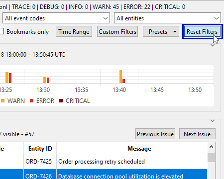

The main investigation areas are:

- **Telemetry Events:** The Event Table displays imported records using canonical and custom fields supplied by the import profile. Select a record *row* here to inspect it. Values participating in active categorical filters are bold within the table.

    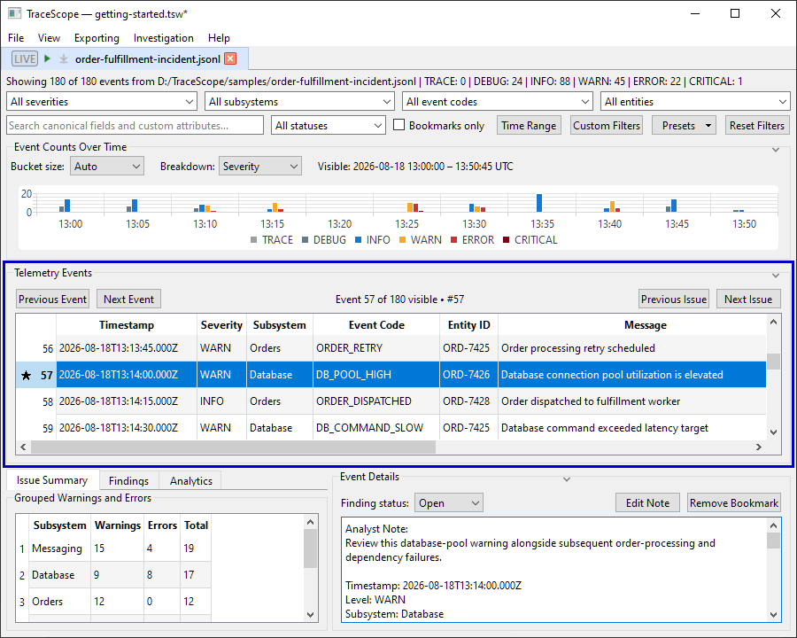

- **Event Details:** Displays the selected row's mapped values and **Custom Attributes** before **Source / Provenance**, with available original source context. A saved **Analyst Note** appears at the very top of this existing details area. The panel also contains bookmarking, note-editing, and finding-status controls.

    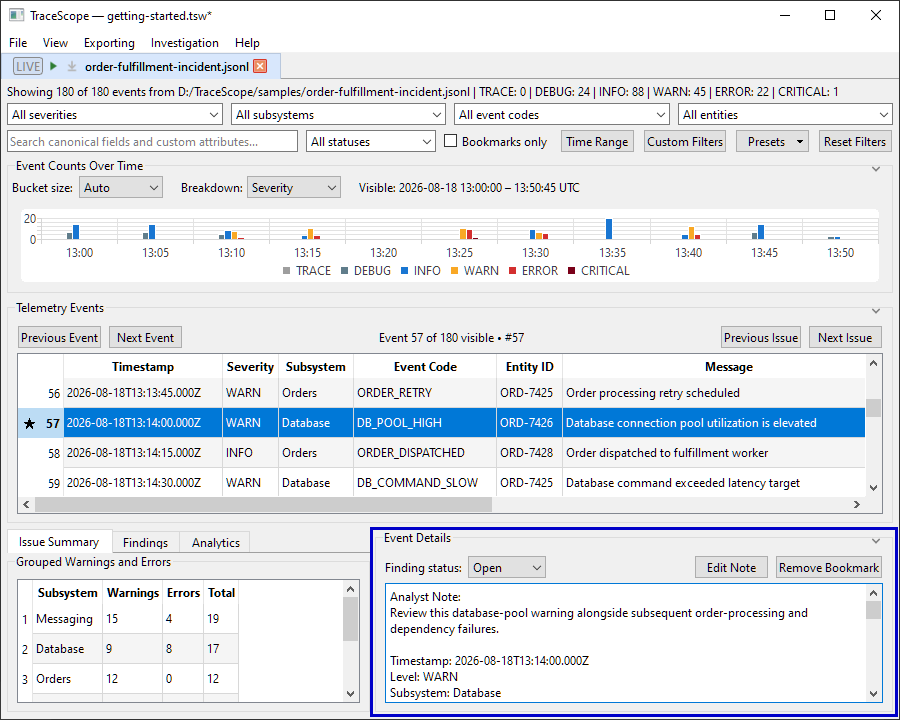

- **Filters and search:** Control which records appear in the Event Table.

    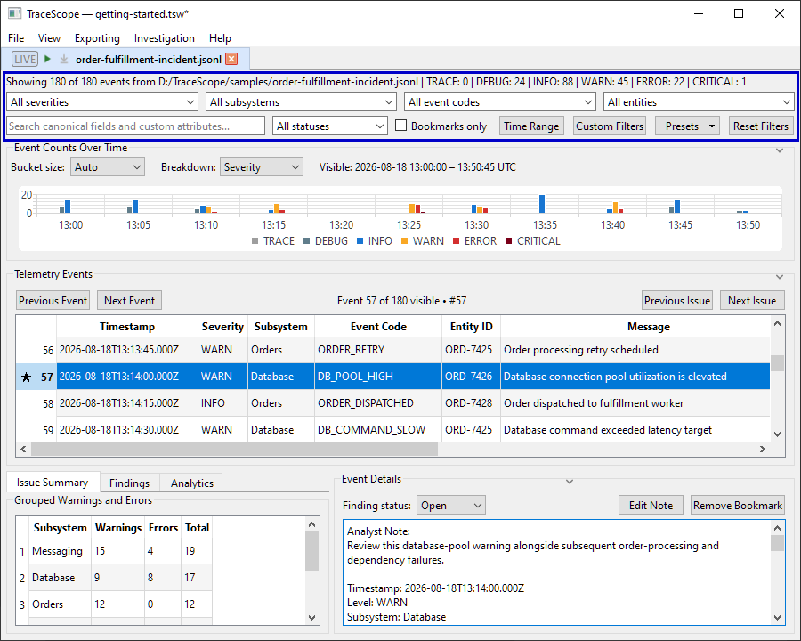

- **Event Counts Over Time:** The timeline groups events into time buckets and supports drilling down into a particular interval.

    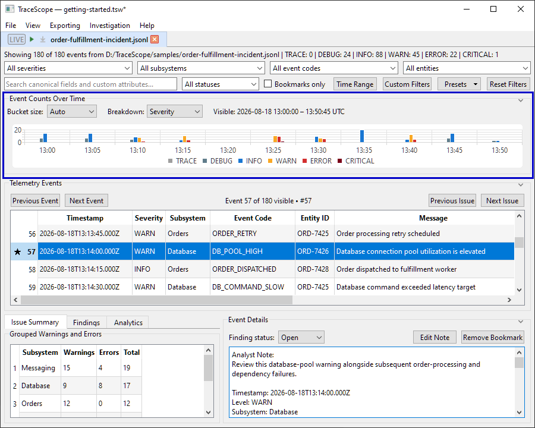

- **Issue Summary, Findings, and Analytics:** Tabs in the lower investigation area. Issue Summary groups elevated-severity events matching source-data filters, Findings organizes explicitly classified records, and Analytics explores frequencies and bursts.

    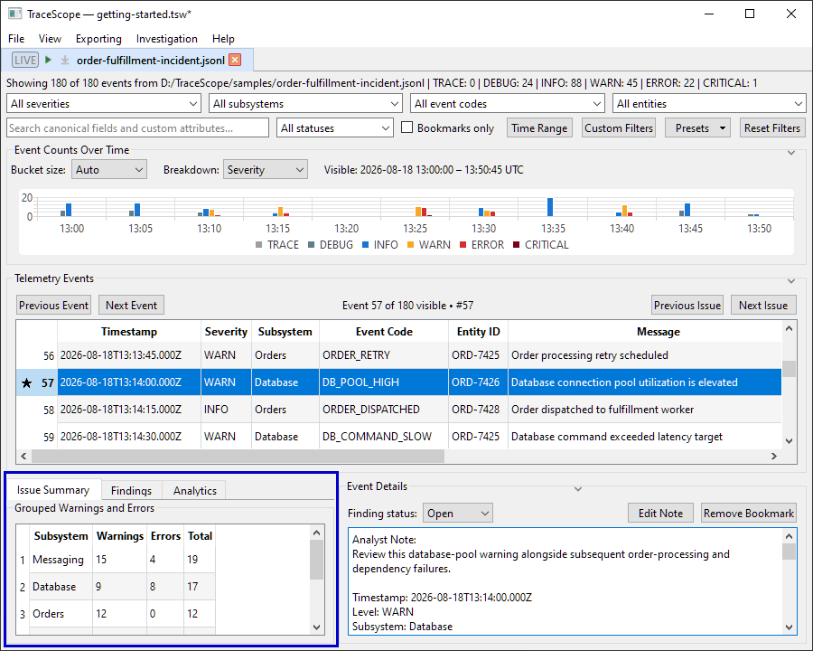

**Your layout may differ.** Window dimensions, monitor resolution, operating-system display scaling, and **View > Interface Scale** determine how much can fit at once. TraceScope may automatically collapse the timeline, the Event Table, or the lower investigation area on a constrained display. Use the chevrons at the right of those section headings to expand or collapse them; enlarging the window or selecting a smaller Interface Scale can create more room. Expanding one section when space is limited may collapse another. You do not need every area expanded simultaneously to follow this guide.

## 2. Understand what filtering changes

A TraceScope investigation retains the imported records while its filters determine which of them are **visible**. Changing a filter does not edit the original file or discard the imported evidence.

The filter controls available in a session depend on its data. For example, a file without usable timestamps cannot offer meaningful time filtering, and a file without event codes will not display an event-code filter. The sample used here includes these fields, so it is suitable for exploring most controls.

Filters work together to narrow the results. You can select multiple values *within* a categorical filter—for example, `WARN` **or** `ERROR`—and combine that selection with another criterion, such as the `Database` subsystem. An additional text search or time window narrows the result further. If several filters leave you with no visible rows, clear one or use **Reset Filters** rather than assuming your records have disappeared.

The **visible-record count** changes as you narrow the Event Table. The Issue Summary, timeline, and Analytics views also respond to filters on source data—such as severity, subsystem, event code, entity, time, custom attributes, and search—but intentionally **ignore review-only filters** such as **Bookmarks only** and **Finding status**. Those two controls narrow the Event Table without redefining the population used by deterministic analysis. Keep this distinction in mind when interpreting counts and patterns.

## 3. Isolate elevated events and inspect a record

Let's begin with the period of database trouble in the order-processing sample.

1. Open the severity control, initially labeled **All severities**, and select `WARN` and `ERROR`.

    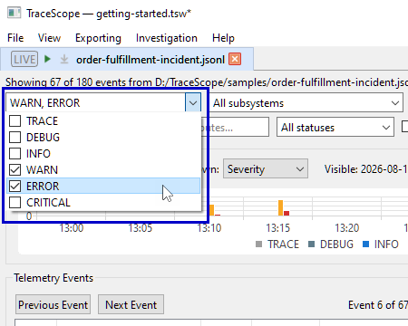

2. Open the subsystem control, initially labeled **All subsystems**, and select `Database`.

    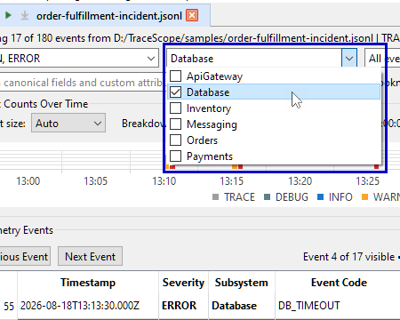

3. In the **Telemetry Events** table, find a `DB_POOL_HIGH` warning and select its **row**.

    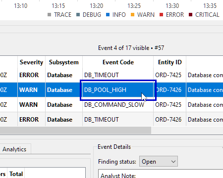

4. Read the associated **Event Details**. In addition to the message, check its timestamp, source location, and any available custom attributes such as database name, connection-pool utilization, host, or queue depth.

    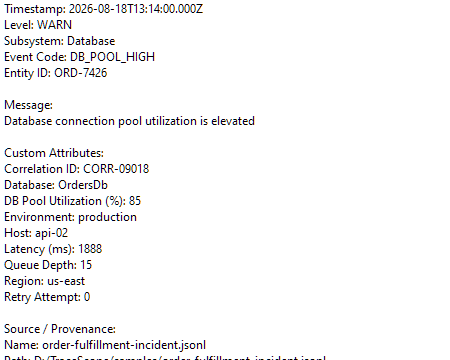

5. Notice the **bold** severity and subsystem values in the Event Table: they indicate values that currently participate in an active filter.

    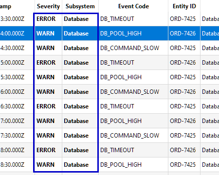

You have combined two categorical criteria to focus on one subsystem's warning and error activity. The records from other subsystems are still in the investigation; they are just outside this view.

To compare the database events with surrounding activity, clear the subsystem selection while keeping `WARN` and `ERROR` selected. You will now see elevated events from other subsystems as well. This is a useful habit: narrow to inspect a suspected pattern, then widen the context before interpreting it.

**Tip:** You can also right-click a filterable **cell in the Event Table** and select **Filter by This Value**.

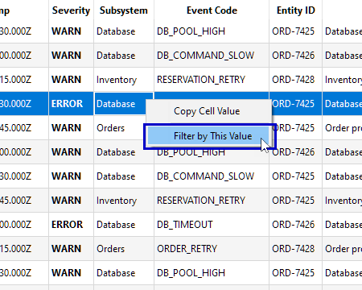

The context menu offers **Remove This Filter** when that exact value is already selected. This works for populated severity, subsystem, event-code, entity, and custom-attribute cells; the message column is not an exact-value filter. The Event Table highlights active categorical filter values in bold.

## 4. Search for text and filter by event code or entity

Categorical filters select known values from your imported data. Text search is useful when you know only part of a message, a source-specific identifier, or another recorded value.

1. Select **Reset Filters**.

    

2. In the search field labeled **Search canonical fields and custom attributes...**, enter `timeout`.

    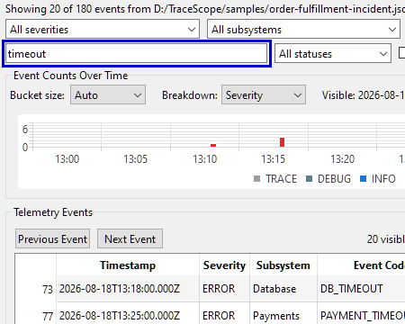

3. Examine the Event Table. Search is case-insensitive and looks for the supplied text in the preserved source representation and available mapped fields; it is **not** a regular-expression editor.
4. Clear the search text to restore the previous unsearched view.
5. Open **All event codes** and select `DB_TIMEOUT` to isolate that particular event code. Select one of the rows and inspect its details.

    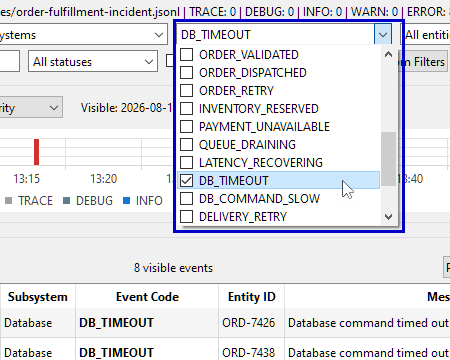

When a source provides an entity ID, **All entities** similarly lets you investigate records associated with a specific entity. The sample includes order and other source identifiers; the available options reflect the values actually imported.

For an exact-value shortcut, right-click a populated **Event Code** or **Entity ID** cell in the Event Table and select **Filter by This Value**. This can save you a trip to the filter control when you notice a relevant value while reading a record.

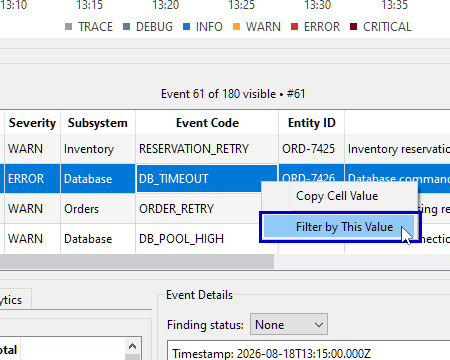

**Search versus exact filters:** Search is flexible and can find partial text. Event-code, entity, subsystem, and custom-field filters select exact recorded values. Which one to use depends on whether you are exploring broadly or following a known identifier.

## 5. Filter using source-specific custom attributes

Not every useful source field fits a standard category. The supplied profile retains additional attributes—including host, region, correlation ID, latency, and queue depth—so you can use them alongside standard investigation fields.

1. Select **Reset Filters**.

    

2. Choose **Custom Filters** to open **Custom Field Filters**.

    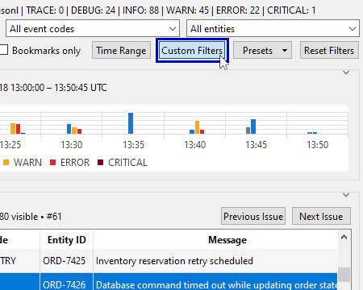

3. Choose an available field, such as **Host**, and enter an exact value observed in the Event Table or Event Details, such as `api-01`.

    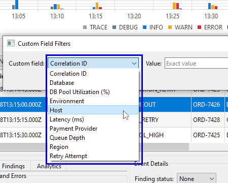

4. Select **Add**, then return to the Event Table to inspect the narrower selection.

    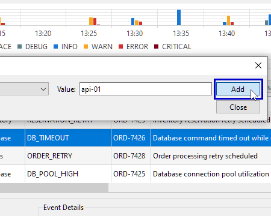

5. Open **Custom Filters** again to review or remove the active custom-field criterion. The button indicates how many custom criteria are active.

    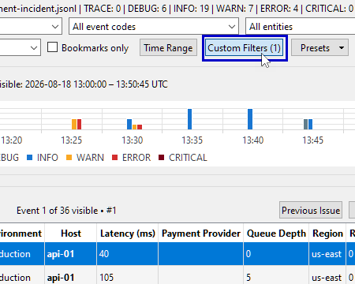

Alternatively, right-click a populated custom-field cell in the Event Table and choose **Filter by This Value**.

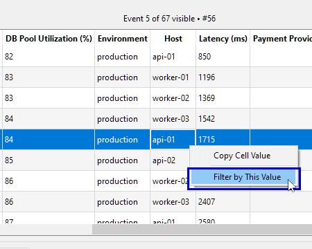

A custom-field filter is an **exact-value** criterion, not a substring search. If a field or value is absent from some records, those records will not match a filter requiring that field and value. A different log format or import profile may expose different custom fields; refer to [Importing Logs](importing-logs.md#keep-source-specific-information-with-custom-fields) if an expected attribute is missing entirely.

## 6. Follow records using navigation and sorting

When you have isolated a set of interesting events, the Event Table's navigation controls make it easier to move through them.

1. Select **Reset Filters**,

    

    then choose `WARN` and `ERROR` again if you want to focus on elevated events.

    
2. Select a row in **Telemetry Events**.
3. Use **Previous Event** and **Next Event** to move through adjacent **visible** records.

    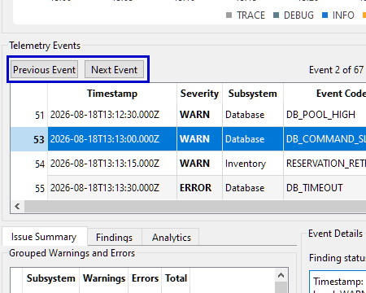
4. Use **Previous Issue** and **Next Issue** to jump between **visible** `WARN`, `ERROR`, or `CRITICAL` records. These controls are particularly useful when the current view also contains routine messages.

    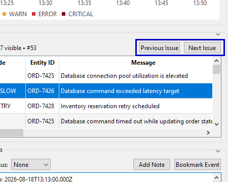
5. Select a different column heading to change the Event Table's sort order, then observe how navigation follows the displayed order.

    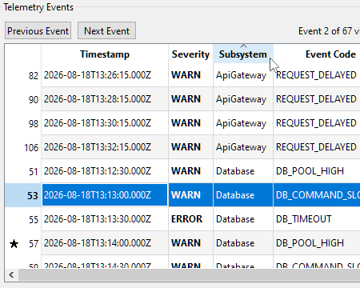

The number shown in the Event Table's left-hand gutter identifies the event's position in the underlying imported investigation. Filtering or sorting does **not** renumber that event. A bookmarked event receives a **star** beside its number to indicate its bookmarked status.

**Context matters:** Navigation follows the *currently visible, sorted* rows. If you want to inspect what happened immediately before or after a selected event in the broader source, clear overly restrictive filters and use an appropriate chronological sort. Adjacent rows in a filtered list are not necessarily consecutive events in the original source.

The **Event Details** panel follows your selected Event Table record. Its **Custom Attributes** appear before the **Source / Provenance** block; if the record has a saved note, you can read it at the top without opening the note editor.

## 7. Focus on a time window

When your log has valid mapped timestamps, TraceScope lets you narrow an investigation to a particular interval.

1. Select **Reset Filters**

    

    and choose **Time Range**.

    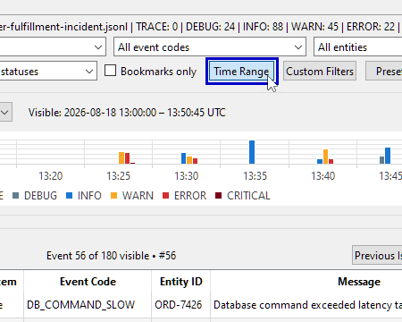
2. In **Time Range Filter**, enable **From**, **To**, or both, and set the boundaries you want to inspect. The dialog labels its controls **UTC**.

    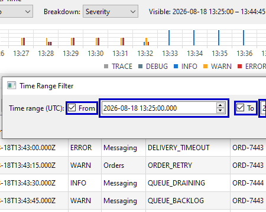
3. Close the dialog and observe the updated Event Table and summary. The **Time Range** button reflects the active bounds.

    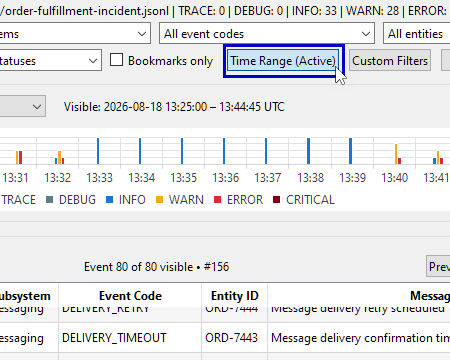
4. To return to the full time span, reopen **Time Range** and disable the active boundaries, or use **Reset Filters**.

    

The time boundaries are **inclusive**. Records without usable timestamps cannot match an active time-range filter. Be sure you understand the source's time zone and the import profile's timestamp rules before drawing conclusions about the sequence of events.

You can also right-click a valid **Timestamp** cell in the Event Table and choose **Filter From This Timestamp** or **Filter Through This Timestamp**.

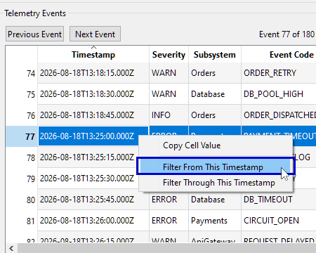

If you choose a boundary that is already active on that timestamp, the menu offers its removal instead.

**Comparing a period between investigations:** These same active From/To boundaries can optionally be captured *independently* for Baseline and Comparison when you create a new session comparison. Only the selected time boundaries apply to its scoped record population; unrelated Event Table filters do not. See [Comparing Sessions](comparing-sessions.md#optionally-compare-selected-time-ranges) for that separate workflow.

## 8. Explore the event timeline

**Event Counts Over Time** shows the distribution of records matching your source-data filters (regardless of any review-only bookmark or finding-status filter). It is often a faster starting point for locating a concentrated period of activity than scanning the entire Event Table.

1. Select **Reset Filters** 

    

    and expand **Event Counts Over Time** if it is collapsed.
2. Examine the chart for changes across the sample's recorded interval. The sample includes routine activity followed by database and other operational problems, making it suitable for exploring shifts in activity.
3. Use **Bucket size**. **Auto** chooses an interval suited to the available chart space and time span; choosing a specific interval gives you a more detailed or broader view.

    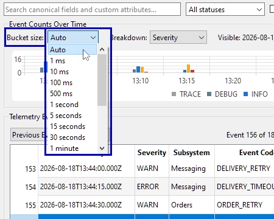

    A short interval is not automatically more informative, particularly when records are sparse.
4. Where available, use **Breakdown** to switch between **Severity** and **Subsystem**.

    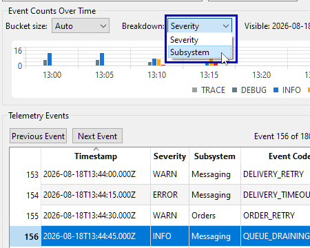

    When viewing subsystems, **Show: Top 5 / Top 10** controls how many subsystem series are displayed. The **Show** control changes the displayed series limit, not the underlying record population.

    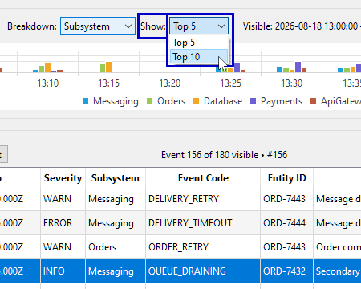
5. If the selected bucket size produces more buckets than can be shown comfortably, use the timeline's horizontal scroll bar and **Visible** range label to navigate without compressing every bucket into the viewport.

    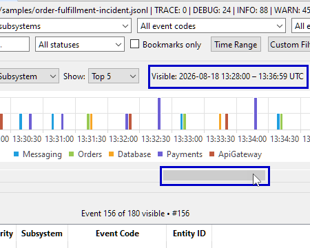

6. **Double-click a bar** corresponding to an interesting interval. TraceScope applies the selected bucket's time span as a filter.

    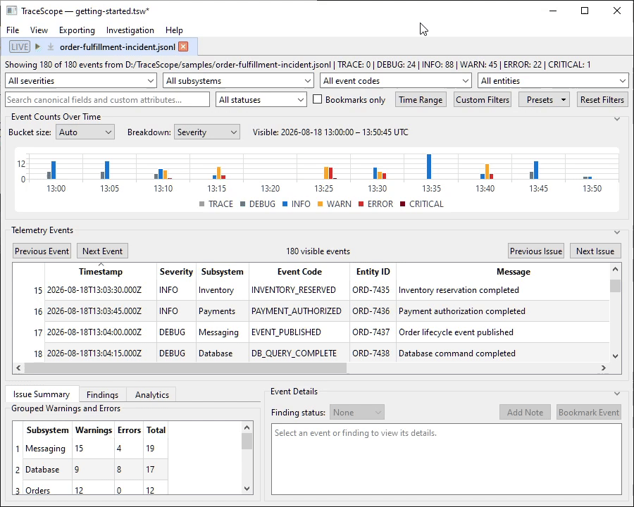

    When you double-click a severity or subsystem series, the drill-down also narrows to that series.

Look back at the filter controls after a timeline drill-down. The timeline is not a separate selection system: it configures the same investigation filters used by the Event Table and other views. Drilling down narrows the current investigation; it does not silently broaden filters you had already applied.

If a time-based chart is unavailable or unhelpful for your own log, confirm that the import profile maps timestamps correctly. A timeline is only as meaningful as its source timestamps and the interval you choose.

## 9. Use Issue Summary as another entry point

The lower investigation area's **Issue Summary** tab groups `WARN`, `ERROR`, and `CRITICAL` events matching the source-data filters by subsystem. It is a descriptive count of the records matching your filters, not a root-cause ranking.

1. Select **Reset Filters**,

    

    expand the lower investigation area if necessary, and open **Issue Summary**.
2. Compare the **Warnings**, **Errors**, and **Total** columns across the listed subsystems.

    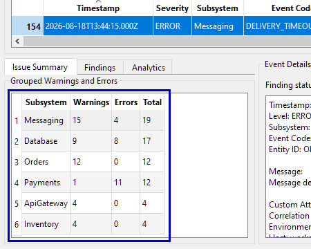
3. **Double-click** a populated warning or error count for a subsystem. TraceScope updates the investigation filters to show the corresponding issue category for that subsystem.

    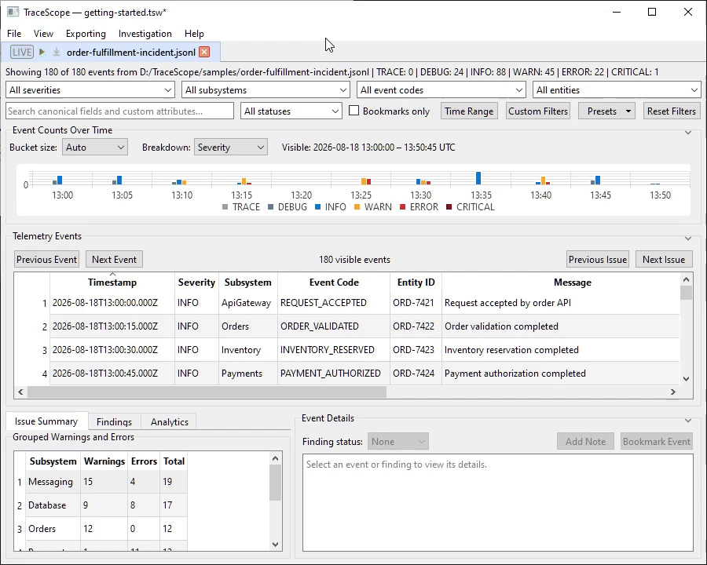
4. Inspect the matching rows in the Event Table. To consider a broader explanation, reset or widen your filters and compare other subsystems and nearby timestamps.

The **Errors** drill-down includes `ERROR` and `CRITICAL` events; the **Total** represents the subsystem's elevated-severity records. An entry without a subsystem may appear in the summary, but it cannot be used for an exact subsystem drill-down.

Issue Summary is available when the investigation contains usable severity **and** subsystem data. If your own file does not supply these fields, the relevant tab or drill-down may not appear. This does not prevent you from searching or inspecting records using other available dimensions.

## 10. Explore frequencies and detected bursts

The lower **Analytics** tab provides additional, deterministic views over records matching the source-data filters. It has two areas: **Overview** and **Bursts**.

### Overview: repeated codes and entities

1. Select **Reset Filters**

    

    and open **Analytics > Overview**.
2. Review **Event Code Frequencies** to see repeated event codes, and **Top Entities** to see frequently occurring entity IDs. 

    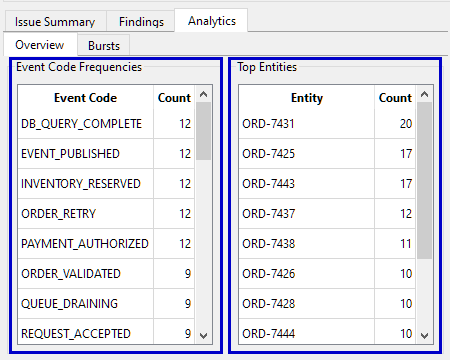

    These sections appear only when the corresponding data is available in the investigation.
3. Double-click an event code or entity to filter the investigation to that value.

    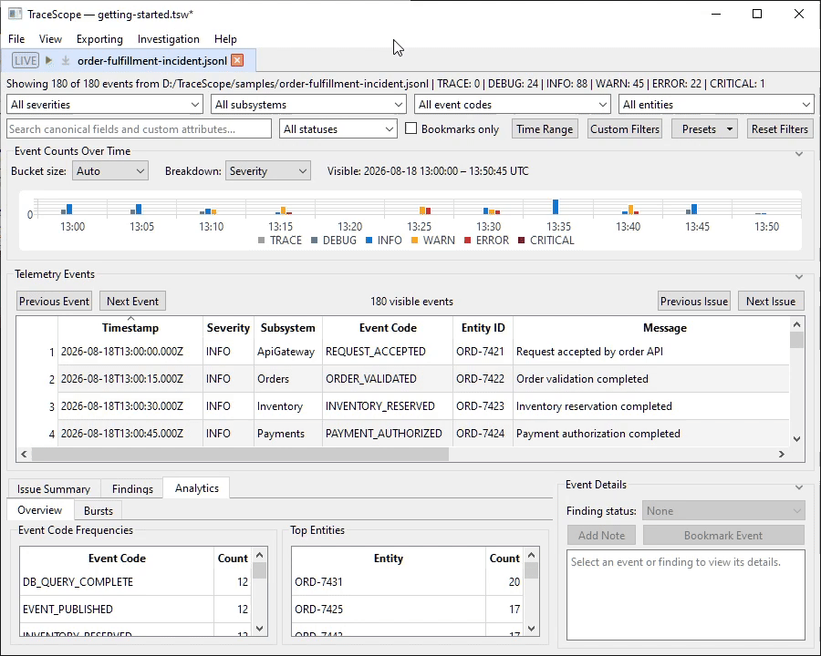

    Inspect the resulting Event Table rows and, when useful, their surrounding records.

A high frequency is an observation about the available records, not automatically a fault. Routine health checks and expected retries can also be frequent. Narrowing or widening your filters changes which records are included in these counts.

### Bursts: concentrated elevated activity

1. Select **Reset Filters**,

    

    then open **Analytics > Bursts**.
2. Review **Detected Bursts**. If a burst is listed, **select** it to read its **Burst Explanation**, including the time span and elevated-event counts.

    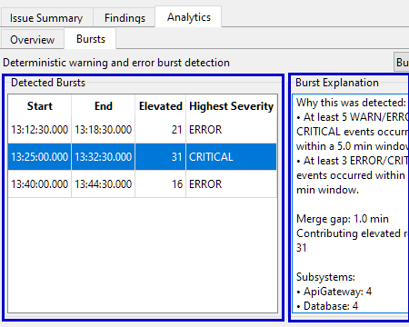
3. Open **Burst Settings...** to identify the current timing mode.

    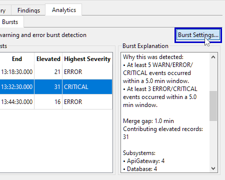

    **Auto** derives its timing window and merge gap from the cadence of the records being analyzed; **Manual** uses the timing values you specify.

    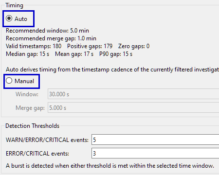

    You can leave the default automatic mode selected for this exercise.
4. Double-click a burst to filter the investigation to its contributing elevated events. 

    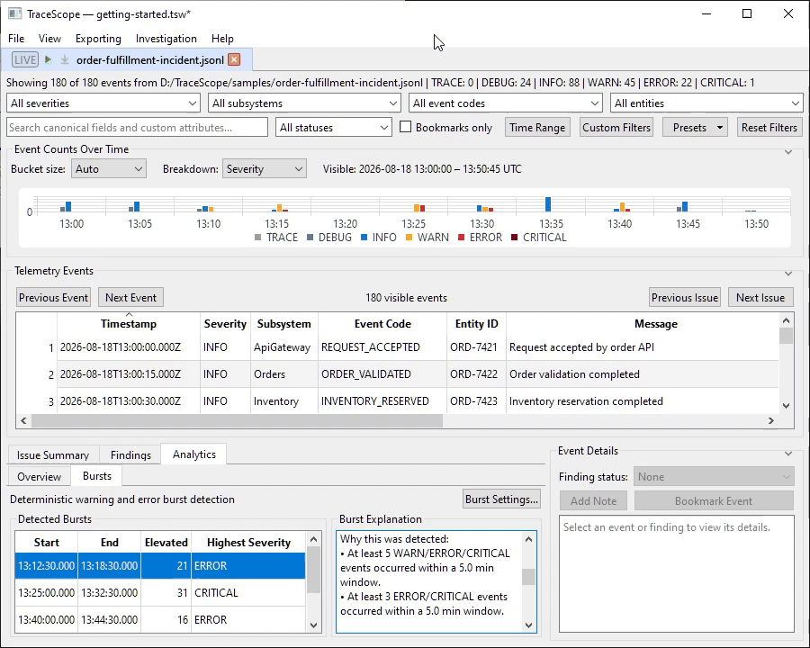

    Inspect those records in the Event Table and Event Details, then return to **Analytics > Bursts** and observe the updated results.
5. Select **Reset Filters** to restore the broader investigation and compare its detected bursts with the narrower view.

    

    If you need to examine a specific timescale, return to **Burst Settings...** and consider manual timing values.

**Why did the burst list change after drilling down?** A burst drill-down applies investigation filters; it does not freeze the original burst analysis. TraceScope runs burst detection again against the *newly filtered records*. Under **Manual**, your chosen timing window and merge gap remain fixed, so the selected burst may still appear as a similar interval, although changing the input records can still change the result. Under **Auto**, TraceScope also recalculates the source cadence and derives new timing values from the narrower dataset. As a result, one burst found in the full investigation may be represented by several smaller bursts after you drill into it. Those new results describe a different analysis population; they do not indicate that the underlying log has changed. Reset the filters to return to the broader view.

Burst detection is deterministic and depends on usable timestamps and severity values. It identifies concentrations of warning/error-class activity under its current settings; it does not determine causation, and an empty burst list does not prove the absence of a problem. The current filters and timing configuration affect the result, so check both when comparing investigations.

## 11. Save a reusable filter preset

When you return to the same kinds of questions, a preset saves time and reduces the risk of accidentally omitting a criterion.

1. Select **Reset Filters**.

    

2. Choose a useful combination, such as `WARN` and `ERROR` with the `Database` subsystem.
3. Open **Presets > Save Current Filters...** and give the preset a descriptive name, such as `Database elevated events`.

    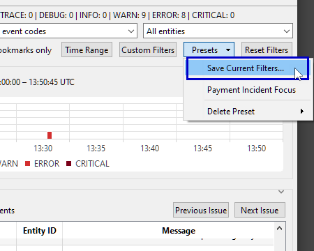
4. Change or reset the filters. Open **Presets** again and select your saved preset to restore that configuration.

    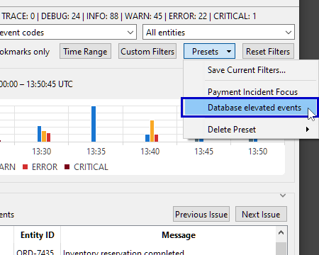

Presets can retain more than categorical selections: they include search text, available time bounds, custom-field criteria, finding-status selections, and the bookmarks-only setting. The **Presets** menu also supports deleting saved presets.

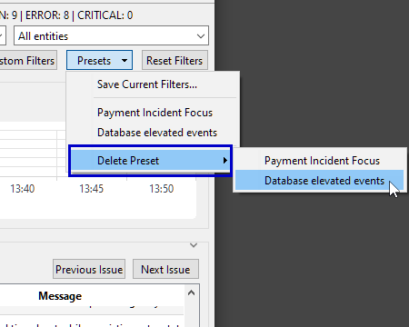

**Check presets after applying them to a different investigation.** Available fields and recorded values vary by source. A saved exact event code, subsystem, timestamp window, or custom-field criterion may make sense for one file but leave no visible matches in another. A preset preserves a useful question; it does not guarantee that a different source can answer it.

For a specific investigation you want to resume later, **File > Save Workspace** also preserves the broader investigation context, including its current filter state. A workspace is not a replacement for a reusable preset, and a preset is not a replacement for saving your investigation.

## Troubleshooting

| Situation | What to check |
| --- | --- |
| The Event Table is empty after selecting filters | Inspect the combined criteria. Reset filters and add them one at a time; a matching value in one category does not guarantee a record matches every active category. See [Understand what filtering changes](#2-understand-what-filtering-changes) for more information. |
| The timeline, Issue Summary, or Analytics counts differ from the Event Table | Check the active filters. The analysis views respond to source-data filters, but ignore review-only **Bookmarks only** and **Finding status** selections. See [Understand what filtering changes](#2-understand-what-filtering-changes) for more information. |
| An expected filter control or analytical tab is missing | Check whether the imported source has the necessary canonical fields. Use Import Configuration and the source preview to review mappings. See [Open an investigation and get oriented](#1-open-an-investigation-and-get-oriented) and [Importing Logs](importing-logs.md#3-configure-an-import-profile) for related information. |
| A time-range filter hides records you expected to see | Check UTC boundaries, imported timestamp validity, and the source's time-zone conventions. See [Focus on a time window](#7-focus-on-a-time-window) for more information. |
| A custom-field filter finds no results | Confirm the exact field name and exact recorded value in Event Details; not every record necessarily contains that field. See [Filter using source-specific custom attributes](#5-filter-using-source-specific-custom-attributes) for more information. |
| Next Event seems to skip source lines | Navigation follows visible records and the current sort order. Remove restrictive filters and check chronological ordering to inspect nearby evidence. See [Follow records using navigation and sorting](#6-follow-records-using-navigation-and-sorting) for more information. |
| The timeline becomes hard to read across a large span | Try **Auto** or a wider **Bucket size**, use the timeline scrollbar, and choose a breakdown appropriate for the question. See [Explore the event timeline](#8-explore-the-event-timeline) for more information. |
| The Detected Bursts list changes after drilling into a burst | Detection runs again on the filtered dataset. With **Auto** timing, the recalculated cadence can split an originally broader burst into smaller ones; **Manual** keeps the timing settings fixed but still analyzes only the filtered records. Use **Reset Filters** to return to the original scope. See [Explore frequencies and detected bursts](#10-explore-frequencies-and-detected-bursts) for more information. |
| No burst is detected | A burst requires supported timestamps and severity data. Check current filters and timing settings; absence of a detected burst is not an all-clear. See [Bursts: concentrated elevated activity](#bursts-concentrated-elevated-activity) for more information. |
| A section mentioned in this guide is collapsed or off-screen | Expand it using its chevron, resize the window, or use **View > Interface Scale**. A constrained layout may collapse another section when you expand one. See [Open an investigation and get oriented](#1-open-an-investigation-and-get-oriented) for more information. |

## Where to go next

Filtering and analysis help you identify evidence worth recording. The [Findings](findings.md) guide covers the complete workflow for bookmarking events, classifying findings, writing analyst notes, navigating the Findings list, and exporting findings without confusing a preliminary observation with a confirmed conclusion.

For a second perspective on an incident, the [Comparing Sessions](comparing-sessions.md) guide uses the fictional field-gateway baseline and degraded samples. If your source continues to grow while you investigate it, the [Live Following](live-following.md) guide explains the separate live-file workflow and its evidence-continuity rules.
