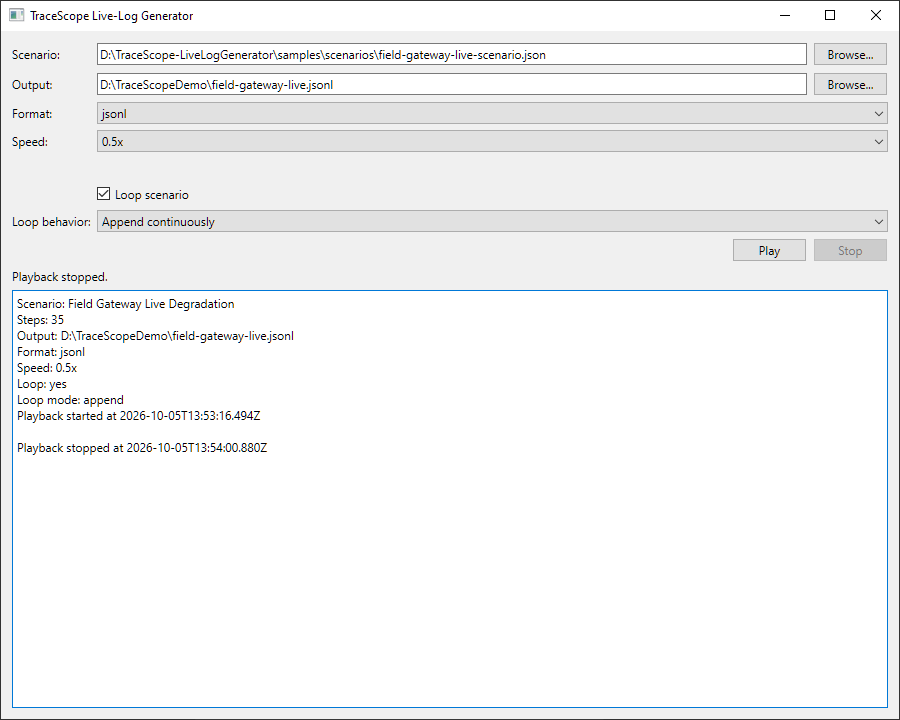

# TraceScope Live-Log Generator

The TraceScope Live-Log Generator is a standalone utility for producing deterministic log-file activity that can be observed by TraceScope under realistic live-follow conditions.

It behaves like an independent application writing logs to disk. TraceScope has no direct connection to the generator and receives no special testing hooks or injected records; it sees only the physical files the generator creates and modifies.

The utility includes:

- `TraceScopeLiveLogGenerator` — the command-line generator and authoritative playback implementation
- `TraceScopeLiveLogGeneratorLauncher` — a small Qt Widgets launcher for convenient manual playback
- deterministic scenario files under `samples/scenarios/`
- renderers for the source families used in TraceScope live-follow testing

The generator is intended for reproducible manual verification, demonstrations, and regression testing. It is not a load generator, fuzzing framework, monitoring service, or TraceScope runtime dependency.

## Find the information you need

| I want to... | Go to |
| --- | --- |
| Run a scenario without using the command line | [1. Graphical launcher](#1-graphical-launcher) |
| Run the generator directly | [2. Command-line usage](#2-command-line-usage) |
| Understand what a scenario contains | [3. Scenario model](#3-scenario-model) |
| Choose one of the bundled scenarios | [4. Bundled scenario library](#4-bundled-scenario-library) |
| Choose an output format | [5. Output formats and fidelity](#5-output-formats-and-fidelity) |
| Understand truncation, replacement, rotation, and structured streams | [6. File-lifecycle behavior](#6-file-lifecycle-behavior) |
| Create or modify a scenario | [7. Scenario authoring](#7-scenario-authoring) |
| Use the generator to test TraceScope | [8. Using the generator with TraceScope](#8-using-the-generator-with-tracescope) |
| Build or obtain the utility | [9. Building and distribution](#9-building-and-distribution) |
| Understand what the utility deliberately does not do | [10. Scope boundaries](#10-scope-boundaries) |

## 1. Graphical launcher

`TraceScopeLiveLogGeneratorLauncher` provides a thin graphical front end for the command-line generator.



Use it when manually exercising TraceScope and there is no need to construct command-line arguments directly.

The launcher exposes:

- scenario-file selection
- output-file selection
- output-format selection
- playback-speed selection
- optional looping
- append or restart behavior between loop iterations
- Play and Stop controls
- playback status
- captured standard output and error output from the generator process

The available playback-speed presets are:

- `0.5x`
- `1x`
- `2x`
- `4x`
- `10x`
- `25x`
- `50x`

The launcher starts `TraceScopeLiveLogGenerator` through `QProcess` and passes the selected settings as ordinary command-line arguments. The generator executable is expected to be in the same application directory as the launcher.

The launcher does **not** contain a second scenario interpreter or playback engine. Scenario loading, validation, format selection, file lifecycle operations, looping, and serialization all remain in the command-line generator.

While playback is active, the scenario, output, format, speed, and loop controls are disabled. Stop terminates the child generator process; if graceful termination does not complete promptly, the launcher ends it forcibly.

For careful interactive observation, `0.5x` or `1x` is usually easiest to follow. Higher speeds are useful for repeated regression checks or quickly producing a completed dataset.

## 2. Command-line usage

The command-line interface has three required options and three optional playback controls.

```text
TraceScopeLiveLogGenerator
    --scenario <path>
    --output <path>
    --format <format-id>
    [--speed <multiplier>]
    [--loop]
    [--loop-mode <append|restart>]
```

Example:

```text
TraceScopeLiveLogGenerator
    --scenario samples/scenarios/field-gateway-live-scenario.json
    --output live-test.jsonl
    --format jsonl
    --speed 4
```

### `--scenario`

Path to a versioned live-log scenario JSON file.

### `--output`

Path to the active physical log file written by the generator.

Lifecycle steps in the scenario may truncate, replace, or rotate this file during playback.

### `--format`

Selects the renderer used to serialize semantic records.

Supported format IDs are listed in [Output formats and fidelity](#5-output-formats-and-fidelity).

### `--speed`

Positive finite playback-speed multiplier.

The default is:

```text
1
```

Examples:

- `0.5` — half-speed playback
- `1` — scenario playback time
- `2` — twice as fast
- `10` — ten times as fast

Playback speed affects real delays such as `wait` steps and partial-write hold periods. It does **not** change the semantic timestamps represented by generated records.

### `--loop`

Replays the scenario continuously after each completed iteration.

Without `--loop`, playback completes once and exits.

### `--loop-mode`

Controls what happens to the physical output file between loop iterations.

Supported values are:

- `append` — continue writing into the same active physical source
- `restart` — recreate the active output file before the next iteration

The default is:

```text
append
```

`--loop-mode` does not alter explicit lifecycle steps inside a scenario. A scenario can still truncate, replace, or rotate its source regardless of the selected loop behavior.

Continuous append example:

```text
TraceScopeLiveLogGenerator
    --scenario samples/scenarios/checkout-api-payment-regression-live-scenario.json
    --output checkout.jsonl
    --format jsonl
    --speed 0.5
    --loop
```

Restart example:

```text
TraceScopeLiveLogGenerator
    --scenario samples/scenarios/checkout-api-payment-regression-live-scenario.json
    --output checkout.jsonl
    --format jsonl
    --speed 0.5
    --loop
    --loop-mode restart
```

In append mode, each iteration receives a new semantic scenario-start time while the same physical output remains active unless the scenario itself changes it.

## 3. Scenario model

The generator separates **what happened** from **how it is serialized** and **when bytes reach disk**.

Conceptually:

```text
deterministic semantic scenario
            ↓
      scenario player
  timing + file lifecycle
            ↓
      selected renderer
            ↓
    physical log file(s)
            ↓
     TraceScope observes
```

### Semantic records

A scenario record contains:

- `timestampOffsetMs`
- `severity`
- `subsystem`
- `eventCode`
- `entityId`
- `message`
- optional custom `attributes`

`timestampOffsetMs` is relative to the start of the scenario rather than an absolute date/time. At runtime, the renderer combines that offset with the scenario's actual start time.

The five canonical text fields remain part of the semantic scenario even when the selected output format cannot naturally represent all of them. Renderers decide which values can be expressed faithfully in their target format.

Custom attribute values may be:

- strings
- numbers
- booleans
- `null`

Nested objects and arrays are not supported as custom scenario-attribute values.

### Semantic time versus playback time

Semantic record time and playback time are separate.

For example, a scenario can represent several minutes of system activity while being played at `10x` speed. The resulting records still contain timestamps spanning the original semantic interval; only the real waits between physical writes are shortened.

This distinction makes it possible to accelerate manual testing without changing the incident being investigated.

### Scenario root

Scenarios use JSON schema version `1`.

A scenario contains:

```json
{
  "schemaVersion": 1,
  "name": "Field Gateway Live Degradation",
  "description": "Deterministic gateway degradation and recovery scenario.",
  "steps": []
}
```

The loader requires:

- `schemaVersion` to be the supported integer version
- `name` to be a non-empty string
- `description` to be a string
- `steps` to be a non-empty array

## Scenario step types

Five step types control playback.

### `record`

Serializes and writes one semantic record.

```json
{
  "type": "record",
  "record": {
    "timestampOffsetMs": 2000,
    "severity": "WARN",
    "subsystem": "Transport",
    "eventCode": "UPSTREAM_LATENCY",
    "entityId": "gateway-17",
    "message": "Upstream response latency exceeded expected range.",
    "attributes": {
      "latencyMs": 1840,
      "endpoint": "collector-a"
    }
  }
}
```

`timestampOffsetMs` must be a non-negative integer.

`severity`, `subsystem`, `eventCode`, `entityId`, and `message` are strings. They may map differently depending on the selected renderer.

#### Partial record writes

A `record` can be physically written in two parts.

```json
{
  "type": "record",
  "write": {
    "mode": "partial",
    "splitFraction": 0.55,
    "holdMs": 1000
  },
  "record": {
    "timestampOffsetMs": 2200,
    "severity": "ERROR",
    "subsystem": "Transport",
    "eventCode": "UPSTREAM_TIMEOUT",
    "entityId": "gateway-17",
    "message": "Upstream request timed out."
  }
}
```

The renderer first creates the complete serialized record. The player then writes the configured first fraction, waits, and writes the remainder.

`splitFraction` must be greater than `0` and less than `1`.

`holdMs` must be a non-negative integer and is scaled by the runtime playback-speed multiplier.

This behavior is used to verify that TraceScope does not admit incomplete trailing records or structured fragments prematurely.

### `wait`

Pauses physical playback before processing the next step.

```json
{
  "type": "wait",
  "durationMs": 3000
}
```

`durationMs` must be a non-negative integer and is affected by the runtime speed multiplier.

### `truncate`

Truncates the currently active output file in place and continues writing to the same path.

```json
{
  "type": "truncate"
}
```

If the selected format requires a header or outer-container prefix, the generator writes fresh initial content after truncation.

### `replace`

Closes and removes the current active file, then creates a new physical file at the same output path.

```json
{
  "type": "replace"
}
```

This is distinct from in-place truncation even though the user-visible path remains the same.

### `rotate`

Preserves the current active file under a numbered rotated filename and creates a fresh active file at the original path.

```json
{
  "type": "rotate"
}
```

For an output path such as:

```text
service.log
```

successive rotations produce:

```text
service.log.1
service.log.2
service.log.3
```

Existing files at the corresponding rotation destination are replaced.

Formats that require closing content are finalized before the old file is preserved.

There is no separate `burst` step. Bursts are represented explicitly by deterministic sequences of records with short waits between them.

## 4. Bundled scenario library

The repository includes five scenarios under `samples/scenarios/`.

Each has a specific role. They are intentionally readable and deterministic rather than large randomized datasets.

| Scenario | Primary use | Lifecycle emphasis |
| --- | --- | --- |
| `field-gateway-live-scenario.json` | General application-log live-follow investigation with rising latency, retries, timeout pressure, queue growth, and recovery | Ordinary growth, waits, partial writes, degradation burst, in-place truncation, recovery |
| `warehouse-sync-deployment-rotation-live-scenario.json` | Source-continuity testing around a rolling deployment and backlog catch-up | Same-path replacement, catch-up burst, partial write, multiple rotations, recovery |
| `checkout-api-healthy-baseline-live-scenario.json` | Healthy comparison baseline for checkout processing | Ordinary growth and realistic service-to-service timing |
| `checkout-api-payment-regression-live-scenario.json` | Regression side of the checkout comparison pair | Elevated latency, retries, warning/error burst, partial write, failure, recovery |
| `web-access-live-scenario.json` | Web-access live-follow testing | Health checks, page/API traffic, client errors, authorization failures, 503 burst, partial write, recovery |

### Field gateway

`field-gateway-live-scenario.json` is the main truncation scenario.

It begins with healthy telemetry activity, moves through upstream latency and retry pressure, performs an in-place truncation, and then continues with recovery records at the same active path.

It is useful for testing:

- live append
- partial records
- filtering
- severity and event-code analysis
- timeline updates
- same-path source-generation changes
- preserved evidence after truncation

### Warehouse synchronization

`warehouse-sync-deployment-rotation-live-scenario.json` is the main replacement-and-rotation scenario.

It models:

- same-path replacement during deployment
- backlog catch-up traffic
- a partial write
- multiple rotations
- continued writes to the active source
- return to steady state

Its rotations produce sequential numbered artifacts while the configured active path continues to receive new output.

### Checkout comparison pair

The two checkout scenarios describe related runs of the same fictional production system.

The healthy scenario provides a baseline.

The payment-regression scenario introduces provider latency, retries, timeout behavior, checkout failure, circuit-breaker activity, and recovery.

Together they provide deterministic material for exercising TraceScope's Baseline → Comparison workflow without comparing unrelated synthetic systems.

### Web access

`web-access-live-scenario.json` is designed for web-access formats.

Its semantic data is based on HTTP-oriented attributes that can be represented naturally in IIS W3C, Apache Common/Combined, and Nginx Combined output.

It does not rely on forcing application-specific severity, subsystem, or entity concepts into access-log formats that do not naturally carry them.

## 5. Output formats and fidelity

The generator supports these format identifiers:

| Format ID | Output family | TraceScope import path | Notes |
| --- | --- | --- | --- |
| `jsonl` | JSON Lines | JSON Lines importer | High semantic fidelity; line-oriented |
| `csv` | CSV | CSV importer | Fixed columns derived from the scenario; header regenerated for fresh files |
| `tsv` | TSV | TSV importer | Fixed columns derived from the scenario; header regenerated for fresh files |
| `logfmt` | key-value / logfmt | Key-value importer | High semantic fidelity; line-oriented |
| `regex-text` | generic text | Regex-text importer with matching profile | Scenario fields rendered into a deterministic text structure |
| `syslog-rfc5424` | Syslog RFC 5424 | Syslog importer | Structured operational representation with format-specific validation |
| `syslog-rfc3164` | Syslog RFC 3164 | Syslog importer | Reduced structured metadata compared with RFC 5424 |
| `iis-w3c` | IIS W3C | IIS W3C importer | HTTP/access-log oriented; header-based |
| `apache-common` | Apache Common | Regex-text preset | HTTP/access-log oriented |
| `apache-combined` | Apache Combined | Regex-text preset | HTTP/access-log oriented |
| `nginx-combined` | Nginx Combined | Regex-text preset | HTTP/access-log oriented |
| `structured-json` | Structured JSON | Structured JSON importer | Open repeated-record container during live playback |
| `structured-xml` | Structured XML | XML importer | Open repeated-record container during live playback |
| `windows-event-xml` | Windows Event XML | XML preset | Event-oriented structured XML representation |

### Scenario compatibility

Not every scenario is meaningful in every renderer.

The renderer factory validates the scenario against format-specific constraints before playback. Examples include:

- required HTTP attributes for access-log formats
- three-digit HTTP status values
- token/quoting restrictions needed for safe access-log output
- RFC 5424 APP-NAME, MSGID, and structured-data naming rules
- RFC 3164 tag restrictions
- whitespace restrictions in fields whose target syntax cannot represent it safely

If a scenario cannot be represented safely in the selected format, the generator returns an error rather than silently producing misleading output.

### Fidelity is format-dependent

The scenario describes one semantic incident, but output formats do not all contain the same concepts.

Application-oriented formats can preserve most or all of:

- timestamp
- severity
- subsystem
- event code
- entity ID
- message
- custom attributes

Operational formats intentionally expose different structures.

For example:

- access logs emphasize request, response, client, and timing fields
- RFC 3164 carries less structured metadata than RFC 5424
- Windows Event XML does not provide a universal application-domain equivalent for every semantic field

The generator preserves useful meaning that belongs naturally in the selected format rather than inventing fields solely to make formats look equivalent.

## 6. File-lifecycle behavior

The scenario player, rather than the renderer, owns physical file behavior.

Its responsibilities include:

- waits
- playback-speed scaling
- physical writes and flushing
- partial writes
- record separators
- truncation
- replacement
- rotation
- structured-file initialization/finalization
- looping

Renderers are responsible for serializing records and providing any format-specific initial, separator, or final content.

This separation means the same lifecycle step has consistent semantics across compatible output families.

### Line-oriented sources

For line-oriented formats, complete records become available through ordinary file growth.

A partial record remains physically incomplete until the second write occurs. TraceScope can therefore be tested against an actual trailing fragment rather than a special simulated state.

Header-based formats such as CSV, TSV, and IIS W3C regenerate their required initial content whenever truncation, replacement, rotation, or restart creates a fresh active file.

### Structured open-container sources

Structured JSON, Structured XML, and Windows Event XML can model a producer that keeps an outer document open while complete child records are appended.

Conceptually:

```text
outer container
    complete record
    complete record
    partially written record    ← not complete yet
EOF
```

During playback, the outer document may therefore be temporarily incomplete even though earlier child records are complete and usable.

Structured JSON uses an open repeated-record array.

Structured XML and Windows Event XML use repeated record elements within an open outer container.

A normal finite playback finalizes the document so the resulting source is independently valid.

### Lifecycle events for structured sources

The lifecycle operations intentionally differ:

- **truncate** discards the existing active contents and writes a fresh container prefix
- **replace** removes the existing physical file and creates a fresh container at the same path
- **rotate** finalizes the old structured document before preserving it, then initializes a fresh active container
- **normal completion** writes final container content
- **append looping** keeps the current source active across loop boundaries
- **restart looping** finalizes the completed iteration where required and recreates the source before the next iteration

Truncation and replacement deliberately do not repair the discarded old structured document first. They model abrupt source lifecycle changes.

Appending a second unrelated complete JSON or XML document after an already closed document is not the generator's structured live-source model.

## 7. Scenario authoring

Bundled scenarios are ordinary versioned JSON files and can be copied or modified for focused testing.

A useful scenario should remain:

- deterministic
- human-readable
- internally coherent
- small enough to inspect manually
- focused on a specific investigation or source-lifecycle question

Avoid randomizing failures, event codes, entities, or incident timing when repeatability matters.

### Minimal example

```json
{
  "schemaVersion": 1,
  "name": "Simple Service Degradation",
  "description": "Small deterministic degradation and recovery sequence.",
  "steps": [
    {
      "type": "record",
      "record": {
        "timestampOffsetMs": 0,
        "severity": "INFO",
        "subsystem": "Worker",
        "eventCode": "START",
        "entityId": "worker-1",
        "message": "Worker started.",
        "attributes": {
          "region": "east"
        }
      }
    },
    {
      "type": "wait",
      "durationMs": 1000
    },
    {
      "type": "record",
      "record": {
        "timestampOffsetMs": 1000,
        "severity": "ERROR",
        "subsystem": "Worker",
        "eventCode": "REQUEST_FAILED",
        "entityId": "worker-1",
        "message": "Upstream request failed.",
        "attributes": {
          "retryCount": 2
        }
      }
    }
  ]
}
```

### Authoring rules enforced by the loader

The loader rejects scenarios that violate the basic schema.

Important rules include:

- schema version must be `1`
- scenario name must not be empty
- at least one step is required
- step `type` must be recognized
- `timestampOffsetMs` must be a non-negative integer
- `wait.durationMs` must be a non-negative integer
- partial `splitFraction` must be greater than `0` and less than `1`
- partial `holdMs` must be a non-negative integer
- custom attributes must contain only scalar string, number, boolean, or null values

The selected renderer may impose additional format-specific validation beyond these scenario-schema rules.

### Prefer explicit records to synthetic algorithms

A scenario should describe the event sequence directly.

For example, represent a failure burst as several explicit record steps rather than asking the generator to invent a random burst of errors.

This keeps the expected output understandable before TraceScope is opened and makes repeated runs directly comparable.

## 8. Using the generator with TraceScope

The generator is most useful when treated exactly like an external application producing a log.

A typical workflow is:

1. Choose a scenario and compatible output format.
2. Choose a disposable output path.
3. Start generator playback.
4. Open or import the active output file in TraceScope using the matching format/profile.
5. Start Live Follow where appropriate.
6. Observe records, source lifecycle changes, filters, analyses, findings, and provenance as the scenario progresses.
7. Preserve a snapshot or workspace when testing evidence continuity.
8. Repeat the same deterministic scenario when verifying a regression or comparing behavior across builds.

The generator can be used to exercise:

- ordinary appended-record following
- incomplete trailing records
- partial structured records
- open structured containers
- pause and resume
- catch-up after resume
- in-place truncation
- same-path replacement
- rotation and rotated source families
- fresh headers/containers after lifecycle changes
- source generations and physical provenance
- filtering while records arrive
- timeline and analytical refresh
- findings and annotations on live evidence
- persistence/recovery after source changes
- comparison capture from known scenarios
- report/export behavior after live ingestion

The generator itself does **not** decide whether TraceScope behaved correctly. It establishes deterministic external conditions so the resulting TraceScope behavior can be inspected and tested.

For the broader verification strategy, see [Testing](testing.md). For TraceScope's source-generation and evidence-continuity architecture, see [Architecture](architecture.md). For the user-facing live workflow, see [Live Following](live-following.md).

## 9. Building and distribution

The generator source lives under:

```text
tools/live-log-generator/
```

The scenarios live under:

```text
samples/scenarios/
```

The generator is part of the root TraceScope CMake project but is not required to run TraceScope.

### Build from source

Build the CLI:

```sh
cmake --build build --target TraceScopeLiveLogGenerator
```

Build the launcher:

```sh
cmake --build build --target TraceScopeLiveLogGeneratorLauncher
```

See [Building from Source](building-from-source.md) for complete Qt/CMake setup instructions.

### Windows local portable target

Windows builds also expose:

```text
TraceScopeLiveLogGeneratorPortable
```

Build it with:

```powershell
cmake --build build --target TraceScopeLiveLogGeneratorPortable
```

This development convenience target assembles the CLI and launcher with their required Qt/compiler runtime dependencies using the active Qt installation's `windeployqt`.

### Release packages

The v1.0 release provides separate Live-Log Generator convenience packages for Windows and Linux.

They remain separate from the primary TraceScope application packages because the generator is a testing and demonstration utility rather than an application dependency.

The release workflow is authoritative for exact package names and contents.

## 10. Scope boundaries

The Live-Log Generator is intentionally small.

It is designed to provide known, repeatable physical log behavior that is easy to understand and trust.

It is **not** intended to become:

- a general synthetic-data platform
- a scenario-editing application
- a fuzzing framework
- a load- or stress-testing system
- a network log collector
- an observability service
- a production log forwarder
- a TraceScope runtime dependency

The launcher likewise remains a playback convenience surface rather than a second application. It does not provide scenario editing, saved launcher presets, advanced progress tracking, renderer configuration, or direct TraceScope integration.

New generator behavior should serve a concrete reproducible testing need while preserving the central boundary:

> **The generator writes ordinary files. TraceScope independently observes those files.**
