# Reporting and Exporting Investigation Results in TraceScope

Investigating a log is only part of the job. You may also need to paste one event into a support ticket, give a colleague a filtered set of records, hand off formally reviewed findings, or prepare a readable report covering multiple investigation sessions and their comparison documents. TraceScope provides separate export paths for those tasks, so you can share the appropriate amount of information without turning every handoff into a complete workspace transfer.

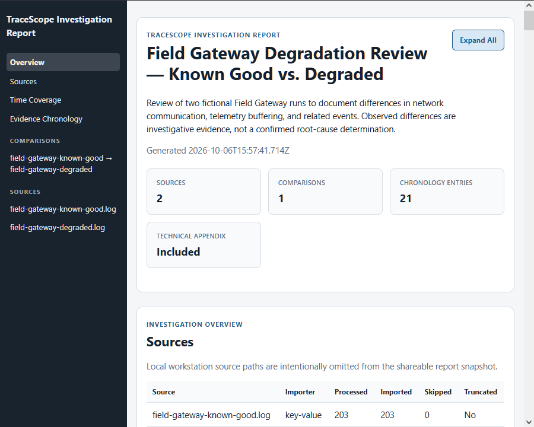

This guide builds on the fictional **Order Fulfillment Incident** used in [Investigating Logs](investigating-logs.md) and [Findings](findings.md). For the full HTML report walkthrough, it returns to the matched **Field Gateway** sessions and comparison from [Comparing Sessions](comparing-sessions.md). You can follow the sections independently if you only need one export format.

**Troubleshooting an export?** [Jump straight to Troubleshooting](#troubleshooting).

**In this guide, you will:**

1. [Choose between record copy, filtered-record CSV, findings CSV, and an HTML investigation report.](#1-choose-the-right-export-for-the-task)
2. [Copy an individual event](#2-copy-an-individual-event) in a form suitable for a ticket or discussion.
3. Export the [current filtered record set](#3-export-the-currently-filtered-records-to-csv) and your [explicitly classified findings](#4-export-classified-findings-to-csv).
4. [Prepare the Field Gateway investigations and their comparison](#5-prepare-the-field-gateway-html-report), then [configure and export a self-contained HTML report](#6-configure-and-export-the-html-report).
5. [Compare what each export captures, what remains unchanged afterward, and what to check before sharing it.](#8-what-each-export-captures-and-what-to-check-before-sharing)

TraceScope reports the imported evidence, the review decisions you recorded, and the deterministic analysis it performed. It does not independently establish the cause of an incident or verify the conclusions in an analyst note.

## 1. Choose the right export for the task

| Handoff | Use it when you need | Where to start |
| --- | --- | --- |
| **Copy an event** | Copy one event's normalized details to the clipboard as structured JSON or readable text, ready to paste into a ticket, message, editor, or another application. | Right-click within **Event Details**. |
| **Filtered-record CSV** | Create a CSV file containing all records matching the current event table filters, ready to open in a spreadsheet application or text editor. | **Exporting > Export Filtered Results...** |
| **Findings CSV** | Create a CSV file of explicitly classified findings, their review state, and source context for a spreadsheet application or other CSV-capable tool. | **Findings > Export**, or **Exporting > Findings**. |
| **HTML investigation report** | Create a self-contained HTML document combining selected investigations, analysis, findings, and optional comparisons, ready to view in a web browser. | **Exporting > Export Investigation Report...** |

These are *exports*, not alternative workspace formats. An HTML report can be read in a browser, and CSV or copied text can be used outside TraceScope, but they do not restore an editable investigation. To resume your own work with its filters, annotations, documents, and layout, save the `.tsw` workspace and its companion `.sessions/` folder. See [Saving and Restoring](saving-and-restoring.md).

The **Exporting** menu depends on which workspace document is active. Activate an investigation session to access its record and findings exports. You can start an HTML report from either an investigation session or a comparison document, then select other available workspace documents to include.

## 2. Copy an individual event

Start with the Order Fulfillment Incident if you still have it open. Otherwise, choose **File > Open Log File...**, select [`samples/order-fulfillment-incident.jsonl`](../samples/order-fulfillment-incident.jsonl), and load [`samples/profiles/order-fulfillment-incident-profile.json`](../samples/profiles/order-fulfillment-incident-profile.json) in **Import Configuration** before importing.

1. Select **Reset Filters**,

   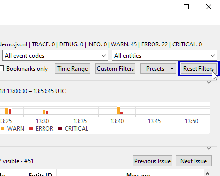

   then use the severity and event-code filters to locate an `ERROR`-level `DB_TIMEOUT` event.

   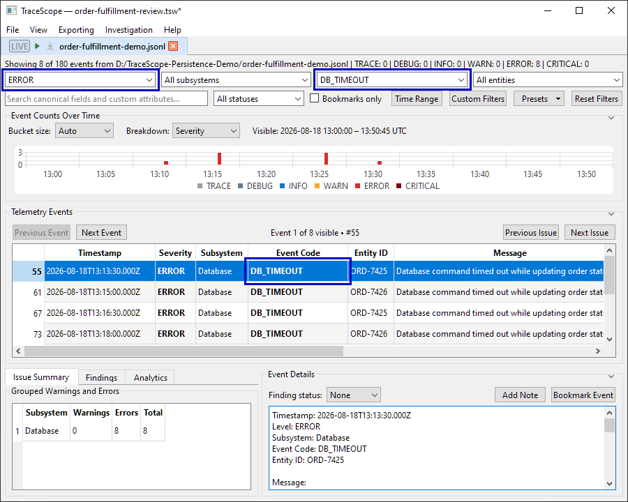
2. Select that record in the **Telemetry Events** table and inspect its separate **Event Details** panel.

   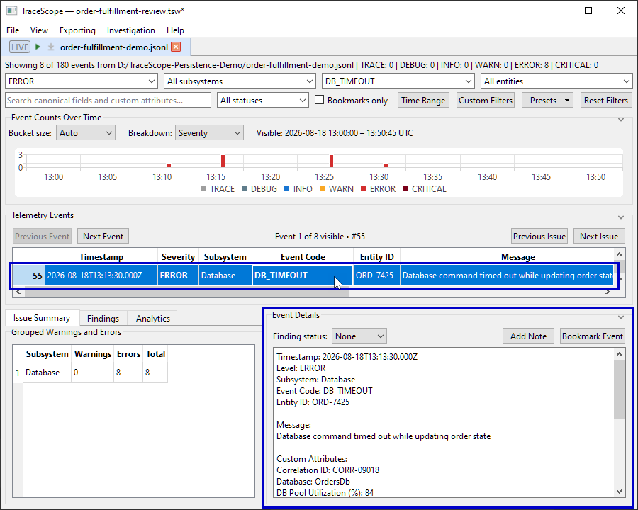
3. Right-click **inside the Event Details text area**. Choose **Copy Event as Formatted Text**.

   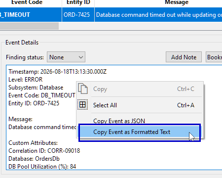
4. Paste the result into a temporary text editor. Observe that it includes the available event details in a labeled, human-readable form.

   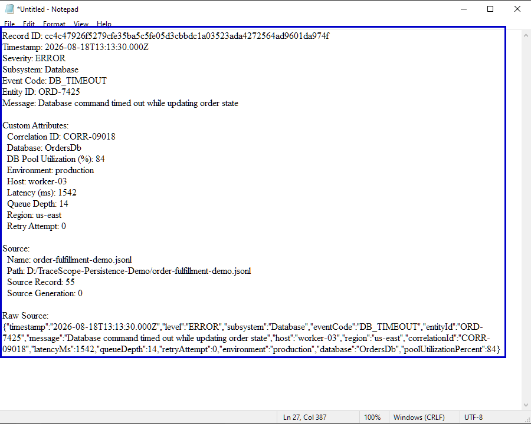
5. Return to TraceScope, right-click in **Event Details** again, and choose **Copy Event as JSON**.

   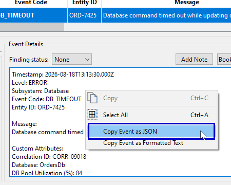

   Paste this version into the editor as well.

   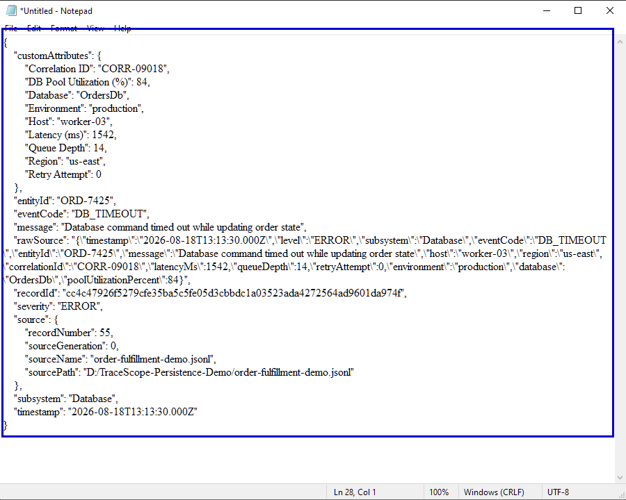

The JSON version is useful when another tool or developer needs the normalized record and its source-specific attributes. The formatted-text version is often easier to read directly in an issue description or conversation. Both commands copy the whole selected detail record, not just text you have highlighted with the mouse. You can also copy a finding's record while previewing it in Event Details.

**Check before sharing:** Individual-record copies can contain the original source path, raw source text, and source-specific values. These may reveal local file locations or sensitive information from the underlying log. Review pasted content before placing it in a public issue, message, or document.

## 3. Export the currently filtered records to CSV

A filtered-record export is useful when you have already narrowed an investigation session's visible records to the evidence someone else needs. It uses the **complete current filtered record set**, not merely the rows currently visible within the table's on-screen scrolling area.

1. Keep the Order Fulfillment Incident active. Select **Reset Filters** to establish a predictable starting point.

   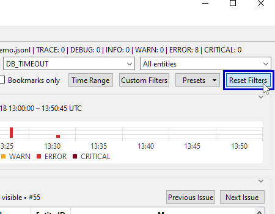
2. Select `ERROR` in the severity filter.

   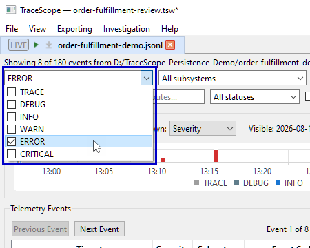

   You can narrow the results further by selecting `DB_TIMEOUT` in the event-code filter if you want an export devoted to that particular event code.

   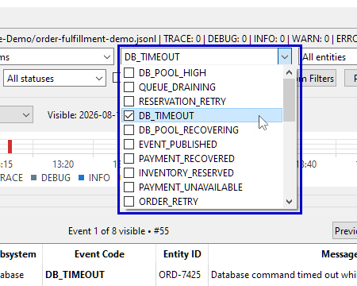
3. Confirm that the **Telemetry Events** table contains matching records. Note the visible record count so you can check your result.

   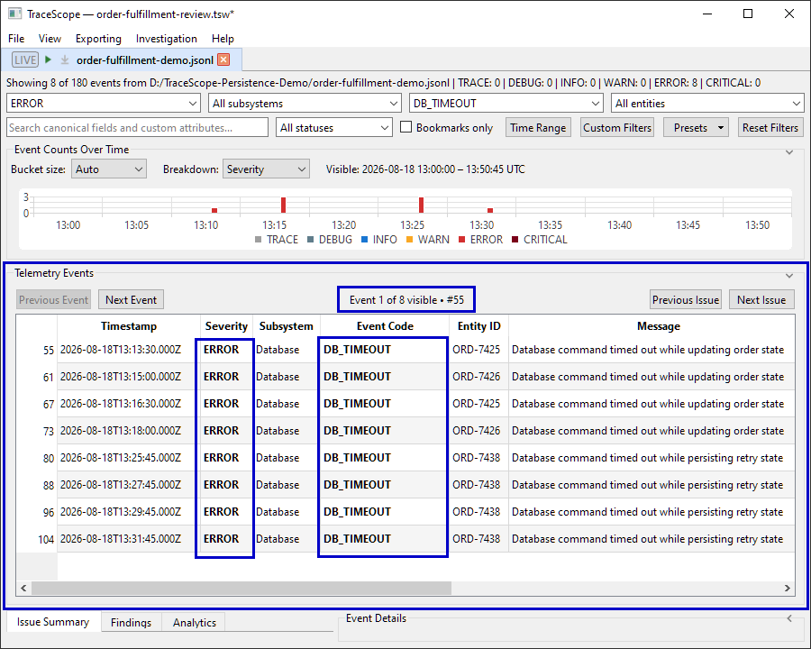
4. Choose **Exporting > Export Filtered Results...**.

   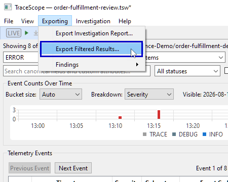
5. Choose a destination and save the file, for example `order-fulfillment-errors.csv`.
6. Open the CSV in a text editor or spreadsheet application. Confirm that the data reflects the filtered investigation rather than the entire imported log.

   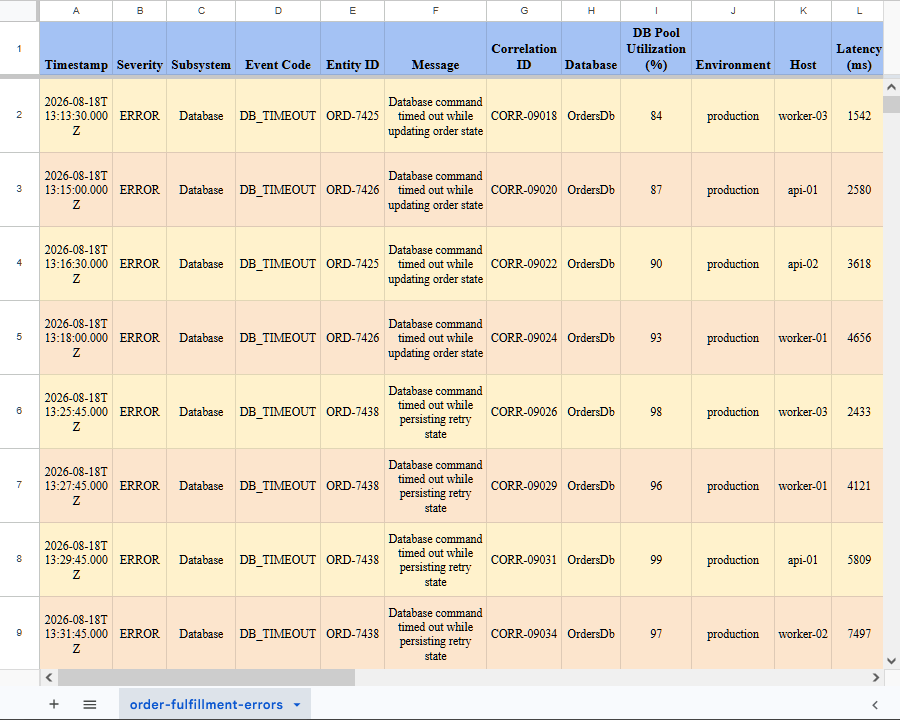

The CSV uses readable canonical headers such as **Timestamp**, **Severity**, **Subsystem**, **Event Code**, **Entity ID**, and **Message**, followed by any populated custom-attribute columns present in the selected records. Unavailable canonical values remain empty rather than being invented. This export is intended for the selected event data; it is not a findings review report and does not add finding statuses, analyst notes, or the detailed source-provenance columns from the dedicated findings export.

If you reset or change the filters after exporting, the CSV file does not change. TraceScope captures the filtered collection when you invoke the export, before the file-selection dialog opens. If no records match, there is nothing to export; adjust or reset the investigation filters and try again.

## 4. Export classified findings to CSV

A finding represents an explicit analyst review decision. Bookmarks and notes alone do not create entries in the Findings list. If you followed [Findings](findings.md), you can reuse your earlier classifications and notes. Otherwise, classify at least one relevant record as **Open** in Event Details before trying the following exercise.

1. Open the **Findings** tab in the lower investigation area. Expand that section if necessary.

   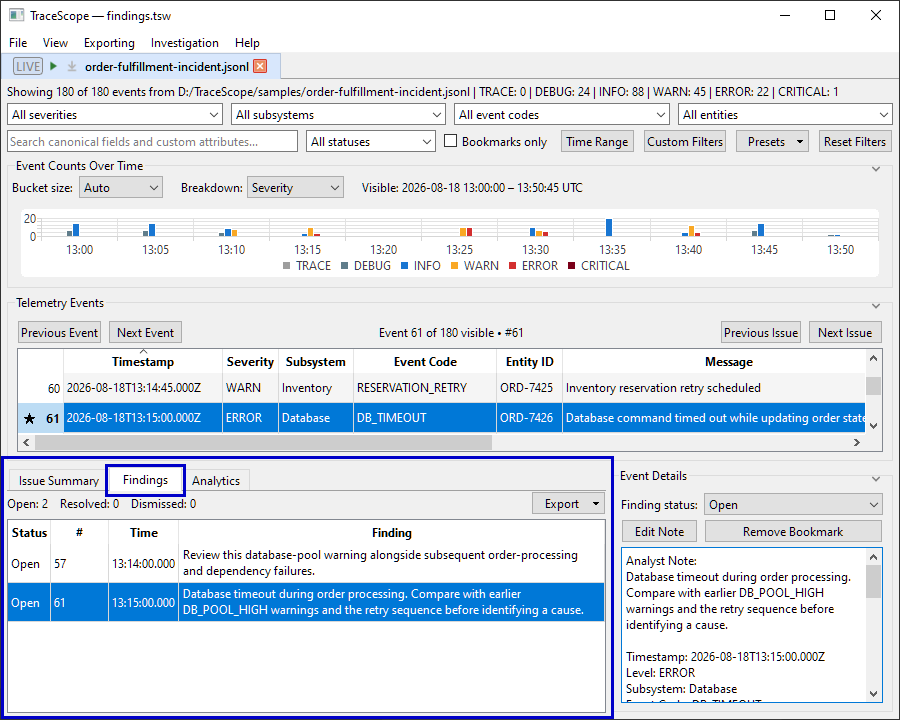
2. Select **Export** in the Findings header. Notice that the menu shows the current number available in each export scope.

   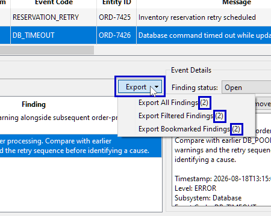
3. Choose the scope appropriate to your task:
   - **Export All Findings** includes every explicitly classified finding in this investigation, regardless of the current event table filters.

      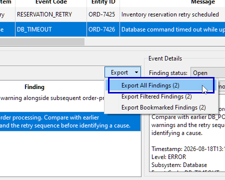
   - **Export Filtered Findings** includes only classified findings whose records match the active investigation filters.

      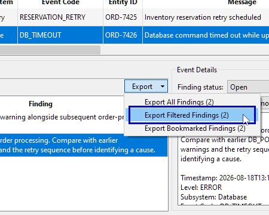
   - **Export Bookmarked Findings** includes only classified findings that are also bookmarked, regardless of the active filters.

      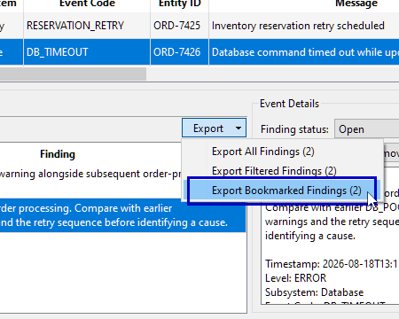
4. To test the distinction more clearly, classify at least two records with different severities, then apply a severity filter that excludes one of them. Compare the **All** and **Filtered** export counts. If you only classified one record, excluding it still demonstrates why the filtered count can be zero.

   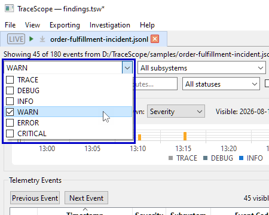

   Open **Findings > Export** again and compare the displayed counts for **All** and **Filtered**.

   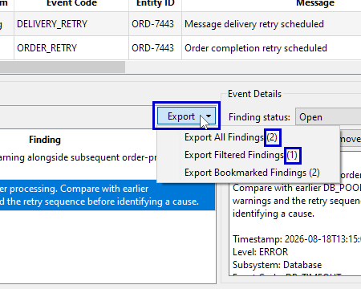
5. Select **Export All Findings**,

   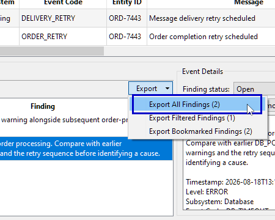

   choose a destination such as `order-fulfillment-findings.csv`, and inspect the resulting file.

   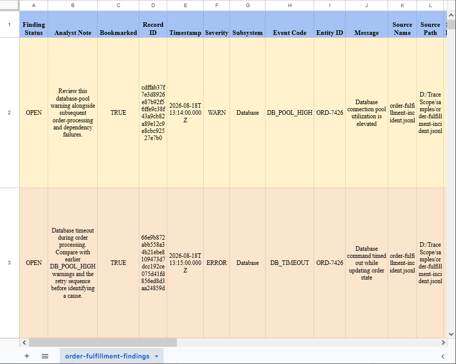

You can access the same three scopes from **Exporting > Findings** while the investigation document is active. A scope with zero eligible findings is disabled. The Findings tab itself remains a review list of all your classified records even when an active filter excludes some of them from the event table; choosing **Filtered** is what applies that narrower scope to the export.

Unlike the filtered-record CSV, the findings CSV includes review and provenance information. Its columns include **Finding Status**, **Analyst Note**, **Bookmarked**, **Record ID**, the available canonical and custom fields, source details, and **Raw Source**. That makes it suitable for a structured handoff, but it also warrants particular care: the **Source Path** column and raw log contents may contain information you should not share outside your intended audience.

The findings snapshot is captured before the save dialog opens. Subsequent changes to a note, bookmark, finding status, or filter do not rewrite an already-exported CSV. Export again when you want to communicate your updated review.

## 5. Prepare the Field Gateway HTML report

The HTML report is the broadest handoff in this guide. It can combine information from multiple open investigation sessions and previously created comparison documents, preserving each selected document's captured state and analytical results at the point of export.

For the walkthrough, return to the workspace from [Comparing Sessions](comparing-sessions.md). Ideally, it should contain three open documents: two investigation sessions and the comparison document created from them.

- **Baseline investigation session:** [`samples/field-gateway-known-good.log`](../samples/field-gateway-known-good.log)

   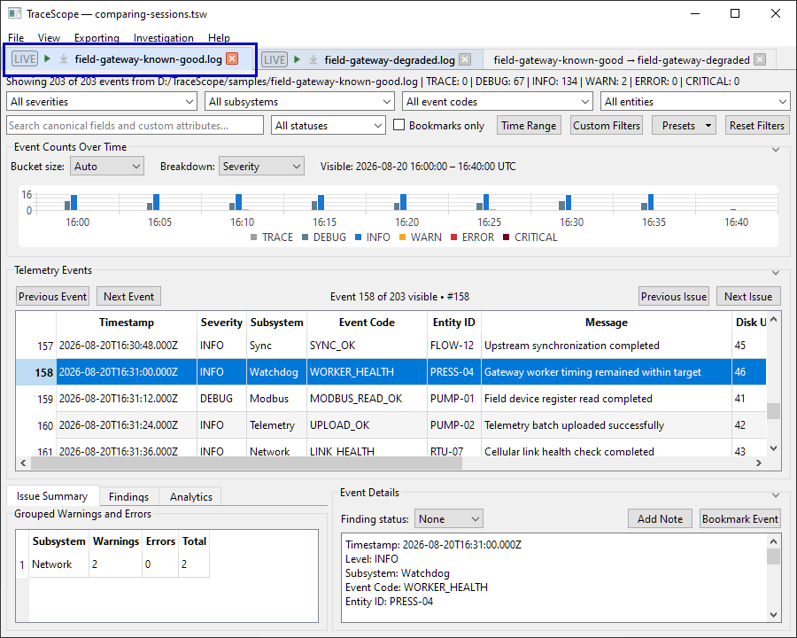
- **Comparison investigation session:** [`samples/field-gateway-degraded.log`](../samples/field-gateway-degraded.log)

   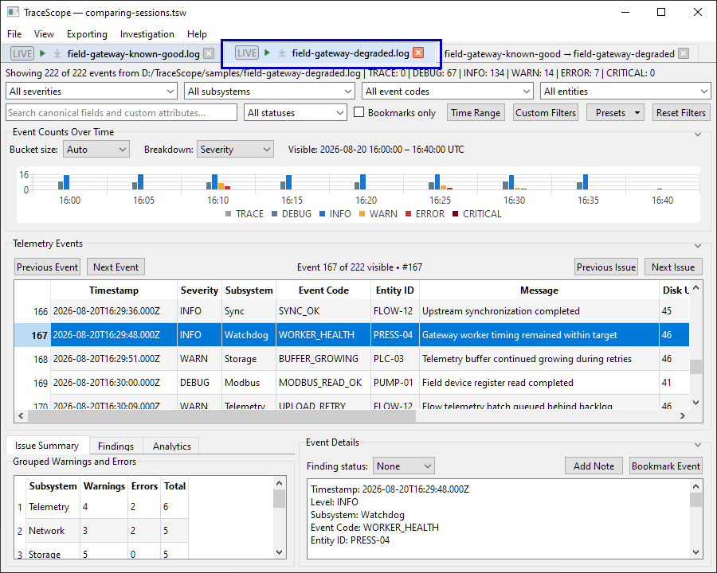
- **Comparison document:** the Baseline → Comparison snapshot you created from those sessions.

   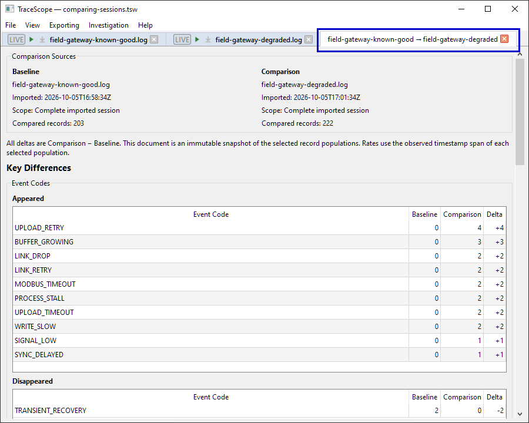

Both source logs use [`samples/profiles/field-gateway-support-session-profile.json`](../samples/profiles/field-gateway-support-session-profile.json) with the **Key-Value / logfmt** importer. If the earlier workspace is no longer open, import both sample files using that profile and create a comparison through **Investigation > Compare Sessions...**. See the comparison guide for the complete procedure and optional shared burst settings.

You do not need to reproduce a particular set of bookmarks or notes to generate a valid report. However, adding an **Open** finding and a short, carefully worded note to a relevant elevated event in the degraded investigation makes the **Findings and Investigator Annotations** section more instructive. For example, you could note an observed communication warning and identify the related behavior you would want to verify, without declaring its cause.

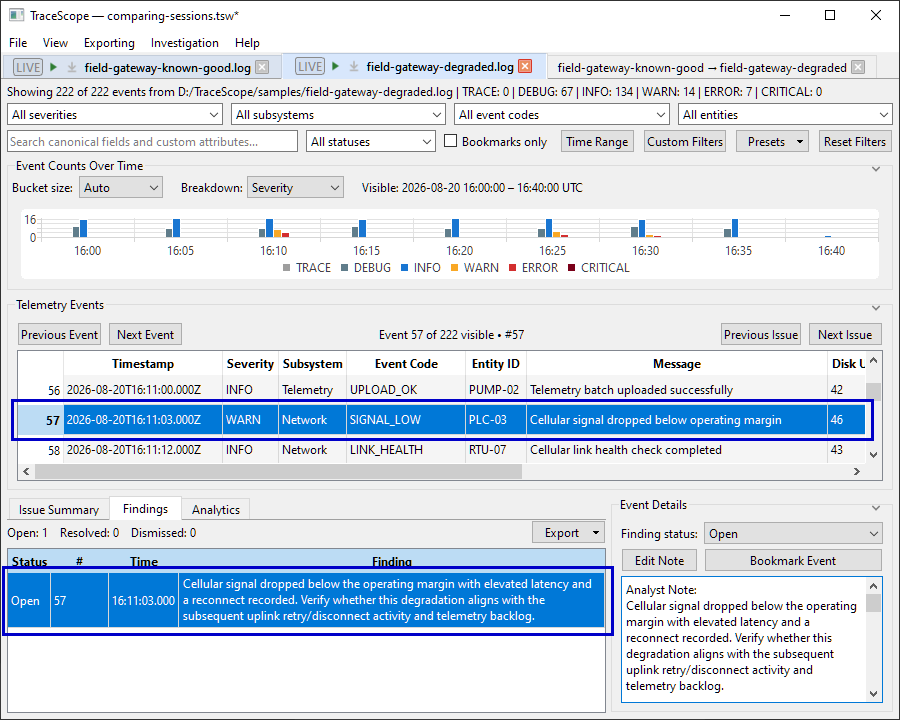

Consider whether you want to reset the individual investigation filters before generating the report. Their current filter state and corresponding record populations become part of the exported report. An existing comparison document, by contrast, retains the **complete-session or independently time-scoped populations captured when it was created**; changing the source investigations' filters now does not recalculate that comparison. Its optional captured time boundaries are separate from the current filters shown in each source-investigation report section.

## 6. Configure and export the HTML report

1. Activate the Field Gateway **comparison document** in the workspace.

   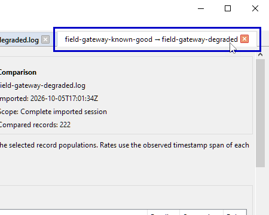

   Choose **Exporting > Export Investigation Report...**.
   
   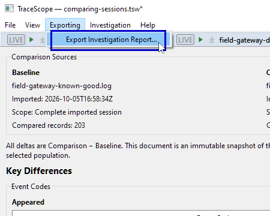
   
   You can start the same report workflow from an investigation document, but starting from the comparison makes its intended inclusion easier to see.
2. In the **Export Investigation Report** dialog, replace the suggested title with something descriptive, such as `Field Gateway Degradation Review — Known Good vs. Degraded`.

   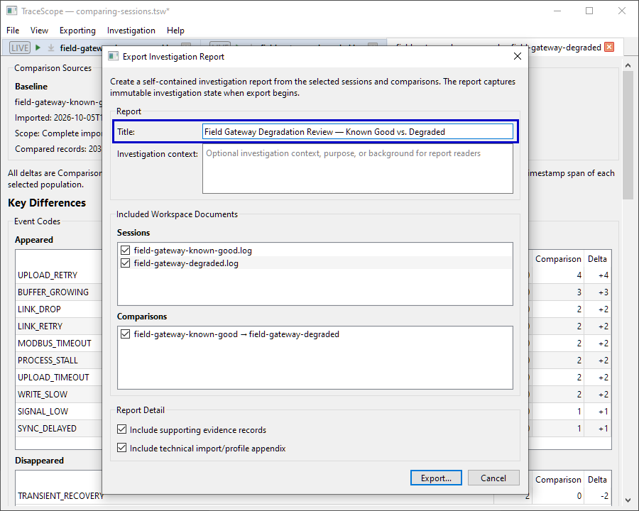
3. Enter optional **Investigation context**, for example: `Review of two fictional Field Gateway runs to document differences in network communication, telemetry buffering, and related events. Observed differences are investigative evidence, not a confirmed root-cause determination.`

   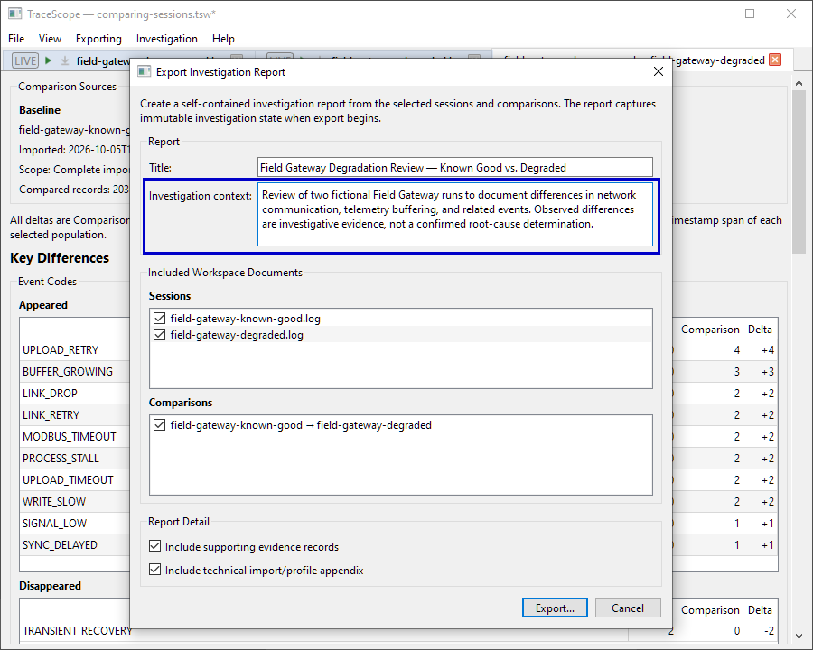
4. Under **Included Workspace Documents**, verify that both Field Gateway investigation sessions are selected under **Sessions**, and their previously created comparison document is selected under **Comparisons**.

   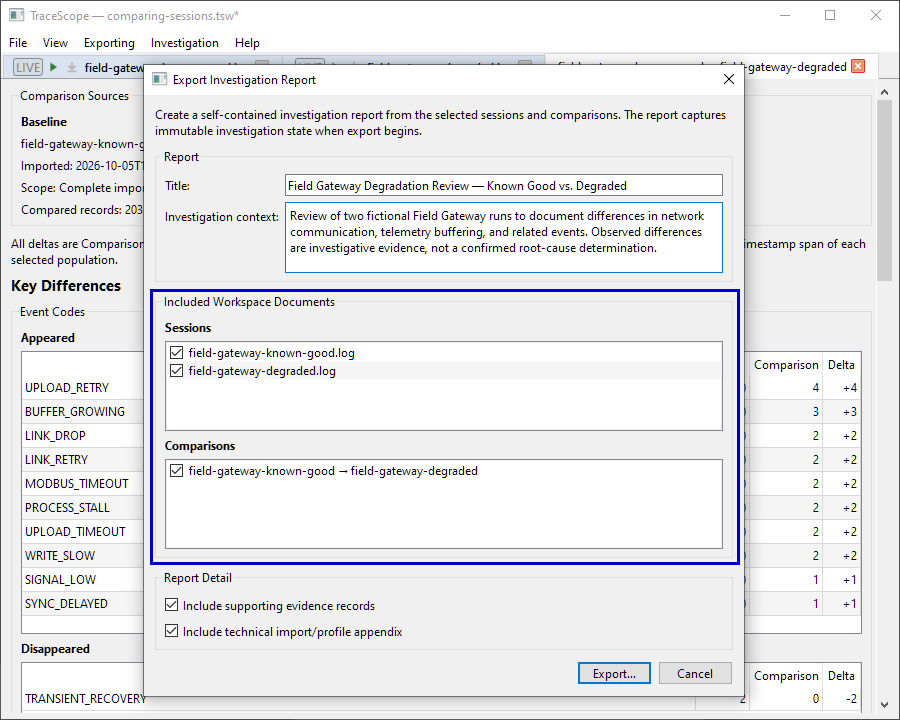

   Selecting a comparison document automatically selects its source investigation sessions *when those sessions are currently open and available*. You can adjust the checkboxes afterward, including deselecting an automatically selected source investigation session, to control which available documents appear in this particular report.
5. Leave **Include supporting evidence records** checked for the first walkthrough.

   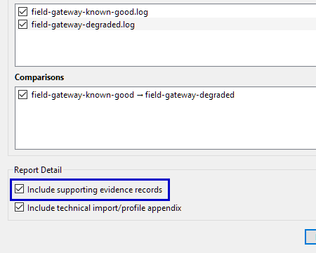

   Leave **Include technical import/profile appendix** checked as well, so you can inspect the most complete example.

   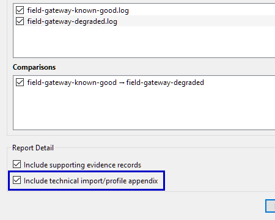
6. Select **Export...**, choose a destination such as `field-gateway-degradation-report.html`, and save.

   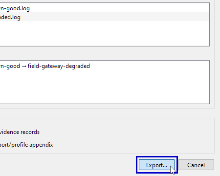
7. Open the generated `.html` file in an ordinary web browser. TraceScope should not be needed to read it.

   

The title is required, and at least one investigation or comparison document must be selected before the dialog allows export. Detached workspace documents are eligible alongside docked documents because the selection is based on the complete logical workspace rather than a particular window's current tab group.

You can also export just an investigation, several investigations without a comparison, or an existing comparison by itself. If a comparison's original source investigations have since been closed, the comparison can still contribute its captured results without manufacturing new source-investigation sections.

**What the two detail checkboxes control:** Disabling **Include supporting evidence records** omits *additional* records included because they support detected bursts. Records with saved investigator state—including findings, notes, or bookmarks—remain part of the core report. Disabling **Include technical import/profile appendix** omits the complete technical profile mapping and related detail, but ordinary import counts and diagnostics remain part of the report.

## 7. Read and verify the HTML report

Use the report's persistent navigation to move through major sections rather than reading the entire document from top to bottom. As you scroll, follow section links, or expand and collapse content, the **currently viewed section is highlighted**.

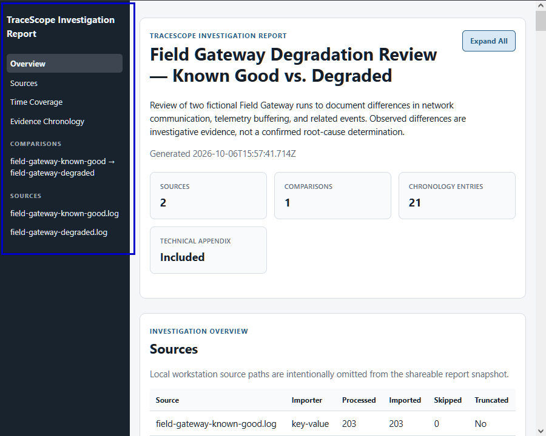

On narrow screens, navigation becomes a compact, sticky header with a **Sections** menu and a **Viewing: ...** label that tracks the current section.

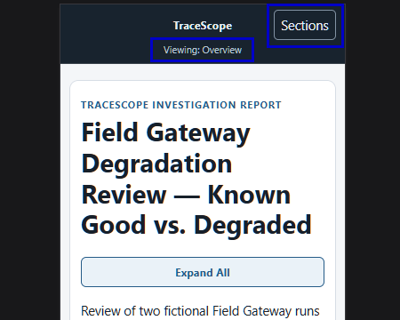

Select **Sections** to open the links; selecting a link, pressing Escape, or clicking outside closes the menu.

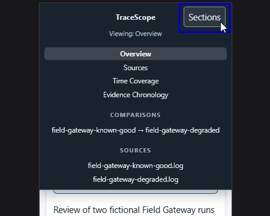

The main overview and investigation summaries are immediately visible, but **most expandable detail blocks start collapsed**. Select a block's heading to reveal or hide its contents.

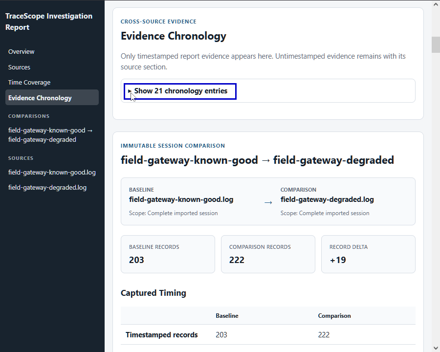

A few populated, immediately useful groups—such as subsystem issue groups, detected bursts, and import diagnostics—start expanded when their relevant data exists. Other blocks, including detailed evidence records, captured filters, additional analytics, and technical profile mappings, can be opened when you need them. Some blocks contain further expandable sections. The report-wide **Expand All / Collapse All** button opens or closes **every** expandable detail block, including nested sections and individual evidence records.

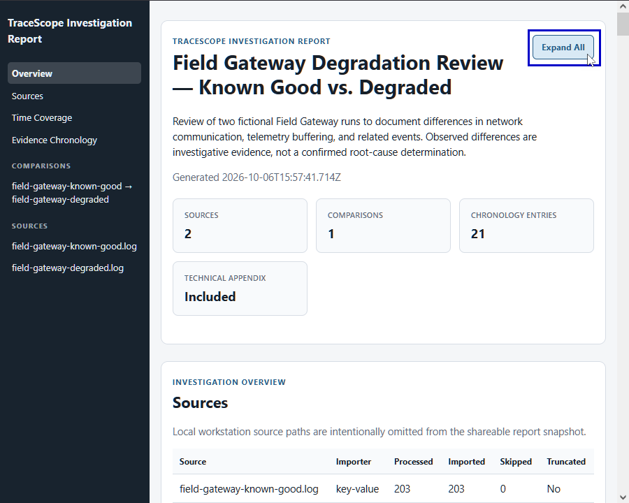

The layout also adjusts wide tables and long text for narrower browser windows.

### Review the overview and sources

Start with the report title, the optional context you entered, and its generation timestamp. The overview identifies how many source investigations and comparison documents were included.

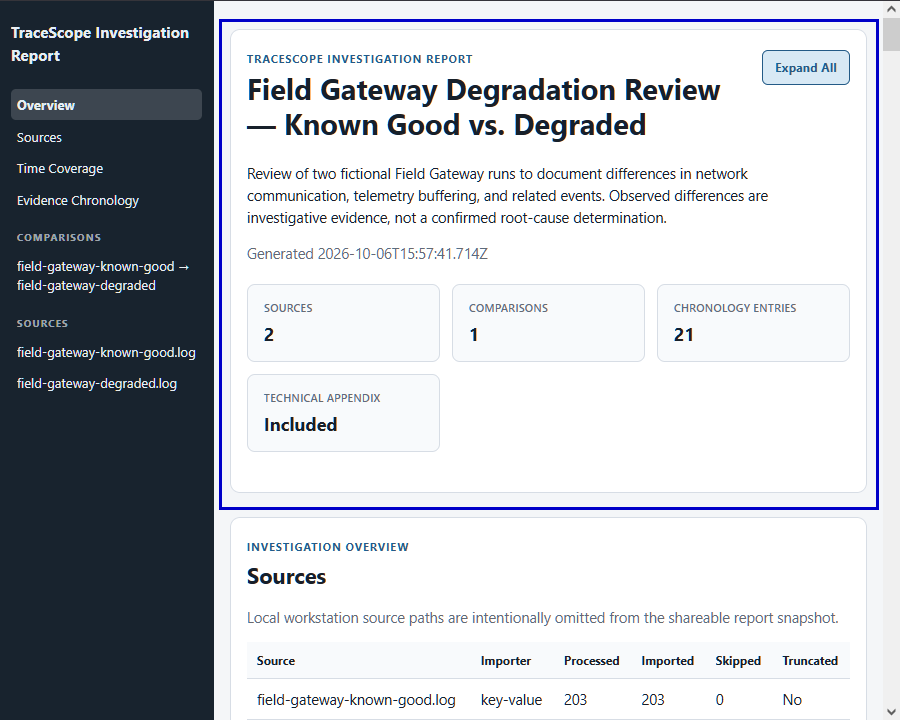

The **Sources** section provides import context, including processed, imported, and skipped record counts.

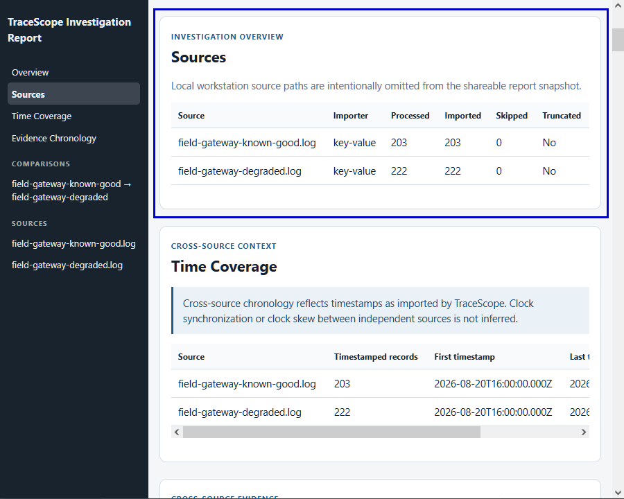

If you included source investigations with timestamps, **Time Coverage** shows their individual timestamp ranges.

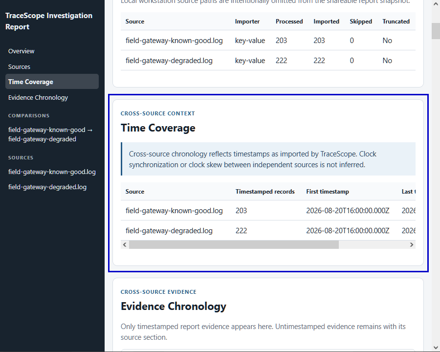

**Evidence Chronology**, when populated, brings together timestamped supporting evidence from the selected investigations.

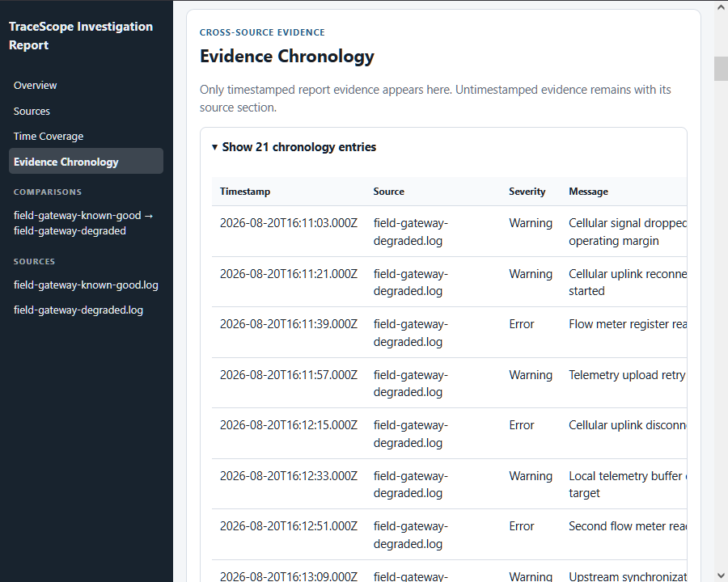

It is *not* a merger of every record in every imported source. In addition, the chronology uses the timestamps as imported: TraceScope does not independently establish that separate machines or log producers had synchronized clocks.

### Review the included comparison

Open the report's comparison section. It preserves the existing **Baseline → Comparison** orientation and the results of your previously created immutable comparison snapshot. Its source block identifies the scope captured for each side: **Complete imported session** by default, or **Captured active time range**, including any start or end boundary that was left unbounded. It also reports the captured baseline and comparison record counts.

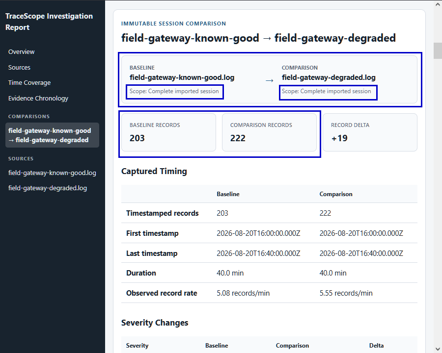

Depending on the available source data and the options you used at comparison creation, the report may include event-code and severity changes, elevated subsystem and entity activity, conservative shared custom-field differences, timing context, and shared-settings burst comparison. To make differences easier to inspect, event-code changes are presented as **Appeared**, **Disappeared**, then **Changed**, with the larger absolute count changes first within each group and deterministic tie-breaking.

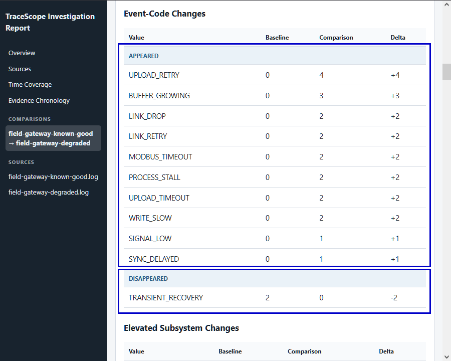

Severity, elevated subsystem/entity, and qualifying categorical custom-field differences use corresponding impact-first ordering. **This is presentation order, not a root-cause ranking.**

The **Captured Timing** section labels the original first-to-last-selected-event rate as **Observed record rate**.

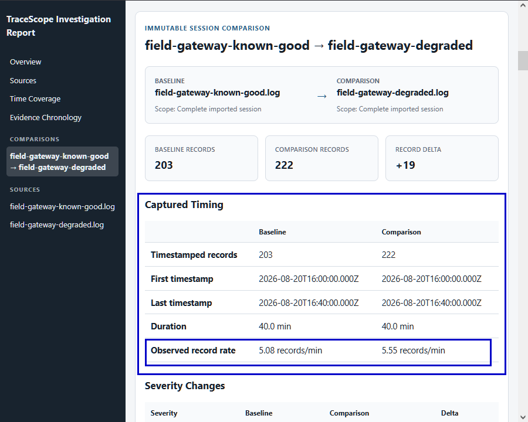

When at least one side captured a positive-duration window with **both** start and end boundaries, the report also shows **Window-average record rate**, calculated across the entire selected window, including quiet periods. A side without a qualifying bounded window displays a dash, and the row is omitted entirely if neither side qualifies. A start-only or end-only selection does not imply a bounded window average.

**An important scope distinction:** The comparison was calculated from the complete or independently time-scoped selected populations **when it was created**. The HTML report does not silently recalculate it using filters active during report export. Each included source-investigation section separately documents its own *current* filtered and analytical context, which may therefore differ from the comparison's earlier scope.

### Review each investigation

Open the report sections generated from the known-good and degraded investigation sessions. Among the material captured, look for:

- **Investigation Scope** and **Severity Summary**, which distinguish the complete imported population, the visible filtered population, and the analysis population.

   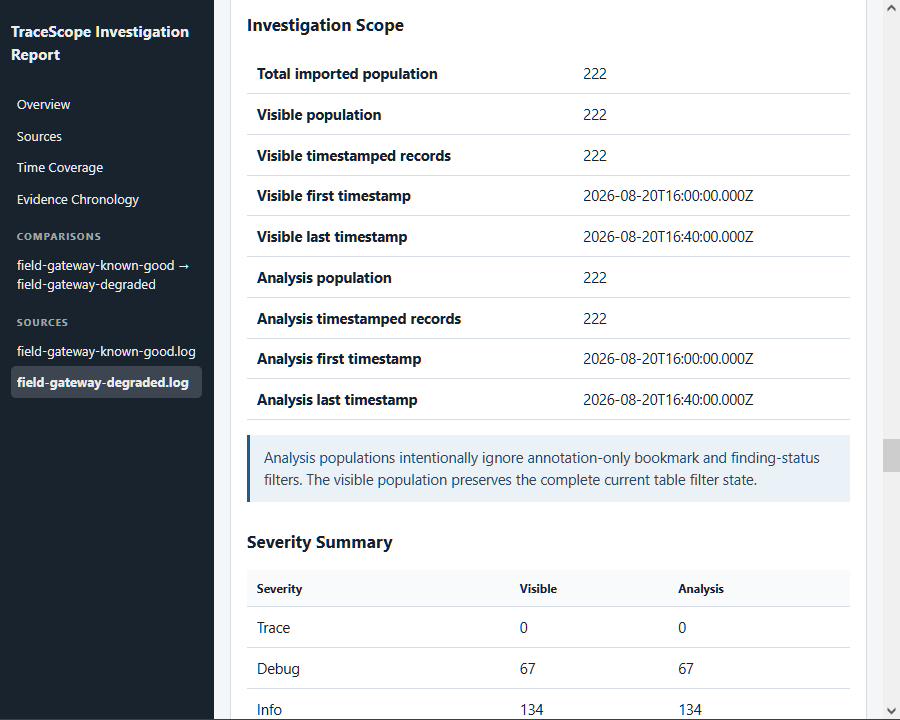
- The **Event Activity Timeline**,

   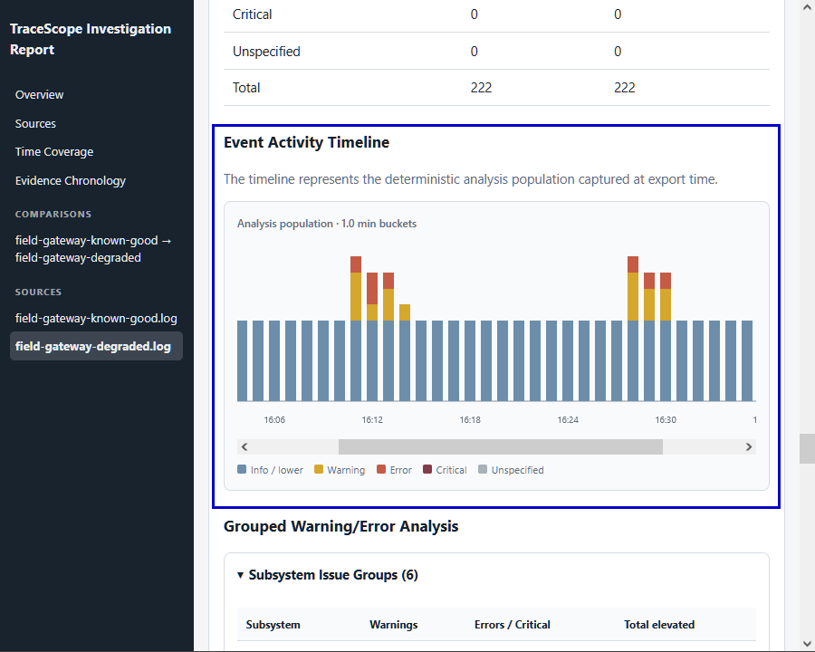

   grouped warning/error analysis,
   
   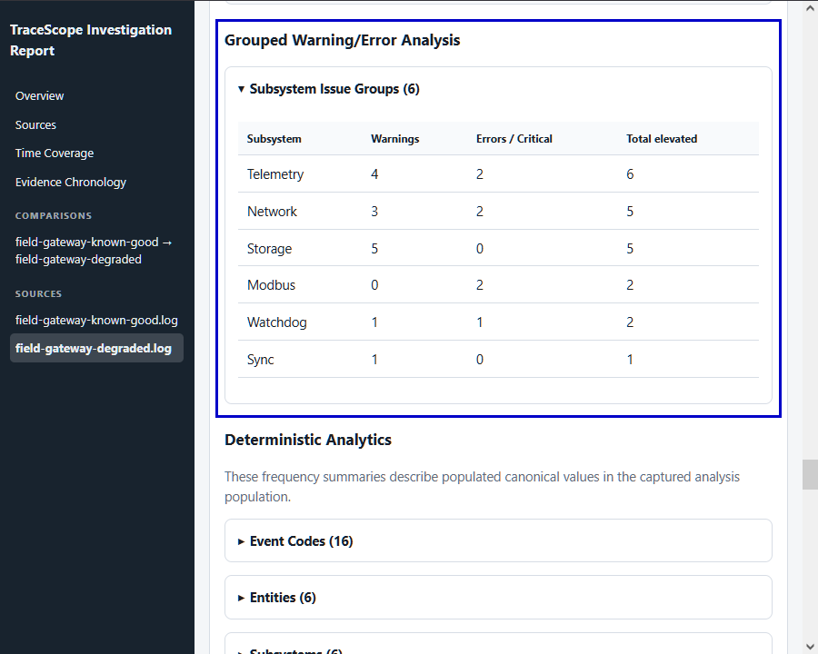
   
   deterministic event-code/entity/subsystem analytics,
   
   
   
   and burst information when supported.

   
- **Findings and Investigator Annotations**, including any review decisions or notes you added, with links into the corresponding evidence details.

   
- **Supporting Evidence**

   

   and **Import and Data-Quality Context**, including import diagnostics and the technical appendix if requested.

   

The **visible population** applies the current event table filters, including review-oriented bookmark or finding-status filters. The **analysis population** deliberately ignores those annotation-only restrictions while retaining the source-data filters. This prevents marking or dismissing a finding from silently changing the underlying event-oriented analytical interpretation.


An open **SnapshotBacked** investigation can be included in an HTML report just like a **SourceBacked** investigation. The report reflects the records and metadata available to that particular investigation. If you exported an investigation to a standalone `.tsinv` file and later reopened it, some earlier import-provenance information—for example, its original import timestamp—may be unavailable even when the underlying investigation evidence matches the original. Existing comparison documents still retain their earlier captured results; generating the report does not recalculate them.

For another complete example of the output, the project publishes a [representative Field Gateway investigation report](https://w-cook.github.io/tracescope-qt-log-inspector/examples/field-gateway-investigation-report.html) that can be viewed directly in a browser without installing TraceScope.

**An HTML report is a point-in-time document.** TraceScope captures the selected report contents when you confirm its configuration, before asking where to save it. Subsequent changes to filters, notes, findings, document layout, source files, or incoming live evidence do not alter that frozen export. An included comparison was already immutable from its earlier creation. Generate a new report when you need a current handoff.

The exported HTML is self-contained: its presentation and captured data are in one file, with no TraceScope backend or separate asset directory required. Open it offline in a web browser, or use the browser's **Print** function and **Save as PDF** option when a PDF handoff is preferable. TraceScope does not provide a separate native PDF-report export in this workflow.

**Printing or saving as PDF:** When browser printing begins, the report **temporarily expands all expandable content automatically**, including nested sections and individual evidence records. After printing, it restores each section's prior open or closed state, so you do not need to use Expand All first merely to include hidden details. The print layout removes screen-only controls, adapts wide tables into readable portrait layouts (including labeled records for exceptionally wide tables), keeps short headings and tables together where possible, repeats supported table headings, and scales timeline graphics. It starts the chronology and each included comparison or investigation on fresh pages, with deliberate page handling for supporting evidence.


**Always inspect your browser's print preview** before saving or sharing a PDF, especially for long tables, source text, evidence records, and page boundaries. The layout provides pagination guidance, but exact breaks depend on your browser, paper settings, and content; the original self-contained HTML remains preferable when a recipient needs interactive expansion and navigation.

TraceScope deliberately omits the originating workstation's local source-file paths from the shareable HTML report. **That is not automatic redaction of the underlying evidence.** Raw log text, custom attributes, your optional report context, and analyst notes can still contain sensitive information or paths written into the original messages. Inspect the final HTML before distributing it. The same caution applies even more directly to record copies and findings CSV exports, which can explicitly contain source paths.

Finally, distinguish an exported handoff from preserved working evidence. An HTML report describes the investigation as captured; it cannot be reopened as an editable TraceScope workspace or replace an independently saved investigation snapshot. Use [Saving and Restoring](saving-and-restoring.md) when continuity, source authority, or future investigation work matters.

## 8. What each export captures and what to check before sharing

All four handoff methods **leave the source investigation sessions, comparison documents, and workspace state unchanged**. However, they capture different information, and none automatically updates an already-copied or exported result when you continue working.

| Handoff | What is captured | What remains unchanged afterward | Check before sharing |
| --- | --- | --- | --- |
| **Copy an event** | One selected event's available canonical fields, custom attributes, record ID, source metadata, and raw source content, as formatted text or structured JSON on the clipboard. The current commands do **not** include its separate analyst note or finding classification. | The investigation, review state, and source records remain unchanged. Pasted text is a static copy; other clipboard operations can replace the clipboard contents. | Check the recipient and format. Copies can contain local source paths, raw log text, and sensitive source-specific attributes. |
| **Filtered-record CSV** | All records passing the current event table filters, with available canonical and custom fields. This is **not** a findings export; it omits analyst notes, finding classifications, and the findings export's detailed source-provenance columns. | Filters, annotations, and source records remain unchanged. The saved CSV stays as exported even if the investigation changes. | Check the active filters, matching record count, and values in any custom fields before distributing the file. |
| **Findings CSV** | Explicitly classified findings in the chosen **All**, **Filtered**, or **Bookmarked** scope, including finding status, analyst note, bookmark state, available record fields, source provenance, and raw source text. | Classifications, bookmarks, filters, notes, and source records remain unchanged. The saved CSV does not reflect subsequent review changes. | Check the chosen scope, exported count, analyst-written notes, **Source Path** column, and raw source contents. |
| **HTML investigation report** | The selected source investigations' captured scope, analysis, findings, annotations, available source/import context, and any selected **previously created** complete or time-scoped comparison results and captured boundaries. The optional checkboxes control extra burst-supporting evidence and the full technical import-profile appendix. | The source investigations and comparisons remain unchanged. The HTML is a separate, immutable point-in-time handoff; it does not become an editable TraceScope workspace. | Check included documents, current session filters, each comparison's captured scope and rate interpretation, optional detail levels, report context, notes, raw evidence, and final browser and print-preview rendering. |

## Troubleshooting

| Situation | What to check |
| --- | --- |
| **Export Filtered Results...** is unavailable, or nothing exports. | Make sure an investigation document is active and its current filters match at least one record. The Exporting menu changes with the active document. See [Choose the right export for the task](#1-choose-the-right-export-for-the-task) and [Export the currently filtered records to CSV](#3-export-the-currently-filtered-records-to-csv) for more information. |
| A finding is missing from **Filtered Findings**. | Check whether its underlying record matches the current investigation filters. Use **All Findings** to include every explicitly classified finding, or **Bookmarked Findings** to select classified and bookmarked records independently of filters. See [Export classified findings to CSV](#4-export-classified-findings-to-csv) for more information. |
| The HTML report's **Export...** button is disabled. | Provide a nonempty title and select at least one available investigation or comparison document. See [Configure and export the HTML report](#6-configure-and-export-the-html-report) for more information. |
| Expected findings or evidence are missing from the HTML report. | Verify that you included the intended source investigation, that its relevant records had actual investigator state, and that you chose the supporting-evidence option appropriate to your task. Merely bookmarking or noting a record does not turn it into a classified finding. See [Configure and export the HTML report](#6-configure-and-export-the-html-report), [Read and verify the HTML report](#7-read-and-verify-the-html-report), and [Findings](findings.md) for more information. |
| The HTML comparison differs in scope from a source section. | This is expected if the comparison captured complete sessions or optional time ranges earlier, while the source section captures the investigation's later filter state. Check the displayed comparison scope and boundaries; exporting does not recalculate it. See [Prepare the Field Gateway HTML report](#5-prepare-the-field-gateway-html-report) and [Review the included comparison](#review-the-included-comparison). |
| A generated report is unexpectedly large or contains information you should not share. | Review the selected sessions, optional evidence and technical appendix, raw source content, custom fields, and analyst-written text. Regenerate a more appropriate handoff rather than editing the evidence assumptions silently. See [Configure and export the HTML report](#6-configure-and-export-the-html-report) and [What each export captures and what to check before sharing](#8-what-each-export-captures-and-what-to-check-before-sharing) for more information. |
| A report table looks cramped or breaks awkwardly in print. | Use the current generated report and inspect portrait print preview. Wide tables switch to print-oriented layouts, with labeled records for exceptionally wide tables; precise page breaks still depend on the browser and paper settings. See [Read and verify the HTML report](#7-read-and-verify-the-html-report). |

## Where to go next

- [Comparing Sessions](comparing-sessions.md) explains how to create and interpret the immutable comparison used in this report.
- [Findings](findings.md) covers classification, notes, bookmarking, and the review workflow behind findings exports.
- [Saving and Restoring](saving-and-restoring.md) explains how to retain editable investigations and preserve evidence independently of an exported report.
- [Investigating Logs](investigating-logs.md) covers the filters and analytics that determine what appears in your filtered exports and captured report sections.
