# Saving and Restoring Investigations in TraceScope

TraceScope is designed for investigations that may span several files, continue over multiple days, and involve sources that change over time. Saving your work involves two related but different things: preserving the **log evidence** you have collected and preserving the **workspace context** in which you investigated it.

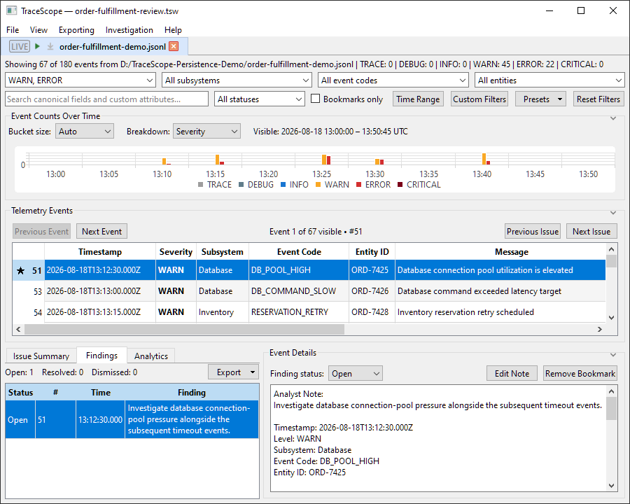

This guide explains when to save a complete workspace, when to save an individual investigation snapshot, and how to restore your work when the original log has moved, changed, or disappeared. It includes a safe walkthrough using a *copy* of a supplied sample file, so you can try missing-source recovery without touching your own logs.

**Having trouble reopening or preserving your work?** [Jump straight to Troubleshooting](#troubleshooting).

**In this guide, you will:**

1. [Distinguish a workspace from an investigation snapshot and an external log](#1-understand-what-tracescope-saves).
2. [Save and reopen a complete investigation](#2-walkthrough-save-and-reopen-a-complete-investigation) containing filters, a bookmark, a finding, and an analyst note.
3. Optionally [simulate a missing source and recover saved evidence](#3-optional-walkthrough-recover-when-the-original-source-is-missing).
4. [Understand SourceBacked, SnapshotBacked, and Hybrid investigations](#5-understand-the-three-backing-modes).
5. [Reload or reconnect sources deliberately](#6-reload-relocate-and-resume-work-deliberately), and [keep saved workspaces portable](#7-keep-workspaces-usable-and-safe).

If you have not yet imported a log, start with [Getting Started](getting-started.md). [Findings](findings.md) explains the annotation workflow in greater detail; [Live Following](live-following.md) explains how evidence accumulates while another application writes to a file.

## 1. Understand what TraceScope saves

TraceScope uses different files to preserve source evidence, investigation snapshots, and workspace state. These files serve different purposes and should not be treated as interchangeable.

| File or folder | What it contains | What it is for |
| --- | --- | --- |
| **External log file** (for example, `.jsonl` or `.csv`) | The source records written by the original application. | Importing, reloading, or continuing to follow the source. TraceScope does not control whether another application later truncates or replaces it. |
| **Investigation snapshot** (`.tsinv`) | A point-in-time copy of normalized records already admitted to one investigation, together with its import profile, import diagnostics and counts, and available source-continuity information. | Keeping the captured evidence independent of the original log file. |
| **Workspace** (`.tsw` **plus its companion `.sessions/` folder**) | The workspace's collection of documents—including investigation sessions and immutable comparisons—along with investigation annotations and filters, saved evidence snapshots, and applicable document, window, and presentation state. | Stopping work and returning later with the wider investigation context restored. |

**The central rule: save the workspace if you want to preserve your investigation, not just its raw evidence.**

A standalone `.tsinv` snapshot does **not** contain the complete workspace. In particular, bookmarks, analyst notes, finding statuses, active filters, comparisons, and window/layout state belong to the `.tsw` workspace. Opening a standalone snapshot on its own should not be expected to reproduce those annotations.

### The two parts of a saved workspace

When you save a workspace as `gateway-review.tsw`, TraceScope also creates a companion folder beside it:

```text
gateway-review.tsw
gateway-review.sessions/
    ...one or more .tsinv investigation snapshots...
```

The `.tsw` file is the workspace's manifest and broader investigation state, including previously created immutable comparison results. Its `.sessions/` folder holds durable evidence snapshots for the investigation sessions saved in that workspace. Both parts are needed. The folder is managed by TraceScope; there is normally no reason to open or rename its individual snapshot files.

**Keep the `.tsw` file and its matching `.sessions/` folder together** when copying, backing up, or sharing a workspace. Copying only the `.tsw` file does not preserve the complete saved package.

The external source files are separate. Whether TraceScope needs them when you reopen a workspace depends on the investigation's [backing mode](#5-understand-the-three-backing-modes).

## 2. Walkthrough: save and reopen a complete investigation

You can use your own investigation for these steps. If you want a predictable exercise, use the same **Order Fulfillment Incident** example from [Getting Started](getting-started.md).

### Prepare a disposable source

For this walkthrough, **make a copy** of the sample log before importing it. We will optionally move that copy later to demonstrate missing-source recovery.

1. Find `samples/order-fulfillment-incident.jsonl` in the main TraceScope sample collection.
2. Copy it to a writable demonstration folder, such as `TraceScope-Persistence-Demo/`, and name the copy `order-fulfillment-demo.jsonl`.
3. Keep the matching sample profile, `samples/profiles/order-fulfillment-incident-profile.json`, available. You can load it directly from your samples collection.
4. In TraceScope, choose **File > Open Log File...**,

    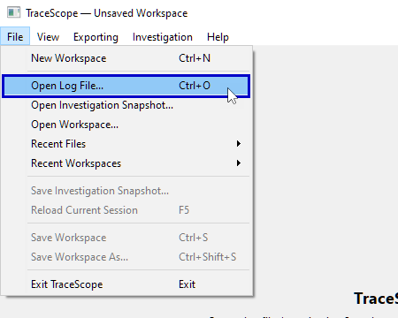

    select your *copied* log, and load the matching profile in **Import Configuration**.
    
    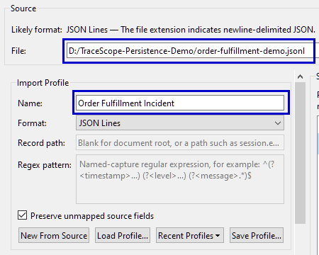
    
    Select **Import**.

    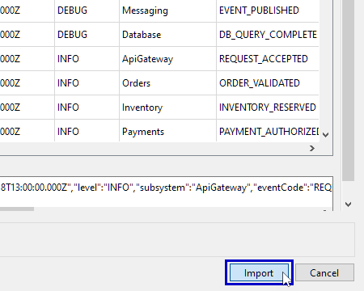

Using a copy is important: neither the original bundled sample nor any important personal log needs to be renamed or modified to try the recovery exercise.

### Give the investigation some state worth saving

In the imported investigation:

1. In the severity filter, select `WARN` and `ERROR` to narrow the records displayed in **Telemetry Events**.

    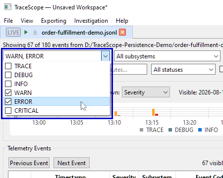
2. Select a `DB_POOL_HIGH` event and inspect it in **Event Details**.

    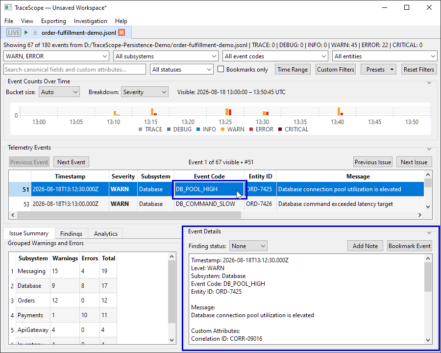
3. Select **Bookmark Event**

    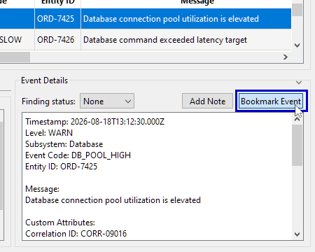

    and change **Finding status** from **None** to **Open**.

    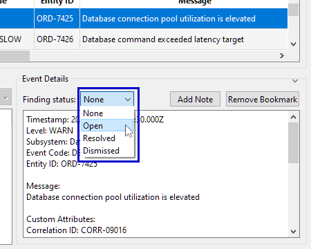
4. Select **Add Note**

    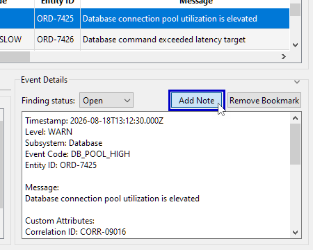

    and save a brief observation, such as `Investigate database connection-pool pressure alongside the subsequent timeout events.`

    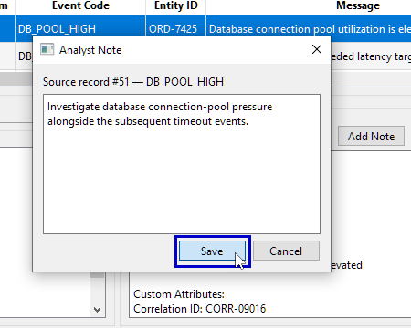
5. Open **Findings** and verify that the Open finding now displays your note.

    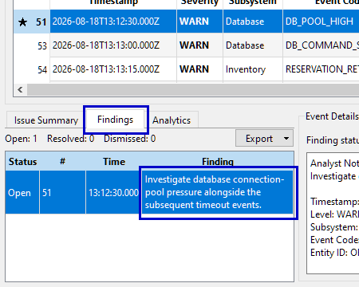

You have now created state associated with your investigation session, including its source/profile association, active filter, bookmark, finding status, and analyst note. Saving the workspace preserves that state along with the broader workspace context.

### Save the workspace

1. Choose **File > Save Workspace** (`Ctrl+S` on Windows).

    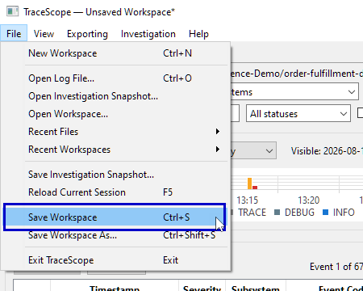

2. If this workspace has not been saved before, choose a location in your demonstration folder and name it `order-fulfillment-review.tsw`.
3. Confirm that the `.tsw` file and its `order-fulfillment-review.sessions/` folder now exist beside each other.

Subsequent uses of **Save Workspace** update the saved workspace. **File > Save Workspace As...** lets you save the current workspace under a different name or location; its new companion folder is created for that saved workspace.

When saving a workspace, TraceScope captures a durable evidence snapshot for each open investigation session. However, saving **does not automatically change an investigation session's backing mode or its authoritative evidence source**. Your newly imported session remains **SourceBacked**, with the copied log still serving as its authoritative external source.

### Reopen the saved workspace

1. Choose **File > New Workspace** to close the current workspace.

    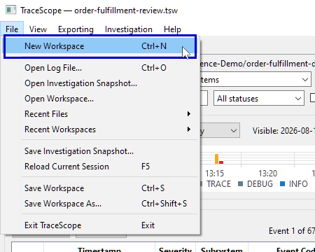

    If TraceScope indicates that you have unsaved changes, resolve that prompt before proceeding.
2. Choose **File > Open Workspace...**,

    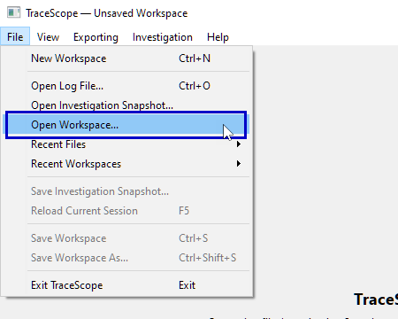

    select `order-fulfillment-review.tsw`, and let TraceScope restore it.
3. Return to the relevant investigation. Check the severity filter, `DB_POOL_HIGH` bookmark, Open finding, and saved analyst note.

    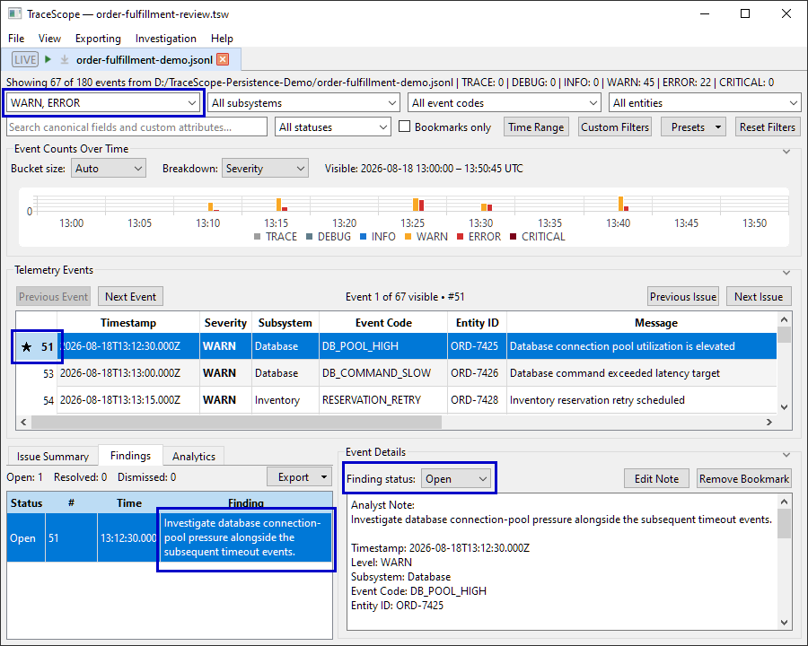

Because your copied external file still exists, this SourceBacked investigation ordinarily reconstructs its records from that file using the saved profile. The saved workspace restores the investigation context and applicable annotations.

You can also access previously saved workspaces through **File > Recent Workspaces**.

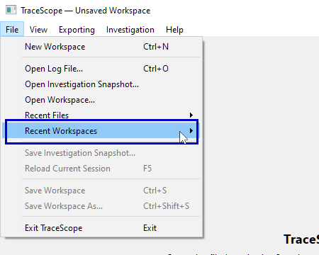

**A note on record identity:** annotations are associated with stable record identities, not simply row numbers. When a SourceBacked investigation is rebuilt from its external file, annotations remain associated with records whose identities still match. If the source has since been rewritten or replaced, do not assume every previously annotated record can be reconstructed from it. The next sections explain how to use preserved evidence instead.

## 3. Optional walkthrough: recover when the original source is missing

This exercise demonstrates why a complete workspace includes saved evidence in addition to a source path. It is safe to skip if you only want to learn ordinary save and reopen behavior.

**Use only the disposable copy from the previous walkthrough.** Do not move the original sample or a real application's actively written log.

1. With the workspace safely saved, choose **File > New Workspace** so the SourceBacked investigation is no longer open.

    
2. Outside TraceScope, rename `order-fulfillment-demo.jsonl` to something like `order-fulfillment-temporarily-hidden.jsonl`. Leave `order-fulfillment-review.tsw` and its `.sessions/` folder untouched.
3. In TraceScope, choose **File > Open Workspace...** 

    

    and select `order-fulfillment-review.tsw`.
4. TraceScope should present **Workspace Source File Missing** for the affected SourceBacked investigation. Because you saved this workspace with a durable snapshot, choose **Open Saved Snapshot**.

    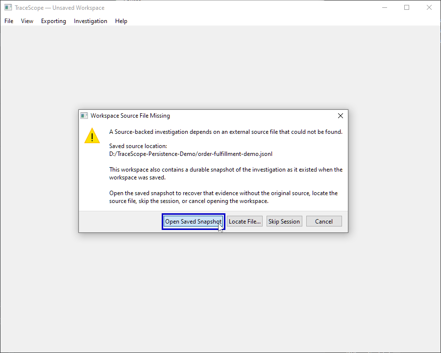
5. TraceScope restores that investigation as **SnapshotBacked**. Inspect the recovered records and verify that your bookmark, finding, note, and saved filter are still present.

    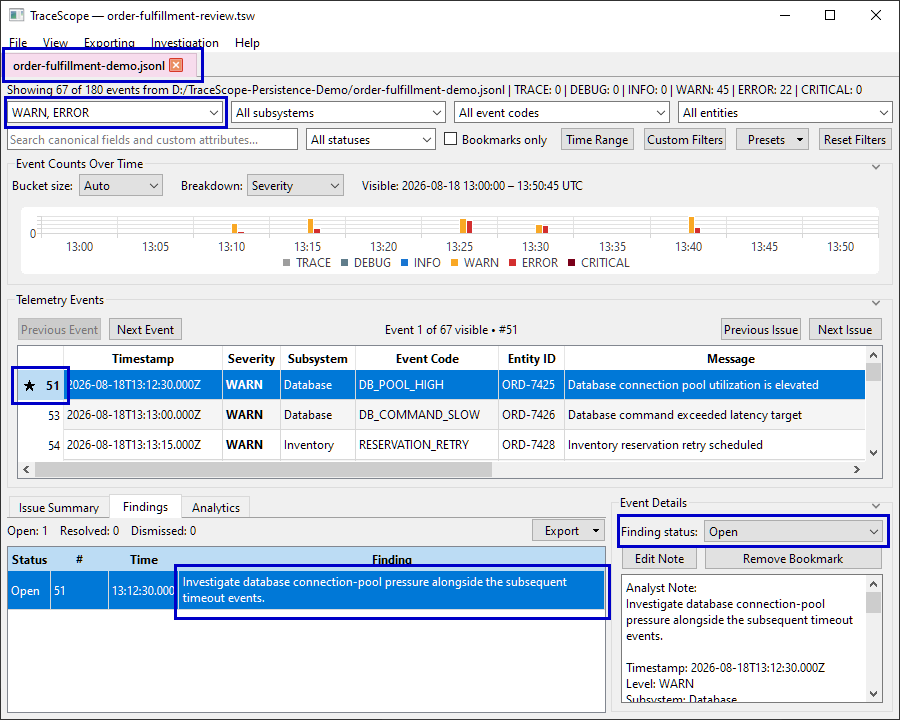

The restored snapshot is authoritative for this recovered investigation; the unavailable external file is no longer required to inspect its saved records.

Other choices in the missing-source prompt are useful in different circumstances:

- **Locate File...** lets you select the source if it was moved or is otherwise available at a different location.

    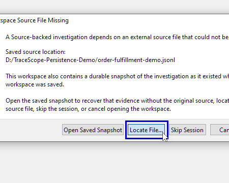

    Use the correct original file or appropriate continuation of that source.
- **Skip Session** omits that investigation from this opening attempt rather than preventing other recoverable workspace content from opening.

    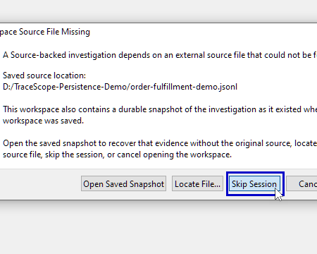

    Previously captured comparison documents retain their independent analysis even if an original source investigation is skipped; they do not require that session to be reopened to display their earlier results.
- **Cancel** abandons opening the workspace.

    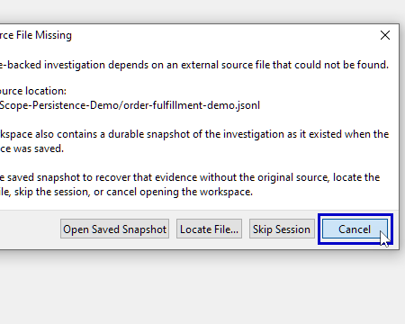

The **Open Saved Snapshot** option appears when a usable saved snapshot is available. If a snapshot is missing or cannot be read, that particular recovery option may not be available.

**Save the workspace if you want to retain the recovered SnapshotBacked state.** To preserve the original SourceBacked exercise as well, choose **File > Save Workspace As...** and save the recovered workspace under a different name. This keeps the original workspace available for repeating the missing-source recovery exercise.

Afterward, you can rename the disposable log back to `order-fulfillment-demo.jsonl` if you want to repeat the original SourceBacked opening exercise.

**Important:** this missing-file example is a controlled recovery demonstration. It is not a promise that ordinary SourceBacked reopening will always select the saved snapshot when a source *still exists but has changed*. While the external source remains available, SourceBacked ordinarily treats it as authoritative. For evidence that must remain authoritative independently of a changing producer, use the deliberate preservation workflow described below.

## 4. Save or open an individual investigation snapshot

A standalone snapshot is useful when you need a fixed copy of the evidence collected so far, but not the entire workspace. This is particularly relevant while [following a live source](live-following.md) that could later rotate, truncate, or disappear.

### Capture a standalone snapshot

1. Make the investigation you want to capture active.
2. Choose **File > Save Investigation Snapshot...**.

    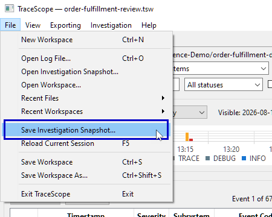
3. Choose a destination for the `.tsinv` file.

TraceScope captures the currently admitted investigation evidence. If the investigation was following a file, this command **does not stop live following or switch its backing mode**. The `.tsinv` represents the captured point in time; subsequent incoming records do not silently modify that saved file.

You can later choose **File > Open Investigation Snapshot...** to open a `.tsinv` as a new SnapshotBacked investigation session in the workspace.

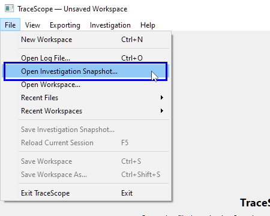

No original external log is needed to inspect the evidence contained in that snapshot.

The standalone snapshot includes the normalized records and the supporting import and source information that was captured. It is not a substitute for saving analyst work: if you also need bookmarks, notes, finding dispositions, active filters, comparison documents, or layout, **save the `.tsw` workspace**.

Opening a standalone `.tsinv` does not merge its evidence into an existing session or restore annotations and other state from another workspace.

## 5. Understand the three backing modes

An investigation session's backing mode answers one essential question: **What is the authoritative source of evidence for this session?** It is separate from whether the workspace has recently been saved.

| Backing mode | Authoritative evidence | Typical situation |
| --- | --- | --- |
| **SourceBacked** | The connected external log file. | You imported a log normally and may want to reload or follow its latest content. A workspace save also provides a recovery snapshot, but does not automatically switch modes. |
| **SnapshotBacked** | Durable TraceScope snapshot evidence. | You opened a standalone `.tsinv`, recovered an unavailable source from a saved workspace snapshot, or deliberately preserved an open investigation as snapshot-only. |
| **Hybrid** | Saved snapshot evidence forms the durable baseline; a verified connected external source can contribute continuation records. | You reconnect a suitable external source to a SnapshotBacked investigation while retaining the evidence that was already preserved. |

TraceScope displays each investigation session's backing mode and source information in its workspace tab and tooltip. 

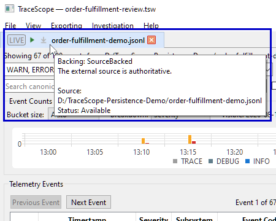

The distinction is especially important if a producer truncates or replaces a file: a SourceBacked reload follows the external source, whereas SnapshotBacked evidence does not depend on the source's current contents.

### Preserve an open investigation as snapshot-only

Use this when keeping all **currently admitted evidence** is more important than continuing to treat the external file as authoritative.

1. Right-click the investigation session's tab in the workspace.
2. Open **Source > Preserve as Snapshot Only...**.

    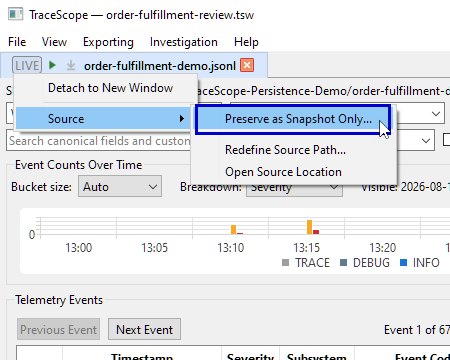
3. Let TraceScope capture the evidence and complete the transition.

This changes the open investigation session's backing mode from SourceBacked or Hybrid to **SnapshotBacked**. If live following was active, the transition establishes a stable capture boundary and does not resume following after it succeeds. The investigation no longer depends on the external source to retain its captured evidence.

**Save the workspace after this transition.** The new backing mode and provisional snapshot initially belong to the current working workspace; saving commits that state to your `.tsw` and its managed companion snapshots. Any later changes to bookmarks, notes, filters, or other workspace state also require another workspace save.

This operation differs from **Save Investigation Snapshot...**: saving a standalone file captures evidence *without changing the open session*, while **Preserve as Snapshot Only...** deliberately changes the session's authority.

### Reconnect preserved evidence to an external source

Some SnapshotBacked investigations retain sufficient information about their previous physical source to reconnect safely.

1. Restore the recorded source file at its original path, or use **Source > Redefine Source Path...** if you have a verifiable relocated copy and that action is available.

    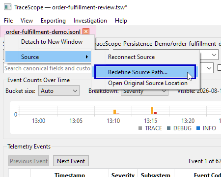
2. Right-click the investigation session's tab and choose **Source > Reconnect Source**.

    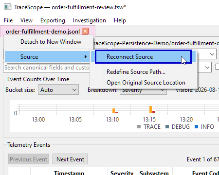
3. If TraceScope verifies the source and reconstructs the continuation successfully, the investigation becomes **Hybrid**.

A successful reconnection keeps the saved evidence as its baseline instead of replacing it with whatever happens to remain in the external file. Reconnection is not always available: a snapshot may lack the required source-continuity information, the file may be unavailable, or verification may fail. Do not treat an arbitrary similarly named file as a safe replacement.

### Deliberately return a Hybrid investigation to source authority

For a Hybrid investigation, **Source > Use Source as Authoritative...** offers a different and potentially destructive choice: reconstruct the investigation entirely from the verified connected external source and return to **SourceBacked**.

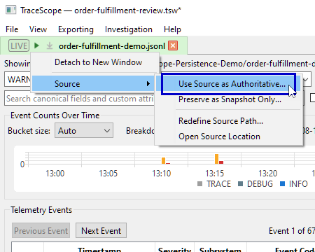

Use it only when you intend the current source to replace snapshot-only evidence. If the external source no longer contains older log generations, those records may not be part of the resulting SourceBacked investigation. Applicable annotations can be retained for record identities that survive, but evidence or annotations tied to absent records should not be assumed to remain available.

If you need the accumulated Hybrid evidence instead, leave the snapshot authoritative or choose **Preserve as Snapshot Only...**. Save your workspace before making a significant source-authority decision.

## 6. Reload, relocate, and resume work deliberately

With an investigation session active, choose **File > Reload Current Session** when you want to reconstruct that session's evidence according to its backing mode.

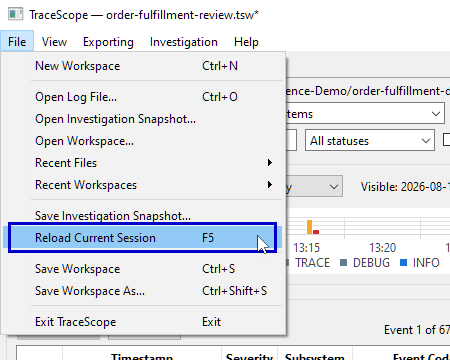

Reload does not mean the same thing in every mode:

- **SourceBacked:** re-imports the authoritative external source using the saved profile and applicable rotated-family configuration. If the source was truncated or replaced, old evidence no longer available from the source should not be assumed to reappear. Stable identities allow applicable investigation state to be retained for surviving records.
- **SnapshotBacked:** reloads from its durable investigation snapshot, without requiring the original source file.
- **Hybrid:** reconstructs from the saved snapshot and, when available and verified, the connected source. If the source is unavailable, the saved evidence can still be restored.

Where supported, reload preparation occurs before the current investigation is replaced. A failed verification or preparation should not be interpreted as a successful refresh of evidence.

### If the source has moved

A moved source is different from a changed source. Use the correct recovery path for the situation:

- **Reopening a saved workspace containing a SourceBacked investigation session whose external file is missing:** use **Locate File...** at the missing-source prompt,

    

    or **Open Saved Snapshot** to recover saved evidence instead.

    
- **Changing the recorded location of an already open investigation:** right-click the investigation session's tab and look under **Source > Redefine Source Path...**. 

    

    When enabled, this action verifies a candidate file against retained physical-source identity before changing the source path. The logical source identity is retained.
- **Reconnecting SnapshotBacked evidence:** reconnect only when continuity information is available and the recorded or safely redefined source can be verified.

    

Source-family discovery may also need to find the related rotated files. Do not rename or delete rotation members casually if you expect a subsequent source-based reload to reconstruct them.

**Reload is not Save.** Reloading reads according to the current evidence authority. Saving commits the current workspace and point-in-time snapshots. In a live investigation, do not rely on Reload to preserve records that the external producer has already removed.

## 7. Keep workspaces usable and safe

A few habits help prevent surprises:

- **Save after meaningful investigation changes.** New annotations, filter changes, source transitions, comparison documents (whether complete-session or independently time-scoped), and newly admitted live evidence are reasons to save the workspace again. A new comparison captures its scope once; saving preserves that captured result rather than a live link to current filters.
- **Back up the whole workspace package.** Copy the `.tsw` file and its matching `.sessions/` folder together. If you expect normal SourceBacked restoration elsewhere, keep the external logs available too; TraceScope may need you to locate them on the other machine.
- **Treat saved evidence as potentially sensitive.** `.tsinv` files and workspace snapshot folders can contain normalized log records and source metadata. Workspaces may also include analyst notes, source paths, and other investigation context. Review what you are permitted to share.
- **Use a new name for experiments.** **Save Workspace As...** is useful before trying a backing-mode change or missing-source recovery that you may want to undo.
- **Know the point in time you're sharing.** An existing snapshot, comparison, or exported report does not silently update just because a live investigation receives more data.

## Troubleshooting

| Situation | What to check |
| --- | --- |
| My `.tsw` opens incompletely after I moved it. | Did you copy the corresponding `<workspace-name>.sessions/` folder? Is the original external file still available if the session is SourceBacked? See [The two parts of a saved workspace](#the-two-parts-of-a-saved-workspace) and [Keep workspaces usable and safe](#7-keep-workspaces-usable-and-safe) for related information. |
| The saved snapshot option is missing during recovery. | Check that the workspace's companion snapshots exist and are readable. Without a usable snapshot, choose **Locate File...** if possible. See [Optional walkthrough: recover when the original source is missing](#3-optional-walkthrough-recover-when-the-original-source-is-missing) for more information. |
| I reopened my workspace but earlier live records are gone. | Check the backing mode. A SourceBacked investigation normally re-imports its current external file, which may have been truncated or replaced. Use preserved snapshot evidence when you need independence from that file. See [Understand the three backing modes](#5-understand-the-three-backing-modes) and [Preserve an open investigation as snapshot-only](#preserve-an-open-investigation-as-snapshot-only) for related information. |
| My `.tsinv` opens, but my bookmarks and notes are missing. | A standalone snapshot stores the evidence, not the broader annotation and workspace state. Reopen the saved `.tsw` with its companion folder instead. See [Understand what TraceScope saves](#1-understand-what-tracescope-saves) and [Save or open an individual investigation snapshot](#4-save-or-open-an-individual-investigation-snapshot) for related information. |
| A saved comparison reopens with an earlier time range or no time range. | This is expected: each comparison retains the selected populations and optional boundaries captured when it was created, not the source sessions' current filters. See [Comparing Sessions](comparing-sessions.md#optionally-compare-selected-time-ranges). |
| I can't start live following from a saved snapshot. | A SnapshotBacked investigation has no active connected source. Reconnection requires usable source-continuity information and successful verification; see [Live Following](live-following.md). Also see [Understand the three backing modes](#5-understand-the-three-backing-modes) and [Reconnect preserved evidence to an external source](#reconnect-preserved-evidence-to-an-external-source) for related information. |
| The source path has changed, and reconnection or relocation fails. | Confirm that the candidate really is the recorded physical source and that required source-identity information exists. Reconnection is intentionally not an arbitrary file-substitution operation. See [Reload, relocate, and resume work deliberately](#6-reload-relocate-and-resume-work-deliberately) for more information. |

## What to read next

You have saved an annotated investigation, reopened it from its original source, and seen how a saved snapshot can recover evidence when that source is unavailable. You also know when to preserve an investigation independently of a changing log and when a connected source can safely contribute new evidence.

For related workflows, see [Following Live Logs](live-following.md), [Recording and Managing Findings](findings.md), and [Investigating Logs](investigating-logs.md). The separate [Comparing Sessions](comparing-sessions.md) and [Reporting and Export](reporting-and-export.md) guides cover creating durable handoff artifacts from your saved investigations.
